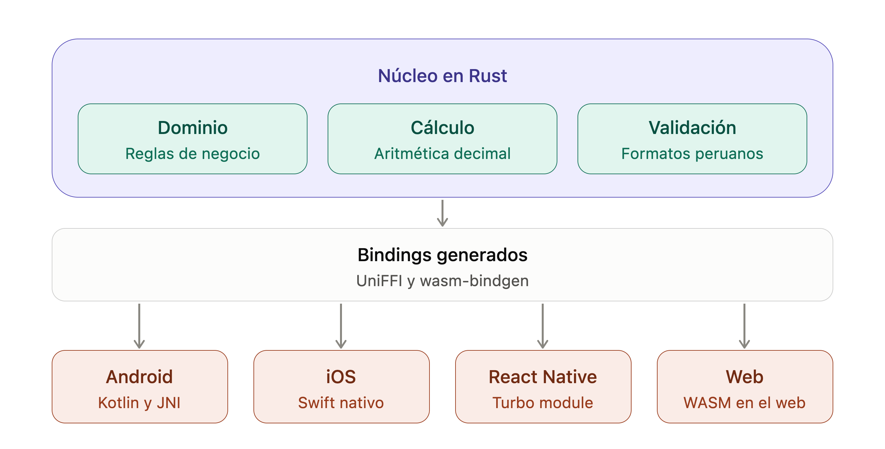

# rust-core-cross-app

POC: un núcleo de dominio financiero escrito en **Rust**, consumido sin reescribirse por
cuatro frontends — Android nativo, iOS nativo, React Native y web Angular.



## Qué demuestra

Una sola tesis: **la lógica de negocio se comparte, la UI varía por plataforma.**

Tres casos de uso, con datos fake y sin red: **aritmética decimal** (el float rompe el
dinero y el core no), **una transferencia** entre dos cuentas en memoria, y el **cifrado
de un número de tarjeta** con ChaCha20-Poly1305 — el mismo hex en las cuatro plataformas,
y lo que cifra una lo descifra cualquier otra.

Un pago, una transferencia o la simulación de un crédito son la misma lógica en web que en
mobile; lo que cambia es la presentación. Si eso es cierto, el dominio y la data pueden
vivir en un solo lugar y cada plataforma poner su propia UI encima — sin duplicar reglas,
sin que se desincronicen, y sin obligar a todos los equipos a la misma tecnología de UI.

La evidencia no es una opinión de arquitectura: las cuatro apps corren los mismos casos de
[`contracts/cases.json`](contracts/README.md) y deben producir **strings idénticos carácter
por carácter**. Si pasa en las cuatro, el argumento está probado.

### Por qué strings y no números

Los montos cruzan la frontera como `String`, nunca como punto flotante. En JavaScript un
monto en `double` IEEE-754 deriva en centavos; en un banco eso no es un detalle. El core
usa `Decimal` internamente y entrega el valor ya con la escala correcta — la UI solo le
pone el `S/` y los separadores.

La pantalla de benchmark existe para hacer visible esa divergencia: compara el core contra
una implementación equivalente en Kotlin/TypeScript, y esa baseline **falla** al menos un
caso del contrato a propósito.

## Arquitectura

El fan-out no es plano. Angular **no** consume el core directamente: consume el paquete
WASM que produce el proyecto React Native.

```
rust-core/crates/ffi        (único crate exportado; domain/calculation/validation no conocen uniffi)
   │
   ├── cargo ndk + uniffi-bindgen kotlin ──> apps/android      (.so por ABI + bindings Kotlin)
   ├── xcodebuild -create-xcframework    ──> apps/ios          (XCFramework + Swift)
   └── ubrn (desde apps/react-native)
         ├── build android|ios --and-generate ──> apps/react-native  (Turbo Module / JSI)
         └── build web                        ──> WASM ──> apps/web-angular
```

## Estado

| Fase | Entregable | Estado |
|---|---|---|
| 0 | Toolchain + `contracts/cases.json` | ✅ Completada |
| 1 | `rust-core` — dominio, cálculo, validación, cifrado, FFI | ⬜ Siguiente |
| 2 | `apps/android` — Kotlin + Compose | ⬜ |
| 3 | `apps/ios` — Swift + SwiftUI | ⬜ |
| 4 | `apps/react-native` — Turbo Module | ⬜ |
| 5 | `apps/web-angular` — WASM | ⬜ |

Cada fase termina con su test de contrato en verde contra el contrato **y** con el `README.md`
de su subproyecto: comandos ya ejecutados (no deducidos) más un diagrama de arquitectura
en Mermaid. Una fase sin las dos cosas no está terminada, por bien que se vea la UI.

## Arranque

```bash
# Fase 0 (ya hecha): toolchain host
curl --proto '=https' --tlsv1.2 -sSf https://sh.rustup.rs | sh -s -- -y
cargo --version

# Fase 1 en adelante, desde rust-core/
cargo test --workspace
cargo test --test de contrato        # solo los vectores del contrato
```

Cada fase instala solo el toolchain y las skills que necesita: ver
[docs/superpowers/skills-by-phase.md](docs/superpowers/skills-by-phase.md).

## Documentación

| Documento | Qué contiene |
|---|---|
| [CLAUDE.md](CLAUDE.md) | Arquitectura, invariantes, fases, ramas. Punto de entrada. |
| [contracts/README.md](contracts/README.md) | El contrato compartido y la especificación de los algoritmos. |
| [rust-core/CONTEXT.md](rust-core/CONTEXT.md) | Reglas del núcleo y contrato de API pública. |
| [apps/*/CONTEXT.md](apps/) | Una por plataforma: stack, estructura, prohibiciones. |
| [docs/superpowers/specs/](docs/superpowers/specs/) | Specs por fase + revisión de los CONTEXT. |
| [docs/superpowers/plans/](docs/superpowers/plans/) | Planes ejecutables por fase. |

## Alcance

Es una POC de **dominio**. No hay red, ni base de datos, ni cache, ni runtime async, ni
Module Federation. Los datos son dummy: tasas, códigos de banco y montos son inventados y
no corresponden a productos reales. Lo que se demuestra es la **coincidencia entre
plataformas**, no la exactitud financiera.

## Desarrollo

Spec-Driven Development con el plugin [superpowers](https://github.com/anthropics/claude-plugins-official):
spec → plan → ejecución con TDD → review → cierre de rama. Una rama por fase.
Detalle en [CLAUDE.md](CLAUDE.md).
