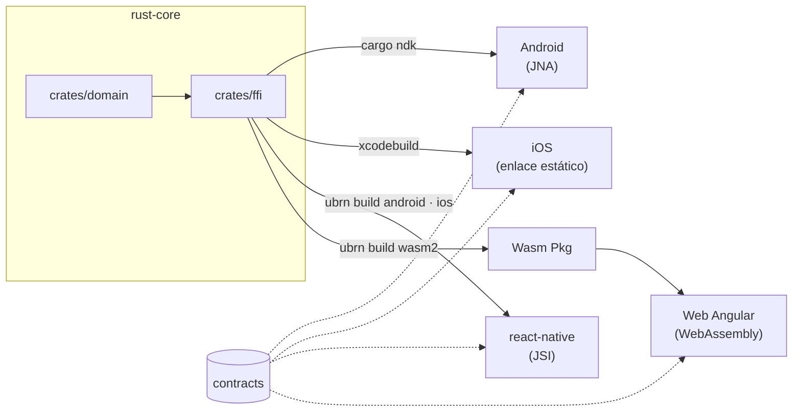

# Rust Cross App

Proyecto Demo que demuestra usar un único núcleo de dominio financiero escrito en **Rust**, consumido sin reescribirse por
cuatro frontends: Android nativo, iOS nativo, React Native y una web en Angular.




## Leyenda

| Caja | Qué es, y cómo se conecta |
|---|---|
| **crates/domain** | `rust-core/crates/domain`. Toda la lógica de negocio, en Rust puro. No conoce a uniffi (el generador que traduce la API de Rust a Kotlin, Swift y TypeScript), y por eso desde aquí no se puede exportar nada: lo impide el compilador. |
| **crates/ffi** | `rust-core/crates/ffi`. La fachada: las nueve funciones que las apps pueden llamar, marcadas para que uniffi las traduzca. Es lo único que sale del núcleo. |
| **Android** | `apps/android`. App demo en Kotlin y Compose. Consume un `.so` (la librería de Rust ya compilada a código de máquina) por cada ABI (arquitectura de CPU: arm64, x86_64…) más los bindings (el Kotlin autogenerado que expone las nueve funciones). **Se conecta por JNA** (*Java Native Access*, una librería que permite a la máquina virtual de Java llamar código nativo sin escribir C): resuelve los símbolos en tiempo de ejecución, y es el puente más caro de los cuatro. |
| **iOS** | `apps/ios`. App demo en Swift y SwiftUI. Consume un XCFramework (el formato con que Xcode empaqueta una librería para varias arquitecturas). **Se conecta directo**: la librería queda enlazada dentro del binario de la app, así que no hay puente que cruzar en ejecución — por eso es el más barato. |
| **react-native** | `apps/react-native`. App demo sobre Fabric y Hermes (el renderer y el motor de JavaScript de la arquitectura nueva de RN). Consume un Turbo Module (el módulo nativo de esa arquitectura). **Se conecta por JSI** (*JavaScript Interface*, la capa de React Native que deja a JavaScript llamar funciones de C++ directamente, sin pasar los datos serializados como JSON por un puente asíncrono). |
| **Wasm Pkg** | `packages/core-financiero-wasm`. No es una app: es el paquete que envuelve el `.wasm` (el núcleo compilado para correr dentro del navegador) con una fachada tipada. Lo genera `ubrn build wasm2`, **que se ejecuta desde `apps/react-native`** porque ahí viven el CLI y su config — pero Angular depende de este paquete, no de esa app. |
| **Web Angular** | `apps/web-angular`. App demo en Angular standalone. **Se conecta por WebAssembly**: el navegador ejecuta el `.wasm` como si fuera código propio, sin plugin ni servidor. |
| **contracts** | `contracts/cases.json`. Un único archivo JSON, escrito a mano, con los casos de prueba del dominio: cada caso dice qué operación pedir, con qué datos, y qué texto exacto tiene que devolver. El primero, por ejemplo, pide sumar `"0.1"` y `"0.2"` y exige `"0.30"` — no el `0.30000000000000004` que devuelve un `float`. Hoy son 31 casos y el contrato va por su versión 2.4.0. Las cinco bases de código leen este mismo archivo y comparan carácter por carácter: que los 31 pasen en las cuatro apps *es* la demostración. |


El mismo núcleo, cuatro puentes distintos — y el puente es lo que separa a las apps: el
mismo `add` cuesta 47,1 µs por JNA en un Pixel 6 y 0,062 µs por enlace estático en un
iPhone 12. Ver [docs/cross-app-pending.md](docs/cross-app-pending.md).

## Stack

| | Tecnología | Cómo llega al núcleo |
|---|---|---|
| **Núcleo** | Rust 1.98 · `rust_decimal` · ChaCha20-Poly1305 | — |
| **Bindings** | uniffi 0.31 | El código generado que traduce la API del núcleo al lenguaje de cada app — Kotlin, Swift y TypeScript — desde un solo crate |
| **Android** | Kotlin 2.4 · Jetpack Compose · AGP 9.4 | `.so` por ABI + bindings Kotlin, sobre **JNA** |
| **iOS** | Swift 6.3 · SwiftUI · Xcode 26.6 | XCFramework **estático** + bindings Swift |
| **React Native** | RN 0.87 · Fabric · Hermes | Turbo Module **JSI** vía `ubrn` |
| **Web** | Angular 21 standalone · Signals | **WebAssembly** (`wasm32-unknown-unknown`) |
| **Monorepo** | pnpm workspaces · Node 22 | — |

Los montos viajan como `String` de punta a punta: ningún tipo de punto flotante toca dinero
en ninguna de las cinco bases de código.

## Glosario de términos

| Término | Qué es |
|---|---|
| **crate** | La unidad de compilación y distribución de Rust: una librería o un ejecutable, con su propio `Cargo.toml`. Equivale a un módulo de Gradle, un Swift package o un paquete de npm. Este núcleo tiene dos, `domain` y `ffi`, y ambos viven en un mismo *workspace*. |
| **FFI** | *Foreign Function Interface*: el mecanismo por el que un programa llama funciones compiladas desde otro lenguaje. El «foreign» es desde el punto de vista de quien llama — para Kotlin, Swift o JavaScript, el Rust de este núcleo es el idioma extranjero. |
| **uniffi** | La herramienta de Mozilla que lee un crate de Rust y escribe sola los bindings de cada lenguaje, para que nadie tenga que escribir a mano el pegamento en C. Es lo que permite que un mismo núcleo se consuma desde cuatro plataformas sin reescribirlo. |
| **WASM** | *WebAssembly*: un formato binario que el navegador ejecuta a velocidad cercana a la nativa, y que sirve de destino de compilación para lenguajes como Rust o C++. Aquí el núcleo se compila al target `wasm32-unknown-unknown` y Angular lo corre dentro de la pestaña, sin plugin ni servidor. Se ejecuta aislado: no ve el disco ni la red. |
| **ChaCha20-Poly1305** | Un algoritmo de cifrado autenticado, o sea dos piezas en una: ChaCha20 cifra el dato y Poly1305 lo firma, de modo que además de ocultarlo permite detectar si alguien lo alteró. Aquí cifra el número de tarjeta. **La POC usa un nonce fijo a propósito**, para que las cuatro plataformas produzcan el mismo hex; en producción eso sería catastrófico (ver [contracts/README.md](contracts/README.md)). |

## Qué demuestra

Una sola tesis: **la lógica de negocio se comparte, la UI varía por plataforma.**

Tres casos de uso, con datos fake y sin red: **aritmética decimal** (el float rompe el
dinero y el core no), **una transferencia** entre dos cuentas en memoria, y el **cifrado
de un número de tarjeta** con ChaCha20-Poly1305 — el mismo hex en las cuatro plataformas,
y lo que cifra una lo descifra cualquier otra.

Un pago, una transferencia o la simulación de un crédito son la misma lógica en web que en
mobile; lo que cambia es la presentación. Si eso es cierto, el dominio y la data pueden
vivir en un solo lugar y cada plataforma poner su propia UI encima — sin duplicar reglas,
sin que se desincronicen, y sin obligar a todos los equipos a la misma tecnología de UI.

La evidencia no es una opinión de arquitectura: las cuatro apps corren los mismos casos de
[`contracts/cases.json`](contracts/README.md) y deben producir **strings idénticos carácter
por carácter**. Si pasa en las cuatro, el argumento está probado.

### Por qué strings y no números

Los montos cruzan la frontera como `String`, nunca como punto flotante. En JavaScript un
monto en `double` IEEE-754 deriva en centavos; en un banco eso no es un detalle. El core
usa `Decimal` internamente y entrega el valor ya con la escala correcta — la UI solo le
pone el `S/` y los separadores.

La pantalla de benchmark existe para hacer visible esa divergencia: compara el core contra
una implementación equivalente en Kotlin/TypeScript, y esa baseline **falla** al menos un
caso del contrato a propósito.

## Arquitectura

El fan-out no es plano. Angular **no** consume el core directamente: consume el paquete
WASM que produce el proyecto React Native. El diagrama de arriba es la fuente de verdad
del grafo de build; no se duplica en texto para no desincronizarlo.

## Arranque

### Paso 0: dejar el repo listo

**Los binarios que produce Rust no están en git.** Un clone limpio no tiene el `.so` de
Android, ni el `.xcframework` de iOS, ni el Turbo Module, ni el `.wasm` — están en
`.gitignore` a propósito, porque son artefactos de build. **Ninguna de las cuatro apps
compila sin ellos**, y el error que dan no siempre dice que eso es lo que falta.

Antes que nada, conviene averiguar en cuál de los dos casos se está:

```bash
# desde la raíz del repo — una línea por app: OK o FALTA
for d in apps/android/core-financiero/src/generated/jniLibs \
         apps/ios/CoreFinanciero.xcframework \
         apps/react-native/src/generated \
         packages/core-financiero-wasm/generated; do
  [ -n "$(ls -A "$d" 2>/dev/null)" ] && echo "OK    $d" || echo "FALTA $d"
done
```

Da **cuatro líneas, una por app**. Si las cuatro dicen `OK`, el repo ya está listo y puede
seguir al [Paso 1](#paso-1-correr-la-plataforma-deseada).

> **Por qué un bucle y no un `ls` con comodines.** Los shells no reaccionan igual ante un
> comodín que no encuentra nada: unos se lo pasan igual a `ls`, que informa archivo por
> archivo, y otros abortan el comando entero con `no matches found` sin llegar a listar
> siquiera los artefactos que sí están. Con un `ls apps/*/…`, entonces, el diagnóstico puede
> fallar justo en el caso que existe para diagnosticar. Este bucle **da la misma salida en
> bash, zsh y sh**, así que no hace falta saber cuál se está usando.

Si alguna dice `FALTA`, hay dos cosas que hacer:

#### 1. Instalar las dependencias del workspace

```bash
# desde la raíz del repo
pnpm install --ignore-scripts
```

**El `--ignore-scripts` no es opcional en un clone limpio, y no depende de qué app se quiera
correr.** Es un bug conocido del workspace: el `prepare: bob build` de `apps/react-native` se
dispara en cualquier `pnpm install` desde la raíz, e intenta generar los `.d.ts` a partir de
archivos que importan de `src/generated/`, un directorio gitignoreado que todavía no existe.
Huevo y gallina.

**Saltearlo sí cuesta algo, y sólo a una de las cuatro apps.** `bob build` corre tres
targets, no uno: `module`, `typescript` y **`codegen`**. Los dos primeros empaquetan la
librería de React Native para publicarla, cosa que ninguna demo usa. El tercero escribe
`apps/react-native/android/generated/` e `ios/generated/`, y **esos sí hacen falta** para
compilar la app de React Native en un aparato — su `codegenConfig` declara
`includesGeneratedCode: true`, que le dice a Gradle y a CocoaPods que no los regeneren porque
ya están. Con `--ignore-scripts` nunca se generan, están gitignoreados, y nada más en este
flujo los repone: el build muere con `Unresolved reference 'NativeCoreFinancieroSpec'` y
después con `fatal error: 'CoreFinancieroSpec.h' file not found`, ninguno de los cuales
menciona la causa.

**Quien vaya a correr la app de React Native** los repone con un comando, después de instalar:

```bash
# desde apps/react-native/
pnpm exec bob build --target codegen
```

Quien vaya a Android nativo, iOS nativo o Angular puede ignorar esto: esas tres no usan el
codegen de React Native.

#### 2. Generar los artefactos del núcleo

**→ [rust-core/BUILD.md § Generar el core que consumen las cuatro
apps](rust-core/BUILD.md#generar-el-core-que-consumen-las-cuatro-apps)**

Esa sección fija el orden de los cuatro pasos y qué artefacto deja cada uno. Dos cosas que
conviene saber antes de abrirla:

- **Es un paso manual a propósito**, fuera de cualquier build automático. Si Gradle regenerara
  el core en cada compilación, el `coreVersion()` de Android dejaría de coincidir con el de las
  otras tres.
- **Los cuatro se generan desde el mismo `HEAD`**, o los cuatro pies de `coreVersion()` dejan de
  coincidir y la comparación lado a lado de la demo deja de valer aunque las pantallas se vean
  bien.

### Paso 1: correr la plataforma deseada

Cada bloque es autónomo: primero verifica el núcleo, después hace lo propio de la app. **La
parte de Rust se repite a propósito** en los cuatro, para poder copiar uno solo.

#### Android

```bash
# desde rust-core/
cargo test --workspace                           # 71 tests
cargo test -p core_financiero --test contract    # solo los 31 vectores del contrato

# desde apps/android/ — son DOS módulos Gradle desde la Fase 6
./gradlew :app:testDebugUnitTest :core-financiero:testDebugUnitTest        # 36, en la JVM
./gradlew :app:connectedDebugAndroidTest :core-financiero:connectedDebugAndroidTest  # 21, sobre aparato
./gradlew :app:installRelease                    # release para la demo: el debug es 3-4x más lento
```

#### iOS

```bash
# desde rust-core/
cargo test --workspace                           # 71 tests
cargo test -p core_financiero --test contract    # solo los 31 vectores del contrato

# desde apps/ios/ — 54 tests, en simulador o aparato real
xcodebuild test -project ios-rust-test.xcodeproj -scheme ios-rust-test \
  -destination 'platform=iOS Simulator,name=iPhone 17 Pro'
# Si falla con «Unable to find a device matching», el modelo existe pero no para el runtime
# que resuelve OS:latest. Hay que fijarlo: ,OS=<versión> — ver apps/ios/README.md
open ios-rust-test.xcodeproj                     # y se corre con ⌘R
```

#### React Native

```bash
# desde rust-core/
cargo test --workspace                           # 71 tests
cargo test -p core_financiero --test contract    # solo los 31 vectores del contrato

# desde apps/react-native/ — 129 tests (N-API + WASM)
pnpm test
cd example && pnpm exec react-native start --reset-cache   # Metro, en su propia terminal
# y en otra terminal: pnpm exec react-native run-android | run-ios
```

#### Web Angular

```bash
# desde rust-core/
cargo test --workspace                           # 71 tests
cargo test -p core_financiero --test contract    # solo los 31 vectores del contrato

# desde apps/web-angular/ — 102 tests
pnpm test
pnpm exec ng serve                               # http://localhost:4200
```

### No hay nada que configurar a mano

Una duda razonable al llegar aquí: «¿y dónde le digo a cada app cómo se llama lo que generó
Rust?». **En ningún lado.** El cableado está fijo en el código de cada proyecto y los artefactos
caen en rutas fijas: si están en su lugar, compila. La tabla de dónde vive cada cosa está en el
README de cada app, en «Antes de correrla».

Cada subproyecto tiene su README con los requisitos y el paso a paso completo:
[rust-core/README.md](rust-core/README.md), [apps/android/README.md](apps/android/README.md),
[apps/ios/README.md](apps/ios/README.md),
[apps/react-native/README.md](apps/react-native/README.md) y
[apps/web-angular/README.md](apps/web-angular/README.md).

## Documentación

| Documento | Qué contiene |
|---|---|
| [CLAUDE.md](CLAUDE.md) | Arquitectura, invariantes, fases, ramas. Punto de entrada. |
| [contracts/README.md](contracts/README.md) | El contrato compartido y la especificación de los algoritmos. |
| [rust-core/CONTEXT.md](rust-core/CONTEXT.md) | Reglas del núcleo y contrato de API pública. |
| [apps/*/CONTEXT.md](apps/) | Una por plataforma: stack, estructura, prohibiciones. |
| [docs/superpowers/specs/](docs/superpowers/specs/) | Specs por fase + revisión de los CONTEXT. |
| [docs/superpowers/plans/](docs/superpowers/plans/) | Planes ejecutables por fase. |

## Alcance

Es una POC de **dominio**. No hay red, ni base de datos, ni cache, ni runtime async, ni
Module Federation. Los datos son dummy: tasas, códigos de banco y montos son inventados y
no corresponden a productos reales. Lo que se demuestra es la **coincidencia entre
plataformas**, no la exactitud financiera.
