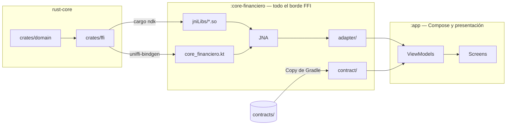

# app-android

App Android nativa que **no contiene ni una sola regla de negocio**. Todo el cálculo —decimales,
transferencias, validación de tarjetas, cifrado— lo resuelve un núcleo escrito en Rust que las
otras tres apps de la POC (iOS, React Native, Angular) consumen **sin reescribirlo**.

Lo que esta app hace con los datos es pedirlos y mostrarlos.

**Estado:** funcional. 57 tests en verde, las cuatro pantallas andando.

| | |
|---|---|
| **Lenguaje / UI** | Kotlin 2.4.20 · Jetpack Compose (BOM 2026.09.00) · Material 3 |
| **Build** | AGP 9.4.0 · Gradle 9 · Java 21 |
| **SDK** | compileSdk 37 · minSdk 28 |
| **Puente al núcleo** | uniffi 0.31 sobre **JNA** (no JNI) |
| **Núcleo** | Rust, `libcore_financiero.so` en tres ABIs |
| **Paquete** | `dev.tohure.android_rust_test` |

---

## Cómo está armada




**Leyenda**

| Caja | Qué es |
|---|---|
| `crates/domain` · `crates/ffi` | El núcleo en Rust: la lógica pura y la fachada uniffi de nueve funciones. |
| `jniLibs/*.so` | El núcleo compilado, un binario por **ABI** (arquitectura de CPU: arm64-v8a, armeabi-v7a, x86_64). El APK embarca los tres. |
| `core_financiero.kt` | Los **bindings**: el Kotlin autogenerado que expone las nueve funciones. No se edita. |
| `JNA` | El puente: *Java Native Access*, que deja a la máquina virtual de Java llamar código nativo. Es el cruce más caro de las cuatro apps. |
| `adapter/` | La única clase que llama al núcleo. Reexporta los tipos de uniffi, no los traduce. |
| `contract/` · `contracts/` | Los dos JSON compartidos y el código que los lee. Un `Copy` de Gradle los mete como assets. |
| `ViewModels` · `Screens` | Presentación: estado inmutable y Compose. Ningún cálculo, y todos los montos son `String`. |

| Línea | Significa |
|---|---|
| **sólida** | El artefacto fluye: se produce con el comando de la etiqueta, o se consume. |
| **caja dentro de caja** | Pertenece a ese módulo de Gradle. `:app` no ve lo que vive en `:core-financiero` salvo lo que el adapter expone. |

**Las cuatro suites de test no están en el diagrama a propósito**: son otra pregunta, y la
contesta [«Correr los tests»](#correr-los-tests), con el detalle de qué prueba cada una.


**Dos módulos, no uno, y la frontera la sostiene Gradle.** `:app` no declara JNA ni conoce la
`.so`: todo el borde FFI vive en `:core-financiero`. Lo que sí cruza son los **tipos** del core
—`Account`, `TransferResult`, `DomainException`, `TransferRequest`—, y es deliberado: el adapter
los reexporta en vez de traducirlos, porque una segunda nomenclatura en Kotlin se desincroniza en
la primera regeneración de bindings.

**Los generados no se versionan** —están en `.gitignore`— y por eso viven en un source set
separado, `src/generated/`, en vez de en `build/`: un `clean` dejaría la app sin compilar hasta
volver a correr el paso de Rust, y eso se descubre el día de la demo.

### Qué es cada pieza y por qué existe

| Pieza | Qué hace | Por qué existe |
|---|---|---|
| `crates/domain` | La lógica: decimales, ITF, Luhn, ChaCha20-Poly1305 | Rust puro, sin uniffi. Un `#[uniffi::export]` ahí **no compila**: la frontera la sostiene el compilador |
| `crates/ffi` | Las nueve funciones públicas | La única superficie que cruza a Kotlin |
| `jniLibs/*.so` | El núcleo compilado, un `.so` por ABI — arm64-v8a, armeabi-v7a y x86_64 | **ABI** es la arquitectura de CPU del aparato. Cada una necesita su propio binario, y el APK los embarca los tres y carga el que corresponde |
| `core_financiero.kt` | Los bindings: el Kotlin que expone las nueve funciones | **Artefacto generado.** Nunca se edita; si algo está mal, se corrige en Rust y se regenera |
| **JNA** | El puente nativo real, en tiempo de ejecución | Los bindings de uniffi corren sobre JNA —*Java Native Access*, que deja a la JVM llamar código nativo sin escribir C—, **no sobre JNI**. Sin esta dependencia la app compila y revienta al primer llamado |
| `adapter/` | `CoreFinanciero`, la única clase que llama al núcleo | Es una **interfaz** para que los ViewModels se testeen en JVM sin emulador. Reexporta los tipos de uniffi: **no los traduce** |
| `contract/` | Lee `cases.json` y `messages.es.json` | Las cuentas iniciales y los mensajes de error son **datos del contrato**, no de la app. Hardcodearlos los haría divergir entre las cuatro apps |
| `ViewModels` | Un estado inmutable por pantalla, en `ui/*/XxxViewModel` | La UI consume y no calcula. Todos los montos son `String` |
| `Screens` | Las cuatro pantallas de Compose, en `ui/*/XxxScreen` | Sólo pintan estado: el formateo con `S/` y separadores ocurre aquí, en el borde, y nada más |
| `contracts/` | Los dos JSON compartidos, en la raíz del repo | Un `Copy` de Gradle los mete como assets de `:core-financiero`. Es el mismo archivo que leen las otras tres apps |
| `ui/components/` | Los cinco componentes compartidos | Las cuatro apps usan la misma descomposición para que las pantallas sean comparables |
| `AppContainer` | Cableado manual | Sin Hilt ni Koin: cinco pantallas y tres dependencias no los justifican |

---

## Antes de correrla

**El binario de Rust se genera primero, para las cuatro apps a la vez.** La secuencia
completa, en orden, vive en
[rust-core/BUILD.md](../../rust-core/BUILD.md#generar-el-core-que-consumen-las-cuatro-apps);
aquí abajo está solo el paso puntual que le toca a esta app.

Hacen falta **Java 21**, el **SDK de Android** y un emulador o teléfono conectado.

Si el repo ya viene con los artefactos construidos, eso alcanza. **Si no**, hay que compilar el
núcleo Rust primero — eso pide `rustup`, `cargo-ndk` y el NDK r27+, y está todo en
**[BUILD.md](BUILD.md)**.

Para saber en cuál de los dos casos se está:

```bash
# desde apps/android/ — con find y no con `ls …/*/…`: ante un comodín sin coincidencias
# cada shell hace una cosa distinta, y alguno ni siquiera llega a ejecutar el ls
find core-financiero/src/generated/jniLibs -name libcore_financiero.so 2>/dev/null
```

Debe imprimir una `.so` por cada ABI; con el build documentado son tres. **Si no imprime
nada**, falta generar el núcleo: ver [BUILD.md](BUILD.md).

### Dónde se cablea, y qué **no** hay que editar

Una duda razonable: «¿y dónde le digo a la app cómo se llama lo que generó Rust?». **En ningún
lado.** No hay que tocar ningún archivo de configuración: el cableado está fijo en el código del
proyecto y los artefactos caen en rutas fijas. Si están en su lugar, compila.

| | |
|---|---|
| **El archivo que lo cablea** | `core-financiero/build.gradle.kts` — las dos líneas `kotlin.srcDir("src/generated/java")` y `jniLibs.srcDir("src/generated/jniLibs")` |
| **Dónde caen los bindings** | `core-financiero/src/generated/java/uniffi/core_financiero/` |
| **Dónde caen las `.so`** | `core-financiero/src/generated/jniLibs/<abi>/libcore_financiero.so`, una por ABI |
| **Qué NO se toca** | `gradle.properties` no declara nada del core. Tampoco hay que registrar los archivos generados en ningún lado: el source set los toma por ruta |

Los generados viven en un source set aparte del código escrito a mano, para que se vea de un
vistazo qué se edita y qué no. **No van en `build/`**: un `clean` dejaría el módulo sin compilar
hasta volver a correr el paso de Rust.

## Correrla

```bash
adb devices                    # debe listar un dispositivo
./gradlew :app:installDebug
adb shell am start -n dev.tohure.android_rust_test/.MainActivity
```

**Para la demo, y sobre todo para el benchmark, conviene el release**, que va firmado con el
keystore de debug justamente para poder instalarse:

```bash
./gradlew :app:installRelease
adb shell am start -n dev.tohure.android_rust_test/.MainActivity
```

No es una firma de distribución —ese keystore es público y lo trae toda máquina con el SDK—,
pero la diferencia de velocidad **no es cosmética**: el APK de debug corre el cruce FFI entre 3
y 4 veces más lento, porque `debuggable=true` le pide al ART que no optimice. Medido, con la
baseline nativa como control; ver [TESTING.md](TESTING.md).

Cuatro pestañas abajo, y **el pie con la versión del núcleo visible en todas**: algo como
`1.0.0+a0a40a5`. Ese string lleva el SHA del commit con el que se compiló el núcleo, y es la
prueba en pantalla de que las cuatro apps de la demo corren **el mismo build**. Si el pie sale
vacío, la librería nativa no cargó — ver [BUILD.md](BUILD.md).

## Correr los tests

**Son cuatro suites, no dos**, desde que el borde FFI vive en su propio módulo. Los comandos son
los que se corrieron al cerrar la Fase 6, y los totales, los que dieron:

```bash
# Las dos de JVM: no necesitan aparato
./gradlew :app:testDebugUnitTest :core-financiero:testDebugUnitTest

# Las dos instrumentadas: NECESITAN emulador o teléfono
./gradlew :app:connectedDebugAndroidTest :core-financiero:connectedDebugAndroidTest
```

| Módulo | JVM | Instrumentada | Qué prueba cada una |
|---|---:|---:|---|
| `:app` | **32** | **1** | JVM: ViewModels con `FakeCoreFinanciero`, formateo, la baseline nativa y la guardia de mutación de `Record`. Instrumentada: que la rotación no se lleve puesto el estado |
| `:core-financiero` | **4** | **20** | JVM: el mapeo de error a nombre de contrato. Instrumentada: **el test de contrato (10), el smoke del FFI (2), el adapter real (3) y las fuentes de assets (2+2)** — las que cruzan la frontera de verdad — más `FfiCostProbe`, que no aserta |

**57 tests, 0 fallos.** Las 19 instrumentadas de `:core-financiero` que asertan algo son las que no se pueden
falsear: cargan `libcore_financiero.so`, resuelven símbolos por JNA y comparan los 31 casos de
`cases.json` con igualdad exacta de strings.

Para correr **un solo** test instrumentado, `--tests` no sirve —es de las tareas `Test` de la
JVM— y hay que usar:

```bash
./gradlew :app:connectedDebugAndroidTest \
  -Pandroid.testInstrumentationRunnerArguments.class=dev.tohure.android_rust_test.RotationTest
```

El detalle de qué prueba y qué **no** prueba cada suite está en **[TESTING.md](TESTING.md)**.

---

## Qué se puede hacer, pantalla por pantalla

### Aritmética — por qué el `Double` no sirve para dinero

Escribí `0.1` y `0.2`, toca **Calcular**. Dos tarjetas:

```
Punto flotante nativo     0.30000000000000004     ← Double de Kotlin
Core (Rust · Decimal)     0.30                    ← el núcleo
```

Es la única pantalla donde la app usa punto flotante, y está ahí **como contraejemplo**. Probá
también restas, o `0.1 + 0.7`: los seis casos del contrato divergen.

### Transferencia — el dinero se conserva

Dos cuentas en memoria, con los saldos que dice el contrato. Transferir `100.00` y observar:

```
Comisión ITF        S/ 0.01
Total debitado      S/ 100.01
Comprobante         TRF-9047-1065-10000
Saldos              S/ 4,899.99   ·   S/ 1,300.50
```

La app **espera** antes de pintar el resultado, para que parezca una llamada de red. **No hay
red**: el núcleo devuelve cuántos milisegundos simular.

Puedes probar a romperlo: un monto mayor al saldo, origen igual a destino, o `100.123` — el campo no te
deja escribir el tercer decimal, y aunque pudieras, el núcleo lo rechaza.

### Tarjeta — cifrado, y que se note que es cifrado

Escribí `4111111111111111` y toca **Validar y cifrar**:

```
Marca               Visa
Enmascarado         4111 **** **** 1111
Cifrado (hex)       bdca39311826947186b2…c7c7c0dd
Descifrado          4111111111111111        ← la vuelta completa
```

La fila `Descifrado` no es decoración: sin ella ese hex es **indistinguible de un hash**. Cifrar
y descifrar en el mismo gesto es lo que demuestra, mirando, que el núcleo hace criptografía
reversible.

Abajo hay un bloque para **pegar un hex producido por otra plataforma**. Ahí está la demostración
en vivo: se copia el hex de la app de iOS, se pega aquí, y sale el mismo número — porque las cuatro
comparten clave, nonce y algoritmo desde el mismo núcleo.

### Benchmark — cuánto cuesta cruzar la frontera

Mide el núcleo contra una suma en `Double`, N veces. El núcleo es **más lento** —en un Pixel 6
con el APK de release, la pantalla da ~60 µs por llamada contra ~2,3 µs de la suma nativa— y esa
es exactamente la comparación honesta: la alternativa nativa es más rápida **y da mal el
resultado**.

Tres cosas que conviene saber antes de citar un número de esta pantalla:

- **Tocá `Ejecutar` dos veces y citá la segunda.** Con n = 1000 la primera corrida arrastra el
  calentamiento del JIT y sale ~1,6× más alta.
- **Con el APK de debug sale entre 3 y 4 veces peor** (~240 µs en vez de ~60). Es el efecto de
  `debuggable=true` sobre el camino del binding, no del núcleo.
- **Depende del aparato, y bastante**: en el emulador de un Mac con Apple Silicon baja, porque
  esos cores son más rápidos que los de un teléfono.

La descomposición de a dónde se va ese tiempo —y por qué **no** se puede optimizar— está en
[TESTING.md](TESTING.md) y [PENDING.md](PENDING.md).

---

## Qué NO se puede hacer, y por qué

Nada de esto es un pendiente: son decisiones de la POC.

| No hace | Por qué |
|---|---|
| **Guardar nada.** Cerrás la app y los saldos vuelven al inicio | Sin base de datos, sin caché, sin `SharedPreferences`. Es una POC de dominio |
| **Keychain / Keystore / biométricos** | La POC demuestra que **el algoritmo de cifrado** vive en el núcleo y da el mismo resultado en cuatro plataformas. Dónde guardarías una clave en producción es otro problema |
| **Red** | Ni un cliente HTTP. La "latencia" de Transferencia es un número que devuelve el núcleo |
| **Agregar cuentas, tarjetas o bancos** | Los datos son del contrato compartido. Cambiarlos aquí los haría divergir de las otras tres apps |
| **Calcular algo en Kotlin** | Encontrarse escribiendo aritmética sobre montos significa que el cálculo está en el lugar equivocado: pedíselo al núcleo |

Y dos reglas que valen para quien toque el código:

- **Ningún `Double` ni `Float` toca un monto. Nunca**, ni en tests. Los montos viajan como
  `String` de punta a punta. La única excepción es `ui/benchmark/NativeBaseline.kt`, que existe
  para exhibir el fallo y lleva un comentario que lo dice.
- **No edites `uniffi/core_financiero.kt` ni `jniLibs/`.** Son generados. Si algo está mal ahí,
  se arregla en `rust-core` y se regenera.

---

## Glosario

| Término | Qué es |
|---|---|
| **módulo de Gradle** | Una unidad de compilación con su propio `build.gradle.kts` y sus propias dependencias. Este proyecto tiene dos —`:app` y `:core-financiero`—, y esa separación es la que impide que `:app` toque el borde FFI. |
| **source set** | Un directorio de fuentes que Gradle compila junto con `src/main`. Los generados viven en `src/generated/` y no en `build/` a propósito: un `clean` los borraría y dejaría la app sin compilar hasta rehacer el paso de Rust. |
| **AGP** | *Android Gradle Plugin*: el plugin que le enseña a Gradle a construir un proyecto Android. Su versión va atada a la de Gradle y a la del SDK. |
| **Compose** | Jetpack Compose, la librería de UI declarativa de Android: la pantalla se describe como funciones que reciben estado y lo pintan. |
| **test instrumentado** | El que corre **dentro** de un emulador o teléfono (`androidTest/`), y por eso es el único que puede cargar la `.so` y cruzar el FFI de verdad. El de JVM (`test/`) corre en la máquina y no puede. |

## Dónde está el resto

| Archivo | Para qué |
|---|---|
| **[BUILD.md](BUILD.md)** | Compilar el núcleo Rust, generar los bindings, armar el APK, y las trampas de AGP 9 |
| **[TESTING.md](TESTING.md)** | Las dos suites, el test de contrato, y cómo se verificaron sus guardias |
| **[PENDING.md](PENDING.md)** | Deuda técnica conocida y qué quedó fuera por diseño |
| **[CONTEXT.md](CONTEXT.md)** | La spec: arquitectura de UI, convenciones de ViewModel, prohibiciones |
| [../../docs/ui-spec.md](../../docs/ui-spec.md) | Los labels y el orden de campos que las cuatro apps comparten |
| [../../contracts/README.md](../../contracts/README.md) | El contrato: los 31 casos y de dónde salen |
