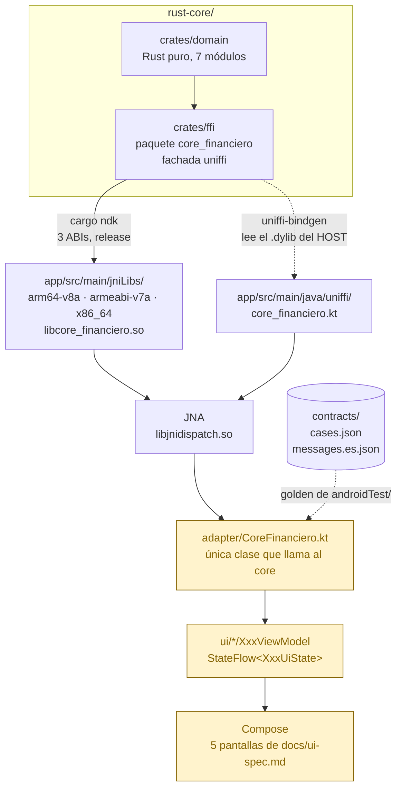

# app-android

Primer consumidor de `rust-core`. Kotlin + Jetpack Compose, vía uniffi.

**Estado: toolchain y pipeline verificados. La app todavía no existe.** El proyecto base
compila, las tres `.so` del core y los bindings Kotlin están dentro del APK, y las nueve
funciones cruzaron la frontera. Lo que falta es la Fase 2 propiamente: adapter, ViewModels,
las cinco pantallas y el test golden de `androidTest/`.

Todos los comandos de este README **se ejecutaron tal como están escritos** y la salida que
sigue a cada uno es la que devolvieron. Ninguno está deducido del CONTEXT.

## Arquitectura



En amarillo, lo que **todavía no existe**. Todo lo demás está construido y verificado.

Dos cosas que el diagrama hace visibles y que cuestan una tarde si se descubren tarde:

- **Los bindings NO salen del `.so` de Android.** Salen del `.dylib` del host. Ver
  "El paso que no es obvio", abajo.
- **JNA está en el medio de todo.** Los bindings Kotlin de uniffi corren sobre JNA, no JNI.
  Sin esa dependencia la app compila y revienta al primer llamado.

## Requisitos previos

Ya instalados en esta máquina, verificados antes de empezar:

```bash
java -version                       # openjdk 21.0.10 LTS
ls ~/Library/Android/sdk/ndk        # 29.0.14033849  30.0.14904198  30.0.16248370
echo $ANDROID_HOME                  # /Users/<user>/Library/Android/sdk
```

**Se usa el NDK `30.0.16248370`.** Cualquiera r27+ sirve; con uno anterior la librería
compila pero **crashea al cargar** en dispositivos con páginas de 16 KB.

## Toolchain de la Fase 2

Se agrega solo lo de esta fase, y se verifica antes de seguir.

```bash
cargo install cargo-ndk
cargo ndk --version
```

Qué se debe ver: `cargo-ndk 4.1.2`.

```bash
rustup target add aarch64-linux-android armv7-linux-androideabi x86_64-linux-android
rustup target list --installed
```

Qué se debe ver — cuatro targets, el del host más los tres de Android:

```
aarch64-apple-darwin
aarch64-linux-android
armv7-linux-androideabi
x86_64-linux-android
```

## Construir las librerías nativas

Desde `rust-core/`. **`ANDROID_NDK_HOME` no viene seteado por el instalador del SDK**: hay
que exportarlo o cargo-ndk no encuentra el toolchain.

```bash
export ANDROID_NDK_HOME="$HOME/Library/Android/sdk/ndk/30.0.16248370"
cargo ndk -t arm64-v8a -t armeabi-v7a -t x86_64 \
  -o ../apps/android/app/src/main/jniLibs build --release -p core_financiero
```

Qué se debe ver, al cierre:

```
    Finished `release` profile [optimized] target(s) in 56.17s
     Copying libraries to /…/apps/android/app/src/main/jniLibs
```

Y los tres artefactos:

```bash
find apps/android/app/src/main/jniLibs -name '*.so' -exec ls -l {} \;
```

| ABI | Bytes |
|---|---|
| `armeabi-v7a` | 326 480 |
| `arm64-v8a` | 532 936 |
| `x86_64` | 588 192 |

### Verificar la alineación de 16 KB

Es el chequeo que evita el crash silencioso en dispositivos modernos. **No se saltea.**

```bash
NDK="$HOME/Library/Android/sdk/ndk/30.0.16248370"
READELF="$NDK/toolchains/llvm/prebuilt/darwin-x86_64/bin/llvm-readelf"
for so in $(find apps/android/app/src/main/jniLibs -name '*.so'); do
  a=$("$READELF" -l "$so" | awk '/LOAD/{print $NF}' | sort -u | head -1)
  printf "%-40s align=%s\n" "$so" "$a"
done
```

Qué se debe ver:

```
./armeabi-v7a/libcore_financiero.so      align=0x1000
./arm64-v8a/libcore_financiero.so        align=0x4000
./x86_64/libcore_financiero.so           align=0x4000
```

`0x4000` son 16 384 bytes = 16 KB, y es lo que hay que ver **en los dos ABIs de 64 bits**.
`armeabi-v7a` en `0x1000` (4 KB) es correcto: el requisito de 16 KB aplica solo a 64 bits.

## Generar los bindings Kotlin

### El paso que no es obvio

El comando que uno escribiría —apuntarle al `.so` de Android que se acaba de construir—
**no funciona**, y falla de una forma que no dice por qué:

```bash
cargo run --bin uniffi-bindgen -- generate \
  --library target/aarch64-linux-android/release/libcore_financiero.so \
  --language kotlin --out-dir ../apps/android/app/src/main/java
# No UniFFI metadata found in target/aarch64-linux-android/release/libcore_financiero.so
```

Dos razones, las dos verificadas acá:

1. El perfil de release del workspace lleva **`strip = true`**, que borra los símbolos de
   metadata que uniffi necesita leer.
2. En macOS el build del host **no produce un `.so`**: produce `libcore_financiero.dylib`.
   Un comando que diga `target/release/libcore_financiero.so` no puede funcionar en esta
   máquina, porque ese archivo no existe.

El comando correcto lee el **`.dylib` del host**. Los bindings que emite uniffi **no dependen
de la arquitectura**, así que esto no es un atajo: es el camino.

```bash
cargo run --quiet --bin uniffi-bindgen -- generate \
  --library target/release/libcore_financiero.dylib \
  --language kotlin --out-dir ../apps/android/app/src/main/java
```

Qué se debe ver:

```
Code generation complete, formatting with ktlint (use --no-format to disable)
```

`--out-dir app/src/main/java` alcanza: uniffi-bindgen crea él mismo el árbol del paquete
`uniffi.core_financiero`. No hay que mover nada.

```bash
ls -l apps/android/app/src/main/java/uniffi/core_financiero/core_financiero.kt
# 63126 bytes
```

### Verificar que las nueve funciones cruzaron

```bash
KT=apps/android/app/src/main/java/uniffi/core_financiero/core_financiero.kt
for f in add subtract calculateItf validateCci validateCard \
         encrypt decrypt executeTransfer coreVersion; do
  printf "%-18s %s\n" "$f" "$(grep -c "fun \`$f\`(" $KT)"
done
```

Qué se debe ver — `1` en las nueve.

## JNA: la dependencia sin la cual todo compila y nada funciona

Los bindings Kotlin de uniffi corren sobre **JNA, no JNI**. Está declarada en el catálogo de
versiones:

```toml
# gradle/libs.versions.toml
jna = "5.14.0"
jna = { group = "net.java.dev.jna", name = "jna", version.ref = "jna" }
```

```kotlin
// app/build.gradle.kts
implementation(variantOf(libs.jna) { artifactType("aar") })
```

**El `@aar` no es opcional.** El artefacto `jar` de JNA no trae las `.so` de
`libjnidispatch`; el `aar` sí. Con el `jar`, la app compila y revienta en runtime.

## Construir el APK

```bash
cd apps/android
./gradlew :app:assembleDebug
```

Qué se debe ver — `BUILD SUCCESSFUL`, y el APK con **las tres `.so` del core más las de
JNA**:

```bash
unzip -l app/build/outputs/apk/debug/app-debug.apk | grep '\.so'
```

```
532936  lib/arm64-v8a/libcore_financiero.so
168176  lib/arm64-v8a/libjnidispatch.so
326480  lib/armeabi-v7a/libcore_financiero.so
122296  lib/armeabi-v7a/libjnidispatch.so
588192  lib/x86_64/libcore_financiero.so
118584  lib/x86_64/libjnidispatch.so
```

Si `libcore_financiero.so` **no** aparece, `jniLibs/` está vacío: volvé al paso de cargo-ndk.

### Pendiente conocido: el APK pesa 32 MB

JNA trae `libjnidispatch.so` para **seis** ABIs, incluidos `mips` y `mips64`, muertos desde
2017. Se recorta con `abiFilters` en `app/build.gradle.kts`:

```kotlin
defaultConfig {
    ndk { abiFilters += listOf("arm64-v8a", "armeabi-v7a", "x86_64") }
}
```

No está aplicado todavía: el tamaño del binario es criterio de la demo, así que se mide
antes y después en la Fase 2 en vez de aplicarlo a ciegas.

## Herramientas de agente

El repo trae skills de Android instaladas (`.claude/skills/`), vía el `android` CLI:

```bash
android --version                          # 1.0.16261425
android skills add android-cli testing-setup agp-9-upgrade edge-to-edge --project=.
```

`android skills list` muestra el catálogo completo. **Ojo:** `jetpack-compose-m3` es de
**Wear OS**, no de Compose para teléfono —duplica a `wear-compose-m3`— y no sirve acá. No
hay skill de Compose Material3 para teléfono en el catálogo.

## Lo que falta (Fase 2)

1. Adapter `CoreFinanciero.kt` — la única clase que llama al core.
2. ViewModels y `UiState` por pantalla, según [CONTEXT.md](CONTEXT.md) → "Arquitectura de UI".
3. Las cinco pantallas de [`docs/ui-spec.md`](../../docs/ui-spec.md).
4. **El test golden de `androidTest/`**, que lee `contracts/cases.json` y compara con
   `assertEquals` sobre strings. Es el primer test de toda la POC que cruza el **borde FFI
   real**: el golden de `rust-core` llama a las funciones como funciones Rust ordinarias, así
   que no prueba JNA, ni `System.loadLibrary`, ni los símbolos que el `strip` podría haberse
   comido. Eso lo prueba recién este.
