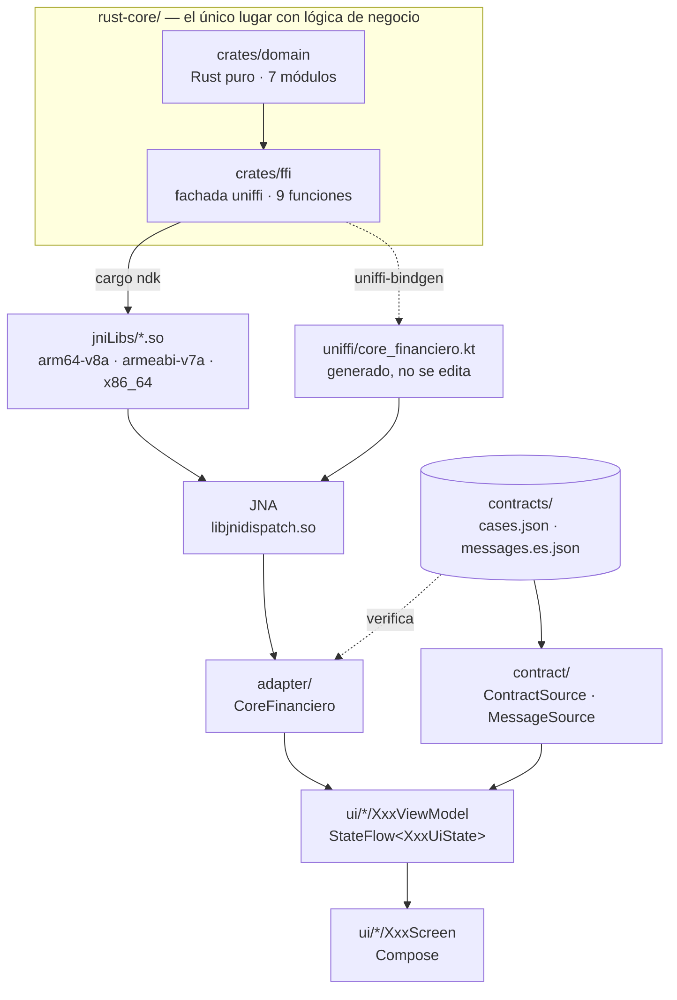

# app-android

App Android nativa que **no contiene ni una sola regla de negocio**. Todo el cálculo —decimales,
transferencias, validación de tarjetas, cifrado— lo resuelve un núcleo escrito en Rust que las
otras tres apps de la POC (iOS, React Native, Angular) consumen **sin reescribirlo**.

Lo que esta app hace con los datos es pedirlos y mostrarlos.

**Estado:** funcional. 35 tests en verde, las cuatro pantallas andando.

| | |
|---|---|
| **Lenguaje / UI** | Kotlin 2.4.20 · Jetpack Compose (BOM 2026.09.00) · Material 3 |
| **Build** | AGP 9.4.0 · Gradle 9 · Java 21 |
| **SDK** | compileSdk 37 · minSdk 28 |
| **Puente al núcleo** | uniffi 0.32 sobre **JNA** (no JNI) |
| **Núcleo** | Rust, `libcore_financiero.so` en tres ABIs |
| **Paquete** | `dev.tohure.android_rust_test` |

---

## Cómo está armada



### Qué es cada pieza y por qué existe

| Pieza | Qué hace | Por qué existe |
|---|---|---|
| `crates/domain` | La lógica: decimales, ITF, Luhn, ChaCha20-Poly1305 | Rust puro, sin uniffi. Un `#[uniffi::export]` ahí **no compila**: la frontera la sostiene el compilador |
| `crates/ffi` | Las nueve funciones públicas | La única superficie que cruza a Kotlin |
| `jniLibs/*.so` | El núcleo compilado por ABI | Lo que el APK embarca y carga en runtime |
| `uniffi/core_financiero.kt` | Bindings generados | **Artefacto generado.** Nunca se edita; si algo está mal, se corrige en Rust y se regenera |
| **JNA** | El puente nativo real | Los bindings de uniffi corren sobre JNA, **no JNI**. Sin esta dependencia la app compila y revienta al primer llamado |
| `adapter/CoreFinanciero` | La única clase que llama al núcleo | Es una **interfaz** para que los ViewModels se testeen en JVM sin emulador. Reexporta los tipos de uniffi: **no los traduce** |
| `contract/` | Lee `cases.json` y `messages.es.json` | Las cuentas iniciales y los mensajes de error son **datos del contrato**, no de la app. Hardcodearlos los haría divergir entre las cuatro apps |
| `ui/*/XxxViewModel` | Un estado inmutable por pantalla | La UI consume y no calcula. Todos los montos son `String` |
| `ui/components/` | Los cinco componentes compartidos | Las cuatro apps usan la misma descomposición para que las pantallas sean comparables |
| `AppContainer` | Cableado manual | Sin Hilt ni Koin: cinco pantallas y tres dependencias no los justifican |

---

## Antes de correrla

Necesitás **Java 21**, el **SDK de Android** y un emulador o teléfono conectado.

Si el repo ya viene con los artefactos construidos, eso alcanza. **Si no**, hay que compilar el
núcleo Rust primero — eso pide `rustup`, `cargo-ndk` y el NDK r27+, y está todo en
**[BUILD.md](BUILD.md)**.

Para saber en cuál de los dos casos estás:

```bash
ls app/src/main/jniLibs/*/libcore_financiero.so
```

Si lista tres archivos, podés correrla ya. Si no, andá a [BUILD.md](BUILD.md).

## Correrla

```bash
adb devices                    # debe listar un dispositivo
./gradlew :app:installDebug
adb shell am start -n dev.tohure.android_rust_test/.MainActivity
```

Cuatro pestañas abajo, y **el pie con la versión del núcleo visible en todas**: algo como
`1.0.0+a0a40a5`. Ese string lleva el SHA del commit con el que se compiló el núcleo, y es la
prueba en pantalla de que las cuatro apps de la demo corren **el mismo build**. Si el pie sale
vacío, la librería nativa no cargó — andá a [BUILD.md](BUILD.md).

---

## Qué podés hacer, pantalla por pantalla

### Aritmética — por qué el `Double` no sirve para dinero

Escribí `0.1` y `0.2`, tocá **Calcular**. Dos tarjetas:

```
Punto flotante nativo     0.30000000000000004     ← Double de Kotlin
Core (Rust · Decimal)     0.30                    ← el núcleo
```

Es la única pantalla donde la app usa punto flotante, y está ahí **como contraejemplo**. Probá
también restas, o `0.1 + 0.7`: los seis casos del contrato divergen.

### Transferencia — el dinero se conserva

Dos cuentas en memoria, con los saldos que dice el contrato. Transferí `100.00` y mirá:

```
Comisión ITF        S/ 0.01
Total debitado      S/ 100.01
Comprobante         TRF-9047-1065-10000
Saldos              S/ 4,899.99   ·   S/ 1,300.50
```

La app **espera** antes de pintar el resultado, para que parezca una llamada de red. **No hay
red**: el núcleo devuelve cuántos milisegundos simular.

Probá a romperlo: un monto mayor al saldo, origen igual a destino, o `100.123` — el campo no te
deja escribir el tercer decimal, y aunque pudieras, el núcleo lo rechaza.

### Tarjeta — cifrado, y que se note que es cifrado

Escribí `4111111111111111` y tocá **Validar y cifrar**:

```
Marca               Visa
Enmascarado         4111 **** **** 1111
Cifrado (hex)       bdca39311826947186b2…c7c7c0dd
Descifrado          4111111111111111        ← la vuelta completa
```

La fila `Descifrado` no es decoración: sin ella ese hex es **indistinguible de un hash**. Cifrar
y descifrar en el mismo gesto es lo que demuestra, mirando, que el núcleo hace criptografía
reversible.

Abajo hay un bloque para **pegar un hex producido por otra plataforma**. Ahí está la demostración
en vivo: copiás el hex de la app de iOS, lo pegás acá, y sale el mismo número — porque las cuatro
comparten clave, nonce y algoritmo desde el mismo núcleo.

### Benchmark — cuánto cuesta cruzar la frontera

Mide el núcleo contra una suma en `Double`, N veces. El núcleo es **más lento** —cruzar el FFI
por JNA cuesta ~150 µs por llamada— y esa es exactamente la comparación honesta: la alternativa
nativa es más rápida **y da mal el resultado**. Ver [TESTING.md](TESTING.md).

---

## Qué NO podés hacer, y por qué

Nada de esto es un pendiente: son decisiones de la POC.

| No hace | Por qué |
|---|---|
| **Guardar nada.** Cerrás la app y los saldos vuelven al inicio | Sin base de datos, sin caché, sin `SharedPreferences`. Es una POC de dominio |
| **Keychain / Keystore / biométricos** | La POC demuestra que **el algoritmo de cifrado** vive en el núcleo y da el mismo resultado en cuatro plataformas. Dónde guardarías una clave en producción es otro problema |
| **Red** | Ni un cliente HTTP. La "latencia" de Transferencia es un número que devuelve el núcleo |
| **Agregar cuentas, tarjetas o bancos** | Los datos son del contrato compartido. Cambiarlos acá los haría divergir de las otras tres apps |
| **Calcular algo en Kotlin** | Si te encontrás escribiendo aritmética sobre montos, el cálculo está en el lugar equivocado: pedíselo al núcleo |

Y dos reglas que valen si vas a tocar el código:

- **Ningún `Double` ni `Float` toca un monto. Nunca**, ni en tests. Los montos viajan como
  `String` de punta a punta. La única excepción es `ui/benchmark/NativeBaseline.kt`, que existe
  para exhibir el fallo y lleva un comentario que lo dice.
- **No edites `uniffi/core_financiero.kt` ni `jniLibs/`.** Son generados. Si algo está mal ahí,
  se arregla en `rust-core` y se regenera.

---

## Dónde está el resto

| Archivo | Para qué |
|---|---|
| **[BUILD.md](BUILD.md)** | Compilar el núcleo Rust, generar los bindings, armar el APK, y las trampas de AGP 9 |
| **[TESTING.md](TESTING.md)** | Las dos suites, el test de contrato, y cómo se verificaron sus guardias |
| **[PENDING.md](PENDING.md)** | Deuda técnica conocida y qué quedó fuera por diseño |
| **[CONTEXT.md](CONTEXT.md)** | La spec: arquitectura de UI, convenciones de ViewModel, prohibiciones |
| [../../docs/ui-spec.md](../../docs/ui-spec.md) | Los labels y el orden de campos que las cuatro apps comparten |
| [../../contracts/README.md](../../contracts/README.md) | El contrato: los 28 casos y de dónde salen |
