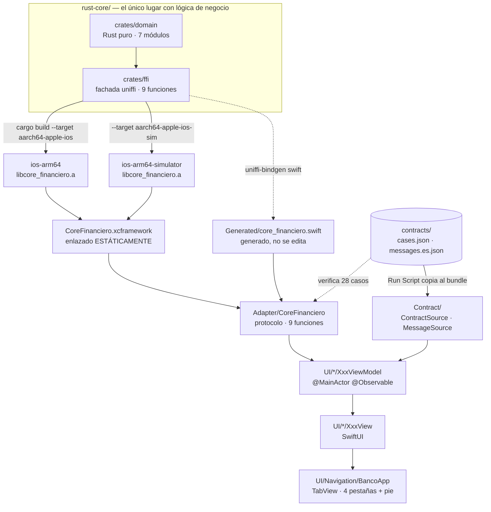

# app-ios

App iOS nativa que **no contiene ni una sola regla de negocio**. Todo el cálculo —decimales,
transferencias, validación de tarjetas, cifrado— lo resuelve un núcleo escrito en Rust que las
otras tres apps de la POC (Android, React Native, Angular) consumen **sin reescribirlo**.

Lo que esta app hace con los datos es pedirlos y mostrarlos.

**Estado:** funcional. Las cuatro pantallas andando y **47 tests en verde**, en simulador y
**también sobre hardware real** — o sea que el slice `aarch64-apple-ios`, el que se embarca,
está probado y no solo compilado. Lo único que queda abierto es el número del benchmark, que se
mide en un teléfono y no en el iPad por la razón que está en [PENDING.md](PENDING.md).

| | |
|---|---|
| **Lenguaje / UI** | Swift 6.3.3 · SwiftUI · `@Observable` |
| **Build** | Xcode 26.6 (17F113) |
| **Deployment target** | **iOS 17.0** — no se negocia |
| **Puente al núcleo** | uniffi 0.32 sobre un **XCFramework estático** |
| **Núcleo** | Rust, `libcore_financiero.a` en dos slices |
| **Target** | `ios-rust-test` |

---

## Cómo está armada



### Qué es cada pieza y por qué existe

| Pieza | Qué hace | Por qué existe |
|---|---|---|
| `crates/domain` | La lógica: decimales, ITF, Luhn, ChaCha20-Poly1305 | Rust puro, sin uniffi. Un `#[uniffi::export]` ahí **no compila**: la frontera la sostiene el compilador |
| `crates/ffi` | Las nueve funciones públicas | La única superficie que cruza a Swift |
| `CoreFinanciero.xcframework` | El núcleo compilado, dos slices | `ios-arm64` es el que se embarca; `ios-arm64-simulator` el que corren los tests. **Son binarios distintos**, y de ahí sale el pendiente de hardware |
| `Generated/core_financiero.swift` | Bindings generados | **Artefacto generado y gitignored.** Nunca se edita; si algo está mal, se corrige en Rust y se regenera. SourceKit se queja de él en el editor; `xcodebuild` no |
| `Adapter/CoreFinanciero` | La única superficie que llama al núcleo | Es un **protocolo** para que los ViewModels se testeen con un doble. Reexporta los tipos de uniffi: **no los traduce** |
| `Adapter/ContractMessages` | Variante de error → texto de usuario | `localizedDescription` es diagnóstico y **nunca** llega a la pantalla |
| `Contract/` | Lee `cases.json` y `messages.es.json` del bundle | Las cuentas iniciales, la clave y el nonce son **datos del contrato**, no de la app. Hardcodearlos los haría divergir entre las cuatro apps |
| `Format/MoneyFormatter` | Pone `S/` y separadores **al pintar** | Escrito a mano y no con `NumberFormatter`: el ICU de cada plataforma mete espacios duros y agrupa distinto, y la demo compara carácter por carácter |
| `UI/*/XxxViewModel` | Un `struct` de estado por pantalla | La UI consume y no calcula. **Todos los montos son `String`** |
| `UI/Components/` | Los cinco componentes compartidos | Las cuatro apps usan la misma descomposición para que las pantallas sean comparables. Es además el **único** lugar donde vive un `#available` |
| `UI/Benchmark/NativeBaseline` | La aritmética en `Double`, a propósito mal | La única excepción a "cero lógica de negocio fuera de `rust-core`": existe **para exhibir** la divergencia de centavos |
| `AppContainer` | Cableado manual | Cinco pantallas y tres dependencias no justifican un contenedor de DI |

### Por qué no hay un ViewModel compartido, y es deliberado

En esta POC **no hay un ViewModel compartido y no lo va a haber**. El núcleo compartido es Rust
y cruza por uniffi como funciones puras; cada app escribe su propio ViewModel, en su propio
lenguaje. Eso no es duplicación accidental — es lo que la POC demuestra: que la capa de
presentación puede ser nativa de cada plataforma mientras el dominio es uno solo.

Lo que impide que esos cuatro ViewModels diverjan son tres artefactos, no un módulo:
[`contracts/cases.json`](../../contracts/cases.json) fija los valores,
[`contracts/messages.es.json`](../../contracts/messages.es.json) los mensajes de error, y
[`docs/ui-spec.md`](../../docs/ui-spec.md) los labels, el orden y la disposición.

---

## Antes de correrla

Hace falta **Xcode 26** y un simulador iOS 17 o superior.

Si el repositorio ya viene con los artefactos construidos, eso alcanza. **Si no**, hay que
compilar el núcleo Rust primero — eso pide `rustup` y los dos targets de iOS, y está todo en
**[BUILD.md](BUILD.md)**.

Para saber en cuál de los dos casos estás:

```bash
ls CoreFinanciero.xcframework/*/libcore_financiero.a
```

Si lista **dos** archivos —`ios-arm64` y `ios-arm64-simulator`— se puede correr ya. Si no, ir a
[BUILD.md](BUILD.md).

## Correrla

```bash
cd apps/ios
xcodebuild build -project ios-rust-test.xcodeproj -scheme ios-rust-test \
  -destination 'platform=iOS Simulator,name=iPhone 17 Pro'
```

Y para abrirla en el simulador, lo más simple es `open ios-rust-test.xcodeproj` y ⌘R.

Qué se debe ver: cuatro pestañas —**Aritmética, Transferencia, Tarjeta, Benchmark**— y al pie
de **las cuatro** el string `1.0.0+57d8fa4` — **sin prefijo**, tal como lo devuelve el core.

**Ese pie no es decorativo.** Es la prueba en pantalla de que las cuatro apps corren el mismo
build, y no es automático: cada artefacto congela el SHA del momento en que se construyó. Antes
de una demo hay que regenerar los cuatro desde el mismo HEAD, o los pies no van a coincidir.

## Correr los tests

```bash
xcodebuild test -project ios-rust-test.xcodeproj -scheme ios-rust-test \
  -destination 'platform=iOS Simulator,name=iPhone 17 Pro'
```

Qué se debe ver: `** TEST SUCCEEDED **` y `Test run with 47 tests in 12 suites passed`.

Y sobre un aparato conectado, que es lo que ejercita el slice que de verdad se embarca:

```bash
xcrun devicectl list devices          # tiene que figurar `available`
xcodebuild test -project ios-rust-test.xcodeproj -scheme ios-rust-test \
  -destination 'id=<identificador del aparato>' -allowProvisioningUpdates
```

Mismo conteo, mismo verde. La primera vez pide además **confiar el certificado en el aparato**;
el mensaje de error exacto y el camino en Ajustes están en **[TESTING.md](TESTING.md)**, junto
con el desglose de la suite, las cinco guardias del contrato y **qué no prueba**.

---

## Qué se puede hacer, pantalla por pantalla

Los labels y el orden de los campos son normativos para las cuatro apps y salen de
[`docs/ui-spec.md`](../../docs/ui-spec.md). Cambiar uno aquí obliga a cambiarlo en las cuatro.

### Aritmética — el float rompe el dinero

Dos operandos, los radios `Sumar` / `Restar` y el botón `Calcular`. Muestra el resultado del
core al lado del de la aritmética nativa en `Double`. Con `0.1 + 0.2` el core da **`0.30`** —con
la escala del contrato, que es lo que fija `ar-001`— y el nativo `0.30000000000000004`: esa
divergencia **es** la pantalla.

**No lleva límite de decimales**, a diferencia de Transferencia: el contrato acepta escala libre
en la entrada.

### Transferencia — el dinero se conserva

Origen, destino y monto. Muestra comisión ITF, total debitado, comprobante y los saldos
resultantes. Transferir `100.00` debe dar `S/ 0.01`, `S/ 100.01`, `TRF-9047-1065-10000` y los
saldos `S/ 4,899.99` y `S/ 1,300.50` — **los mismos strings que Android**.

El campo de monto acepta **2 decimales como máximo**, y eso es un **filtro de texto, no una
validación**: no parsea, no redondea y no calcula. Quien rechaza el monto sigue siendo el core,
y el caso `tr-007` lo prueba en el test de contrato.

Vale la pena romperla a propósito: monto mayor al saldo, y origen igual a destino.

### Tarjeta — cifrado, y que se note que es cifrado

Hace tres cosas y las tres importan: **valida por Luhn, cifra, y descifra.** Con
`4111111111111111` el hex empieza en `bdca3931…` — el mismo que muestra Android, que es el caso
`tj-001` del contrato.

La fila `Descifrado` no es decoración: sin ella el hex es indistinguible de un hash.

El bloque de abajo es **la demostración en vivo de la tesis**: se copia el hex de otra app, se
pega aquí y sale el mismo número, porque las cuatro comparten clave, nonce y algoritmo desde el
mismo core de Rust. Pegar el hex de `tj-002` debe devolver `5555555555554444`.

> El nonce es fijo **a propósito**, para que las cuatro plataformas produzcan el mismo hex. En
> producción eso sería catastrófico; ver [`contracts/README.md`](../../contracts/README.md).

### Benchmark — cuánto cuesta cruzar la frontera

Mide N llamadas a `add("0.1","0.2")` contra la baseline nativa y muestra p50 y p95 de cada una.
**Es la única pantalla donde las llamadas al core salen del hilo principal**: son miles y
bloquearían la UI. En el resto son síncronas y de microsegundos.

El core sale **más lento** que la baseline y está bien: cruzar el FFI cuesta. Lo que la pantalla
exhibe es que la baseline, siendo más rápida, **da mal el resultado**.

Los números de esta plataforma **todavía no están medidos**, y se miden en un teléfono: el
iPad con el que se validó la app lleva un M1 y compararlo contra un Pixel 6 mezclaría el costo
del puente con la diferencia de chip. Ver [PENDING.md](PENDING.md).

---

## Qué NO se puede hacer, y por qué

- **No hay red, ni persistencia, ni async, ni I/O.** Las cuentas se reinician al cerrar la app.
  El `Task.sleep` de Transferencia simula `simulatedLatencyMs`, un campo que devuelve el core;
  no hay ninguna llamada de red detrás.
- **No hay Keychain, biométricos ni almacenamiento seguro.** La pantalla de Tarjeta invita a
  pedirlo: la POC demuestra que **el algoritmo** vive en el core y da el mismo resultado en las
  cuatro plataformas, no dónde guardarías una clave en una app real.
- **No hay aritmética sobre montos en Swift.** Ni `Double`, ni `Float`, ni `Decimal`, ni en los
  tests. La única excepción es `NativeBaseline`, que existe para exhibir el problema y lo dice
  en su propio comentario.
- **No se edita nada bajo `Generated/`.** Si un binding está mal, se corrige en `rust-core` y se
  regenera.
- **No hay tests de UI.** La cobertura de las pantallas vive en los 22 tests de ViewModel; lo
  que eso deja afuera está dicho en [PENDING.md](PENDING.md).

---

## Dónde está el resto

| Archivo | Qué contesta |
|---|---|
| [BUILD.md](BUILD.md) | Cómo se compila el núcleo y se generan los bindings, paso por paso |
| [CONTEXT.md](CONTEXT.md) | Cómo se escribe código en esta app: las reglas del adapter, del ViewModel y de los filtros |
| [TESTING.md](TESTING.md) | Qué prueba la suite, qué **no** prueba, y las cinco guardias del contrato |
| [PENDING.md](PENDING.md) | Qué falta, qué se decidió no hacer, y **qué bloquea el cierre de la fase** |
