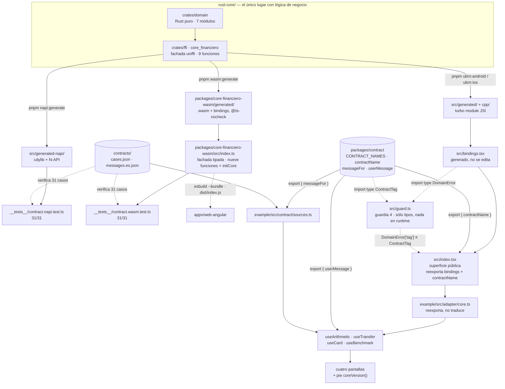

# app-react-native

App de React Native que **no contiene ni una sola regla de negocio**. Todo el cálculo
—decimales, transferencias, validación de tarjetas, cifrado— lo resuelve un núcleo escrito en
Rust que las otras tres apps de la POC (Android, iOS, Angular) consumen **sin reescribirlo**.

Lo que esta app hace con los datos es pedirlos y mostrarlos.

Es además el **único subproyecto que produce tres salidas** del mismo crate: el turbo module
JSI que consume la app, los bindings N-API con que el test de contrato llama al core desde
Node, y el **`.wasm` del que depende la Fase 5** — `apps/web-angular` no consume `rust-core`
directamente, consume lo que se construye aquí.

**Estado:** funcional. Las cuatro pantallas andando en Android y en iOS, el pie de
`coreVersion()` visible en las cuatro, y **129 tests en verde**, con el contrato **31/31 por
N-API y 31/31 por WASM**.

Lo que esta app **no** tiene, y conviene saberlo de entrada: **ninguna prueba automatizada
cruza JSI.** El cruce se verifica con un smoke manual. El porqué está en
[TESTING.md](TESTING.md#qué-no-prueba-nada-de-esto).

| | |
|---|---|
| **Lenguaje / UI** | TypeScript 6.0 · React 19.2 · React Native 0.87 (Fabric) |
| **Runtime de JS** | Hermes |
| **Puente al núcleo** | `uniffi-bindgen-react-native` 0.31.0-5 — turbo module **JSI** |
| **Núcleo** | Rust, enlazado **dentro** de `libbanco-core-financiero.so` / del framework de iOS |
| **Paquete** | `@banco/core-financiero` (librería) + `example/` (la app) |
| **Gestor** | pnpm, workspace declarado en `pnpm-workspace.yaml` |

---

## Cómo está armada

No es una app suelta: es una **librería más un `example/`**, que es la forma que impone
`react-native-builder-bob`. La librería es el paquete que envuelve al core; `example/` es la
app que lo consume, y es donde viven las pantallas.



### Qué es cada pieza y por qué existe

| Pieza | Qué hace | Por qué existe |
|---|---|---|
| `crates/domain` | La lógica: decimales, ITF, Luhn, ChaCha20-Poly1305 | Rust puro, sin uniffi. Un `#[uniffi::export]` ahí **no compila**: la frontera la sostiene el compilador |
| `crates/ffi` | Las nueve funciones públicas | La única superficie que cruza a TypeScript |
| `src/bindings.tsx` | Entrypoint que genera `ubrn` | Registra el crate con Hermes. **Se reescribe entero en cada `--and-generate`**: no se edita |
| `src/index.tsx` | La superficie pública del paquete | Reexporta `bindings` y `contractName`, que ahora vive en `@banco/contract` y no aquí |
| `packages/contract` | `CONTRACT_NAMES`/`contractName`/`messageFor`: variante de `DomainError` → nombre del contrato → mensaje de usuario | Ese mapeo **no cruza el FFI**. Vive en un paquete neutral (fuera de `apps/react-native`) porque lo necesitan también el paquete WASM y Angular — dos copias se desincronizan |
| `src/guard.ts` | La guardia 4: aserta `DomainError['tag'] ≡ ContractTag` | La tabla vive en un paquete que no puede depender de ningún flavour generado; la equivalencia contra el tipo real se aserta aquí. No exporta nada en runtime, existe sólo para que `tsc` lo mire — ver [TESTING.md](TESTING.md#guardia-4-ya-no-la-sostiene-un-satisfies-local-la-sostiene-srcguardts) |
| `example/src/adapter/core.ts` | Reexporta las nueve funciones | **No traduce nombres ni tipos**: una segunda nomenclatura se desincroniza en la primera regeneración |
| `example/src/contract/sources.ts` | Lee `cases.json` y reexporta `messageFor` de `@banco/contract` | Las cuentas, la clave y el nonce son **datos del contrato**, no constantes de la app; `messageFor` ya no se reimplementa aquí, era una copia exacta |
| `userMessage`, de `@banco/contract` | `DomainError` → texto de usuario, en el borde de UI | **Ya no vive en esta app.** Era `example/src/adapter/ContractMessages.ts`, una copia casi idéntica de la de Angular; el arreglo de la Fase 6 —que el diagnóstico dejara de llegar a la pantalla— hubo que aplicarlo en los dos lugares. Ahora los hooks lo importan del paquete |
| `example/src/format/money.ts` | `S/` y separadores, **sobre el string** | Nunca convierte a `number`. Escrito a mano y no con `Intl`: ver [PENDING.md](PENDING.md#intlnumberformat-y-por-qué-el-formateador-está-escrito-a-mano) |
| `__benchmarks__/baseline.ts` | Aritmética IEEE-754 sobre montos | **La excepción**, y existe para exhibir el fallo. Su test comprueba que diverge del contrato |

---

## Antes de correrla

**El binario de Rust se genera primero, para las cuatro apps a la vez.** La secuencia
completa, en orden, vive en
[rust-core/BUILD.md](../../rust-core/BUILD.md#generar-el-core-que-consumen-las-cuatro-apps);
aquí abajo están solo los pasos puntuales que le tocan a esta app (Android e iOS del turbo
module, y el `.wasm` del que depende Angular).

Ya instalado y verificado en esta máquina: Node 22.16, pnpm, Java 21 LTS, Xcode, NDK
30.0.16248370, Rust 1.98.1 con los targets de Android e iOS.

```bash
cd apps/react-native
pnpm install
pnpm exec ubrn --help          # prueba que el CLI compiló (este build no tiene --version)
```

Los artefactos nativos **no están en git**. Hay que generarlos al menos una vez:

```bash
export ANDROID_NDK_HOME="$HOME/Library/Android/sdk/ndk/30.0.16248370"
pnpm ubrn:android              # ~1:01 — 3 ABIs + bindings, y deja src/bindings.tsx
pnpm ubrn:ios                  # ~12 s con cargo cacheado; incluye pod install
pnpm napi:generate             # el .dylib del host + los bindings N-API
```

**`napi:generate` es obligatorio para `pnpm test`, y es el que más fácil se olvida.** Sin él la
suite da **90 de 129 con 3 suites rotas**, no un error que diga qué falta:
`Cannot find module '../src/generated-napi/core_financiero'` en las dos de N-API, y
`BancoApp.test.tsx` cae por `src/bindings`, que sale de `ubrn:android` o `ubrn:ios`.

O sea que **los 129 tests de esta app necesitan el toolchain nativo**: `ubrn:android` pide el
NDK y `ubrn:ios` pide Xcode. Con uno de los dos alcanza para `src/bindings.tsx`. Es la diferencia
con Angular, que sólo necesita `wasm:generate` y ningún toolchain móvil.

Con los tres comandos, la suite da **129 de 129 en verde** desde un clone limpio.

### Dónde se cablea, y qué **no** hay que editar

Una duda razonable: «¿y dónde le digo a la app cómo se llama lo que generó Rust?». **En ningún
lado.** No hay que tocar ningún archivo de configuración: el cableado está fijo en el código del
proyecto y los artefactos caen en rutas fijas. Si están en su lugar, compila.

| | |
|---|---|
| **Los archivos que lo cablean** | `ubrn.config.yaml` para el turbo module, y `ubrn.wasm.yaml` para el `.wasm` |
| **Dónde caen los bindings TS** | `src/generated/` |
| **Dónde cae el C++ del turbo module** | `cpp/` y `ios/` — los dos gitignored |
| **Dónde caen los de N-API** | `src/generated-napi/`, que es lo que usa el test de contrato desde Node |
| **Qué NO se toca** | Los dos `.yaml` ya están escritos y versionados. No hay que editarlos para construir |

**Ojo con `android/generated` e `ios/generated`: ésos no son de `ubrn`.** Los produce el
**Codegen de React Native** a partir del `codegenConfig` del `package.json`, y los genera Gradle
o CocoaPods en tiempo de build. Son dos generadores distintos escribiendo en carpetas de nombre
parecido; confundirlos hace buscar el error en el lado equivocado.

Esta app es la única que produce **tres** salidas del mismo crate: el turbo module JSI que usa
la app, los bindings N-API con que el test de contrato llama al core desde Node, y el `.wasm`
del que depende Angular.

---

## Correrla

Los comandos de abajo son los que **efectivamente se corrieron** para cerrar esta fase.

```bash
# Metro, en su propia terminal. Tras reconstruir nativo, --reset-cache no es opcional.
cd apps/react-native/example
pnpm exec react-native start --reset-cache

# Android (emulador Pixel 9 Pro API 36, arm64-v8a)
pnpm exec react-native run-android --no-packager        # ~27 s

# iOS (simulador iPhone 17 Pro)
pnpm exec react-native run-ios --no-packager --simulator "iPhone 17 Pro"   # ~20 s
```

**Metro muere con la terminal que lo lanzó.** Si la app arranca en pantalla roja diciendo
`loadJSBundleFromAssets`, no es un fallo del build: es que no hay Metro.

Para leer la pantalla de Android sin mirarla —útil por ssh o en CI—:

```bash
adb shell uiautomator dump /sdcard/ui.xml >/dev/null
adb shell cat /sdcard/ui.xml | tr '>' '>\n' | grep -o 'text="[^"]*"' | grep -v 'text=""'
```

---

## Correr los tests

```bash
cd apps/react-native
pnpm test              # 129 tests, 16 suites, en dos proyectos de Jest
pnpm exec tsc --noEmit # sin errores
pnpm lint              # sin errores
```

Son **dos proyectos de Jest y la separación no es cosmética** — el detalle está en
[TESTING.md](TESTING.md):

| Proyecto | Entorno | Qué corre ahí |
|---|---|---|
| `napi` | Node puro | El contrato por N-API y por WASM, y la divergencia de la baseline. Carga un `.dylib` nativo de verdad |
| `react-native` | Preset de RN | Los hooks y los componentes, con `@testing-library/react-native` |

```bash
pnpm jest __tests__/contract.napi.test.ts     # el contrato por N-API
pnpm jest __tests__/contract.wasm.test.ts     # los mismos 31 por WASM
pnpm jest __benchmarks__                      # la baseline de TS diverge del contrato
```

**Lo que estos tests NO prueban es el cruce de JSI.** Eso lo prueba el smoke manual de
[BUILD.md](BUILD.md#el-smoke-jsi), y es una diferencia real con Android —que tiene 15 tests
instrumentados— y con iOS.

### La verificación completa de la fase

Corrida entera al cerrar, sobre `b5b1388`. Son los números reales, no los que el plan esperaba:

| Base | Comando | Resultado |
|---|---|---|
| `rust-core` | `cargo test --workspace` | **67** |
| `apps/android` | `./gradlew :app:testDebugUnitTest --rerun` | **31** |
| `apps/android` | `./gradlew :app:connectedDebugAndroidTest` | **15** (Pixel 9 Pro API 36) |
| `apps/ios` | `xcodebuild test -scheme ios-rust-test -destination 'platform=iOS Simulator,name=iPhone 17 Pro'` | **47** |
| `apps/react-native` | `pnpm test` | **129**, 16 suites |

**El `--rerun` de Android no es decorativo.** Sin él, Gradle contesta `BUILD SUCCESSFUL` en
405 ms con la tarea `UP-TO-DATE`: **no corrió nada**, reusó un resultado cacheado. Un verde así
no prueba nada el día que importa. El conteo de arriba se cruzó además contra los XML de
`app/build/test-results/`.

Y el pie de `coreVersion()` en las cuatro pantallas —Android nativo, iOS nativo, y React Native
en Android y en iOS— decía **`1.0.0+b5b1388`**, idéntico en las cuatro.

---

## Qué se puede hacer, pantalla por pantalla

Los labels son los de [`docs/ui-spec.md`](../../docs/ui-spec.md), **textuales**: la demo pone
las cuatro apps lado a lado y las compara carácter por carácter. Cambiar uno aquí obliga a
cambiarlo en las cuatro.

### Aritmética — el float rompe el dinero

Con `0.1` y `0.2`, `Sumar`: el bloque rojo muestra `0.30000000000000004` y el verde `0.30`.
Es la única pantalla donde se permite el tipo flotante nativo, y existe justamente para eso.

### Transferencia — el dinero se conserva

Origen `00219100123456789047`, destino `01122000987654321065`, monto `100.00`. El botón pasa a
spinner mientras corre la latencia simulada —**no hay red**; el número lo devuelve el core— y
después: `Comisión ITF S/ 0.01`, `Total debitado S/ 100.01`,
`Comprobante TRF-9047-1065-10000`, y los saldos en `S/ 4,899.99` y `S/ 1,300.50`.

Tipear `0.001` en el monto: **el campo no deja escribir el tercer decimal.** Es un filtro de
texto, no una validación — quien rechaza el monto sigue siendo el core, y el caso `tr-007` del
contrato lo prueba.

### Tarjeta — cifrado, y que se note que es cifrado

Con `4111111111111111`, `Validar y cifrar`: `Visa`, `4111 **** **** 1111`, el hex
`bdca39311826947186b20ec2a92c3f521aacff902e37d519bcd2754fc7c7c0dd` y, debajo, el número **de
vuelta**. Esa última fila no es decoración: sin ella el hex es indistinguible de un hash.

El bloque de abajo es la demostración en vivo de la tesis. Pegar ahí el hex que produjo la app
de Android o la de iOS y sale el mismo número, porque las cuatro comparten clave, nonce y
algoritmo desde el mismo core.

### Benchmark — cuánto cuesta cruzar la frontera

Medido con `FfiCostProbe` en **release, sobre aparatos físicos** —un Pixel 6 y un iPhone 12—
contra el artefacto `1.0.0+959025f`. `add("0.1","0.2")`, p50:

| | piso del cruce | `add` | baseline JS |
|---|---|---|---|
| React Native / Android — Pixel 6 | 4,23 µs | **9,44 µs** | 1,18 µs |
| React Native / iOS — iPhone 12 | 2,29 µs | **4,71 µs** | 0,67 µs |
| *app nativa de Android, mismo Pixel 6* | *47,10 µs* | *145,9 µs* | *2,12 µs* |
| *app nativa de iOS, mismo iPhone 12* | *0,062 µs* | *0,42 µs* | *0,15 µs* |

**El core es más lento que la baseline, y está bien: es el argumento.** Lo que la pantalla exhibe
es que la baseline, siendo más rápida, **da mal el resultado**.

Pero el dato que se lleva la discusión es otro: **el orden se da vuelta según la plataforma.** En
el Pixel 6 esta app cruza **15× más barato** que la app nativa de Kotlin, porque JSI llama a C++
directo y Kotlin paga JNA. En el iPhone es al revés: la nativa cruza **11× más barato**, porque
enlaza el `.a` estáticamente. *No hay un ganador de plataforma; hay un puente caro, y es JNA.*

Y como esta app usa **el mismo puente en los dos teléfonos**, sus dos filas son el único control
de hardware que tiene la POC: 1,8× de diferencia. Eso es lo que permite afirmar que la brecha
entre las dos apps nativas no la explica el aparato. Cuadro completo en
[docs/cross-app-pending.md](../../docs/cross-app-pending.md); cómo se prende la sonda, en
[BUILD.md](BUILD.md).

Los números que este archivo traía antes —3,96 µs en Android, 8,75 en iOS— eran de **emulador y
simulador**, y eran optimistas: el mismo `add` en el Pixel 6 físico cuesta 9,44.

---

## Por qué el turbo module es agnóstico del bundler

Es la pregunta que la demo va a recibir, y conviene tenerla contestada antes.

**A un turbo module no lo bundlea nadie.** Es código nativo que enlazan Gradle y CocoaPods, y
que se registra contra el runtime de JavaScript cuando la app arranca. Metro, Re.Pack, rspack y
webpack bundlean **JavaScript**: lo que pasa por ellos es el `.ts` generado que llama al
módulo, no el módulo. Por eso cambiar de bundler no toca esta pieza.

**Y el core no se puede federar.** Viaja dentro del `.apk` y del `.ipa`, porque es una librería
nativa enlazada en tiempo de build. Se pueden federar las **pantallas** que lo llaman; el core,
nunca. Quien pida Module Federation para el núcleo está pidiendo algo que la plataforma no
permite, no algo que esta POC no hizo.

---

## Qué NO se puede hacer, y por qué

- **Ni una regla de negocio en TypeScript.** Ni un Luhn, ni una tasa, ni una multiplicación
  sobre un monto. Escribir aritmética sobre dinero aquí es hacer lo contrario
  de lo que la POC demuestra.
- **Ningún monto pasa por `number`.** Ni `parseFloat`, ni `Number()`, ni `+`. Son strings desde
  `rust_decimal` hasta el `<Text>`. La única excepción son las dos baselines, y existen para
  exhibir el problema.
- **Ninguna librería de decimales** (`decimal.js`, `big.js`). Necesitarla es señal de que el
  cálculo está en el lugar equivocado.
- **Sin red, sin persistencia, sin I/O.** Las cuentas se reinician al cerrar la app.
- **Los generados no se editan a mano.** `src/generated*`, `cpp/`, `src/bindings.tsx`,
  `src/NativeCoreFinanciero.ts` y el podspec los reescribe `ubrn` en cada regeneración. Si algo
  generado está mal, se corrige en `rust-core` y se regenera.

---

## Dónde está el resto

| Archivo | Qué contesta |
|---|---|
| [CONTEXT.md](CONTEXT.md) | El stack, la estructura y las prohibiciones del subproyecto |
| [BUILD.md](BUILD.md) | Toolchain, los tres flavours de `ubrn`, el smoke JSI, y **las siete incompatibilidades de pnpm que hubo que arreglar** |
| [TESTING.md](TESTING.md) | Qué prueba y qué **no** prueba cada suite, y las cinco guardias del contrato |
| [PENDING.md](PENDING.md) | La deuda: el WASM, el `catch_unwind` que no existe ahí, y lo que queda abierto |
| [../../docs/ui-spec.md](../../docs/ui-spec.md) | Los labels exactos, normativos para las cuatro apps |
| [../../docs/demo-runbook.md](../../docs/demo-runbook.md) | El guion de la demo |
