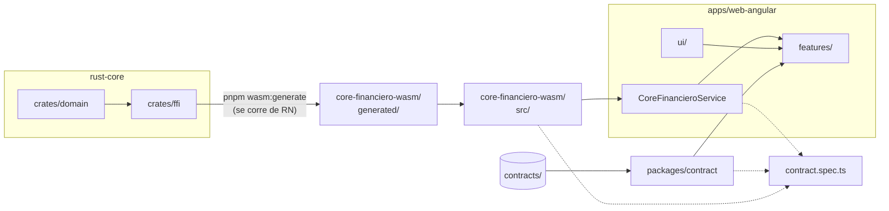

# app-web-angular

Cuarto y último consumidor del núcleo. Angular standalone que corre el **mismo** `rust-core`
compilado a WebAssembly: sin reescribir una regla de negocio y sin migrar el front a React.

Es la app que cierra la POC. Con ésta, las cuatro pantallas existen a la vez y la comparación
lado a lado —cuatro plataformas produciendo el mismo string carácter por carácter— se puede
hacer de verdad.


## Arquitectura



**Leyenda**

| Caja | Qué es |
|---|---|
| `crates/domain` · `crates/ffi` | El núcleo en Rust: la lógica pura y la fachada uniffi de nueve funciones. |
| `core-financiero-wasm/generated/` | El `.wasm` —el núcleo compilado para correr dentro del navegador— más los bindings que escribe el generador. Va con `@ts-nocheck`, está gitignoreado y **no se edita**. |
| `core-financiero-wasm/src/` | La fachada escrita a mano: una superficie estable que no se mueve cuando el generador cambia, más `initCore`. Sin esta capa, cada regeneración rompería el `tsc` de la app. |
| `CoreFinancieroService` | Las nueve funciones, **síncronas**. El módulo se carga una sola vez en un *app initializer*, así que no hace falta un `await` por método. |
| `packages/contract` | El mapeo de error a texto de usuario, compartido con React Native. No cruza el FFI. |
| `ui/` · `features/` | Los seis componentes compartidos y las cuatro pantallas. Ningún cálculo, y todos los montos son `String`. |
| `contracts/` | Los dos JSON compartidos, en la raíz del repo. |
| `contract.spec.ts` | Los 31 casos del contrato contra el borde real: las nueve funciones entran por `CoreFinancieroService` —el mismo que usan las pantallas—, y del paquete WASM sólo sale `initCore`. Las punteadas son suyas: marcan lo que el test consume. |


**El comando que produce el `.wasm` se ejecuta desde `apps/react-native`** porque ahí viven
el CLI de `ubrn` y su config — pero esta app depende del **paquete**, no de esa app: su
`package.json` no la nombra.


### Qué es cada pieza y por qué existe

- **`apps/web-angular` no depende de `rust-core`, depende de `apps/react-native`.** El `.wasm`
  lo produce `ubrn build wasm2` allí, no aquí. Es la única arista rara del grafo de build de la
  POC y está así a propósito: `ubrn` ya sabía compilar a wasm y montar un segundo pipeline en
  `rust-core` habría sido ceremonia. Eso explica **dónde** vive el comando; por qué el core se
  compila con uniffi y no con `wasm-pack`, que sería lo habitual para una app web, está más
  abajo.
- **`packages/core-financiero-wasm` tiene dos capas y las dos hacen falta.** `generated/` es
  churn del generador y va con `@ts-nocheck`; `src/index.ts` lo envuelve a mano con una
  superficie que no se mueve cuando el generador cambia. Sin esa capa, cada regeneración
  rompería el `tsc` de la app.
- **`public/core_financiero.wasm` es un symlink** al artefacto generado. Nunca se copia a mano
  —la prohibición del CONTEXT— y por eso en un clone limpio sin el paquete construido el archivo
  apunta a la nada: ver «Antes de correrla».
- **El servicio es síncrono, y eso es una decisión, no un descuido.** El módulo se inicializa
  una sola vez al arrancar (`loadCore` en un app initializer) y después las nueve funciones se
  reexportan tal cual. La alternativa —un `await` en cada método— habría vuelto `async` a las
  cuatro pantallas para nada: el WASM ya está cargado antes de que se pinte la primera.
- **`packages/contract` lo comparten producción y test, y desde la Fase 6 también las dos apps
  de TypeScript.** `userMessage` —el borde donde un `DomainError` se vuelve texto humano— vive
  ahí, no aquí: estaba escrita dos veces, casi idéntica, en esta app y en React Native, y el
  arreglo de la Fase 6 —que el diagnóstico dejara de llegar a la pantalla— hubo que aplicarlo en
  los dos lugares. Usa el mismo `contractName`/`messageFor` que el test de contrato, en vez de
  una segunda copia que se desincroniza. Se importa del barrel y no de
  `@banco/contract/testing`, que toca `node:fs` y no se puede empaquetar para el navegador.

### Por qué no `wasm-pack`, que es el camino estándar

Para un proyecto de Rust y Angular y nada más, el pipeline habitual del ecosistema es
**`wasm-pack` / `wasm-bindgen`**: se anotan las funciones con `#[wasm_bindgen]`, se corre
`wasm-pack build --target web`, y sale un paquete npm con el `.wasm` y sus tipos. Sin uniffi, sin
`ubrn`, sin nada que mencione React Native. Es razonable preguntarse por qué esta POC toma el
camino largo.

La razón es consecuencia directa de las cuatro plataformas. El core tiene **cero anotaciones
`#[wasm_bindgen]`** —verificado sobre `crates/ffi` y `crates/domain`, no supuesto—: su única
superficie de exportación es `#[uniffi::export]`, y esas nueve funciones sirven a las cuatro apps
a la vez.

Adoptar `wasm-pack` obligaría a anotar las mismas nueve funciones **dos veces**
—`#[uniffi::export]` para Android, iOS y React Native, `#[wasm_bindgen]` para esta app— y a
mantener las dos superficies sincronizadas a mano. Es el mismo modo de falla que el adapter de
Android evita al reexportar los tipos de uniffi en vez de traducirlos, sólo que adentro del core,
que es el peor lugar donde ponerlo.

Hay un segundo costo, menos visible: `wasm-bindgen` y uniffi generan APIs con convenciones
distintas, así que esta app terminaría consumiendo el núcleo con una forma diferente a la de las
otras tres. La tesis de la POC —cuatro plataformas, el mismo núcleo, los mismos strings— se
sostiene peor cuando una de las cuatro llama al core de otra manera.

> `wasm-bindgen` **sí** aparece en el árbol de dependencias: `ubrn` lo lleva compilado adentro,
> anclado en `=0.2.100`. Lo que no existe es una sola anotación escrita a mano en el core. La
> distinción importa para quien corra `cargo tree` y encuentre el crate.

## Antes de correr la demo

**El binario de Rust se genera primero, para las cuatro apps a la vez.** La secuencia
completa, en orden, vive en
[rust-core/BUILD.md](../../rust-core/BUILD.md#generar-el-core-que-consumen-las-cuatro-apps);
el paso que le toca a esta app no se corre aquí ni en `rust-core/`, sino desde
`apps/react-native/` — ver abajo.

**No hace falta correr ni construir la app de React Native.** Es la duda razonable al ver el
`cd apps/react-native` de abajo, así que conviene decirlo antes: no hace falta NDK de Android, ni
Xcode, ni emulador, ni teléfono, ni Metro. `ubrn` es la herramienta que compila el crate a wasm y
está instalada como dependencia de esa app; es una **ubicación de herramienta de build, no una
dependencia de runtime**. Tanto es así que el artefacto se escribe en `packages/`, fuera de ella.

Lo que sí hace falta: **Node 22, pnpm, y Rust con el target `wasm32-unknown-unknown`.**

El `.wasm` **no está en git**. En un clone limpio hay que construirlo, y es lo primero:

```bash
# desde la raíz del repo
pnpm install --ignore-scripts

# el .wasm se construye en react-native, no aquí
cd apps/react-native && pnpm wasm:generate
```

**El `--ignore-scripts` no es opcional en un clone limpio.** Es un bug conocido **del
workspace, no de esta app**: lo provoca el `prepare` de `apps/react-native`, que corre en
cualquier `pnpm install` desde la raíz. La causa y qué se pierde al saltearlo están en
[el Paso 0 del README raíz](../../README.md#paso-0-dejar-el-repo-listo).

Lo que sí es propio de aquí: sin el flag, el `pnpm wasm:generate` de después **ni siquiera
arranca**, porque pnpm detecta la instalación incompleta, reintenta el install solo, y aborta
con `[ERROR] Command failed with exit code 1: pnpm install`.

Ese segundo comando hace tres cosas: `ubrn build wasm2 --release --and-generate`, le pega el
`@ts-nocheck` al `index.ts` generado, y compila la fachada con esbuild. Tarda ~40 s la primera vez, y **no necesita ningún toolchain móvil**.

Si se saltea, la app falla al arrancar con un mensaje que dice exactamente qué falta
construir — **pero ese mensaje va a la consola del navegador, no a la pantalla**: lo que se ve
es una página en blanco. Quien no abra las herramientas de desarrollo no tiene ninguna pista.

El mensaje:

```
No se pudo cargar core_financiero.wasm desde http://localhost:4200/core_financiero.wasm
(status 404). ¿Está construido el paquete @banco/core-financiero-wasm?
```

### Dónde se cablea, y qué **no** hay que editar

Una duda razonable: «¿y dónde le digo a la app cómo se llama lo que generó Rust?». **En ningún
lado.** No hay que tocar ningún archivo de configuración: el cableado está fijo en el código del
proyecto y los artefactos caen en rutas fijas. Si están en su lugar, compila.

| | |
|---|---|
| **Lo que cablea la API de TypeScript** | `package.json` — la dependencia `"@banco/core-financiero-wasm": "workspace:*"` |
| **Lo que cablea el binario** | `public/core_financiero.wasm`, que es un **symlink versionado** a `packages/core-financiero-wasm/generated/core_financiero.wasm`. `angular.json` sirve todo `public/` como assets |
| **Dónde cae el `.wasm`** | `packages/core-financiero-wasm/generated/` — el destino del symlink, **gitignored** |
| **Dónde cae lo que Angular importa** | `packages/core-financiero-wasm/dist/`, el bundle de esbuild |
| **Qué NO se toca** | **No hay carpeta `src/assets/`, y no hay que crearla.** El `.wasm` no se copia a mano en ningún lado: el symlink ya está en git y apunta al artefacto |

**El symlink está versionado pero su destino no**, y por eso el servicio chequea
`response.ok` antes de leer los bytes: en un clone sin construir el symlink queda colgando, y
sin ese chequeo los bytes del error entrarían a `WebAssembly.compile` y el fallo sería un trap
opaco en vez de un mensaje que dice qué falta.

Qué contesta el dev-server, medido y no supuesto — un `.wasm` que no está da **404**, no el
`index.html` del SPA:

| Pedido | Respuesta |
|---|---|
| `/core_financiero.wasm` con el symlink colgando | `404`, `text/html`, 153 bytes |
| Una ruta de navegación cualquiera | `200`, `text/html`, el `index.html` del SPA |
| `/core_financiero.wasm` con el paquete construido | `200`, **`application/wasm`**, 180 644 bytes |

El *fallback* del SPA existe, pero **no se aplica a una ruta con extensión de archivo**, así que
la explicación importa poco para el resultado —`response.ok` es falso en los dos casos— y mucho
para entender qué se está viendo.

Esta app **no consume `rust-core` directamente**: consume lo que produce
`apps/react-native`. Es la única de las cuatro con esa dependencia, y es la razón por la que su
paso de build no se corre ni aquí ni en `rust-core/`.

## Correr la demo

```bash
cd apps/web-angular
pnpm exec ng serve
# abrir http://localhost:4200/
```

Qué se debe ver: cuatro pantallas y, al pie de todas, `1.0.0+<sha>` — el mismo string que muestran
las otras tres apps. Si el pie sale vacío, el WASM no cargó.

**`ng serve` estuvo roto en este repo hasta que se destraparon dos fallos encadenados de
resolución de módulos** —uno en `@banco/contract`, que se consume como fuente TypeScript, y otro
en `@banco/core-financiero-wasm`, que no era autocontenido—. El detalle de los dos está en
[PENDING.md](PENDING.md); vale leerlo antes de tocar `angular.json` o el `build` del paquete WASM,
porque los dos arreglos son los que lo sostienen.

Si alguna vez vuelve a fallar, el plan B sigue en pie y no depende de Vite:

```bash
pnpm exec ng build --configuration development
cd dist/web-angular/browser && python3 -m http.server 4311
```

El `.wasm` **no necesita** servirse con MIME `application/wasm` — ver «Qué NO se puede hacer».

## Correr los tests

```bash
cd apps/web-angular
pnpm test          # 102 passed (14 archivos), incluye el contrato 31/31
pnpm lint          # All files pass linting
pnpm build         # bundle inicial 215.08 kB (57.98 kB transferidos)
pnpm format:check  # All matched files use Prettier code style!
```

Los cuatro son gates de la fase y los cuatro corrieron en verde antes de cerrarla.

El test de contrato vive en `src/app/core/contract.spec.ts` y lee el **mismo**
`contracts/cases.json` que Rust, Android, iOS y React Native. Comparación por **igualdad exacta
de strings**, nunca numérica con tolerancia. Lleva cuatro de las cinco guardias (versión y
moneda; conteo por grupo; claves de primer nivel; cobertura de las nueve variantes en
`messages.es.json`); **la guardia 4 vive en `packages/core-financiero-wasm/src/guard.ts`**,
porque es sobre la forma del `DomainError` de este flavour del binding y no sobre el JSON.

## Qué se puede hacer, pantalla por pantalla

Los labels y el orden de campos son normativos y viven en
[`docs/ui-spec.md`](../../docs/ui-spec.md), igual que en las otras tres.

### Aritmética — el float rompe el dinero

`0.1 + 0.2`. El core devuelve `0.30`; el `number` de JavaScript da
`0.30000000000000004`. Los seis casos de `aritmetica` divergen bajo IEEE-754, y ésta es la
pantalla donde se ve.

### Transferencia — el dinero se conserva

Origen, destino, monto. Devuelve los saldos nuevos, la comisión ITF, el total debitado y el
comprobante. La suma de saldos antes y después es la misma, al centavo.

El campo de monto acepta **2 decimales como máximo**, forzado en el campo con un filtro de
texto. No es una regla de negocio: el core igual rechaza `tr-007`, pero el usuario no tiene que
llegar hasta ahí en una demo.

### Tarjeta — cifrado, y que se note que es cifrado

Número de tarjeta, marca y enmascarado, y el ciphertext en hex. El hex tiene que salir
**idéntico** en las cuatro apps: el nonce es fijo a propósito para que así sea.

### Benchmark — cuánto cuesta cruzar la frontera

Compara el `add` del core contra la baseline en `number` del propio JavaScript. Medido en Chrome
con el WASM real: **core ~1,5 µs contra ~0,07 µs de la baseline nativa, una brecha de 20-40×**.

Tres advertencias que no se pueden omitir al presentarlo, y ninguna es menor:

1. **No mide como las otras tres apps.** El `performance.now()` del navegador está cuantizado a
   ~100 µs por la mitigación anti-Spectre, o sea un reloj ~100× más grueso que lo que se quiere
   medir. Por eso aquí se cronometran **lotes** de K llamadas y se divide, mientras Android e iOS
   miden cruce por cruce con relojes de nanosegundos. **Ubica el orden de magnitud; no sirve para
   una comparación centavo a centavo con las otras tres.**
2. **El número depende de lo que teclees en `Iteraciones`**, y no es ruido: 3,00 µs con 100,
   1,50 con 1000 y 1,32 con 999999, reproducible al centésimo. Lo reportado es el costo por
   operación **dentro de un lote**, y a mayor lote más caliente está el JIT. **Dos corridas sólo
   son comparables si tecleaste el mismo valor.**
3. **Corre en el hilo principal.** La pestaña se bloquea mientras mide (43 ms con 100; 3,4 s con
   el tope de 999999). Sacarlo de ahí exigía reinstanciar el módulo WASM en un Web Worker, que es
   infraestructura nueva y quedó fuera de alcance.

Puesta junto a las otras tres, la cifra ubica a WASM **en el medio, y más arriba de lo que se
esperaba**. Comparando `add` contra `add`: Android nativo por JNA 145,9 µs, React Native por JSI
9,44 µs en el mismo teléfono, **WASM ~1,5 µs**, iOS nativo por `.a` estático 0,42 µs. O sea unas
cien veces más rápido que JNA, **más rápido que el puente JSI de React Native**, y unas cuatro
veces más lento que el `.a` que iOS enlaza estáticamente. Mismo núcleo; lo que cambia es el
puente.

## Qué NO se puede hacer, y por qué

- **No hay `number` en ningún monto.** Ni `parseFloat`, ni `Number()`, ni aritmética. Los montos
  son strings desde el WASM hasta el template. La única excepción es
  `features/benchmark/baseline.ts`, que existe justamente para exhibir la divergencia y lo dice
  en un comentario.
- **No hay reglas de negocio en TypeScript.** Ni validación de CCI, ni Luhn, ni la alícuota del
  ITF.
- **No se usa `Intl.NumberFormat` sobre montos.** Con `style: "currency"` separa el símbolo con
  **U+00A0** y las otras tres apps usan **U+0020**: un byte invisible que rompe la comparación
  carácter por carácter. `formatPEN` agrupa manipulando el string. Tampoco `CurrencyPipe`, que
  espera un `number`.
- **No hay red del `catch_unwind`.** `wasm32-unknown-unknown` impone `panic = "abort"`, así que
  un pánico del core aquí **no vuelve como error del FFI**: es un trap que deja la instancia del
  módulo inutilizable y obliga a recargar la página. Lo único que protege esta app es la
  disciplina del core (cero `panic!`/`unwrap()`/`expect()` en producción) y sus proptests
  `*_never_panics`. No hay segunda red.
- **El MIME `application/wasm` no hace falta aquí**, contra lo que advertía el CONTEXT. `loadCore`
  pasa **bytes** (`response.arrayBuffer()`) a `initCore`, y con bytes se usa
  `WebAssembly.compile`, que no mira el `Content-Type`; sólo `compileStreaming` lo exige. Se
  pierde la compilación en streaming, irrelevante para 180 KB.

## Glosario

| Término | Qué es |
|---|---|
| **standalone** | Componentes de Angular que declaran sus propias dependencias y no necesitan un `NgModule`. Es el modo por defecto de las versiones recientes, y el que usa esta app. |
| **app initializer** | Un paso que Angular ejecuta **antes** de pintar la primera pantalla. Aquí carga el módulo WASM una sola vez, y es lo que permite que el servicio sea síncrono en vez de pedir un `await` por método. |
| **symlink** | Un enlace simbólico. `public/core_financiero.wasm` no es una copia sino un puntero al artefacto generado — copiarlo a mano está prohibido. En un clone limpio sin el paquete construido, ese puntero apunta a la nada. |
| **`ubrn` / `wasm2`** | *uniffi-bindgen-react-native* y su *flavour* de WebAssembly: juntos producen el `.wasm`. Se ejecutan desde `apps/react-native`, no aquí. |

## Dónde está el resto

- [CONTEXT.md](CONTEXT.md) — el contrato de este subproyecto y sus prohibiciones.
- [PENDING.md](PENDING.md) — deuda conocida, con el porqué de cada una.
- [`docs/ui-spec.md`](../../docs/ui-spec.md) — labels y orden de campos, normativo para las cuatro.
- [`docs/demo-runbook.md`](../../docs/demo-runbook.md) — el guion de la demo lado a lado.
- [`rust-core/README.md`](../../rust-core/README.md) — el núcleo y su contrato.
