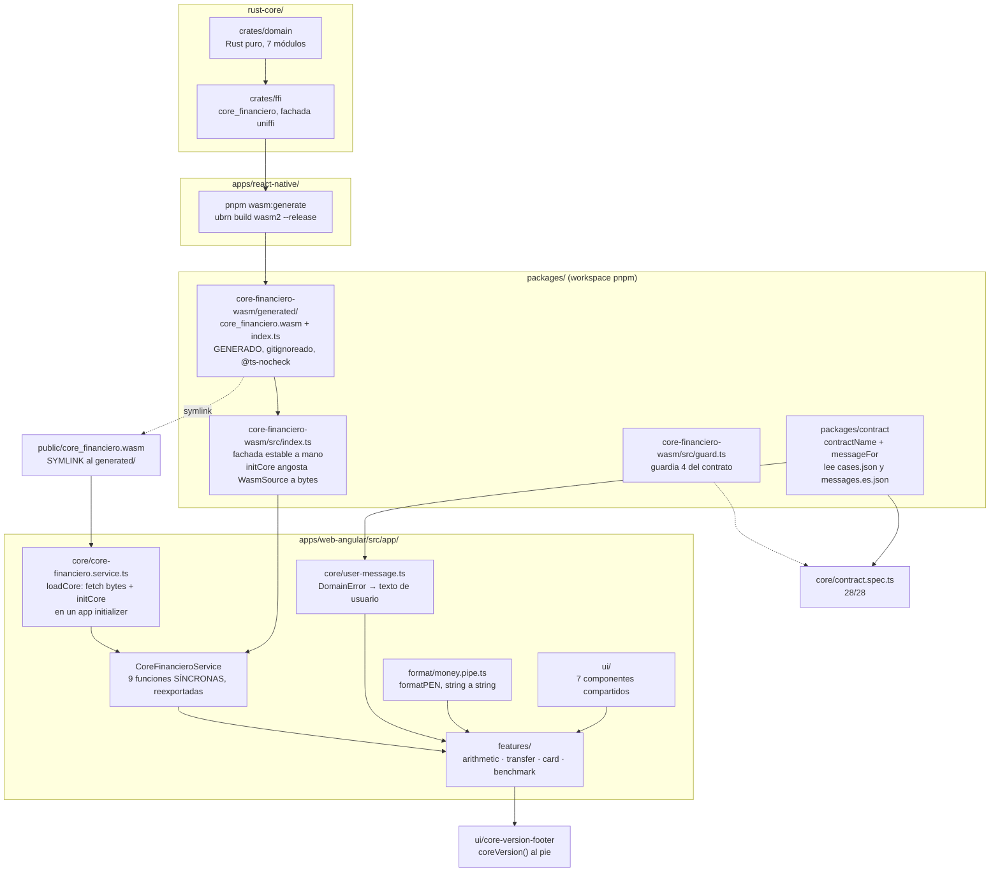

# app-web-angular

Cuarto y último consumidor del núcleo. Angular standalone que corre el **mismo** `rust-core`
compilado a WebAssembly: sin reescribir una regla de negocio y sin migrar el front a React.

Es la app que cierra la POC. Con ésta, las cuatro pantallas existen a la vez y la comparación
lado a lado —cuatro plataformas produciendo el mismo string carácter por carácter— se puede
hacer de verdad.

**99 tests en verde**, 15 archivos, con el test de contrato **28/28** contra
`contracts/cases.json` v2.3.0.

## Cómo está armada



### Qué es cada pieza y por qué existe

- **`apps/web-angular` no depende de `rust-core`, depende de `apps/react-native`.** El `.wasm`
  lo produce `ubrn build wasm2` allá, no acá. Es la única arista rara del grafo de build de la
  POC y está así a propósito: `ubrn` ya sabía compilar a wasm y montar un segundo pipeline en
  `rust-core` habría sido ceremonia.
- **`packages/core-financiero-wasm` tiene dos capas y las dos hacen falta.** `generated/` es
  churn del generador y va con `@ts-nocheck`; `src/index.ts` lo envuelve a mano con una
  superficie que no se mueve cuando el generador cambia. Sin esa capa, cada regeneración
  rompería el `tsc` de la app.
- **`public/core_financiero.wasm` es un symlink** al artefacto generado. Nunca se copia a mano
  —la prohibición del CONTEXT— y por eso en un clone limpio sin el paquete construido el archivo
  apunta a la nada: ver «Antes de correrla».
- **El servicio es síncrono, y eso es una decisión, no un descuido.** El módulo se inicializa
  una sola vez al arrancar (`loadCore` en un app initializer) y después las nueve funciones se
  reexportan tal cual. La alternativa —un `await` en cada método— habría vuelto `async` a las
  cuatro pantallas para nada: el WASM ya está cargado antes de que se pinte la primera.
- **`packages/contract` lo comparten producción y test.** `user-message.ts` usa el mismo
  `contractName`/`messageFor` que el test de contrato, en vez de una segunda copia que se
  desincroniza. Se importa del barrel y no de `@banco/contract/testing`, que toca `node:fs` y no
  se puede empaquetar para el navegador.

## Antes de correrla

El `.wasm` **no está en git**. En un clone limpio hay que construirlo, y es lo primero:

```bash
# desde la raíz del repo
pnpm install

# el .wasm se construye en react-native, no acá
cd apps/react-native && pnpm wasm:generate
```

Ese comando hace tres cosas: `ubrn build wasm2 --release --and-generate`, le pega el
`@ts-nocheck` al `index.ts` generado, y compila la fachada con esbuild.

Si te lo saltás, la app arranca y falla en el arranque con un mensaje que dice exactamente qué
falta construir. Eso es deliberado: el symlink apunta a un artefacto gitignoreado y el server de
Angular contesta el `index.html` del SPA con status 200, así que sin el chequeo de `response.ok`
el error sería un trap opaco de WebAssembly en vez de una instrucción.

## Correrla

**`ng serve` no funciona en este repo, y no es de esta fase.** El optimizador de dependencias de
Vite se rompe con `@banco/contract`, que es un paquete del workspace. El workaround, que es lo
que se usó en todas las verificaciones de la fase:

```bash
cd apps/web-angular
pnpm exec ng build --configuration development
cd dist/web-angular/browser && python3 -m http.server 4311
# abrir http://localhost:4311/
```

Ningún gate depende de `ng serve`: los tests corren en jsdom y la verificación visual se hizo
sobre este servidor estático. Ver [PENDING.md](PENDING.md).

El `.wasm` **no necesita** servirse con MIME `application/wasm` — ver «Qué NO se puede hacer».

## Correr los tests

```bash
cd apps/web-angular
pnpm test          # 99 passed (15 archivos), incluye el contrato 28/28
pnpm lint          # All files pass linting
pnpm build         # bundle inicial 215.08 kB (57.98 kB transferidos)
pnpm format:check  # All matched files use Prettier code style!
```

Los cuatro son gates de la fase y los cuatro corrieron en verde antes de cerrarla.

El test de contrato vive en `src/app/core/contract.spec.ts` y lee el **mismo**
`contracts/cases.json` que Rust, Android, iOS y React Native. Comparación por **igualdad exacta
de strings**, nunca numérica con tolerancia. Lleva cuatro de las cinco guardias (versión y
moneda; conteo por grupo; claves de primer nivel; cobertura de las nueve variantes en
`messages.es.json`); **la guardia 4 vive en `packages/core-financiero-wasm/src/guard.ts`**,
porque es sobre la forma del `DomainError` de este flavour del binding y no sobre el JSON.

## Qué se puede hacer, pantalla por pantalla

Los labels y el orden de campos son normativos y viven en
[`docs/ui-spec.md`](../../docs/ui-spec.md), igual que en las otras tres.

### Aritmética — el float rompe el dinero

`0.1 + 0.2`. El core devuelve `0.30`; el `number` de JavaScript da
`0.30000000000000004`. Los seis casos de `aritmetica` divergen bajo IEEE-754, y ésta es la
pantalla donde se ve.

### Transferencia — el dinero se conserva

Origen, destino, monto. Devuelve los saldos nuevos, la comisión ITF, el total debitado y el
comprobante. La suma de saldos antes y después es la misma, al centavo.

El campo de monto acepta **2 decimales como máximo**, forzado en el campo con un filtro de
texto. No es una regla de negocio: el core igual rechaza `tr-007`, pero el usuario no tiene que
llegar hasta ahí en una demo.

### Tarjeta — cifrado, y que se note que es cifrado

Número de tarjeta, marca y enmascarado, y el ciphertext en hex. El hex tiene que salir
**idéntico** en las cuatro apps: el nonce es fijo a propósito para que así sea.

### Benchmark — cuánto cuesta cruzar la frontera

Compara el `add` del core contra la baseline en `number` del propio JavaScript. Medido en Chrome
con el WASM real: **core ~1,5 µs contra ~0,07 µs de la baseline nativa, una brecha de 20-40×**.

Tres advertencias que no se pueden omitir al presentarlo, y ninguna es menor:

1. **No mide como las otras tres apps.** El `performance.now()` del navegador está cuantizado a
   ~100 µs por la mitigación anti-Spectre, o sea un reloj ~100× más grueso que lo que se quiere
   medir. Por eso acá se cronometran **lotes** de K llamadas y se divide, mientras Android e iOS
   miden cruce por cruce con relojes de nanosegundos. **Ubica el orden de magnitud; no sirve para
   una comparación centavo a centavo con las otras tres.**
2. **El número depende de lo que teclees en `Iteraciones`**, y no es ruido: 3,00 µs con 100,
   1,50 con 1000 y 1,32 con 999999, reproducible al centésimo. Lo reportado es el costo por
   operación **dentro de un lote**, y a mayor lote más caliente está el JIT. **Dos corridas sólo
   son comparables si tecleaste el mismo valor.**
3. **Corre en el hilo principal.** La pestaña se bloquea mientras mide (43 ms con 100; 3,4 s con
   el tope de 999999). Sacarlo de ahí exigía reinstanciar el módulo WASM en un Web Worker, que es
   infraestructura nueva y quedó fuera de alcance.

Puesta junto a las otras tres, la cifra ubica a WASM **en el medio**: Android 172 µs, WASM
~1,5 µs, iOS 0,33 µs. Unas cien veces más rápido que el puente JNA de Android y unas cuatro
veces más lento que el `.a` que iOS enlaza estáticamente. Mismo núcleo; lo que cambia es el
puente.

## Qué NO se puede hacer, y por qué

- **No hay `number` en ningún monto.** Ni `parseFloat`, ni `Number()`, ni aritmética. Los montos
  son strings desde el WASM hasta el template. La única excepción es
  `features/benchmark/baseline.ts`, que existe justamente para exhibir la divergencia y lo dice
  en un comentario.
- **No hay reglas de negocio en TypeScript.** Ni validación de CCI, ni Luhn, ni la alícuota del
  ITF.
- **No se usa `Intl.NumberFormat` sobre montos.** Con `style: "currency"` separa el símbolo con
  **U+00A0** y las otras tres apps usan **U+0020**: un byte invisible que rompe la comparación
  carácter por carácter. `formatPEN` agrupa manipulando el string. Tampoco `CurrencyPipe`, que
  espera un `number`.
- **No hay red del `catch_unwind`.** `wasm32-unknown-unknown` impone `panic = "abort"`, así que
  un pánico del core acá **no vuelve como error del FFI**: es un trap que deja la instancia del
  módulo inutilizable y obliga a recargar la página. Lo único que protege esta app es la
  disciplina del core (cero `panic!`/`unwrap()`/`expect()` en producción) y sus proptests
  `*_never_panics`. No hay segunda red.
- **El MIME `application/wasm` no hace falta acá**, contra lo que advertía el CONTEXT. `loadCore`
  pasa **bytes** (`response.arrayBuffer()`) a `initCore`, y con bytes se usa
  `WebAssembly.compile`, que no mira el `Content-Type`; sólo `compileStreaming` lo exige. Se
  pierde la compilación en streaming, irrelevante para 180 KB.

## Dónde está el resto

- [CONTEXT.md](CONTEXT.md) — el contrato de este subproyecto y sus prohibiciones.
- [PENDING.md](PENDING.md) — deuda conocida, con el porqué de cada una.
- [`docs/ui-spec.md`](../../docs/ui-spec.md) — labels y orden de campos, normativo para las cuatro.
- [`docs/demo-runbook.md`](../../docs/demo-runbook.md) — el guion de la demo lado a lado.
- [`rust-core/README.md`](../../rust-core/README.md) — el núcleo y su contrato.
