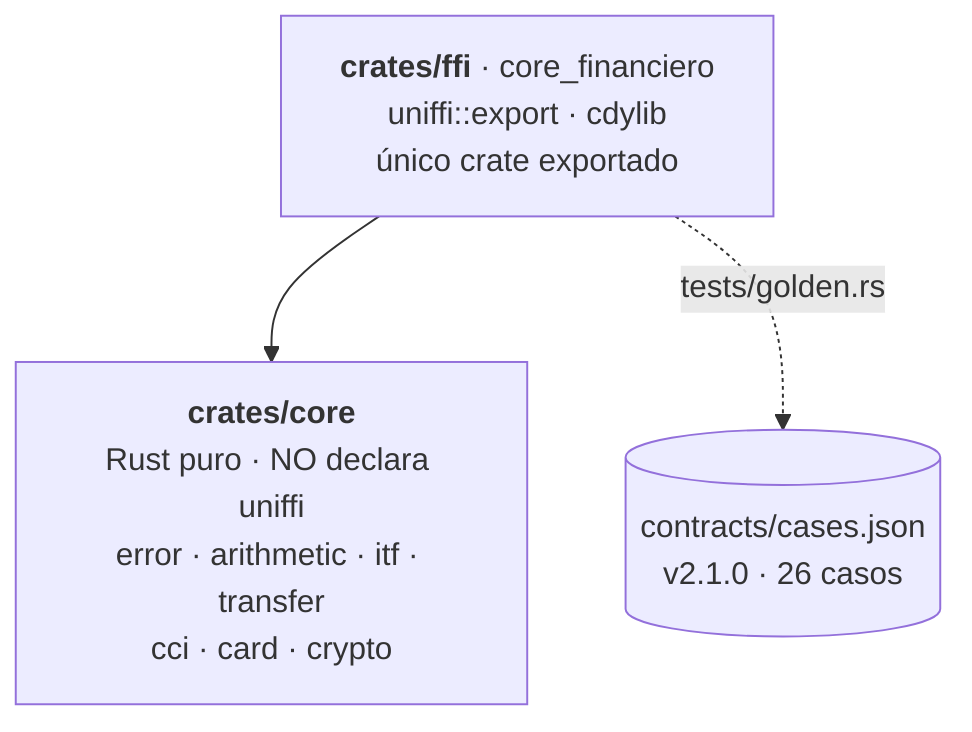

# Fase 1 — `rust-core` · Plan de implementación

> **For agentic workers:** REQUIRED SUB-SKILL: Use superpowers:subagent-driven-development (recommended) or superpowers:executing-plans to implement this plan task-by-task. Steps use checkbox (`- [ ]`) syntax for tracking.

**Goal:** construir el núcleo de dominio en Rust que las cuatro apps consumirán sin reescribirlo, con el test golden de `contracts/cases.json` en verde.

**Architecture:** dos crates. `core` es Rust puro con toda la lógica en módulos y no declara `uniffi`, así que un `#[uniffi::export]` ahí adentro no compila — la frontera la hace cumplir el compilador. `ffi` es el único crate exportado: aplica las macros de uniffi y traduce `core::ErrorDominio` con un `From`. Todo monto viaja como `String`; `rust_decimal::Decimal` nunca cruza la frontera.

**Tech Stack:** Rust 1.98.1 · `rust_decimal` 1.43 · `chacha20poly1305` 0.11 · `hex` 0.4 · `thiserror` 2.0 · `uniffi` 0.32 · `proptest` 1.11 · `serde_json` 1.0 (solo dev)

**Spec:** [`../specs/2026-09-08-phase-1-rust-core-design.md`](../specs/2026-09-08-phase-1-rust-core-design.md)

## Global Constraints

Aplican a **todas** las tareas. No se repiten en cada una.

- **Ningún `f32` ni `f64`**, en ningún lado, ni en tests. Los montos son `String` en la frontera y `Decimal` adentro.
- **Ningún `panic!`, `unwrap()` ni `expect()`** en código de producción. Todo error es `Result<_, ErrorDominio>`. En tests sí se permite `unwrap()`.
- `#![forbid(unsafe_code)]` en la primera línea de cada `lib.rs`.
- **Cero reglas de negocio inventadas.** Si un caso no está en `contracts/cases.json`, se pregunta antes de implementar. La fuente normativa de los algoritmos es [`contracts/README.md`](../../../contracts/README.md).
- Redondeo global: **2 decimales, `RoundingStrategy::MidpointAwayFromZero`**. Verificado: `3500.00 × 0.00005 = 0.175 → "0.18"`.
- Nombres de archivos, carpetas y crates en **inglés**; identificadores de dominio en **español** (`validar_cci`, `calcular_itf`, `ejecutar_transferencia`). Commits en español, Conventional Commits, scope `rust-core`.
- Gates de cada tarea antes de commitear: `cargo test --workspace`, `cargo clippy --workspace --all-targets -- -D warnings`, `cargo fmt --all`.
- Sin red, sin disco, sin async, sin threads en la API pública.

---

## File Structure

| Archivo | Responsabilidad |
|---|---|
| `rust-core/Cargo.toml` | Workspace y `[profile.release]` |
| `rust-core/crates/core/src/lib.rs` | Declara los módulos y reexporta la API |
| `rust-core/crates/core/src/error.rs` | `ErrorDominio`, definido **una sola vez** |
| `rust-core/crates/core/src/arithmetic.rs` | Parseo, redondeo, formateo, `sumar`, `restar` |
| `rust-core/crates/core/src/itf.rs` | `ALICUOTA_ITF` y `calcular_itf` |
| `rust-core/crates/core/src/cci.rs` | `validar_cci` y la tabla de bancos |
| `rust-core/crates/core/src/card.rs` | Luhn, marca, enmascarado |
| `rust-core/crates/core/src/crypto.rs` | `cifrar` / `descifrar` |
| `rust-core/crates/core/src/transfer.rs` | `ejecutar_transferencia`, comprobante, latencia |
| `rust-core/crates/core/tests/properties.rs` | Property-based con `proptest` |
| `rust-core/crates/ffi/Cargo.toml` | cdylib `core_financiero` + bin `uniffi-bindgen` |
| `rust-core/crates/ffi/build.rs` | Inyecta versión + SHA de git |
| `rust-core/crates/ffi/src/lib.rs` | `uniffi::export`, Records, `From<core::ErrorDominio>` |
| `rust-core/crates/ffi/tests/golden.rs` | Corre `contracts/cases.json` |
| `rust-core/README.md` | Gate de fase: diagrama Mermaid + comandos ejecutados |

**El golden va dentro del paquete `ffi`.** Verificado: un `tests/` en la raíz de un workspace sin paquete raíz **nunca se compila ni se ejecuta**; puesto ahí, el test golden habría "pasado" sin correr jamás.

---

## Task 1: Contrato v2.1.0 — los dos campos que faltaban

Va **primero y en su propio commit**: el criterio de aceptación se escribe antes que la implementación, y `CLAUDE.md` exige que los cambios de contrato no se mezclen con cambios al core.

**Files:**
- Modify: `contracts/cases.json`
- Modify: `contracts/README.md`

**Interfaces:**
- Produces: los esperados `comprobante` y `latencia_simulada_ms` que consumen la Task 8 y la Task 11.

- [ ] **Step 1: Agregar los dos campos a los casos válidos de `transferencia`**

En `tr-001`, dentro de `esperado`, junto a `total_debitado`:

```json
        "comprobante": "TRF-9047-1065-10000",
        "latencia_simulada_ms": 350
```

En `tr-002`:

```json
        "comprobante": "TRF-9047-1065-350000",
        "latencia_simulada_ms": 750
```

Y subir la versión del archivo:

```json
  "version": "2.1.0",
```

- [ ] **Step 2: Documentar las derivaciones en `contracts/README.md`**

Dentro de la sección `### Transferencia`, después del pseudocódigo:

```markdown
Dos salidas más, ambas **deterministas** — `ejecutar_transferencia` es pura, así que no
pueden depender de reloj ni de azar: si lo hicieran, las cuatro apps mostrarían valores
distintos lado a lado, que es lo contrario de lo que la POC prueba.

    comprobante          = "TRF-" + ultimos4(origen) + "-" + ultimos4(destino) + "-" + centavos(monto)
    latencia_simulada_ms = 250 + min(parte_entera(monto), 500)

`centavos(monto)` es el monto redondeado a 2 decimales por 100, sin decimales. La latencia
crece con el monto y está topeada en 750 ms: montos grandes "tardan más", y lo decide el
core, no la app.
```

- [ ] **Step 3: Verificar el JSON y los valores**

Run:
```bash
python3 -c "
import json; d=json.load(open('contracts/cases.json'))
assert d['version']=='2.1.0', d['version']
for c in d['transferencia']:
    if not c['valido']: continue
    e=c['esperado']
    m=c['entrada']['monto']; o=c['entrada']['origen']; dst=c['entrada']['destino']
    cent=int(round(float(m)*100))          # solo para verificar el contrato, no es codigo del core
    assert e['comprobante']==f'TRF-{o[-4:]}-{dst[-4:]}-{cent}', (c['id'], e['comprobante'])
    assert e['latencia_simulada_ms']==250+min(int(float(m)),500), (c['id'], e['latencia_simulada_ms'])
print('contrato v2.1.0 coherente con las derivaciones')
"
```
Expected: `contrato v2.1.0 coherente con las derivaciones`

- [ ] **Step 4: Commit**

```bash
git add contracts/cases.json contracts/README.md
git commit -m "$(cat <<'MSG'
feat(contracts): agregar comprobante y latencia al contrato, v2.1.0

ResultadoTransferencia devolvia dos campos que no existian en el
contrato. Como ejecutar_transferencia es pura, tienen que estar
determinados por la entrada: si no, las cuatro apps mostrarian
comprobantes distintos lado a lado.

    comprobante          = TRF- + ultimos4(origen) + ultimos4(destino) + centavos
    latencia_simulada_ms = 250 + min(parte_entera(monto), 500)

Minor: se agrega cobertura, no se corrige ningun esperado existente.

Co-Authored-By: Claude Opus 5 <noreply@anthropic.com>
MSG
)"
```

---

## Task 2: Workspace, los dos crates y `ErrorDominio`

**Files:**
- Create: `rust-core/Cargo.toml`, `rust-core/crates/core/Cargo.toml`, `rust-core/crates/core/src/lib.rs`, `rust-core/crates/core/src/error.rs`
- Create: `rust-core/crates/ffi/Cargo.toml`, `rust-core/crates/ffi/src/lib.rs`, `rust-core/crates/ffi/uniffi-bindgen.rs`

**Interfaces:**
- Produces: `core::error::ErrorDominio` con las nueve variantes y `ErrorDominio::nombre() -> &'static str`, que usan todas las tareas siguientes y el golden para comparar contra el campo `error` de `cases.json`.

- [ ] **Step 1: Crear el workspace**

`rust-core/Cargo.toml`:

```toml
[workspace]
resolver = "2"
members = ["crates/core", "crates/ffi"]

[workspace.package]
version = "1.0.0"
edition = "2021"
rust-version = "1.98"

[workspace.dependencies]
rust_decimal = "1.43"
chacha20poly1305 = "0.11"
hex = "0.4"
thiserror = "2.0"
uniffi = "0.32"
proptest = "1.11"
serde_json = "1.0"

[profile.release]
opt-level = "z"
lto = true
codegen-units = 1
strip = true
panic = "unwind"   # NO cambiar a abort: desactiva el catch_unwind de uniffi
```

`rust-core/crates/core/Cargo.toml` — **no declara uniffi, a propósito**:

```toml
[package]
name = "core"
version.workspace = true
edition.workspace = true
rust-version.workspace = true

[dependencies]
rust_decimal = { workspace = true }
chacha20poly1305 = { workspace = true }
hex = { workspace = true }
thiserror = { workspace = true }

[dev-dependencies]
proptest = { workspace = true }
```

`rust-core/crates/ffi/Cargo.toml`:

```toml
[package]
name = "core_financiero"
version.workspace = true
edition.workspace = true
rust-version.workspace = true

[lib]
crate-type = ["cdylib", "lib"]

[[bin]]
name = "uniffi-bindgen"
path = "uniffi-bindgen.rs"

[dependencies]
core = { path = "../core" }
uniffi = { workspace = true, features = ["cli"] }
thiserror = { workspace = true }

[dev-dependencies]
serde_json = { workspace = true }
```

`rust-core/crates/ffi/uniffi-bindgen.rs`:

```rust
fn main() {
    uniffi::uniffi_bindgen_main()
}
```

- [ ] **Step 2: Escribir el test que falla**

`rust-core/crates/core/src/error.rs`, al final del archivo:

```rust
#[cfg(test)]
mod tests {
    use super::*;

    #[test]
    fn el_nombre_coincide_con_el_del_contrato() {
        // Los strings del campo "error" de contracts/cases.json.
        assert_eq!(ErrorDominio::MismaCuenta.nombre(), "MismaCuenta");
        assert_eq!(ErrorDominio::DigitoControl.nombre(), "DigitoControl");
        assert_eq!(
            ErrorDominio::Longitud { campo: "cci".into(), esperado: 20, recibido: 18 }.nombre(),
            "Longitud"
        );
        assert_eq!(
            ErrorDominio::CuentaNoEncontrada { id: "x".into() }.nombre(),
            "CuentaNoEncontrada"
        );
        assert_eq!(
            ErrorDominio::SaldoInsuficiente { disponible: "1.00".into(), requerido: "2.00".into() }.nombre(),
            "SaldoInsuficiente"
        );
        assert_eq!(
            ErrorDominio::MontoInvalido { detalle: "cero".into() }.nombre(),
            "MontoInvalido"
        );
    }
}
```

- [ ] **Step 3: Correr el test y verificar que falla**

Run: `cd rust-core && cargo test -p core`
Expected: FAIL — `cannot find type ErrorDominio` / `no method named nombre`

- [ ] **Step 4: Implementar `ErrorDominio`**

Arriba del bloque de tests en `rust-core/crates/core/src/error.rs`:

```rust
use thiserror::Error;

/// El único tipo de error del núcleo. Se define aquí una sola vez; el crate `ffi`
/// lo expone a uniffi con un `From`, para que este crate no dependa de uniffi.
#[derive(Debug, Clone, PartialEq, Eq, Error)]
pub enum ErrorDominio {
    #[error("longitud inválida en {campo}: se esperaban {esperado} dígitos, llegaron {recibido}")]
    Longitud { campo: String, esperado: u32, recibido: u32 },

    #[error("dígito de control inválido")]
    DigitoControl,

    #[error("banco no reconocido: {codigo}")]
    BancoDesconocido { codigo: String },

    #[error("monto inválido: {detalle}")]
    MontoInvalido { detalle: String },

    #[error("cuenta no encontrada: {id}")]
    CuentaNoEncontrada { id: String },

    #[error("origen y destino son la misma cuenta")]
    MismaCuenta,

    #[error("saldo insuficiente: disponible {disponible}, requerido {requerido}")]
    SaldoInsuficiente { disponible: String, requerido: String },

    #[error("error de cifrado: {detalle}")]
    Cifrado { detalle: String },

    #[error("parámetro fuera de rango: {campo}")]
    FueraDeRango { campo: String },
}

impl ErrorDominio {
    /// Nombre de la variante, para comparar contra el campo `error` de
    /// `contracts/cases.json`. El contrato identifica el error por nombre, no por mensaje.
    pub fn nombre(&self) -> &'static str {
        match self {
            Self::Longitud { .. } => "Longitud",
            Self::DigitoControl => "DigitoControl",
            Self::BancoDesconocido { .. } => "BancoDesconocido",
            Self::MontoInvalido { .. } => "MontoInvalido",
            Self::CuentaNoEncontrada { .. } => "CuentaNoEncontrada",
            Self::MismaCuenta => "MismaCuenta",
            Self::SaldoInsuficiente { .. } => "SaldoInsuficiente",
            Self::Cifrado { .. } => "Cifrado",
            Self::FueraDeRango { .. } => "FueraDeRango",
        }
    }
}
```

`rust-core/crates/core/src/lib.rs`:

```rust
#![forbid(unsafe_code)]

pub mod error;

pub use error::ErrorDominio;
```

`rust-core/crates/ffi/src/lib.rs` — por ahora solo el andamiaje, para que el workspace compile:

```rust
#![forbid(unsafe_code)]

uniffi::setup_scaffolding!();
```

- [ ] **Step 5: Correr los gates**

Run:
```bash
cd rust-core
cargo test --workspace
cargo clippy --workspace --all-targets -- -D warnings
cargo fmt --all
```
Expected: test PASS, clippy sin warnings.

- [ ] **Step 6: Verificar que el compilador hace cumplir la frontera**

Este paso prueba la tesis arquitectónica de la fase. Agregar temporalmente a `crates/core/src/lib.rs`:

```rust
#[uniffi::export]
pub fn no_deberia_compilar() {}
```

Run: `cargo build -p core`
Expected: **FAIL** con `failed to resolve: use of undeclared crate or module 'uniffi'`.
Luego **borrar esas tres líneas** y volver a correr `cargo build -p core`: debe pasar.

- [ ] **Step 7: Commit**

```bash
git add rust-core/
git commit -m "feat(rust-core): workspace de dos crates y ErrorDominio

core no declara uniffi, asi que un uniffi::export ahi adentro no compila:
la frontera que la POC argumenta la hace cumplir el compilador, no la
disciplina. Verificado en el paso 6 del plan.

ErrorDominio se define una sola vez, con nombre() para que el golden
compare contra el campo error de cases.json por nombre de variante.

Co-Authored-By: Claude Opus 5 <noreply@anthropic.com>"
```

---

## Task 3: `arithmetic.rs` — parseo, redondeo, `sumar` y `restar`

Es la base de todo lo demás: `itf` y `transfer` usan su parseo y su formateo.

**Files:**
- Create: `rust-core/crates/core/src/arithmetic.rs`
- Modify: `rust-core/crates/core/src/lib.rs`

**Interfaces:**
- Produces:
  - `pub fn sumar(a: &str, b: &str) -> Result<String, ErrorDominio>`
  - `pub fn restar(a: &str, b: &str) -> Result<String, ErrorDominio>`
  - `pub(crate) fn parsear_monto(valor: &str, campo: &str) -> Result<Decimal, ErrorDominio>`
  - `pub(crate) fn redondear(valor: Decimal) -> Decimal`
  - `pub(crate) fn formatear(valor: Decimal) -> String`

- [ ] **Step 1: Escribir los tests que fallan**

`rust-core/crates/core/src/arithmetic.rs`:

```rust
#[cfg(test)]
mod tests {
    use super::*;

    // Los seis casos del grupo `aritmetica` de contracts/cases.json.
    // Los seis divergen bajo IEEE-754; ese es el punto de la pantalla.
    #[test]
    fn suma_los_casos_del_contrato() {
        assert_eq!(sumar("0.1", "0.2").unwrap(), "0.30");            // ar-001
        assert_eq!(sumar("0.7", "0.1").unwrap(), "0.80");            // ar-002
        assert_eq!(sumar("1000000.10", "0.20").unwrap(), "1000000.30"); // ar-003
    }

    #[test]
    fn resta_los_casos_del_contrato() {
        assert_eq!(restar("1.00", "0.90").unwrap(), "0.10");   // ar-004
        assert_eq!(restar("100.00", "99.99").unwrap(), "0.01"); // ar-005
        assert_eq!(restar("82.35", "12.34").unwrap(), "70.01"); // ar-006
    }

    #[test]
    fn la_salida_siempre_trae_dos_decimales() {
        assert_eq!(sumar("1", "1").unwrap(), "2.00");
        assert_eq!(sumar("0", "0").unwrap(), "0.00");
    }

    #[test]
    fn el_texto_que_no_es_monto_da_error_no_panico() {
        assert_eq!(sumar("hola", "1").unwrap_err().nombre(), "MontoInvalido");
        assert_eq!(restar("1", "").unwrap_err().nombre(), "MontoInvalido");
    }
}
```

- [ ] **Step 2: Correr y verificar que falla**

Run: `cd rust-core && cargo test -p core arithmetic`
Expected: FAIL — `cannot find function sumar`

- [ ] **Step 3: Implementar**

Arriba del bloque de tests en `arithmetic.rs`:

```rust
use crate::error::ErrorDominio;
use rust_decimal::{Decimal, RoundingStrategy};
use std::str::FromStr;

/// Escala de salida de todo monto: 2 decimales (PEN).
pub const ESCALA: u32 = 2;

/// Parsea un monto que llegó como texto. Nunca entra en pánico: el texto viene del usuario.
pub(crate) fn parsear_monto(valor: &str, campo: &str) -> Result<Decimal, ErrorDominio> {
    Decimal::from_str(valor.trim()).map_err(|e| ErrorDominio::MontoInvalido {
        detalle: format!("{campo}: {e}"),
    })
}

/// Redondeo normativo del contrato: 2 decimales, medio hacia afuera del cero.
pub(crate) fn redondear(valor: Decimal) -> Decimal {
    valor.round_dp_with_strategy(ESCALA, RoundingStrategy::MidpointAwayFromZero)
}

/// Todo monto sale con exactamente 2 decimales. El símbolo y los separadores los pone la UI.
pub(crate) fn formatear(valor: Decimal) -> String {
    format!("{:.*}", ESCALA as usize, redondear(valor))
}

pub fn sumar(a: &str, b: &str) -> Result<String, ErrorDominio> {
    let x = parsear_monto(a, "a")?;
    let y = parsear_monto(b, "b")?;
    let r = x.checked_add(y).ok_or(ErrorDominio::FueraDeRango { campo: "suma".into() })?;
    Ok(formatear(r))
}

pub fn restar(a: &str, b: &str) -> Result<String, ErrorDominio> {
    let x = parsear_monto(a, "a")?;
    let y = parsear_monto(b, "b")?;
    let r = x.checked_sub(y).ok_or(ErrorDominio::FueraDeRango { campo: "resta".into() })?;
    Ok(formatear(r))
}
```

En `lib.rs`, agregar:

```rust
pub mod arithmetic;

pub use arithmetic::{restar, sumar};
```

- [ ] **Step 4: Correr los tests**

Run: `cd rust-core && cargo test -p core && cargo clippy --workspace --all-targets -- -D warnings && cargo fmt --all`
Expected: PASS, clippy limpio.

- [ ] **Step 5: Commit**

```bash
git add rust-core/
git commit -m "feat(rust-core): aritmetica decimal con redondeo del contrato

sumar y restar sobre rust_decimal, redondeo a 2 decimales
MidpointAwayFromZero. Los seis casos del grupo aritmetica de cases.json
pasan; los seis divergen bajo IEEE-754, que es lo que la pantalla exhibe.

Co-Authored-By: Claude Opus 5 <noreply@anthropic.com>"
```

---

## Task 4: `itf.rs` — la alícuota como constante nombrada

**Files:**
- Create: `rust-core/crates/core/src/itf.rs`
- Modify: `rust-core/crates/core/src/lib.rs`

**Interfaces:**
- Produces:
  - `pub const ALICUOTA_ITF: &str`
  - `pub fn calcular_itf(monto: &str) -> Result<String, ErrorDominio>`
  - `pub(crate) fn itf_redondeado(monto: Decimal) -> Result<Decimal, ErrorDominio>` — lo consume la Task 8.

- [ ] **Step 1: Escribir los tests que fallan**

`rust-core/crates/core/src/itf.rs`:

```rust
#[cfg(test)]
mod tests {
    use super::*;

    // Los cuatro casos del grupo `itf` de contracts/cases.json.
    #[test]
    fn calcula_los_casos_del_contrato() {
        assert_eq!(calcular_itf("1000.00").unwrap(), "0.05");  // itf-001
        assert_eq!(calcular_itf("3500.00").unwrap(), "0.18");  // itf-002
        assert_eq!(calcular_itf("150.00").unwrap(), "0.01");   // itf-003
        assert_eq!(calcular_itf("87654.32").unwrap(), "4.38"); // itf-004
    }

    #[test]
    fn redondea_el_medio_hacia_afuera_no_al_par() {
        // 3500.00 * 0.00005 = 0.175 exacto. Con banker's rounding daría 0.17 y el
        // contrato lo caza: por eso este caso existe.
        assert_eq!(calcular_itf("3500.00").unwrap(), "0.18");
    }

    #[test]
    fn el_texto_invalido_da_error_no_panico() {
        assert_eq!(calcular_itf("no-soy-un-monto").unwrap_err().nombre(), "MontoInvalido");
    }
}
```

- [ ] **Step 2: Correr y verificar que falla**

Run: `cd rust-core && cargo test -p core itf`
Expected: FAIL — `cannot find function calcular_itf`

- [ ] **Step 3: Implementar**

```rust
use crate::arithmetic::{formatear, parsear_monto, redondear};
use crate::error::ErrorDominio;
use rust_decimal::Decimal;
use std::str::FromStr;

/// Alícuota del ITF. **Dato dummy de la POC.** Es constante nombrada y no un literal
/// suelto justamente para que cambiarla acá y ver moverse las cuatro apps sea parte
/// del guion de la demo.
pub const ALICUOTA_ITF: &str = "0.00005";

/// El ITF ya redondeado a 2 decimales. Lo usa `ejecutar_transferencia` para el total.
pub(crate) fn itf_redondeado(monto: Decimal) -> Result<Decimal, ErrorDominio> {
    let alicuota = Decimal::from_str(ALICUOTA_ITF)
        .map_err(|_| ErrorDominio::FueraDeRango { campo: "alicuota".into() })?;
    let bruto = monto
        .checked_mul(alicuota)
        .ok_or(ErrorDominio::FueraDeRango { campo: "itf".into() })?;
    Ok(redondear(bruto))
}

pub fn calcular_itf(monto: &str) -> Result<String, ErrorDominio> {
    let m = parsear_monto(monto, "monto")?;
    Ok(formatear(itf_redondeado(m)?))
}
```

En `lib.rs`:

```rust
pub mod itf;

pub use itf::{calcular_itf, ALICUOTA_ITF};
```

- [ ] **Step 4: Correr los tests**

Run: `cd rust-core && cargo test -p core && cargo clippy --workspace --all-targets -- -D warnings && cargo fmt --all`
Expected: PASS

- [ ] **Step 5: Commit**

```bash
git add rust-core/
git commit -m "feat(rust-core): calculo del ITF con la alicuota como constante nombrada

Los cuatro casos del grupo itf de cases.json pasan, incluido itf-002
(0.175 -> 0.18), que es el que distingue MidpointAwayFromZero de
banker's rounding.

Co-Authored-By: Claude Opus 5 <noreply@anthropic.com>"
```

---

## Task 5: `cci.rs` — validación del CCI y tabla de bancos

**Files:**
- Create: `rust-core/crates/core/src/cci.rs`
- Modify: `rust-core/crates/core/src/lib.rs`

**Interfaces:**
- Produces:
  - `pub struct CciValido { pub codigo_banco: String, pub nombre_banco: String, pub oficina: String, pub cuenta: String }`
  - `pub fn validar_cci(cci: &str) -> Result<CciValido, ErrorDominio>`

- [ ] **Step 1: Escribir los tests que fallan**

`rust-core/crates/core/src/cci.rs`:

```rust
#[cfg(test)]
mod tests {
    use super::*;

    // Los cuatro casos del grupo `cci` de contracts/cases.json.
    #[test]
    fn acepta_un_cci_valido() {
        let r = validar_cci("00219100123456789047").unwrap(); // cci-001
        assert_eq!(r.codigo_banco, "002");
        assert_eq!(r.nombre_banco, "Banco Demo Uno");
        assert_eq!(r.oficina, "191");
        assert_eq!(r.cuenta, "001234567890");
    }

    #[test]
    fn acepta_un_cci_de_otro_banco() {
        let r = validar_cci("01122000987654321065").unwrap(); // cci-002
        assert_eq!(r.codigo_banco, "011");
        assert_eq!(r.nombre_banco, "Banco Demo Dos");
        assert_eq!(r.oficina, "220");
        assert_eq!(r.cuenta, "009876543210");
    }

    #[test]
    fn rechaza_el_digito_de_control_malo() {
        // cci-003: mismo CCI que cci-001 con el ultimo digito cambiado.
        assert_eq!(validar_cci("00219100123456789048").unwrap_err().nombre(), "DigitoControl");
    }

    #[test]
    fn rechaza_la_longitud_mala() {
        // cci-004: 18 digitos.
        assert_eq!(validar_cci("002191001234567890").unwrap_err().nombre(), "Longitud");
    }

    #[test]
    fn rechaza_un_banco_fuera_de_la_tabla() {
        // Todo ceros pasa el digito de control (la suma ponderada da 0) pero el banco
        // 000 no esta en la tabla. Es el destino de tr-004 y por eso la transferencia
        // NO valida CCI: el contrato exige ahi CuentaNoEncontrada, no BancoDesconocido.
        assert_eq!(validar_cci("00000000000000000000").unwrap_err().nombre(), "BancoDesconocido");
    }

    #[test]
    fn no_entra_en_panico_con_texto_arbitrario() {
        for entrada in ["", "abc", "ñ", "0021910012345678904x", "0".repeat(500).as_str()] {
            let _ = validar_cci(entrada); // solo debe no romper
        }
    }
}
```

- [ ] **Step 2: Correr y verificar que falla**

Run: `cd rust-core && cargo test -p core cci`
Expected: FAIL — `cannot find function validar_cci`

- [ ] **Step 3: Implementar**

```rust
use crate::error::ErrorDominio;

/// Pesos del dígito de control, especificados en contracts/README.md.
const PESOS: [u32; 18] = [3, 2, 9, 8, 7, 6, 5, 4, 3, 2, 9, 8, 7, 6, 5, 4, 3, 2];

/// Tabla de bancos. **Códigos dummy de la POC**, no corresponden a bancos reales.
const BANCOS: [(&str, &str); 3] = [
    ("002", "Banco Demo Uno"),
    ("011", "Banco Demo Dos"),
    ("009", "Banco Demo Tres"),
];

const LARGO_CCI: u32 = 20;

#[derive(Debug, Clone, PartialEq, Eq)]
pub struct CciValido {
    pub codigo_banco: String,
    pub nombre_banco: String,
    pub oficina: String,
    pub cuenta: String,
}

/// Dígito de control: `(11 - (Σ dígito·peso) mod 11) mod 11`, y 0 si da mayor que 9.
fn digito_control(digitos: &[u32], pesos: &[u32]) -> u32 {
    let suma: u32 = digitos.iter().zip(pesos).map(|(d, p)| d * p).sum();
    let d = (11 - (suma % 11)) % 11;
    if d > 9 {
        0
    } else {
        d
    }
}

pub fn validar_cci(cci: &str) -> Result<CciValido, ErrorDominio> {
    let cci = cci.trim();
    let recibido = cci.chars().count() as u32;

    // Un solo error para "no son 20 dígitos", tenga letras o no.
    let digitos: Vec<u32> = match cci.chars().map(|c| c.to_digit(10)).collect::<Option<Vec<_>>>() {
        Some(d) if d.len() as u32 == LARGO_CCI => d,
        _ => {
            return Err(ErrorDominio::Longitud {
                campo: "cci".into(),
                esperado: LARGO_CCI,
                recibido,
            })
        }
    };

    let d19 = digito_control(&digitos[..18], &PESOS);
    let pesos_20: Vec<u32> = PESOS.iter().copied().chain([2]).collect();
    let d20 = digito_control(&digitos[..19], &pesos_20);

    if d19 != digitos[18] || d20 != digitos[19] {
        return Err(ErrorDominio::DigitoControl);
    }

    let codigo_banco = &cci[0..3];
    let nombre_banco = BANCOS
        .iter()
        .find(|(codigo, _)| *codigo == codigo_banco)
        .map(|(_, nombre)| *nombre)
        .ok_or_else(|| ErrorDominio::BancoDesconocido { codigo: codigo_banco.to_string() })?;

    Ok(CciValido {
        codigo_banco: codigo_banco.to_string(),
        nombre_banco: nombre_banco.to_string(),
        oficina: cci[3..6].to_string(),
        cuenta: cci[6..18].to_string(),
    })
}
```

> El indexado por bytes (`cci[0..3]`) es seguro acá: llegado este punto ya se verificó que los 20 caracteres son dígitos ASCII.

En `lib.rs`:

```rust
pub mod cci;

pub use cci::{validar_cci, CciValido};
```

- [ ] **Step 4: Correr los tests**

Run: `cd rust-core && cargo test -p core && cargo clippy --workspace --all-targets -- -D warnings && cargo fmt --all`
Expected: PASS

- [ ] **Step 5: Commit**

```bash
git add rust-core/
git commit -m "feat(rust-core): validacion de CCI con digitos de control

Los cuatro casos del grupo cci de cases.json, mas el caso de banco fuera
de tabla que documenta por que ejecutar_transferencia NO valida CCI: el
destino de tr-004 pasa el digito de control pero el contrato exige
CuentaNoEncontrada.

Co-Authored-By: Claude Opus 5 <noreply@anthropic.com>"
```

---

## Task 6: `card.rs` — Luhn, marca y enmascarado

**Files:**
- Create: `rust-core/crates/core/src/card.rs`
- Modify: `rust-core/crates/core/src/lib.rs`

**Interfaces:**
- Produces:
  - `pub struct TarjetaValida { pub marca: String, pub enmascarado: String }`
  - `pub fn validar_tarjeta(numero: &str) -> Result<TarjetaValida, ErrorDominio>`

- [ ] **Step 1: Escribir los tests que fallan**

`rust-core/crates/core/src/card.rs`:

```rust
#[cfg(test)]
mod tests {
    use super::*;

    // Los seis casos del grupo `tarjeta` de contracts/cases.json.
    #[test]
    fn acepta_visa() {
        let r = validar_tarjeta("4111111111111111").unwrap(); // tj-001
        assert_eq!(r.marca, "Visa");
        assert_eq!(r.enmascarado, "4111 **** **** 1111");
    }

    #[test]
    fn acepta_mastercard() {
        let r = validar_tarjeta("5555555555554444").unwrap(); // tj-002
        assert_eq!(r.marca, "Mastercard");
        assert_eq!(r.enmascarado, "5555 **** **** 4444");
    }

    #[test]
    fn acepta_amex_de_quince_digitos() {
        let r = validar_tarjeta("378282246310005").unwrap(); // tj-003
        assert_eq!(r.marca, "Amex");
        assert_eq!(r.enmascarado, "3782 **** **** 0005");
    }

    #[test]
    fn rechaza_luhn_invalido() {
        assert_eq!(validar_tarjeta("4111111111111112").unwrap_err().nombre(), "DigitoControl"); // tj-004
        assert_eq!(validar_tarjeta("1234567890123456").unwrap_err().nombre(), "DigitoControl"); // tj-005
    }

    #[test]
    fn rechaza_la_longitud_mala() {
        assert_eq!(validar_tarjeta("41111").unwrap_err().nombre(), "Longitud"); // tj-006
    }

    #[test]
    fn no_entra_en_panico_con_texto_arbitrario() {
        for entrada in ["", "abcd", "ñññññññññññññ", "4111-1111-1111-1111"] {
            let _ = validar_tarjeta(entrada);
        }
    }
}
```

- [ ] **Step 2: Correr y verificar que falla**

Run: `cd rust-core && cargo test -p core card`
Expected: FAIL — `cannot find function validar_tarjeta`

- [ ] **Step 3: Implementar**

```rust
use crate::error::ErrorDominio;

const LARGO_MIN: usize = 13;
const LARGO_MAX: usize = 19;
/// Solo se usa para poblar el campo `esperado` del error; el rango real es 13-19.
const LARGO_TIPICO: u32 = 16;

#[derive(Debug, Clone, PartialEq, Eq)]
pub struct TarjetaValida {
    pub marca: String,
    pub enmascarado: String,
}

fn luhn(digitos: &[u32]) -> bool {
    let suma: u32 = digitos
        .iter()
        .rev()
        .enumerate()
        .map(|(i, &d)| {
            if i % 2 == 1 {
                let doble = d * 2;
                if doble > 9 {
                    doble - 9
                } else {
                    doble
                }
            } else {
                d
            }
        })
        .sum();
    suma % 10 == 0
}

/// Marca por prefijo, según contracts/README.md.
fn marca(numero: &str) -> Option<&'static str> {
    if numero.starts_with('4') {
        return Some("Visa");
    }
    let dos: u32 = numero.get(..2)?.parse().ok()?;
    if (51..=55).contains(&dos) {
        return Some("Mastercard");
    }
    if dos == 34 || dos == 37 {
        return Some("Amex");
    }
    let cuatro: u32 = numero.get(..4)?.parse().ok()?;
    if (2221..=2720).contains(&cuatro) {
        return Some("Mastercard");
    }
    None
}

pub fn validar_tarjeta(numero: &str) -> Result<TarjetaValida, ErrorDominio> {
    let numero = numero.trim();
    let recibido = numero.chars().count() as u32;

    let digitos: Vec<u32> = match numero.chars().map(|c| c.to_digit(10)).collect::<Option<Vec<_>>>() {
        Some(d) if (LARGO_MIN..=LARGO_MAX).contains(&d.len()) => d,
        _ => {
            return Err(ErrorDominio::Longitud {
                campo: "tarjeta".into(),
                esperado: LARGO_TIPICO,
                recibido,
            })
        }
    };

    if !luhn(&digitos) {
        return Err(ErrorDominio::DigitoControl);
    }

    // Ningún caso del contrato pasa Luhn con un prefijo desconocido. Si llegara uno,
    // el core dice "no sé" en vez de inventar una marca.
    let marca = marca(numero).ok_or_else(|| ErrorDominio::FueraDeRango { campo: "marca".into() })?;

    let largo = numero.len();
    Ok(TarjetaValida {
        marca: marca.to_string(),
        enmascarado: format!("{} **** **** {}", &numero[..4], &numero[largo - 4..]),
    })
}
```

En `lib.rs`:

```rust
pub mod card;

pub use card::{validar_tarjeta, TarjetaValida};
```

- [ ] **Step 4: Correr los tests**

Run: `cd rust-core && cargo test -p core && cargo clippy --workspace --all-targets -- -D warnings && cargo fmt --all`
Expected: PASS

- [ ] **Step 5: Commit**

```bash
git add rust-core/
git commit -m "feat(rust-core): validacion de tarjeta con Luhn, marca y enmascarado

Los seis casos del grupo tarjeta de cases.json. Un prefijo desconocido
que pase Luhn devuelve FueraDeRango en vez de inventar una marca: no hay
caso en el contrato y no se inventan reglas de negocio.

Co-Authored-By: Claude Opus 5 <noreply@anthropic.com>"
```

---

## Task 7: `crypto.rs` — ChaCha20-Poly1305

La API de `chacha20poly1305` 0.11 está **verificada**: `Key::from_slice` y `Nonce::from_slice` están deprecados y harían fallar `clippy -D warnings`. Se usa `try_into`.

**Files:**
- Create: `rust-core/crates/core/src/crypto.rs`
- Modify: `rust-core/crates/core/src/lib.rs`

**Interfaces:**
- Produces:
  - `pub fn cifrar(texto: &str, clave_hex: &str, nonce_hex: &str) -> Result<String, ErrorDominio>`
  - `pub fn descifrar(cifrado_hex: &str, clave_hex: &str, nonce_hex: &str) -> Result<String, ErrorDominio>`

- [ ] **Step 1: Escribir los tests que fallan**

`rust-core/crates/core/src/crypto.rs`:

```rust
#[cfg(test)]
mod tests {
    use super::*;

    const CLAVE: &str = "000102030405060708090a0b0c0d0e0f101112131415161718191a1b1c1d1e1f";
    const NONCE: &str = "000102030405060708090a0b";

    // Vectores del grupo `tarjeta` de contracts/cases.json. Se derivaron con la
    // stdlib de Node 22, o sea son independientes de Rust: que Rust los reproduzca
    // es evidencia real, no un snapshot de si mismo.
    #[test]
    fn reproduce_los_vectores_del_contrato() {
        assert_eq!(
            cifrar("4111111111111111", CLAVE, NONCE).unwrap(),
            "bdca39311826947186b20ec2a92c3f521aacff902e37d519bcd2754fc7c7c0dd"
        );
        assert_eq!(
            cifrar("5555555555554444", CLAVE, NONCE).unwrap(),
            "bcce3d351c22907582b60ac6ac293a57e26c8e6007abc9a2b0c323bf74184036"
        );
        assert_eq!(
            cifrar("378282246310005", CLAVE, NONCE).unwrap(),
            "bacc30321125977481b00ec3a82d3b43191141e9da8b2ad948e1c7b3a8ee5e"
        );
    }

    #[test]
    fn el_roundtrip_devuelve_el_original() {
        let cifrado = cifrar("4111111111111111", CLAVE, NONCE).unwrap();
        assert_eq!(descifrar(&cifrado, CLAVE, NONCE).unwrap(), "4111111111111111");
    }

    #[test]
    fn la_clave_de_largo_incorrecto_da_error_no_panico() {
        assert_eq!(cifrar("x", "0001", NONCE).unwrap_err().nombre(), "Cifrado");
    }

    #[test]
    fn el_hex_invalido_da_error_no_panico() {
        assert_eq!(cifrar("x", "zzzz", NONCE).unwrap_err().nombre(), "Cifrado");
        assert_eq!(descifrar("zzzz", CLAVE, NONCE).unwrap_err().nombre(), "Cifrado");
    }

    #[test]
    fn el_tag_adulterado_no_descifra() {
        let mut cifrado = cifrar("4111111111111111", CLAVE, NONCE).unwrap();
        cifrado.replace_range(0..1, "0");
        assert!(descifrar(&cifrado, CLAVE, NONCE).is_err());
    }
}
```

- [ ] **Step 2: Correr y verificar que falla**

Run: `cd rust-core && cargo test -p core crypto`
Expected: FAIL — `cannot find function cifrar`

- [ ] **Step 3: Implementar**

```rust
use crate::error::ErrorDominio;
use chacha20poly1305::{
    aead::{Aead, KeyInit},
    ChaCha20Poly1305, Key, Nonce,
};

fn error(detalle: &str) -> ErrorDominio {
    ErrorDominio::Cifrado { detalle: detalle.to_string() }
}

/// El nonce entra como parámetro y **no** se genera acá: generarlo pediría entropía del
/// sistema (una syscall), lo que rompería la pureza, y haría la salida no determinista,
/// o sea no comparable entre plataformas — que es justo lo que el contrato prueba.
///
/// ⚠️ Reutilizar el par (clave, nonce) es catastrófico en producción. Acá es a propósito.
fn preparar(clave_hex: &str, nonce_hex: &str) -> Result<(ChaCha20Poly1305, Vec<u8>), ErrorDominio> {
    let clave = hex::decode(clave_hex.trim()).map_err(|_| error("la clave no es hex válido"))?;
    let nonce = hex::decode(nonce_hex.trim()).map_err(|_| error("el nonce no es hex válido"))?;
    let clave: &Key = clave
        .as_slice()
        .try_into()
        .map_err(|_| error("la clave debe tener 32 bytes"))?;
    if nonce.len() != 12 {
        return Err(error("el nonce debe tener 12 bytes"));
    }
    Ok((ChaCha20Poly1305::new(clave), nonce))
}

pub fn cifrar(texto: &str, clave_hex: &str, nonce_hex: &str) -> Result<String, ErrorDominio> {
    let (cipher, nonce) = preparar(clave_hex, nonce_hex)?;
    let nonce: &Nonce = nonce.as_slice().try_into().map_err(|_| error("nonce inválido"))?;
    let salida = cipher
        .encrypt(nonce, texto.as_bytes())
        .map_err(|_| error("no se pudo cifrar"))?;
    Ok(hex::encode(salida))
}

pub fn descifrar(cifrado_hex: &str, clave_hex: &str, nonce_hex: &str) -> Result<String, ErrorDominio> {
    let (cipher, nonce) = preparar(clave_hex, nonce_hex)?;
    let nonce: &Nonce = nonce.as_slice().try_into().map_err(|_| error("nonce inválido"))?;
    let bytes = hex::decode(cifrado_hex.trim()).map_err(|_| error("el cifrado no es hex válido"))?;
    let claro = cipher
        .decrypt(nonce, bytes.as_slice())
        .map_err(|_| error("no se pudo descifrar: clave, nonce o tag incorrectos"))?;
    String::from_utf8(claro).map_err(|_| error("el texto descifrado no es UTF-8"))
}
```

En `lib.rs`:

```rust
pub mod crypto;

pub use crypto::{cifrar, descifrar};
```

- [ ] **Step 4: Correr los tests**

Run: `cd rust-core && cargo test -p core && cargo clippy --workspace --all-targets -- -D warnings && cargo fmt --all`
Expected: PASS

- [ ] **Step 5: Commit**

```bash
git add rust-core/
git commit -m "feat(rust-core): cifrado ChaCha20-Poly1305 con nonce como parametro

Reproduce los tres vectores del contrato, derivados con la stdlib de
Node 22 e independientes de Rust. El nonce entra como parametro: no se
necesita entropia del sistema (se mantiene la pureza) y la salida es
determinista, o sea comparable entre las cuatro plataformas.

Co-Authored-By: Claude Opus 5 <noreply@anthropic.com>"
```

---

## Task 8: `transfer.rs` — la transferencia como función pura

**Files:**
- Create: `rust-core/crates/core/src/transfer.rs`
- Modify: `rust-core/crates/core/src/lib.rs`

**Interfaces:**
- Consumes: `arithmetic::{parsear_monto, redondear, formatear}` (Task 3), `itf::itf_redondeado` (Task 4).
- Produces:
  - `pub struct Cuenta { pub id: String, pub titular: String, pub saldo: String }`
  - `pub struct SolicitudTransferencia { pub origen: String, pub destino: String, pub monto: String }`
  - `pub struct ResultadoTransferencia { pub cuentas: Vec<Cuenta>, pub comision_itf: String, pub total_debitado: String, pub comprobante: String, pub latencia_simulada_ms: u32 }`
  - `pub fn ejecutar_transferencia(cuentas: Vec<Cuenta>, solicitud: SolicitudTransferencia) -> Result<ResultadoTransferencia, ErrorDominio>`

- [ ] **Step 1: Escribir los tests que fallan**

`rust-core/crates/core/src/transfer.rs`:

```rust
#[cfg(test)]
mod tests {
    use super::*;

    // `cuentas_iniciales` de contracts/cases.json.
    fn cuentas() -> Vec<Cuenta> {
        vec![
            Cuenta { id: "00219100123456789047".into(), titular: "Ana Quispe".into(), saldo: "5000.00".into() },
            Cuenta { id: "01122000987654321065".into(), titular: "Luis Ramos".into(), saldo: "1200.50".into() },
        ]
    }

    fn solicitud(origen: &str, destino: &str, monto: &str) -> SolicitudTransferencia {
        SolicitudTransferencia { origen: origen.into(), destino: destino.into(), monto: monto.into() }
    }

    #[test]
    fn tr_001_transferencia_feliz() {
        let r = ejecutar_transferencia(
            cuentas(),
            solicitud("00219100123456789047", "01122000987654321065", "100.00"),
        )
        .unwrap();
        assert_eq!(r.cuentas[0].saldo, "4899.99");
        assert_eq!(r.cuentas[1].saldo, "1300.50");
        assert_eq!(r.comision_itf, "0.01");
        assert_eq!(r.total_debitado, "100.01");
        assert_eq!(r.comprobante, "TRF-9047-1065-10000");
        assert_eq!(r.latencia_simulada_ms, 350);
    }

    #[test]
    fn tr_002_con_redondeo_del_itf() {
        let r = ejecutar_transferencia(
            cuentas(),
            solicitud("00219100123456789047", "01122000987654321065", "3500.00"),
        )
        .unwrap();
        assert_eq!(r.cuentas[0].saldo, "1499.82");
        assert_eq!(r.cuentas[1].saldo, "4700.50");
        assert_eq!(r.comision_itf, "0.18");
        assert_eq!(r.total_debitado, "3500.18");
        assert_eq!(r.comprobante, "TRF-9047-1065-350000");
        assert_eq!(r.latencia_simulada_ms, 750);
    }

    #[test]
    fn tr_003_saldo_insuficiente() {
        let e = ejecutar_transferencia(
            cuentas(),
            solicitud("01122000987654321065", "00219100123456789047", "10000.00"),
        )
        .unwrap_err();
        assert_eq!(e.nombre(), "SaldoInsuficiente");
    }

    #[test]
    fn tr_004_cuenta_inexistente() {
        let e = ejecutar_transferencia(
            cuentas(),
            solicitud("00219100123456789047", "00000000000000000000", "50.00"),
        )
        .unwrap_err();
        assert_eq!(e.nombre(), "CuentaNoEncontrada");
    }

    #[test]
    fn tr_005_misma_cuenta() {
        let e = ejecutar_transferencia(
            cuentas(),
            solicitud("00219100123456789047", "00219100123456789047", "50.00"),
        )
        .unwrap_err();
        assert_eq!(e.nombre(), "MismaCuenta");
    }

    #[test]
    fn tr_006_monto_cero() {
        let e = ejecutar_transferencia(
            cuentas(),
            solicitud("00219100123456789047", "01122000987654321065", "0.00"),
        )
        .unwrap_err();
        assert_eq!(e.nombre(), "MontoInvalido");
    }

    #[test]
    fn no_muta_las_cuentas_de_entrada() {
        let originales = cuentas();
        let _ = ejecutar_transferencia(
            originales.clone(),
            solicitud("00219100123456789047", "01122000987654321065", "100.00"),
        );
        assert_eq!(originales[0].saldo, "5000.00");
    }
}
```

- [ ] **Step 2: Correr y verificar que falla**

Run: `cd rust-core && cargo test -p core transfer`
Expected: FAIL — `cannot find function ejecutar_transferencia`

- [ ] **Step 3: Implementar**

```rust
use crate::arithmetic::{formatear, parsear_monto, redondear};
use crate::error::ErrorDominio;
use crate::itf::itf_redondeado;
use rust_decimal::prelude::ToPrimitive;
use rust_decimal::Decimal;

#[derive(Debug, Clone, PartialEq, Eq)]
pub struct Cuenta {
    pub id: String,
    pub titular: String,
    pub saldo: String,
}

#[derive(Debug, Clone, PartialEq, Eq)]
pub struct SolicitudTransferencia {
    pub origen: String,
    pub destino: String,
    pub monto: String,
}

#[derive(Debug, Clone, PartialEq, Eq)]
pub struct ResultadoTransferencia {
    /// El estado NUEVO, ya aplicado. La app guarda esto en memoria y lo tira al cerrar.
    pub cuentas: Vec<Cuenta>,
    pub comision_itf: String,
    pub total_debitado: String,
    pub comprobante: String,
    /// La app espera estos ms antes de pintar, para que la demo "parezca" HTTP.
    /// No hay ningún cliente HTTP en ninguna parte.
    pub latencia_simulada_ms: u32,
}

fn ultimos4(id: &str) -> String {
    let caracteres: Vec<char> = id.chars().collect();
    let inicio = caracteres.len().saturating_sub(4);
    caracteres[inicio..].iter().collect()
}

/// Determinista a propósito: si dependiera del reloj, las cuatro apps mostrarían
/// comprobantes distintos lado a lado. Ver contracts/README.md.
fn comprobante(origen: &str, destino: &str, monto: Decimal) -> Result<String, ErrorDominio> {
    let centavos = redondear(monto)
        .checked_mul(Decimal::from(100))
        .and_then(|c| c.trunc().to_i64())
        .ok_or(ErrorDominio::FueraDeRango { campo: "comprobante".into() })?;
    Ok(format!("TRF-{}-{}-{}", ultimos4(origen), ultimos4(destino), centavos))
}

/// `250 + min(parte entera del monto, 500)`, topeada en 750 ms.
fn latencia_simulada(monto: Decimal) -> u32 {
    let entero = monto.trunc().to_u32().unwrap_or(500);
    250 + entero.min(500)
}

pub fn ejecutar_transferencia(
    cuentas: Vec<Cuenta>,
    solicitud: SolicitudTransferencia,
) -> Result<ResultadoTransferencia, ErrorDominio> {
    // El orden de las validaciones lo fija contracts/README.md y los casos tr-003..tr-006
    // lo verifican. No reordenar sin cambiar el contrato.
    if solicitud.origen == solicitud.destino {
        return Err(ErrorDominio::MismaCuenta);
    }

    let i_origen = cuentas
        .iter()
        .position(|c| c.id == solicitud.origen)
        .ok_or_else(|| ErrorDominio::CuentaNoEncontrada { id: solicitud.origen.clone() })?;
    let i_destino = cuentas
        .iter()
        .position(|c| c.id == solicitud.destino)
        .ok_or_else(|| ErrorDominio::CuentaNoEncontrada { id: solicitud.destino.clone() })?;

    let monto = parsear_monto(&solicitud.monto, "monto")?;
    if monto <= Decimal::ZERO {
        return Err(ErrorDominio::MontoInvalido {
            detalle: "el monto debe ser mayor que cero".into(),
        });
    }

    let comision = itf_redondeado(monto)?;
    let total = redondear(
        monto
            .checked_add(comision)
            .ok_or(ErrorDominio::FueraDeRango { campo: "total".into() })?,
    );

    let saldo_origen = parsear_monto(&cuentas[i_origen].saldo, "saldo origen")?;
    if saldo_origen < total {
        return Err(ErrorDominio::SaldoInsuficiente {
            disponible: formatear(saldo_origen),
            requerido: formatear(total),
        });
    }
    let saldo_destino = parsear_monto(&cuentas[i_destino].saldo, "saldo destino")?;

    // Entra el estado, sale el estado nuevo: la entrada no se muta.
    let mut nuevas = cuentas.clone();
    nuevas[i_origen].saldo = formatear(
        saldo_origen
            .checked_sub(total)
            .ok_or(ErrorDominio::FueraDeRango { campo: "saldo origen".into() })?,
    );
    nuevas[i_destino].saldo = formatear(
        saldo_destino
            .checked_add(monto)
            .ok_or(ErrorDominio::FueraDeRango { campo: "saldo destino".into() })?,
    );

    Ok(ResultadoTransferencia {
        cuentas: nuevas,
        comision_itf: formatear(comision),
        total_debitado: formatear(total),
        comprobante: comprobante(&solicitud.origen, &solicitud.destino, monto)?,
        latencia_simulada_ms: latencia_simulada(monto),
    })
}
```

En `lib.rs`:

```rust
pub mod transfer;

pub use transfer::{
    ejecutar_transferencia, Cuenta, ResultadoTransferencia, SolicitudTransferencia,
};
```

- [ ] **Step 4: Correr los tests**

Run: `cd rust-core && cargo test -p core && cargo clippy --workspace --all-targets -- -D warnings && cargo fmt --all`
Expected: PASS — los seis casos de `transferencia` en verde.

- [ ] **Step 5: Commit**

```bash
git add rust-core/
git commit -m "feat(rust-core): transferencia como funcion pura de estado

Entra el estado, sale el estado nuevo, como un reducer: sin BD, sin
cache, sin red. Los seis casos del grupo transferencia de cases.json,
mas comprobante y latencia deterministas del contrato v2.1.0.

El orden de validaciones lo fija contracts/README.md y lo verifican
tr-003 a tr-006.

Co-Authored-By: Claude Opus 5 <noreply@anthropic.com>"
```

---

## Task 9: Property-based tests

Las invariantes que los ejemplos no cubren. Es lo que Rust aporta y que el argumento de robustez necesita.

**Files:**
- Create: `rust-core/crates/core/tests/properties.rs`

**Interfaces:**
- Consumes: toda la API pública de `core` (Tasks 3-8).

- [ ] **Step 1: Escribir los tests**

`rust-core/crates/core/tests/properties.rs`:

```rust
use core::{cifrar, descifrar, ejecutar_transferencia, validar_cci, validar_tarjeta};
use core::{Cuenta, SolicitudTransferencia};
use proptest::prelude::*;
use rust_decimal::Decimal;
use std::str::FromStr;

const CLAVE: &str = "000102030405060708090a0b0c0d0e0f101112131415161718191a1b1c1d1e1f";
const NONCE: &str = "000102030405060708090a0b";

fn suma_saldos(cuentas: &[Cuenta]) -> Decimal {
    cuentas
        .iter()
        .filter_map(|c| Decimal::from_str(&c.saldo).ok())
        .sum()
}

proptest! {
    /// Test de SEGURIDAD, no solo de robustez: estas funciones reciben texto
    /// arbitrario del usuario a través del FFI. Un pánico acá es un crash de la app.
    #[test]
    fn validar_cci_nunca_entra_en_panico(entrada in ".*") {
        let _ = validar_cci(&entrada);
    }

    #[test]
    fn validar_tarjeta_nunca_entra_en_panico(entrada in ".*") {
        let _ = validar_tarjeta(&entrada);
    }

    #[test]
    fn descifrar_nunca_entra_en_panico(entrada in ".*", clave in ".*", nonce in ".*") {
        let _ = descifrar(&entrada, &clave, &nonce);
    }

    #[test]
    fn el_roundtrip_de_cifrado_devuelve_el_original(texto in ".{0,200}") {
        let cifrado = cifrar(&texto, CLAVE, NONCE).unwrap();
        prop_assert_eq!(descifrar(&cifrado, CLAVE, NONCE).unwrap(), texto);
    }

    /// No se crea ni se destruye dinero: la suma de saldos baja exactamente el ITF.
    #[test]
    fn la_transferencia_conserva_el_dinero(centavos in 1i64..400_000i64) {
        let monto = Decimal::new(centavos, 2);
        let cuentas = vec![
            Cuenta { id: "00219100123456789047".into(), titular: "Ana".into(), saldo: "5000.00".into() },
            Cuenta { id: "01122000987654321065".into(), titular: "Luis".into(), saldo: "1200.50".into() },
        ];
        let antes = suma_saldos(&cuentas);
        let solicitud = SolicitudTransferencia {
            origen: "00219100123456789047".into(),
            destino: "01122000987654321065".into(),
            monto: format!("{monto:.2}"),
        };
        if let Ok(r) = ejecutar_transferencia(cuentas, solicitud) {
            let despues = suma_saldos(&r.cuentas);
            let comision = Decimal::from_str(&r.comision_itf).unwrap();
            prop_assert_eq!(despues, antes - comision);

            // Y ningún saldo queda negativo.
            for cuenta in &r.cuentas {
                prop_assert!(Decimal::from_str(&cuenta.saldo).unwrap() >= Decimal::ZERO);
            }
        }
    }
}
```

- [ ] **Step 2: Correr los tests**

Run: `cd rust-core && cargo test -p core --test properties`
Expected: PASS. Si `proptest` encuentra un contraejemplo lo guarda en
`crates/core/proptest-regressions/` — **ese archivo se commitea**, es el caso que hizo
fallar y no debe perderse.

- [ ] **Step 3: Correr todos los gates**

Run: `cd rust-core && cargo test --workspace && cargo clippy --workspace --all-targets -- -D warnings && cargo fmt --all`
Expected: PASS

- [ ] **Step 4: Commit**

```bash
git add rust-core/
git commit -m "test(rust-core): invariantes con proptest

Conservacion del dinero, ningun saldo negativo, roundtrip del cifrado, y
el test de seguridad: validar_cci, validar_tarjeta y descifrar nunca
entran en panico con texto arbitrario. Reciben input del usuario a traves
del FFI, asi que un panico ahi es un crash de la app del banco.

Co-Authored-By: Claude Opus 5 <noreply@anthropic.com>"
```

---

## Task 10: El crate `ffi` — la fachada uniffi

API de uniffi 0.32 **verificada**: `setup_scaffolding!`, `#[derive(uniffi::Record)]`, enum de error con campos y `Vec<Cuenta>` cruzando la frontera compilan y pasan clippy.

**Files:**
- Create: `rust-core/crates/ffi/build.rs`
- Modify: `rust-core/crates/ffi/src/lib.rs`

**Interfaces:**
- Consumes: toda la API pública de `core`.
- Produces: la superficie FFI completa que consumen las cuatro apps y el golden de la Task 11.

- [ ] **Step 1: Escribir el test que falla**

Al final de `rust-core/crates/ffi/src/lib.rs`:

```rust
#[cfg(test)]
mod tests {
    use super::*;

    #[test]
    fn la_version_trae_semver_y_sha() {
        let v = version_core();
        assert!(v.contains('+'), "version_core debe ser <semver>+<sha>, fue {v}");
        assert!(v.starts_with("1.0.0"), "fue {v}");
    }

    #[test]
    fn el_error_del_nucleo_se_traduce_conservando_el_nombre() {
        let e: ErrorDominio = core::ErrorDominio::MismaCuenta.into();
        assert_eq!(e.nombre(), "MismaCuenta");
        let e: ErrorDominio = core::ErrorDominio::SaldoInsuficiente {
            disponible: "1.00".into(),
            requerido: "2.00".into(),
        }
        .into();
        assert_eq!(e.nombre(), "SaldoInsuficiente");
    }

    #[test]
    fn la_api_publica_responde() {
        assert_eq!(sumar("0.1".into(), "0.2".into()).unwrap(), "0.30");
        assert_eq!(calcular_itf("3500.00".into()).unwrap(), "0.18");
        assert_eq!(validar_tarjeta("4111111111111111".into()).unwrap().marca, "Visa");
    }
}
```

- [ ] **Step 2: Correr y verificar que falla**

Run: `cd rust-core && cargo test -p core_financiero`
Expected: FAIL — `cannot find function version_core`

- [ ] **Step 3: Escribir `build.rs`**

`rust-core/crates/ffi/build.rs`:

```rust
use std::process::Command;

/// Inyecta el SHA de git en compilación. `version_core()` devuelve versión + SHA para
/// que cuatro strings idénticos en pantalla sean evidencia de que las cuatro apps corren
/// el mismo build — un semver escrito a mano no probaría nada.
///
/// Esto es I/O en **tiempo de compilación**, no en runtime: la regla de funciones puras
/// es sobre la API pública.
fn main() {
    let sha = Command::new("git")
        .args(["rev-parse", "--short", "HEAD"])
        .output()
        .ok()
        .filter(|salida| salida.status.success())
        .and_then(|salida| String::from_utf8(salida.stdout).ok())
        .map(|s| s.trim().to_string())
        .filter(|s| !s.is_empty())
        .unwrap_or_else(|| "sin-git".to_string());

    println!("cargo:rustc-env=GIT_SHA={sha}");
    println!("cargo:rerun-if-changed=../../../.git/HEAD");
}
```

- [ ] **Step 4: Escribir la fachada**

`rust-core/crates/ffi/src/lib.rs`, arriba del bloque de tests:

```rust
#![forbid(unsafe_code)]

uniffi::setup_scaffolding!();

// ---------- error: se define en `core` una sola vez y acá se le pone la piel de uniffi

#[derive(Debug, Clone, PartialEq, Eq, thiserror::Error, uniffi::Error)]
pub enum ErrorDominio {
    #[error("longitud inválida en {campo}: se esperaban {esperado} dígitos, llegaron {recibido}")]
    Longitud { campo: String, esperado: u32, recibido: u32 },
    #[error("dígito de control inválido")]
    DigitoControl,
    #[error("banco no reconocido: {codigo}")]
    BancoDesconocido { codigo: String },
    #[error("monto inválido: {detalle}")]
    MontoInvalido { detalle: String },
    #[error("cuenta no encontrada: {id}")]
    CuentaNoEncontrada { id: String },
    #[error("origen y destino son la misma cuenta")]
    MismaCuenta,
    #[error("saldo insuficiente: disponible {disponible}, requerido {requerido}")]
    SaldoInsuficiente { disponible: String, requerido: String },
    #[error("error de cifrado: {detalle}")]
    Cifrado { detalle: String },
    #[error("parámetro fuera de rango: {campo}")]
    FueraDeRango { campo: String },
}

impl ErrorDominio {
    /// Espejo de `core::ErrorDominio::nombre()`. Lo usa el golden.
    pub fn nombre(&self) -> &'static str {
        match self {
            Self::Longitud { .. } => "Longitud",
            Self::DigitoControl => "DigitoControl",
            Self::BancoDesconocido { .. } => "BancoDesconocido",
            Self::MontoInvalido { .. } => "MontoInvalido",
            Self::CuentaNoEncontrada { .. } => "CuentaNoEncontrada",
            Self::MismaCuenta => "MismaCuenta",
            Self::SaldoInsuficiente { .. } => "SaldoInsuficiente",
            Self::Cifrado { .. } => "Cifrado",
            Self::FueraDeRango { .. } => "FueraDeRango",
        }
    }
}

impl From<core::ErrorDominio> for ErrorDominio {
    fn from(e: core::ErrorDominio) -> Self {
        use core::ErrorDominio as N;
        match e {
            N::Longitud { campo, esperado, recibido } => Self::Longitud { campo, esperado, recibido },
            N::DigitoControl => Self::DigitoControl,
            N::BancoDesconocido { codigo } => Self::BancoDesconocido { codigo },
            N::MontoInvalido { detalle } => Self::MontoInvalido { detalle },
            N::CuentaNoEncontrada { id } => Self::CuentaNoEncontrada { id },
            N::MismaCuenta => Self::MismaCuenta,
            N::SaldoInsuficiente { disponible, requerido } => Self::SaldoInsuficiente { disponible, requerido },
            N::Cifrado { detalle } => Self::Cifrado { detalle },
            N::FueraDeRango { campo } => Self::FueraDeRango { campo },
        }
    }
}

// ---------- records

#[derive(Debug, Clone, uniffi::Record)]
pub struct Cuenta {
    pub id: String,
    pub titular: String,
    pub saldo: String,
}

#[derive(Debug, Clone, uniffi::Record)]
pub struct SolicitudTransferencia {
    pub origen: String,
    pub destino: String,
    pub monto: String,
}

#[derive(Debug, Clone, uniffi::Record)]
pub struct ResultadoTransferencia {
    pub cuentas: Vec<Cuenta>,
    pub comision_itf: String,
    pub total_debitado: String,
    pub comprobante: String,
    pub latencia_simulada_ms: u32,
}

#[derive(Debug, Clone, uniffi::Record)]
pub struct CciValido {
    pub codigo_banco: String,
    pub nombre_banco: String,
    pub oficina: String,
    pub cuenta: String,
}

#[derive(Debug, Clone, uniffi::Record)]
pub struct TarjetaValida {
    pub marca: String,
    pub enmascarado: String,
}

impl From<core::Cuenta> for Cuenta {
    fn from(c: core::Cuenta) -> Self {
        Self { id: c.id, titular: c.titular, saldo: c.saldo }
    }
}

impl From<Cuenta> for core::Cuenta {
    fn from(c: Cuenta) -> Self {
        Self { id: c.id, titular: c.titular, saldo: c.saldo }
    }
}

// ---------- caso 1: aritmética decimal

#[uniffi::export]
pub fn sumar(a: String, b: String) -> Result<String, ErrorDominio> {
    core::sumar(&a, &b).map_err(Into::into)
}

#[uniffi::export]
pub fn restar(a: String, b: String) -> Result<String, ErrorDominio> {
    core::restar(&a, &b).map_err(Into::into)
}

// ---------- caso 2: transferencia

#[uniffi::export]
pub fn ejecutar_transferencia(
    cuentas: Vec<Cuenta>,
    solicitud: SolicitudTransferencia,
) -> Result<ResultadoTransferencia, ErrorDominio> {
    let cuentas: Vec<core::Cuenta> = cuentas.into_iter().map(Into::into).collect();
    let solicitud = core::SolicitudTransferencia {
        origen: solicitud.origen,
        destino: solicitud.destino,
        monto: solicitud.monto,
    };
    let r = core::ejecutar_transferencia(cuentas, solicitud)?;
    Ok(ResultadoTransferencia {
        cuentas: r.cuentas.into_iter().map(Into::into).collect(),
        comision_itf: r.comision_itf,
        total_debitado: r.total_debitado,
        comprobante: r.comprobante,
        latencia_simulada_ms: r.latencia_simulada_ms,
    })
}

#[uniffi::export]
pub fn validar_cci(cci: String) -> Result<CciValido, ErrorDominio> {
    let v = core::validar_cci(&cci)?;
    Ok(CciValido {
        codigo_banco: v.codigo_banco,
        nombre_banco: v.nombre_banco,
        oficina: v.oficina,
        cuenta: v.cuenta,
    })
}

#[uniffi::export]
pub fn calcular_itf(monto: String) -> Result<String, ErrorDominio> {
    core::calcular_itf(&monto).map_err(Into::into)
}

// ---------- caso 3: tarjeta y cifrado

#[uniffi::export]
pub fn validar_tarjeta(numero: String) -> Result<TarjetaValida, ErrorDominio> {
    let v = core::validar_tarjeta(&numero)?;
    Ok(TarjetaValida { marca: v.marca, enmascarado: v.enmascarado })
}

#[uniffi::export]
pub fn cifrar(texto: String, clave_hex: String, nonce_hex: String) -> Result<String, ErrorDominio> {
    core::cifrar(&texto, &clave_hex, &nonce_hex).map_err(Into::into)
}

#[uniffi::export]
pub fn descifrar(cifrado_hex: String, clave_hex: String, nonce_hex: String) -> Result<String, ErrorDominio> {
    core::descifrar(&cifrado_hex, &clave_hex, &nonce_hex).map_err(Into::into)
}

// ---------- meta

/// Versión del crate + SHA corto de git. Cuatro strings idénticos en pantalla son la
/// prueba de que las cuatro apps corren exactamente el mismo build.
#[uniffi::export]
pub fn version_core() -> String {
    format!("{}+{}", env!("CARGO_PKG_VERSION"), env!("GIT_SHA"))
}
```

- [ ] **Step 5: Correr los gates**

Run: `cd rust-core && cargo test --workspace && cargo clippy --workspace --all-targets -- -D warnings && cargo fmt --all`
Expected: PASS

- [ ] **Step 6: Commit**

```bash
git add rust-core/
git commit -m "feat(ffi): fachada uniffi con la superficie completa de la POC

core define ErrorDominio una sola vez; aca se le pone la piel de uniffi
con un From. version_core devuelve semver + SHA de git inyectado por
build.rs: cuatro strings identicos en pantalla son la prueba de que las
cuatro apps corren el mismo build.

Co-Authored-By: Claude Opus 5 <noreply@anthropic.com>"
```

---

## Task 11: El test golden — la evidencia de la POC

No es un test más. Que esto pase en las cuatro plataformas **es** la demostración.

**Files:**
- Create: `rust-core/crates/ffi/tests/golden.rs`

**Interfaces:**
- Consumes: toda la superficie FFI de la Task 10 y `contracts/cases.json` v2.1.0 de la Task 1.

- [ ] **Step 1: Escribir el golden**

`rust-core/crates/ffi/tests/golden.rs`:

```rust
//! Corre contracts/cases.json contra la superficie FFI.
//!
//! La comparación es **igualdad exacta de strings**, nunca numérica con tolerancia:
//! una tolerancia haría pasar el test aunque una plataforma derive en centavos, que es
//! justo el fallo que la POC existe para hacer visible.

use core_financiero::*;
use serde_json::Value;

// include_str! embebe el contrato en el binario de test: cambiar cases.json fuerza
// recompilar, y no hay I/O en tiempo de ejecución.
const CASES: &str = include_str!("../../../../contracts/cases.json");

fn contrato() -> Value {
    serde_json::from_str(CASES).expect("cases.json debe ser JSON válido")
}

fn campo(v: &Value, k: &str) -> String {
    v[k].as_str()
        .unwrap_or_else(|| panic!("falta el campo de texto `{k}` en {v}"))
        .to_string()
}

#[test]
fn el_contrato_es_la_version_esperada() {
    assert_eq!(campo(&contrato(), "version"), "2.1.0");
}

#[test]
fn golden_aritmetica() {
    for caso in contrato()["aritmetica"].as_array().expect("grupo aritmetica") {
        let id = campo(caso, "id");
        let op = campo(caso, "op");
        let (a, b) = (campo(caso, "a"), campo(caso, "b"));
        let obtenido = match op.as_str() {
            "sumar" => sumar(a, b),
            "restar" => restar(a, b),
            otra => panic!("{id}: operación desconocida `{otra}`"),
        }
        .unwrap_or_else(|e| panic!("{id}: error inesperado {e}"));
        assert_eq!(obtenido, campo(caso, "esperado"), "caso {id}");
    }
}

#[test]
fn golden_itf() {
    for caso in contrato()["itf"].as_array().expect("grupo itf") {
        let id = campo(caso, "id");
        let obtenido = calcular_itf(campo(caso, "entrada"))
            .unwrap_or_else(|e| panic!("{id}: error inesperado {e}"));
        assert_eq!(obtenido, campo(caso, "esperado"), "caso {id}");
    }
}

#[test]
fn golden_cci() {
    for caso in contrato()["cci"].as_array().expect("grupo cci") {
        let id = campo(caso, "id");
        let entrada = campo(caso, "entrada");
        match validar_cci(entrada) {
            Ok(v) => {
                assert!(caso["valido"].as_bool() == Some(true), "{id}: debía fallar");
                let e = &caso["esperado"];
                assert_eq!(v.codigo_banco, campo(e, "codigo_banco"), "caso {id}");
                assert_eq!(v.nombre_banco, campo(e, "nombre_banco"), "caso {id}");
                assert_eq!(v.oficina, campo(e, "oficina"), "caso {id}");
                assert_eq!(v.cuenta, campo(e, "cuenta"), "caso {id}");
            }
            Err(err) => {
                assert!(caso["valido"].as_bool() == Some(false), "{id}: debía pasar");
                assert_eq!(err.nombre(), campo(caso, "error"), "caso {id}");
            }
        }
    }
}

#[test]
fn golden_tarjeta() {
    let d = contrato();
    let clave = campo(&d, "_clave_demo_hex");
    let nonce = campo(&d, "_nonce_demo_hex");
    for caso in d["tarjeta"].as_array().expect("grupo tarjeta") {
        let id = campo(caso, "id");
        let entrada = campo(caso, "entrada");
        match validar_tarjeta(entrada.clone()) {
            Ok(v) => {
                assert!(caso["valido"].as_bool() == Some(true), "{id}: debía fallar");
                let e = &caso["esperado"];
                assert_eq!(v.marca, campo(e, "marca"), "caso {id}");
                assert_eq!(v.enmascarado, campo(e, "enmascarado"), "caso {id}");

                let cifrado = cifrar(entrada.clone(), clave.clone(), nonce.clone())
                    .unwrap_or_else(|err| panic!("{id}: {err}"));
                assert_eq!(cifrado, campo(e, "cifrado_hex"), "caso {id} (cifrado)");

                let vuelta = descifrar(cifrado, clave.clone(), nonce.clone())
                    .unwrap_or_else(|err| panic!("{id}: {err}"));
                assert_eq!(vuelta, entrada, "caso {id} (roundtrip)");
            }
            Err(err) => {
                assert!(caso["valido"].as_bool() == Some(false), "{id}: debía pasar");
                assert_eq!(err.nombre(), campo(caso, "error"), "caso {id}");
            }
        }
    }
}

#[test]
fn golden_transferencia() {
    let d = contrato();
    let iniciales: Vec<Cuenta> = d["cuentas_iniciales"]
        .as_array()
        .expect("cuentas_iniciales")
        .iter()
        .map(|c| Cuenta {
            id: campo(c, "id"),
            titular: campo(c, "titular"),
            saldo: campo(c, "saldo"),
        })
        .collect();

    for caso in d["transferencia"].as_array().expect("grupo transferencia") {
        let id = campo(caso, "id");
        let entrada = &caso["entrada"];
        let solicitud = SolicitudTransferencia {
            origen: campo(entrada, "origen"),
            destino: campo(entrada, "destino"),
            monto: campo(entrada, "monto"),
        };

        match ejecutar_transferencia(iniciales.clone(), solicitud) {
            Ok(r) => {
                assert!(caso["valido"].as_bool() == Some(true), "{id}: debía fallar");
                let e = &caso["esperado"];
                assert_eq!(r.comision_itf, campo(e, "comision_itf"), "caso {id}");
                assert_eq!(r.total_debitado, campo(e, "total_debitado"), "caso {id}");
                assert_eq!(r.comprobante, campo(e, "comprobante"), "caso {id}");
                assert_eq!(
                    u64::from(r.latencia_simulada_ms),
                    e["latencia_simulada_ms"].as_u64().expect("latencia"),
                    "caso {id}"
                );
                let esperadas = e["cuentas"].as_array().expect("cuentas esperadas");
                assert_eq!(r.cuentas.len(), esperadas.len(), "caso {id}");
                for (obtenida, esperada) in r.cuentas.iter().zip(esperadas) {
                    assert_eq!(obtenida.id, campo(esperada, "id"), "caso {id}");
                    assert_eq!(obtenida.titular, campo(esperada, "titular"), "caso {id}");
                    assert_eq!(obtenida.saldo, campo(esperada, "saldo"), "caso {id}");
                }
            }
            Err(err) => {
                assert!(caso["valido"].as_bool() == Some(false), "{id}: debía pasar");
                assert_eq!(err.nombre(), campo(caso, "error"), "caso {id}");
            }
        }
    }
}
```

- [ ] **Step 2: Correr el golden y confirmar que efectivamente corre**

Run: `cd rust-core && cargo test -p core_financiero --test golden -- --nocapture`
Expected: `running 6 tests` … `test result: ok. 6 passed`.

**Verificación obligatoria de que el test no es un fantasma.** Un golden que no se ejecuta
pasa igual. Cambiar temporalmente en `golden_itf` el `assert_eq!` por
`assert_eq!(obtenido, "NO-DEBE-PASAR", "caso {id}")`, correr, y confirmar que **falla**.
Luego revertir y confirmar que vuelve a pasar.

- [ ] **Step 3: Confirmar que el atajo documentado también lo alcanza**

Run: `cd rust-core && cargo test --workspace 2>&1 | grep golden`
Expected: aparece `Running tests/golden.rs`.

- [ ] **Step 4: Commit**

```bash
git add rust-core/
git commit -m "test(ffi): golden contra cases.json v2.1.0

Los 26 casos del contrato mas comprobante y latencia, con igualdad exacta
de strings. Vive dentro del paquete ffi: en la raiz del workspace cargo
nunca lo habria compilado ni ejecutado.

Verificado que el test realmente corre rompiendolo a proposito y viendolo
fallar antes de revertir.

Co-Authored-By: Claude Opus 5 <noreply@anthropic.com>"
```

---

## Task 12: Smoke del FFI — generar bindings Kotlin y Swift

Adelanta a esta fase el fallo más caro de la Fase 2. No agrega toolchain: `uniffi-bindgen` es un binario del propio crate y lee la librería del host.

**Files:**
- Modify: `rust-core/README.md` (se crea en la Task 13; acá solo se anotan los comandos que funcionaron)

- [ ] **Step 1: Compilar la librería del host**

Run:
```bash
cd rust-core
cargo build --release -p core_financiero
ls -la target/release/libcore_financiero.dylib
```
Expected: el `.dylib` existe.

- [ ] **Step 2: Generar los bindings Kotlin**

Run:
```bash
cd rust-core
mkdir -p target/bindings-smoke/kotlin
cargo run --quiet --bin uniffi-bindgen -- generate \
  --library target/release/libcore_financiero.dylib \
  --language kotlin --no-format \
  --out-dir target/bindings-smoke/kotlin
find target/bindings-smoke/kotlin -name '*.kt'
```
Expected: al menos un `.kt` generado, sin error.

- [ ] **Step 3: Generar los bindings Swift**

Run:
```bash
cd rust-core
mkdir -p target/bindings-smoke/swift
cargo run --quiet --bin uniffi-bindgen -- generate \
  --library target/release/libcore_financiero.dylib \
  --language swift --no-format \
  --out-dir target/bindings-smoke/swift
ls target/bindings-smoke/swift
```
Expected: un `.swift`, un `.h` y un `module.modulemap`. **Los tres importan**: sin el
`.h` y el `modulemap`, el XCFramework de la Fase 3 no expone ningún símbolo (hallazgo A1
del review de CONTEXT).

- [ ] **Step 4: Verificar que la API completa cruzó la frontera**

Run:
```bash
cd rust-core
for f in sumar restar ejecutar_transferencia validar_cci calcular_itf validar_tarjeta cifrar descifrar version_core; do
  k=$(grep -rl "$f" target/bindings-smoke/kotlin | wc -l | tr -d ' ')
  s=$(grep -rl "$f" target/bindings-smoke/swift  | wc -l | tr -d ' ')
  printf "%-24s kotlin:%s swift:%s\n" "$f" "$k" "$s"
done
```
Expected: las nueve funciones con `kotlin:1` y `swift:1` o más. Si alguna sale en 0, el
tipo de esa función no cruza el FFI y hay que arreglarlo **ahora**, no en la Fase 2.

- [ ] **Step 5: Confirmar que los bindings no se commitean**

Run: `git status --porcelain rust-core/target | head`
Expected: vacío — `target/` ya está en `.gitignore`. Los bindings son artefactos
regenerables; se generan en cada fase desde el core.

---

## Task 13: Documentación de cierre — el gate de la fase

Sin esto la fase **no está terminada**, aunque los tests estén en verde.

**Files:**
- Create: `rust-core/README.md`
- Modify: `rust-core/CONTEXT.md`
- Modify: `CLAUDE.md`

- [ ] **Step 1: Escribir `rust-core/README.md`**

Con el diagrama Mermaid y **solo comandos ya ejecutados** en las tareas anteriores:

````markdown
# rust-core

Núcleo de dominio de la POC. Es el único lugar donde vive lógica de negocio: las cuatro
apps lo consumen sin reescribirlo.

## Cómo está organizado



Son dos crates y no más porque la POC argumenta **una** frontera: la lógica de negocio no
conoce el FFI. Y no es una convención — `crates/core` no declara `uniffi` en su
`Cargo.toml`, así que un `#[uniffi::export]` ahí adentro **no compila**.

## Correr los tests

```bash
cargo test --workspace                          # todo: unitarias + proptest + golden
cargo test -p core                              # solo el núcleo, sin compilar uniffi
cargo test -p core_financiero --test golden     # solo los vectores del contrato
cargo clippy --workspace --all-targets -- -D warnings
cargo fmt --all
```

El golden vive en `crates/ffi/tests/golden.rs`, **no** en `rust-core/tests/`: un `tests/`
en la raíz de un workspace sin paquete raíz nunca se compila ni se ejecuta, y el test
habría "pasado" sin correr jamás.

## Generar los bindings

No hace falta NDK ni targets de iOS para esto: `uniffi-bindgen` es un binario de este
mismo workspace y lee la librería del host.

```bash
cargo build --release -p core_financiero

cargo run --bin uniffi-bindgen -- generate \
  --library target/release/libcore_financiero.dylib \
  --language kotlin --no-format --out-dir target/bindings-smoke/kotlin

cargo run --bin uniffi-bindgen -- generate \
  --library target/release/libcore_financiero.dylib \
  --language swift --no-format --out-dir target/bindings-smoke/swift
```

En Swift se generan tres archivos y **los tres importan**: sin el `.h` y el
`module.modulemap`, el XCFramework de la Fase 3 no expone ningún símbolo.

Los comandos de exportación por plataforma (cargo-ndk, XCFramework, `ubrn`) están en
[CONTEXT.md](CONTEXT.md).

## Reglas que no se negocian

Están en [CONTEXT.md](CONTEXT.md) y en el [CLAUDE.md](../CLAUDE.md) de la raíz. Las dos
que más fácil se rompen:

- **Ningún `f32`/`f64` toca un monto.** Los montos son `String` en la frontera y
  `Decimal` adentro.
- **`panic = "unwind"`, nunca `abort`.** Con `abort` se desactiva el `catch_unwind` de
  uniffi y cualquier pánico mata la app.
````

- [ ] **Step 2: Corregir `rust-core/CONTEXT.md`**

Dos cambios, con su porqué:
1. La estructura: de cinco crates a dos (`core` + `ffi`), con los módulos adentro de `core`.
2. La ubicación del golden: de `rust-core/tests/` a `crates/ffi/tests/golden.rs`.

- [ ] **Step 3: Corregir `CLAUDE.md`**

En la lista de fases, cambiar "Workspace y los cinco crates (`domain`, `calculation`,
`validation`, `crypto`, `ffi`)" por "Workspace y los dos crates (`core` + `ffi`)".

- [ ] **Step 4: Verificación final de la fase**

Run:
```bash
cd rust-core
cargo test --workspace
cargo clippy --workspace --all-targets -- -D warnings
cargo fmt --all --check
grep -rn "f32\|f64" crates/ --include='*.rs' || echo "sin punto flotante ✅"
grep -rn "unwrap()\|expect(" crates/core/src crates/ffi/src --include='*.rs' | grep -v "#\[cfg(test)\]" || echo "sin unwrap/expect en produccion ✅"
```
Expected: todo verde y los dos `grep` sin resultados en código de producción.

- [ ] **Step 5: Commit**

```bash
git add rust-core/README.md rust-core/CONTEXT.md CLAUDE.md
git commit -m "docs(rust-core): README con diagrama Mermaid y correccion de los CONTEXT

Gate de cierre de la Fase 1: el README lleva el diagrama de como esta
organizado el crate y solo comandos efectivamente ejecutados.

Corrige dos cosas del CONTEXT que el diseno de la fase invalido: son dos
crates y no cinco, y el golden va dentro del paquete ffi porque en la
raiz del workspace cargo nunca lo habria ejecutado.

Co-Authored-By: Claude Opus 5 <noreply@anthropic.com>"
```

- [ ] **Step 6: Cerrar la fase**

Correr `/security-review` sobre la rama y luego
`superpowers:finishing-a-development-branch` para mergear a `main`.

---

## Notas de ejecución

**Lo que ya está verificado** (no hace falta re-descubrirlo):

| Qué | Resultado |
|---|---|
| `round_dp_with_strategy(2, MidpointAwayFromZero)` + `{:.2}` | da `0.18` para `3500×0.00005`, y `0.30`/`70.01` para los casos de aritmética |
| `chacha20poly1305` 0.11 | reproduce los tres vectores del contrato, derivados con Node 22 |
| `Key::from_slice` / `Nonce::from_slice` | **deprecados**: harían fallar `clippy -D warnings`. Usar `try_into` |
| `uniffi` 0.32 con `setup_scaffolding!`, `Record`, error con campos, `Vec<Cuenta>` | compila y pasa clippy |
| Paquete llamado `core` | no choca con el `core` de la stdlib en edición 2021 |
| `tests/` en la raíz del workspace | **nunca se ejecuta** — por eso el golden va en `crates/ffi/tests/` |

**Orden:** las tareas 3 a 8 dependen de la 2, y la 8 de la 3 y la 4. La 11 depende de la
10. Las tareas 3-7 son independientes entre sí y podrían paralelizarse.

**Si un valor del contrato no cuadra:** no lo corrijas para que pase el código. Un cambio
a `cases.json` va siempre en su propio commit con la justificación aritmética en el
mensaje — es la única forma de auditar después si el contrato se dobló.
