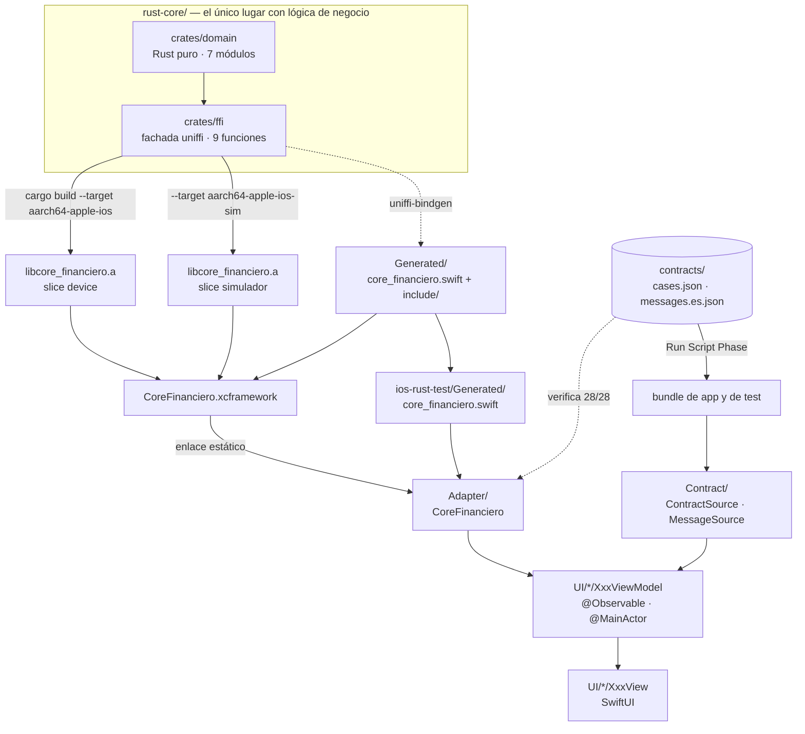

# Fase 3 — `apps/ios` Implementation Plan

> **For agentic workers:** REQUIRED SUB-SKILL: Use superpowers:subagent-driven-development (recommended) or superpowers:executing-plans to implement this plan task-by-task. Steps use checkbox (`- [ ]`) syntax for tracking.

**Goal:** Que una app nativa de iOS consuma `rust-core` por uniffi y produzca, sobre los 28 casos de `contracts/cases.json`, strings idénticos carácter por carácter a los que produce Android.

**Architecture:** El crate `core_financiero` se compila a dos `.a` —device y simulador—, uniffi genera los bindings Swift, y los tres artefactos se empaquetan en un XCFramework que la app enlaza estáticamente. Encima van un adapter que reexporta los tipos de uniffi sin traducirlos, un ViewModel `@Observable` por pantalla, y cuatro vistas SwiftUI. **Cero reglas de negocio en Swift.**

**Tech Stack:** Swift 6.3 (modo de lenguaje 5.0), SwiftUI, Swift Testing, Xcode 26.6 / SDK iOS 26.5, uniffi 0.32, Rust 1.98.1. **Sin una sola dependencia de SPM.**

**Spec:** [docs/superpowers/specs/2026-09-10-phase-3-app-ios-design.md](../specs/2026-09-10-phase-3-app-ios-design.md)

## Global Constraints

Valen en **todas** las tareas. Los requisitos de cada tarea las incluyen implícitamente.

- **`IPHONEOS_DEPLOYMENT_TARGET = 17.0`.** Ni más ni menos.
- **Ningún tipo de punto flotante toca un monto. Nunca.** Ni `Double` ni `Float`, **tampoco en tests**. Excepción única: `UI/Benchmark/NativeBaseline.swift`, que existe para exhibir la divergencia y lleva el comentario que lo dice.
- **Cero reglas de negocio fuera de `rust-core`.** Ninguna validación de CCI, ninguna fórmula de ITF, ninguna tasa. Si aparece aritmética sobre montos en Swift, el cálculo está en el lugar equivocado.
- **Ninguna librería de decimales, ningún paquete SPM.** Para comparar u ordenar en UI: `Decimal` de Foundation, construido con `Decimal(string:locale:)` y locale **POSIX**.
- **Prohibidos el `!` de force-unwrap, `try!` y `as!` en código de producción.** Es el espejo Swift de la regla "sin `panic!`/`unwrap()`/`expect()`" del core.
- **`localizedDescription` es diagnóstico, jamás texto de usuario.**
- **Montos como `String` de extremo a extremo**, desde el FFI hasta el widget de texto. El formateo (`S/`, separadores) ocurre solo al pintar.
- **Identificadores en inglés, texto de UI en español.** `ArithmeticView.swift`, no `AritmeticaView.swift`.
- **Las claves y los nombres de error de `contracts/cases.json` van en español** y no se traducen: `comision_itf`, `saldo`, `"MismaCuenta"`.
- **Comparaciones de contrato: igualdad exacta de strings.** `#expect(a == b)`, nunca numérica con tolerancia.
- **No se editan `Generated/` ni `CoreFinanciero.xcframework/`.** Son artefactos generados y gitignorados.
- **Los labels de UI son los de [`docs/ui-spec.md`](../../ui-spec.md)**, literales. Cambiar uno obliga a cambiarlo en las cuatro apps.
- **Commits en Conventional Commits, en español, con scope `ios`**: `feat(ios):`, `test(ios):`, `docs(ios):`, `chore(ios):`.
- **Gates por tarea:** TDD → `/simplify` → `superpowers:requesting-code-review`. Y `superpowers:verification-before-completion` antes de declarar la fase terminada.
- **Tras cualquier movimiento estructural de archivos, `codegraph index --force`.** El watcher no capta un `mv` de árbol entero.

### Datos fijos del contrato (v2.3.0)

Se repiten acá para que ninguna tarea los invente:

```
clave demo  = 000102030405060708090a0b0c0d0e0f101112131415161718191a1b1c1d1e1f
nonce demo  = 000102030405060708090a0b
moneda      = PEN
cuentas     = 00219100123456789047  Ana Quispe  5000.00
              01122000987654321065  Luis Ramos  1200.50
```

### La superficie del core: nueve funciones globales

Emitidas por uniffi como funciones **globales** del módulo de la app. No se prefijan con nada.

```swift
public func add(a: String, b: String) throws -> String
public func subtract(a: String, b: String) throws -> String
public func calculateItf(amount: String) throws -> String
public func validateCci(cci: String) throws -> ValidCci
public func validateCard(number: String) throws -> ValidCard
public func encrypt(text: String, keyHex: String, nonceHex: String) throws -> String
public func decrypt(ciphertextHex: String, keyHex: String, nonceHex: String) throws -> String
public func executeTransfer(accounts: [Account], request: TransferRequest) throws -> TransferResult
public func coreVersion() -> String          // la única que no lanza
```

```swift
public struct Account { public var id: String; public var holder: String; public var balance: String }
public struct TransferRequest { public var origin: String; public var destination: String; public var amount: String }
public struct TransferResult {
    public var accounts: [Account]
    public var itfFee: String
    public var totalDebited: String
    public var receipt: String
    public var simulatedLatencyMs: UInt32      // el ÚNICO campo que no es String
}
public struct ValidCci { public var bankCode: String; public var bankName: String; public var branch: String; public var account: String }
public struct ValidCard { public var brand: String; public var masked: String }
```

`DomainError` tiene **nueve** casos, con la capitalización que genera uniffi: `Length`, `CheckDigit`, `UnknownBank`, `InvalidAmount`, `AccountNotFound`, `SameAccount`, `InsufficientFunds`, `Encryption`, `OutOfRange`.

---

## Estructura de archivos

```
apps/ios/
├── BUILD.md                     Task 1    cómo se construye el puente
├── TESTING.md                   Task 14   las suites y qué prueba cada una
├── PENDING.md                   Task 14   qué NO hace y por qué
├── README.md                    Task 14   qué es y cómo se corre + diagrama Mermaid
├── CONTEXT.md                   Task 3    (corregido)
├── .swift-format                Task 3
├── Generated/                   Task 1    GENERADO · gitignorado
│   ├── core_financieroFFI.modulemap
│   └── include/{core_financieroFFI.h, module.modulemap}
├── CoreFinanciero.xcframework/  Task 1    GENERADO · gitignorado
├── ios-rust-test.xcodeproj/     Tasks 1-2 pbxproj editado a mano, verificado compilando
└── ios-rust-test/
    ├── Generated/               Task 1    GENERADO · gitignorado
    │   └── core_financiero.swift
    ├── ios_rust_testApp.swift   Task 9
    ├── AppContainer.swift       Task 9
    ├── Adapter/
    │   ├── CoreFinanciero.swift        Task 6   el protocolo
    │   ├── UniffiCoreFinanciero.swift  Task 6   la implementación real
    │   └── ContractMessages.swift      Task 4   variante → nombre del contrato → mensaje
    ├── Contract/
    │   ├── ContractSource.swift        Task 4
    │   ├── BundleContractSource.swift  Task 4
    │   ├── MessageSource.swift         Task 4
    │   └── BundleMessageSource.swift   Task 4
    ├── Format/MoneyFormatter.swift     Task 7
    └── UI/
        ├── Theme/Palette.swift         Task 8
        ├── Components/Components.swift Task 8
        ├── Navigation/BancoApp.swift   Task 9
        ├── Arithmetic/{ArithmeticView,ArithmeticViewModel,ArithmeticUiState}.swift   Task 10
        ├── Transfer/{TransferView,TransferViewModel,TransferUiState}.swift           Task 11
        ├── Card/{CardView,CardViewModel,CardUiState}.swift                           Task 12
        └── Benchmark/{BenchmarkView,BenchmarkViewModel,BenchmarkUiState}.swift       Task 13
            └── NativeBaseline.swift         Task 10 — el ÚNICO archivo con Double
└── ios-rust-testTests/
    ├── CoreSmokeTest.swift             Task 1
    ├── ContractFixtures.swift          Task 4   lectura del bundle + modelos de caso
    ├── ContractTest.swift              Task 5   los 28 casos y las cinco guardias
    ├── FakeCoreFinanciero.swift        Task 6
    ├── MoneyFormatterTest.swift        Task 7
    ├── ContractMessagesTest.swift      Task 4
    └── {Arithmetic,Transfer,Card,Benchmark}ViewModelTest.swift   Tasks 10-13
```

**`ios-rust-testUITests/` se borra en la Task 2.**

---

### Task 1: El puente — del `.a` de Rust a `coreVersion()` en verde

**Por qué va primero:** nada en esta POC linkeó nunca un XCFramework, los targets de Rust para iOS no están instalados, y hay tres trampas documentadas sin ejercitar. Si esto falla, falla en diez minutos en vez de en la hora doce con cuatro pantallas encima.

**Files:**
- Create: `apps/ios/ios-rust-testTests/CoreSmokeTest.swift`
- Create: `apps/ios/BUILD.md`
- Modify: `.gitignore`
- Modify: `apps/ios/ios-rust-test.xcodeproj/project.pbxproj`
- Generated (no se editan): `apps/ios/Generated/`, `apps/ios/ios-rust-test/Generated/`, `apps/ios/CoreFinanciero.xcframework/`

**Interfaces:**
- Consumes: nada. Es la primera tarea.
- Produces: el módulo de la app expone las nueve funciones globales de uniffi y los cinco `struct` listados en Global Constraints. Todas las tareas siguientes las consumen.

- [ ] **Step 1: Instalar los dos targets de Rust y verificar**

```bash
rustup target add aarch64-apple-ios aarch64-apple-ios-sim
rustup target list --installed
```

Qué se debe ver: la lista incluye `aarch64-apple-ios` y `aarch64-apple-ios-sim`, además de los tres de Android y `aarch64-apple-darwin` que ya estaban.

- [ ] **Step 2: Escribir el smoke test que va a fallar**

Crear `apps/ios/ios-rust-testTests/CoreSmokeTest.swift`:

```swift
import Testing
@testable import ios_rust_test

/// La prueba mínima de que el XCFramework linkea y Swift resuelve los símbolos del `.a`.
///
/// `coreVersion()` es la única función del core que no lanza, así que es la que menos
/// supuestos mete: si devuelve el string, el puente entero funciona.
@Suite("El puente al núcleo")
struct CoreSmokeTest {
    @Test("coreVersion() cruza el FFI y trae el SHA del build")
    func coreVersionCrossesTheBoundary() {
        let version = coreVersion()
        #expect(!version.isEmpty)
        // El formato es "<version>+<sha corto>", inyectado por build.rs desde git.
        #expect(version.contains("+"))
    }
}
```

- [ ] **Step 3: Correr el test y verificar que falla**

```bash
cd apps/ios
xcodebuild test -project ios-rust-test.xcodeproj -scheme ios-rust-test \
  -destination 'platform=iOS Simulator,name=iPhone 17 Pro' 2>&1 | tail -20
```

Esperado: **FALLA al compilar**, con `cannot find 'coreVersion' in scope`. Ese error es el objetivo: significa que el módulo todavía no trae nada del core.

- [ ] **Step 4: Compilar los dos `.a` de iOS y el del host**

```bash
cd rust-core
cargo build --release --target aarch64-apple-ios
cargo build --release --target aarch64-apple-ios-sim
cargo build --release          # el artefacto del HOST, solo para bindgen
ls -la target/aarch64-apple-ios/release/libcore_financiero.a \
       target/aarch64-apple-ios-sim/release/libcore_financiero.a
```

Qué se debe ver: los dos `.a` existen y pesan varios MB. Son **binarios distintos**: el de simulador no sirve en un teléfono ni al revés.

- [ ] **Step 5: Generar los bindings Swift**

```bash
cd rust-core
cargo run --bin uniffi-bindgen -- generate \
  --library target/release/libcore_financiero.a \
  --language swift --out-dir ../apps/ios/Generated
ls ../apps/ios/Generated
```

Qué se debe ver, **tres** archivos: `core_financiero.swift`, `core_financieroFFI.h` y `core_financieroFFI.modulemap`.

> **Contingencia.** Si bindgen responde `No UniFFI metadata found`, es el mismo problema que la Fase 2 encontró en Android: el perfil de release lleva `strip = true` y se comió la metadata. La salida es leer el `.dylib` del host en vez del `.a` — los bindings no dependen de la arquitectura:
> ```bash
> cargo run --bin uniffi-bindgen -- generate \
>   --library target/release/libcore_financiero.dylib \
>   --language swift --out-dir ../apps/ios/Generated
> ```
> Si hizo falta, **anotarlo en `BUILD.md` y corregir el bloque de `rust-core/CONTEXT.md`** en el Step 12.

- [ ] **Step 6: Repartir los tres archivos generados a sus dos destinos**

El `.swift` lo compila la app, así que va **dentro de la carpeta sincronizada**; los otros dos son headers del XCFramework y se quedan afuera. El renombre del modulemap es la trampa documentada: `-create-xcframework -headers` exige un archivo llamado **exactamente** `module.modulemap`, y con el nombre generado el XCFramework se arma **sin error** y después `import core_financieroFFI` no resuelve.

```bash
cd apps/ios
mkdir -p Generated/include ios-rust-test/Generated
mv Generated/core_financiero.swift     ios-rust-test/Generated/
mv Generated/core_financieroFFI.h      Generated/include/
cp Generated/core_financieroFFI.modulemap Generated/include/module.modulemap
ls Generated Generated/include ios-rust-test/Generated
```

Qué se debe ver: `Generated/` con `core_financieroFFI.modulemap` y `include/`; `Generated/include/` con **dos** archivos, `core_financieroFFI.h` y `module.modulemap`; `ios-rust-test/Generated/` con `core_financiero.swift`.

- [ ] **Step 7: Armar el XCFramework**

`-headers` va **una vez por cada `-library`**, inmediatamente después del suyo.

```bash
cd rust-core
xcodebuild -create-xcframework \
  -library target/aarch64-apple-ios/release/libcore_financiero.a \
  -headers ../apps/ios/Generated/include \
  -library target/aarch64-apple-ios-sim/release/libcore_financiero.a \
  -headers ../apps/ios/Generated/include \
  -output ../apps/ios/CoreFinanciero.xcframework
ls ../apps/ios/CoreFinanciero.xcframework
```

Qué se debe ver: `Info.plist` y **dos** directorios de slice, `ios-arm64` e `ios-arm64-simulator`. Si solo aparece uno, falta un slice y la app no va a correr en la mitad de los aparatos.

- [ ] **Step 8: Enlazar el XCFramework editando el `pbxproj`**

Los grupos sincronizados cubren las carpetas de fuentes, pero un `.xcframework` hay que declararlo. Tres ediciones en `apps/ios/ios-rust-test.xcodeproj/project.pbxproj`.

**8a.** Agregar la sección `PBXBuildFile` completa, justo **antes** de `/* Begin PBXContainerItemProxy section */`:

```
/* Begin PBXBuildFile section */
		C0DE000000000000000000F2 /* CoreFinanciero.xcframework in Frameworks */ = {isa = PBXBuildFile; fileRef = C0DE000000000000000000F1 /* CoreFinanciero.xcframework */; };
/* End PBXBuildFile section */

```

**8b.** Dentro de `/* Begin PBXFileReference section */`, agregar una línea más:

```
		C0DE000000000000000000F1 /* CoreFinanciero.xcframework */ = {isa = PBXFileReference; lastKnownFileType = wrapper.xcframework; path = CoreFinanciero.xcframework; sourceTree = "<group>"; };
```

**8c.** En la fase `Frameworks` **del target de app** —la que tiene el id `DD83237C3053A1AF0038F99E`—, cambiar `files = ( );` por:

```
			files = (
				C0DE000000000000000000F2 /* CoreFinanciero.xcframework in Frameworks */,
			);
```

**8d.** En el grupo raíz `DD8323763053A1AF0038F99E`, agregar el archivo a `children`, antes de `Products`:

```
				C0DE000000000000000000F1 /* CoreFinanciero.xcframework */,
```

No hace falta "Embed": es una librería **estática**, se enlaza y desaparece dentro del binario.

- [ ] **Step 9: Correr el test y verificar que pasa**

```bash
cd apps/ios
xcodebuild test -project ios-rust-test.xcodeproj -scheme ios-rust-test \
  -destination 'platform=iOS Simulator,name=iPhone 17 Pro' 2>&1 | tail -20
```

Esperado: **TEST SUCCEEDED**, con `coreVersionCrossesTheBoundary` en verde. Ese es el momento en que la Fase 3 deja de ser una apuesta.

Si falla con `no such module 'core_financieroFFI'`, el modulemap del Step 6 no quedó con el nombre correcto. Si falla con símbolos indefinidos al linkear, revisar que el `.xcframework` del Step 7 traiga los dos slices.

- [ ] **Step 10: Ignorar los tres directorios generados**

`.gitignore` ya ignora `/apps/ios/CoreFinanciero.xcframework/` y `/apps/ios/Generated/`. Falta el nuevo, que quedó adentro de la carpeta sincronizada. Agregar debajo de la línea de `Generated`:

```
/apps/ios/ios-rust-test/Generated/
```

Verificar que git no ve nada generado:

```bash
git status --short apps/ios
```

Qué se debe ver: **solo** `CoreSmokeTest.swift`, el `pbxproj` y el `.gitignore`. Si aparece `core_financiero.swift` o el `.xcframework`, el ignore está mal.

- [ ] **Step 11: Escribir `BUILD.md` copiando los comandos que acaban de correr**

Crear `apps/ios/BUILD.md` con: el diagrama del pipeline, los requisitos previos verificados (Xcode 26.6, SDK 26.5, Rust 1.98.1), y los Steps 1, 4, 5, 6 y 7 **tal como se ejecutaron**, cada uno con su "qué se debe ver". Incluir la trampa del modulemap y, si se usó, la contingencia del Step 5. Cerrar con la nota de `codegraph index --force` tras movimientos estructurales.

**Regla:** los comandos se copian de la terminal, no se deducen. Un README con comandos sin ejecutar se descubre roto el día de la demo.

- [ ] **Step 12: Commit**

```bash
git add apps/ios/ios-rust-testTests/CoreSmokeTest.swift apps/ios/BUILD.md \
        apps/ios/ios-rust-test.xcodeproj/project.pbxproj .gitignore
git commit -m "feat(ios): el puente al núcleo — coreVersion() cruza el FFI

Instala los dos targets de iOS, compila los dos .a, genera los bindings
Swift, arma el XCFramework con el modulemap renombrado y lo enlaza. El
smoke test pasa en el simulador: la librería linkea y Swift resuelve los
símbolos.

Es el primer commit de la fase a propósito: nada había linkeado nunca un
XCFramework, y cuatro pantallas encima de un puente roto no sirven."
```

---

### Task 2: Las cuatro correcciones del proyecto Xcode

**Files:**
- Modify: `apps/ios/ios-rust-test.xcodeproj/project.pbxproj`
- Create: `apps/ios/ios-rust-test.xcodeproj/xcshareddata/xcschemes/ios-rust-test.xcscheme`
- Delete: `apps/ios/ios-rust-testUITests/`

**Interfaces:**
- Consumes: el proyecto que compila y el smoke test verde de la Task 1.
- Produces: deployment target 17.0 y un scheme compartido que sobrevive a un clon fresco. Todas las tareas siguientes corren `xcodebuild -scheme ios-rust-test` contra él.

- [ ] **Step 1: Bajar el deployment target a 17.0**

En `project.pbxproj`, reemplazar **las dos** apariciones (Debug y Release):

```
				IPHONEOS_DEPLOYMENT_TARGET = 26.5;
```

por

```
				IPHONEOS_DEPLOYMENT_TARGET = 17.0;
```

Verificar:

```bash
cd apps/ios
grep -c 'IPHONEOS_DEPLOYMENT_TARGET = 17.0' ios-rust-test.xcodeproj/project.pbxproj
```

Esperado: `2`. Y cero apariciones de `26.5`.

- [ ] **Step 2: Corregir el bundle id duplicado**

Reemplazar en las dos configuraciones del target de app:

```
				PRODUCT_BUNDLE_IDENTIFIER = "dev.tohure.ios-rust-test.ios-rust-test";
```

por

```
				PRODUCT_BUNDLE_IDENTIFIER = "dev.tohure.ios-rust-test";
```

Y en las del target de tests, `dev.tohure.ios-rust-test.ios-rust-testTests` queda como está: un bundle de test **debe** tener id propio.

- [ ] **Step 3: Borrar el target de UITests**

Android no tiene suite de UI y esta POC tampoco la pide; un target que se compila sin probar nada alarga cada corrida. Eliminar de `project.pbxproj` **todos** los objetos con estos ids y las referencias que los nombran:

| Id | Qué es |
|---|---|
| `DD8323953053A1B00038F99E` | el `PBXNativeTarget` |
| `DD8323963053A1B00038F99E` | el `PBXFileReference` del `.xctest` (y su línea en el grupo `Products`) |
| `DD8323993053A1B00038F99E` | el `PBXFileSystemSynchronizedRootGroup` (y su línea en el grupo raíz) |
| `DD8323973053A1B00038F99E` | el `PBXContainerItemProxy` |
| `DD8323983053A1B00038F99E` | el `PBXTargetDependency` |
| `DD8323A63053A1B00038F99E` | el `XCConfigurationList` y sus dos `XCBuildConfiguration` |
| `DD8323923053A1B00038F99E`, `DD8323933053A1B00038F99E`, `DD8323943053A1B00038F99E` | sus fases Sources / Frameworks / Resources |

Quitar también la entrada `DD8323953053A1B00038F99E = { ... }` de `TargetAttributes`, y el id del array `targets` del `PBXProject`.

Después borrar la carpeta:

```bash
cd apps/ios
rm -rf ios-rust-testUITests
xcodebuild -list -project ios-rust-test.xcodeproj
```

Qué se debe ver: **dos** targets, `ios-rust-test` y `ios-rust-testTests`. Ningún UITests.

- [ ] **Step 4: Commitear el scheme compartido**

Hoy el scheme vive solo en `xcuserdata/`, que está gitignorado: un clon fresco no lo tiene y `xcodebuild -scheme` depende de que Xcode lo autocree. Crear `apps/ios/ios-rust-test.xcodeproj/xcshareddata/xcschemes/ios-rust-test.xcscheme`:

```xml
<?xml version="1.0" encoding="UTF-8"?>
<Scheme LastUpgradeVersion = "2660" version = "1.7">
   <BuildAction parallelizeBuildables = "YES" buildImplicitDependencies = "YES">
      <BuildActionEntries>
         <BuildActionEntry buildForTesting = "YES" buildForRunning = "YES" buildForProfiling = "YES" buildForArchiving = "YES" buildForAnalyzing = "YES">
            <BuildableReference
               BuildableIdentifier = "primary"
               BlueprintIdentifier = "DD83237E3053A1AF0038F99E"
               BuildableName = "ios-rust-test.app"
               BlueprintName = "ios-rust-test"
               ReferencedContainer = "container:ios-rust-test.xcodeproj">
            </BuildableReference>
         </BuildActionEntry>
      </BuildActionEntries>
   </BuildAction>
   <TestAction buildConfiguration = "Debug" selectedDebuggerIdentifier = "Xcode.DebuggerFoundation.Debugger.LLDB" selectedLauncherIdentifier = "Xcode.DebuggerFoundation.Launcher.LLDB" shouldUseLaunchSchemeArgsEnv = "YES">
      <Testables>
         <TestableReference skipped = "NO">
            <BuildableReference
               BuildableIdentifier = "primary"
               BlueprintIdentifier = "DD83238B3053A1B00038F99E"
               BuildableName = "ios-rust-testTests.xctest"
               BlueprintName = "ios-rust-testTests"
               ReferencedContainer = "container:ios-rust-test.xcodeproj">
            </BuildableReference>
         </TestableReference>
      </Testables>
   </TestAction>
   <LaunchAction buildConfiguration = "Debug" selectedDebuggerIdentifier = "Xcode.DebuggerFoundation.Debugger.LLDB" selectedLauncherIdentifier = "Xcode.DebuggerFoundation.Launcher.LLDB" launchStyle = "0" useCustomWorkingDirectory = "NO" ignoresPersistentStateOnLaunch = "NO" debugDocumentVersioning = "YES" debugServiceExtension = "internal" allowLocationSimulation = "YES">
      <BuildableProductRunnable runnableDebuggingMode = "0">
         <BuildableReference
            BuildableIdentifier = "primary"
            BlueprintIdentifier = "DD83237E3053A1AF0038F99E"
            BuildableName = "ios-rust-test.app"
            BlueprintName = "ios-rust-test"
            ReferencedContainer = "container:ios-rust-test.xcodeproj">
         </BuildableReference>
      </BuildableProductRunnable>
   </LaunchAction>
   <ProfileAction buildConfiguration = "Release" shouldUseLaunchSchemeArgsEnv = "YES" savedToolIdentifier = "" useCustomWorkingDirectory = "NO" debugDocumentVersioning = "YES">
      <BuildableProductRunnable runnableDebuggingMode = "0">
         <BuildableReference
            BuildableIdentifier = "primary"
            BlueprintIdentifier = "DD83237E3053A1AF0038F99E"
            BuildableName = "ios-rust-test.app"
            BlueprintName = "ios-rust-test"
            ReferencedContainer = "container:ios-rust-test.xcodeproj">
         </BuildableReference>
      </BuildableProductRunnable>
   </ProfileAction>
   <AnalyzeAction buildConfiguration = "Debug"></AnalyzeAction>
   <ArchiveAction buildConfiguration = "Release" revealArchiveInOrganizer = "YES"></ArchiveAction>
</Scheme>
```

- [ ] **Step 5: Verificar que todo sigue en verde con el target más bajo**

Esta es la verificación que le da sentido a la tarea: el core tiene que linkear igual con deployment target 17.0.

```bash
cd apps/ios
xcodebuild test -project ios-rust-test.xcodeproj -scheme ios-rust-test \
  -destination 'platform=iOS Simulator,name=iPhone 17 Pro' 2>&1 | tail -15
xcodebuild -showBuildSettings -project ios-rust-test.xcodeproj -target ios-rust-test 2>/dev/null \
  | grep -E 'IPHONEOS_DEPLOYMENT_TARGET|PRODUCT_BUNDLE_IDENTIFIER'
```

Esperado: **TEST SUCCEEDED**, `IPHONEOS_DEPLOYMENT_TARGET = 17.0` y `PRODUCT_BUNDLE_IDENTIFIER = dev.tohure.ios-rust-test`.

- [ ] **Step 6: Commit**

```bash
git add -A apps/ios/ios-rust-test.xcodeproj apps/ios/ios-rust-testUITests
git commit -m "chore(ios): target 17.0, bundle id sin duplicar, scheme compartido

Xcode dejó el deployment target en 26.5, que deja afuera cualquier
aparato que no esté en iOS 26, y duplicó el segmento del bundle id.

El scheme vivía solo en xcuserdata/, que está gitignorado: un clon
fresco no lo tenía y \`xcodebuild -scheme\` dependía de que Xcode lo
autocreara. Ahora es compartido y se commitea.

Se borra el target de UITests: Android no tiene suite de UI y esta POC
tampoco la pide.

El smoke test sigue en verde con el target en 17.0."
```

---

### Task 3: Las correcciones que la fase arrastra

Las cinco de la spec. **Cada una en su propio commit**, separadas de la implementación: es la única forma de auditar después si la documentación se dobló para que el código pasara.

**Files:**
- Modify: `apps/ios/CONTEXT.md`
- Modify: `.claude/settings.json`
- Create: `apps/ios/.swift-format`

**Interfaces:**
- Consumes: nada de código.
- Produces: `.swift-format` — el comando de formato que todas las tareas siguientes corren antes de commitear.

- [ ] **Step 1: Corregir las cuatro contradicciones de `CONTEXT.md`**

| Dónde | Dice | Queda |
|---|---|---|
| Encabezado "Stack" | `iOS 16+` | `iOS 17+` |
| "Arquitectura de UI" | `@Observable` "(iOS 17+)" con `ObservableObject` como alternativa "si hay que bajar el deployment target" | `@Observable`, sin alternativa: el target es 17.0 |
| "El campo de monto…" | el `.onChange` de un parámetro como principal y el de dos como comentario | el de **dos** parámetros como principal |
| "Pruebas" | `XCTest` … `XCTAssertEqual` | **Swift Testing** … `#expect(a == b)` |
| "Estructura" | `AritmeticaView.swift`, `TransferenciaView.swift`, `TarjetaView.swift` | `ArithmeticView.swift`, `TransferView.swift`, `CardView.swift` |

También actualizar el árbol de "Estructura" para que refleje el real: el proyecto está en la raíz de `apps/ios/`, la carpeta de fuentes es `ios-rust-test/`, y `Generated/core_financiero.swift` vive **dentro** de ella mientras `Generated/include/` queda afuera.

```bash
git add apps/ios/CONTEXT.md
git commit -m "docs(ios): el CONTEXT decía iOS 16+ y a la vez pedía @Observable

Las dos no podían ser ciertas: @Observable es iOS 17+. Se fija el
deployment target en 17.0 y se corrigen las otras tres contradicciones
que arrastraba —la firma vieja de .onChange como principal, XCTest
cuando el proyecto usa Swift Testing, y los nombres de vista en español
contra la regla de identificadores en inglés de CLAUDE.md."
```

- [ ] **Step 2: Declarar `swift-lsp` en el repositorio**

Está habilitado a nivel usuario, así que un clon fresco no lo tiene. En `.claude/settings.json`:

```json
{
  "enabledPlugins": {
    "superpowers@claude-plugins-official": true,
    "swift-lsp@claude-plugins-official": true
  }
}
```

```bash
git add .claude/settings.json
git commit -m "chore(ios): el repo declara swift-lsp, no solo la máquina

Estaba habilitado a nivel usuario: un clon fresco no lo tenía."
```

- [ ] **Step 3: Agregar la configuración de `swift-format` y verificarla**

`swift-format` 6.3.0 viene con Xcode 26; no se instala nada. Crear `apps/ios/.swift-format`:

```json
{
  "version": 1,
  "lineLength": 100,
  "indentation": { "spaces": 4 },
  "respectsExistingLineBreaks": true,
  "lineBreakBeforeEachArgument": false,
  "indentConditionalCompilationBlocks": false,
  "rules": {
    "AlwaysUseLowerCamelCase": true,
    "NeverForceUnwrap": true,
    "NeverUseForceTry": true,
    "UseLetInEveryBoundCaseVariable": true
  }
}
```

`NeverForceUnwrap` y `NeverUseForceTry` no son decoración: son la Global Constraint de "prohibidos `!` y `try!`" puesta donde una herramienta la revisa.

Verificar sobre el único Swift propio que existe hasta ahora:

```bash
cd apps/ios
xcrun swift-format lint --configuration .swift-format --recursive ios-rust-testTests
```

Esperado: sin salida. Cualquier línea impresa es una violación con archivo y número.

```bash
git add apps/ios/.swift-format
git commit -m "chore(ios): swift-format con NeverForceUnwrap y NeverUseForceTry

Es el cargo fmt de esta fase, y de paso pone donde una herramienta la
revisa la regla de que ni ! ni try! entran a producción."
```

---

### Task 4: El contrato llega al bundle, y los errores se traducen

**Files:**
- Modify: `apps/ios/ios-rust-test.xcodeproj/project.pbxproj` (dos `PBXShellScriptBuildPhase`)
- Create: `apps/ios/ios-rust-test/Contract/ContractSource.swift`
- Create: `apps/ios/ios-rust-test/Contract/BundleContractSource.swift`
- Create: `apps/ios/ios-rust-test/Contract/MessageSource.swift`
- Create: `apps/ios/ios-rust-test/Contract/BundleMessageSource.swift`
- Create: `apps/ios/ios-rust-test/Adapter/ContractMessages.swift`
- Test: `apps/ios/ios-rust-testTests/ContractFixtures.swift`
- Test: `apps/ios/ios-rust-testTests/ContractMessagesTest.swift`

**Interfaces:**
- Consumes: `Account` y `DomainError` del módulo de la app (Task 1).
- Produces:
  - `protocol ContractSource { func initialAccounts() -> [Account]; func demoKeyHex() -> String; func demoNonceHex() -> String }`
  - `protocol MessageSource { func messages() -> [String: String] }`
  - `struct BundleContractSource: ContractSource { init(bundle: Bundle) throws }`
  - `struct BundleMessageSource: MessageSource { init(bundle: Bundle) throws }`
  - `extension DomainError { var contractName: String }`
  - `struct ContractMessages { init(source: MessageSource); func userMessage(_ error: DomainError) -> String }`
  - `enum ContractFixtures` (solo en tests): `static func data(_ name: String) throws -> Data`

> **Nota sobre errores en esta tarea.** Un contrato que falta en el bundle es un **fallo de build**, no un error de dominio: la Run Script Phase no corrió o el archivo se movió. Por eso los `init` son `throws` y no devuelven valores por defecto — un contrato ausente tiene que romper ruidosamente y temprano. Esto **no** contradice la Global Constraint: lo prohibido es `try!` sobre una llamada al core, que convertiría un `DomainError` legítimo en un crash.

- [ ] **Step 1: Escribir el test que va a fallar — el contrato tiene que estar en el bundle de test**

Crear `apps/ios/ios-rust-testTests/ContractFixtures.swift`:

```swift
import Foundation
import Testing

/// Lee los JSON del contrato desde el bundle de **test**.
///
/// No usa `Bundle.main`: en un bundle de test eso apunta al runner del simulador, no al
/// `.xctest`. Es el error que hace que el archivo "no aparezca" aunque la fase de copia
/// haya corrido bien.
enum ContractFixtures {
    enum FixtureError: Error, CustomStringConvertible {
        case missing(String)
        var description: String {
            switch self {
            case .missing(let name):
                return """
                    `\(name)` no está en el bundle de test. La Run Script Phase que copia \
                    contracts/*.json no corrió, o corrió sobre el target equivocado.
                    """
            }
        }
    }

    static func data(_ name: String) throws -> Data {
        let bundle = Bundle(for: BundleToken.self)
        guard let url = bundle.url(forResource: name, withExtension: "json") else {
            throw FixtureError.missing("\(name).json")
        }
        return try Data(contentsOf: url)
    }

    /// Solo existe para darle a `Bundle(for:)` una clase de este bundle.
    private final class BundleToken {}
}

@Suite("El contrato llega al bundle de test")
struct ContractInBundleTest {
    @Test("cases.json está en el bundle y es la versión que esta fase espera")
    func casesIsBundledAtTheExpectedVersion() throws {
        let raw = try JSONSerialization.jsonObject(with: try ContractFixtures.data("cases"))
        let root = try #require(raw as? [String: Any])
        #expect(root["version"] as? String == "2.3.0")
        #expect(root["moneda"] as? String == "PEN")
    }

    @Test("messages.es.json está en el bundle con los nueve mensajes")
    func messagesIsBundled() throws {
        let raw = try JSONSerialization.jsonObject(with: try ContractFixtures.data("messages.es"))
        let root = try #require(raw as? [String: Any])
        let messages = try #require(root["mensajes"] as? [String: String])
        #expect(messages.count == 9)
    }
}
```

- [ ] **Step 2: Correr y verificar que falla**

```bash
cd apps/ios
xcodebuild test -project ios-rust-test.xcodeproj -scheme ios-rust-test \
  -destination 'platform=iOS Simulator,name=iPhone 17 Pro' \
  -only-testing:ios-rust-testTests/ContractInBundleTest 2>&1 | tail -20
```

Esperado: **FALLA** con el mensaje de `FixtureError.missing` — `cases.json` no está en el bundle porque todavía nadie lo copia.

- [ ] **Step 3: Agregar las dos Run Script Phases al `pbxproj`**

Una por target: las rutas de salida dependen de `TARGET_BUILD_DIR`, que es distinto para la app y para el `.xctest`. Insertar esta sección completa antes de `/* Begin PBXSourcesBuildPhase section */`:

```
/* Begin PBXShellScriptBuildPhase section */
		C0DE000000000000000000F3 /* Copiar los contratos al bundle */ = {
			isa = PBXShellScriptBuildPhase;
			buildActionMask = 2147483647;
			files = (
			);
			inputPaths = (
				"$(SRCROOT)/../../contracts/cases.json",
				"$(SRCROOT)/../../contracts/messages.es.json",
			);
			name = "Copiar los contratos al bundle";
			outputPaths = (
				"$(TARGET_BUILD_DIR)/$(UNLOCALIZED_RESOURCES_FOLDER_PATH)/cases.json",
				"$(TARGET_BUILD_DIR)/$(UNLOCALIZED_RESOURCES_FOLDER_PATH)/messages.es.json",
			);
			runOnlyForDeploymentPostprocessing = 0;
			shellPath = /bin/sh;
			shellScript = "set -eu\nDST=\"$TARGET_BUILD_DIR/$UNLOCALIZED_RESOURCES_FOLDER_PATH\"\nmkdir -p \"$DST\"\ncp \"$SRCROOT/../../contracts/cases.json\" \"$DST/\"\ncp \"$SRCROOT/../../contracts/messages.es.json\" \"$DST/\"\n";
		};
		C0DE000000000000000000F4 /* Copiar los contratos al bundle */ = {
			isa = PBXShellScriptBuildPhase;
			buildActionMask = 2147483647;
			files = (
			);
			inputPaths = (
				"$(SRCROOT)/../../contracts/cases.json",
				"$(SRCROOT)/../../contracts/messages.es.json",
			);
			name = "Copiar los contratos al bundle";
			outputPaths = (
				"$(TARGET_BUILD_DIR)/$(UNLOCALIZED_RESOURCES_FOLDER_PATH)/cases.json",
				"$(TARGET_BUILD_DIR)/$(UNLOCALIZED_RESOURCES_FOLDER_PATH)/messages.es.json",
			);
			runOnlyForDeploymentPostprocessing = 0;
			shellPath = /bin/sh;
			shellScript = "set -eu\nDST=\"$TARGET_BUILD_DIR/$UNLOCALIZED_RESOURCES_FOLDER_PATH\"\nmkdir -p \"$DST\"\ncp \"$SRCROOT/../../contracts/cases.json\" \"$DST/\"\ncp \"$SRCROOT/../../contracts/messages.es.json\" \"$DST/\"\n";
		};
/* End PBXShellScriptBuildPhase section */

```

Después, en `buildPhases` del target de **app** (`DD83237E3053A1AF0038F99E`), agregar `C0DE000000000000000000F3 /* Copiar los contratos al bundle */,` **después** de la fase `Resources`; y en el de **tests** (`DD83238B3053A1B00038F99E`), agregar `C0DE000000000000000000F4 /* Copiar los contratos al bundle */,` en la misma posición.

`$(SRCROOT)` es `apps/ios`, así que `$(SRCROOT)/../../contracts` es `contracts/` en la raíz del repo.

- [ ] **Step 4: Correr y verificar que pasa**

```bash
cd apps/ios
xcodebuild test -project ios-rust-test.xcodeproj -scheme ios-rust-test \
  -destination 'platform=iOS Simulator,name=iPhone 17 Pro' \
  -only-testing:ios-rust-testTests/ContractInBundleTest 2>&1 | tail -15
```

Esperado: **TEST SUCCEEDED**, dos tests en verde.

- [ ] **Step 5: Escribir los dos protocolos y sus implementaciones**

Crear `apps/ios/ios-rust-test/Contract/ContractSource.swift`:

```swift
/// De dónde salen los datos del contrato que la app necesita en producción.
///
/// Existe como protocolo por una razón propia de iOS: producción lee de `Bundle.main` y
/// los tests de `Bundle(for:)`. El mismo código tiene que leer de dos bundles distintos.
protocol ContractSource {
    /// Las dos cuentas de `cuentas_iniciales`. Son datos del contrato, no de la app:
    /// hardcodearlas las haría divergir entre las cuatro plataformas.
    func initialAccounts() -> [Account]

    /// La clave y el nonce de demo, de `_clave_demo_hex` y `_nonce_demo_hex`.
    ///
    /// **El nonce es FIJO a propósito**, para que las cuatro plataformas produzcan el mismo
    /// hex y se pueda comparar en la demo. En producción, reutilizar un nonce con
    /// ChaCha20-Poly1305 es catastrófico; ver `contracts/README.md`.
    func demoKeyHex() -> String
    func demoNonceHex() -> String
}
```

Crear `apps/ios/ios-rust-test/Contract/BundleContractSource.swift`:

```swift
import Foundation

/// Lee `cases.json` del bundle que se le pase.
///
/// El `init` lanza a propósito: un contrato ausente es un fallo de build —la Run Script
/// Phase no corrió— y tiene que romper ruidosamente al arrancar, no devolver una lista
/// vacía que deje la pantalla de Transferencia sin cuentas y sin explicación.
struct BundleContractSource: ContractSource {
    enum LoadError: Error, CustomStringConvertible {
        case notInBundle
        case malformed(String)
        var description: String {
            switch self {
            case .notInBundle:
                return "cases.json no está en el bundle: la fase que copia contracts/ no corrió."
            case .malformed(let key):
                return "cases.json no tiene `\(key)` o no tiene la forma esperada."
            }
        }
    }

    private let accounts: [Account]
    private let keyHex: String
    private let nonceHex: String

    init(bundle: Bundle) throws {
        guard let url = bundle.url(forResource: "cases", withExtension: "json") else {
            throw LoadError.notInBundle
        }
        let raw = try JSONSerialization.jsonObject(with: try Data(contentsOf: url))
        guard let root = raw as? [String: Any] else { throw LoadError.malformed("raíz") }

        guard let rows = root["cuentas_iniciales"] as? [[String: String]] else {
            throw LoadError.malformed("cuentas_iniciales")
        }
        accounts = try rows.map { row in
            guard let id = row["id"], let holder = row["titular"], let balance = row["saldo"] else {
                throw LoadError.malformed("cuentas_iniciales[]")
            }
            return Account(id: id, holder: holder, balance: balance)
        }

        guard let key = root["_clave_demo_hex"] as? String else {
            throw LoadError.malformed("_clave_demo_hex")
        }
        guard let nonce = root["_nonce_demo_hex"] as? String else {
            throw LoadError.malformed("_nonce_demo_hex")
        }
        keyHex = key
        nonceHex = nonce
    }

    func initialAccounts() -> [Account] { accounts }
    func demoKeyHex() -> String { keyHex }
    func demoNonceHex() -> String { nonceHex }
}
```

Crear `apps/ios/ios-rust-test/Contract/MessageSource.swift`:

```swift
/// Los nueve mensajes de usuario, indexados por **nombre del contrato**
/// (`Longitud`, `DigitoControl`, …), no por el nombre de la variante en inglés.
///
/// Los mensajes NO cruzan el FFI: en Swift, `localizedDescription` de un `DomainError` es
/// `String(reflecting: self)`, o sea el volcado de debug del enum. Sin este archivo, las
/// cuatro apps mostrarían textos distintos en sus pantallas de error.
///
/// Es protocolo por lo mismo que `ContractSource`, y además porque así un segundo idioma
/// es otro archivo y no un cambio de código.
protocol MessageSource {
    func messages() -> [String: String]
}
```

Crear `apps/ios/ios-rust-test/Contract/BundleMessageSource.swift`:

```swift
import Foundation

struct BundleMessageSource: MessageSource {
    enum LoadError: Error, CustomStringConvertible {
        case notInBundle
        case malformed
        var description: String {
            switch self {
            case .notInBundle:
                return "messages.es.json no está en el bundle: la fase que copia contracts/ no corrió."
            case .malformed:
                return "messages.es.json no tiene la clave `mensajes` con forma de diccionario."
            }
        }
    }

    private let table: [String: String]

    init(bundle: Bundle) throws {
        guard let url = bundle.url(forResource: "messages.es", withExtension: "json") else {
            throw LoadError.notInBundle
        }
        let raw = try JSONSerialization.jsonObject(with: try Data(contentsOf: url))
        guard let root = raw as? [String: Any],
              let table = root["mensajes"] as? [String: String]
        else { throw LoadError.malformed }
        self.table = table
    }

    func messages() -> [String: String] { table }
}
```

- [ ] **Step 6: Escribir el test de `ContractMessages` antes de la implementación**

Crear `apps/ios/ios-rust-testTests/ContractMessagesTest.swift`:

```swift
import Testing
@testable import ios_rust_test

@Suite("El mapeo de errores a texto de usuario")
struct ContractMessagesTest {
    private func messages() throws -> ContractMessages {
        ContractMessages(source: try BundleMessageSource(bundle: Bundle(for: BundleToken.self)))
    }

    @Test("los nueve nombres del contrato salen de las nueve variantes")
    func theNineVariantsMapToTheNineContractNames() {
        #expect(DomainError.Length.contractName == "Longitud")
        #expect(DomainError.CheckDigit.contractName == "DigitoControl")
        #expect(DomainError.UnknownBank(code: "999").contractName == "BancoDesconocido")
        #expect(DomainError.InvalidAmount.contractName == "MontoInvalido")
        #expect(DomainError.AccountNotFound(id: "x").contractName == "CuentaNoEncontrada")
        #expect(DomainError.SameAccount.contractName == "MismaCuenta")
        #expect(
            DomainError.InsufficientFunds(available: "1.00", required: "2.00").contractName
                == "SaldoInsuficiente"
        )
        #expect(DomainError.Encryption.contractName == "Cifrado")
        #expect(DomainError.OutOfRange(field: "monto").contractName == "FueraDeRango")
    }

    @Test("un error sin campos devuelve su mensaje tal cual")
    func anErrorWithNoFieldsReturnsItsMessageVerbatim() throws {
        #expect(
            try messages().userMessage(.SameAccount)
                == "La cuenta de origen y la de destino son la misma."
        )
    }

    @Test("los placeholders se interpolan CRUDOS, sin formatear el monto")
    func placeholdersAreInterpolatedRaw() throws {
        let text = try messages().userMessage(
            .InsufficientFunds(available: "1200.50", required: "10000.50")
        )
        #expect(text == "Saldo insuficiente: tenés 1200.50 y se necesitan 10000.50.")
        // Ni `S/` ni separadores de miles: los formateadores de Android, iOS y el navegador
        // no coinciden entre sí y una diferencia rompe la comparación carácter por carácter.
        #expect(!text.contains("S/"))
        #expect(!text.contains(","))
    }

    private final class BundleToken {}
}
```

- [ ] **Step 7: Correr y verificar que falla**

Esperado: **FALLA al compilar** con `value of type 'DomainError' has no member 'contractName'`.

- [ ] **Step 8: Implementar `ContractMessages`**

Crear `apps/ios/ios-rust-test/Adapter/ContractMessages.swift`:

```swift
extension DomainError {
    /// El nombre que `contracts/cases.json` le da a este error.
    ///
    /// `DomainError::contract_name()` es un método de Rust y **no cruza el FFI**: el enum
    /// generado trae solo los nombres en inglés.
    ///
    /// El `switch` va **exhaustivo y sin `default`**. Es deliberado: agregar una décima
    /// variante al core tiene que romper la compilación acá —un fallo ruidoso y ubicado—
    /// en vez de caer en un `"Desconocido"` que compila, pasa en verde, y se descubre el
    /// día de la demo cuando esta app muestra un error que las otras tres no.
    var contractName: String {
        switch self {
        case .Length: return "Longitud"
        case .CheckDigit: return "DigitoControl"
        case .UnknownBank: return "BancoDesconocido"
        case .InvalidAmount: return "MontoInvalido"
        case .AccountNotFound: return "CuentaNoEncontrada"
        case .SameAccount: return "MismaCuenta"
        case .InsufficientFunds: return "SaldoInsuficiente"
        case .Encryption: return "Cifrado"
        case .OutOfRange: return "FueraDeRango"
        }
    }
}

/// Traduce un error del core al texto que ve el usuario.
///
/// Vive en producción y no solo en el test porque `contracts/messages.es.json` indexa los
/// mensajes por nombre del contrato: la pantalla de error necesita el mapeo igual que el
/// test de contrato. **El test de contrato reusa esta misma función** en vez de escribir
/// la suya, así que verifica contra `cases.json` el mapeo que la UI usa de verdad.
struct ContractMessages {
    private let table: [String: String]

    init(source: MessageSource) {
        table = source.messages()
    }

    func userMessage(_ error: DomainError) -> String {
        let name = error.contractName
        guard let template = table[name] else {
            return "Error del núcleo: \(name)"
        }
        return interpolate(template, error)
    }

    /// Reemplaza `{code}`, `{id}`, `{available}`, `{required}` y `{field}` por los campos de
    /// la variante, **crudos**. Nada de `NumberFormatter` acá: los formateadores de Android,
    /// iOS y el navegador no coinciden entre sí, y una diferencia rompe la comparación
    /// carácter por carácter que es toda la tesis. El formateo vive en las pantallas.
    private func interpolate(_ template: String, _ error: DomainError) -> String {
        switch error {
        case .Length, .CheckDigit, .InvalidAmount, .SameAccount, .Encryption:
            return template
        case .UnknownBank(let code):
            return template.replacingOccurrences(of: "{code}", with: code)
        case .AccountNotFound(let id):
            return template.replacingOccurrences(of: "{id}", with: id)
        case .InsufficientFunds(let available, let required):
            return template
                .replacingOccurrences(of: "{available}", with: available)
                .replacingOccurrences(of: "{required}", with: required)
        case .OutOfRange(let field):
            return template.replacingOccurrences(of: "{field}", with: field)
        }
    }
}
```

> **Si los nombres de los valores asociados no compilan**, leer las firmas reales en `apps/ios/ios-rust-test/Generated/core_financiero.swift` y ajustar. **No adivinar**: CodeGraph no indexa ese archivo (es generado y gitignorado), así que acá se lee el archivo directamente.

- [ ] **Step 9: Correr y verificar que pasa**

```bash
cd apps/ios
xcodebuild test -project ios-rust-test.xcodeproj -scheme ios-rust-test \
  -destination 'platform=iOS Simulator,name=iPhone 17 Pro' 2>&1 | tail -15
```

Esperado: **TEST SUCCEEDED** — smoke + 2 de bundle + 3 de mensajes = 6 tests.

- [ ] **Step 10: Formatear y commitear**

```bash
cd apps/ios
xcrun swift-format lint --configuration .swift-format --recursive ios-rust-test ios-rust-testTests
cd ../..
git add apps/ios/ios-rust-test/Contract apps/ios/ios-rust-test/Adapter \
        apps/ios/ios-rust-testTests apps/ios/ios-rust-test.xcodeproj/project.pbxproj
git commit -m "feat(ios): el contrato entra al bundle y los errores se traducen

Una Run Script Phase por target copia contracts/*.json directo a
\$TARGET_BUILD_DIR, sin copia intermedia en el árbol de fuentes: así no
existe la posibilidad de un JSON viejo en el bundle, que es el modo de
fallar que deja a Rust en verde y a la pantalla de error mostrando otra
cosa.

ContractMessages vive en producción y el test de contrato va a reusarlo,
para verificar el mapeo que la UI usa de verdad y no una copia."
```

---

### Task 5: El test de contrato — los 28 casos y las cinco guardias

**Es la tarea que demuestra la tesis de la POC.** Que estos 28 casos produzcan en Swift los mismos strings que en Rust y en Kotlin *es* la demostración.

**Files:**
- Modify: `apps/ios/ios-rust-testTests/ContractFixtures.swift` (se le agregan los modelos)
- Create: `apps/ios/ios-rust-testTests/ContractTest.swift`

**Interfaces:**
- Consumes: las nueve funciones globales (Task 1), `ContractFixtures.data(_:)` y `DomainError.contractName` (Task 4).
- Produces: nada que otra tarea consuma. Es una hoja del grafo — y el criterio de cierre de la fase.

- [ ] **Step 1: Agregar los modelos de caso a `ContractFixtures.swift`**

Las claves del JSON van en español —es la excepción documentada en `CLAUDE.md`— y las propiedades Swift en inglés. El puente son los `CodingKeys`, que es exactamente donde corresponde que viva.

Agregar al final de `apps/ios/ios-rust-testTests/ContractFixtures.swift`:

```swift
// MARK: - Los grupos de cases.json

struct ContractFile: Decodable, Sendable {
    let version: String
    let currency: String
    let itfRate: String
    let demoKeyHex: String
    let demoNonceHex: String
    let arithmetic: [ArithmeticCase]
    let initialAccounts: [AccountRow]
    let transfer: [TransferCase]
    let cci: [CciCase]
    let itf: [ItfCase]
    let card: [CardCase]

    enum CodingKeys: String, CodingKey {
        case version
        case currency = "moneda"
        case itfRate = "_alicuota_itf"
        case demoKeyHex = "_clave_demo_hex"
        case demoNonceHex = "_nonce_demo_hex"
        case arithmetic = "aritmetica"
        case initialAccounts = "cuentas_iniciales"
        case transfer = "transferencia"
        case cci
        case itf
        case card = "tarjeta"
    }
}

struct AccountRow: Decodable, Sendable {
    let id: String
    let holder: String
    let balance: String
    enum CodingKeys: String, CodingKey {
        case id
        case holder = "titular"
        case balance = "saldo"
    }
}

struct ArithmeticCase: Decodable, Sendable, CustomTestStringConvertible {
    let id: String
    let op: String
    let a: String
    let b: String
    let expected: String
    enum CodingKeys: String, CodingKey {
        case id, op, a, b
        case expected = "esperado"
    }
    var testDescription: String { id }
}

struct TransferCase: Decodable, Sendable, CustomTestStringConvertible {
    struct Input: Decodable, Sendable {
        let origin: String
        let destination: String
        let amount: String
        enum CodingKeys: String, CodingKey {
            case origin = "origen"
            case destination = "destino"
            case amount = "monto"
        }
    }
    struct Expected: Decodable, Sendable {
        let accounts: [AccountRow]
        let itfFee: String
        let totalDebited: String
        let receipt: String
        let simulatedLatencyMs: UInt32
        enum CodingKeys: String, CodingKey {
            case accounts = "cuentas"
            case itfFee = "comision_itf"
            case totalDebited = "total_debitado"
            case receipt = "comprobante"
            case simulatedLatencyMs = "latencia_simulada_ms"
        }
    }
    let id: String
    let input: Input
    let valid: Bool
    let expected: Expected?
    let error: String?
    enum CodingKeys: String, CodingKey {
        case id
        case input = "entrada"
        case valid = "valido"
        case expected = "esperado"
        case error
    }
    var testDescription: String { id }
}

struct CciCase: Decodable, Sendable, CustomTestStringConvertible {
    struct Expected: Decodable, Sendable {
        let bankCode: String
        let bankName: String
        let branch: String
        let account: String
        enum CodingKeys: String, CodingKey {
            case bankCode = "codigo_banco"
            case bankName = "nombre_banco"
            case branch = "oficina"
            case account = "cuenta"
        }
    }
    let id: String
    let input: String
    let valid: Bool
    let expected: Expected?
    let error: String?
    enum CodingKeys: String, CodingKey {
        case id
        case input = "entrada"
        case valid = "valido"
        case expected = "esperado"
        case error
    }
    var testDescription: String { id }
}

struct ItfCase: Decodable, Sendable, CustomTestStringConvertible {
    let id: String
    let input: String
    let expected: String
    enum CodingKeys: String, CodingKey {
        case id
        case input = "entrada"
        case expected = "esperado"
    }
    var testDescription: String { id }
}

struct CardCase: Decodable, Sendable, CustomTestStringConvertible {
    struct Expected: Decodable, Sendable {
        let brand: String
        let masked: String
        let cipherHex: String
        enum CodingKeys: String, CodingKey {
            case brand = "marca"
            case masked = "enmascarado"
            case cipherHex = "cifrado_hex"
        }
    }
    let id: String
    let input: String
    let valid: Bool
    let expected: Expected?
    let error: String?
    enum CodingKeys: String, CodingKey {
        case id
        case input = "entrada"
        case valid = "valido"
        case expected = "esperado"
        case error
    }
    var testDescription: String { id }
}

extension ContractFixtures {
    /// Se carga una sola vez. `@Test(arguments:)` necesita los casos antes de correr, así
    /// que esto se evalúa al inicializar el tipo.
    ///
    /// Si el contrato no está o no decodifica, `fatalError` es lo correcto **acá y solo
    /// acá**: es código de test, y un contrato ilegible tiene que detener la suite entera
    /// con un mensaje claro en vez de dejar cero casos corriendo en verde.
    static let contract: ContractFile = {
        do {
            return try JSONDecoder().decode(ContractFile.self, from: try data("cases"))
        } catch {
            fatalError("No se pudo leer contracts/cases.json desde el bundle de test: \(error)")
        }
    }()
}
```

- [ ] **Step 2: Escribir las cinco guardias, y verlas fallar**

**Por qué van primero:** sin ellas, un grupo vaciado a `[]` deja el test en verde sin comparar un solo string. `@Test(arguments: [])` genera cero casos y **reporta éxito** — el mismo agujero que un `for` sobre cero elementos en Rust y en Kotlin, verificado por mutación en la Fase 1.

Crear `apps/ios/ios-rust-testTests/ContractTest.swift`:

```swift
import Foundation
import Testing
@testable import ios_rust_test

/// Espejo Swift de `rust-core/crates/ffi/tests/contract.rs` y de `ContractTest.kt`.
///
/// Que este test pase **es** la demostración de la POC: los mismos 28 casos producen los
/// mismos strings en Rust, Kotlin y Swift.
///
/// Comparaciones con `==` sobre `String`, nunca numéricas con tolerancia.
@Suite("Contrato v2.3.0")
struct ContractTest {
    private var contract: ContractFile { ContractFixtures.contract }

    // ── Guardias ──────────────────────────────────────────────────────────────

    @Test("guardia: el contrato es la versión y la moneda esperadas")
    func theContractIsTheExpectedVersion() {
        #expect(contract.version == "2.3.0")
        #expect(contract.currency == "PEN")
    }

    @Test("guardia: cada grupo tiene la cantidad de casos esperada")
    func eachGroupHasTheExpectedNumberOfCases() {
        #expect(contract.arithmetic.count == 6)
        #expect(contract.cci.count == 4)
        #expect(contract.itf.count == 5)
        #expect(contract.card.count == 6)
        #expect(contract.transfer.count == 7)
        #expect(contract.initialAccounts.count == 2)
    }

    @Test("guardia: las claves de primer nivel son exactamente las conocidas")
    func theTopLevelKeysAreExactlyTheKnownOnes() throws {
        let raw = try JSONSerialization.jsonObject(with: try ContractFixtures.data("cases"))
        let root = try #require(raw as? [String: Any])
        let known: Set<String> = [
            "version", "moneda", "_nota", "_alicuota_itf",
            "_clave_demo_hex", "_nonce_demo_hex",
            "aritmetica", "cuentas_iniciales", "transferencia", "cci", "itf", "tarjeta",
        ]
        let actual = Set(root.keys)
        #expect(actual.subtracting(known).isEmpty, "cases.json trae claves desconocidas")
        #expect(known.subtracting(actual).isEmpty, "a cases.json le faltan claves")
    }

    @Test("guardia: las nueve variantes de DomainError tienen nombre de contrato distinto")
    func theNineVariantsHaveNineDistinctContractNames() {
        let all: [DomainError] = [
            .Length,
            .CheckDigit,
            .UnknownBank(code: "002"),
            .InvalidAmount,
            .AccountNotFound(id: "x"),
            .SameAccount,
            .InsufficientFunds(available: "0.00", required: "1.00"),
            .Encryption,
            .OutOfRange(field: "monto"),
        ]
        let names = Set(all.map(\.contractName))
        #expect(names.count == 9)
        // Todo nombre de error que aparece en cases.json tiene que ser uno de los nueve.
        let used = Set(
            contract.transfer.compactMap(\.error)
                + contract.cci.compactMap(\.error)
                + contract.card.compactMap(\.error)
        )
        #expect(used.subtracting(names).isEmpty, "cases.json usa un error que el core no tiene")
    }

    @Test("guardia: el messages.es.json del bundle cubre las nueve variantes")
    func theBundledMessagesCoverTheNineVariants() throws {
        // La única guardia que Rust no puede dar: Rust lee el archivo fuente con
        // `include_str!` y esta app lee lo que copió la Run Script Phase. Un asset viejo
        // o truncado dejaría a Rust en verde y a la pantalla de error mostrando otra cosa.
        let source = try BundleMessageSource(bundle: Bundle(for: BundleToken.self))
        let table = source.messages()
        let names = [
            "Longitud", "DigitoControl", "BancoDesconocido", "MontoInvalido",
            "CuentaNoEncontrada", "MismaCuenta", "SaldoInsuficiente", "Cifrado", "FueraDeRango",
        ]
        for name in names {
            #expect(table[name] != nil, "messages.es.json no tiene el mensaje de `\(name)`")
        }
        #expect(table.count == 9)
    }

    private final class BundleToken {}
}
```

- [ ] **Step 3: Correr las guardias**

```bash
cd apps/ios
xcodebuild test -project ios-rust-test.xcodeproj -scheme ios-rust-test \
  -destination 'platform=iOS Simulator,name=iPhone 17 Pro' \
  -only-testing:ios-rust-testTests/ContractTest 2>&1 | tail -20
```

Esperado: **las cinco en verde.** Si alguna falla, se arregla antes de escribir un solo caso: una guardia rota invalida todo lo que venga después.

- [ ] **Step 4: Escribir los 28 casos**

Agregar dentro de `struct ContractTest`, antes de `private final class BundleToken {}`:

```swift
    // ── Los 28 casos ──────────────────────────────────────────────────────────

    @Test("aritmetica", arguments: ContractFixtures.contract.arithmetic)
    func arithmetic(_ c: ArithmeticCase) throws {
        let actual = switch c.op {
        case "sumar": try add(a: c.a, b: c.b)
        case "restar": try subtract(a: c.a, b: c.b)
        default: throw ContractFixtures.FixtureError.missing("op desconocida: \(c.op)")
        }
        #expect(actual == c.expected)
    }

    @Test("itf", arguments: ContractFixtures.contract.itf)
    func itf(_ c: ItfCase) throws {
        #expect(try calculateItf(amount: c.input) == c.expected)
    }

    @Test("cci", arguments: ContractFixtures.contract.cci)
    func cci(_ c: CciCase) throws {
        if c.valid {
            let expected = try #require(c.expected)
            let actual = try validateCci(cci: c.input)
            #expect(actual.bankCode == expected.bankCode)
            #expect(actual.bankName == expected.bankName)
            #expect(actual.branch == expected.branch)
            #expect(actual.account == expected.account)
        } else {
            let expected = try #require(c.error)
            do {
                _ = try validateCci(cci: c.input)
                Issue.record("\(c.id): se esperaba \(expected) y no lanzó")
            } catch let e as DomainError {
                #expect(e.contractName == expected)
            }
        }
    }

    @Test("tarjeta", arguments: ContractFixtures.contract.card)
    func card(_ c: CardCase) throws {
        if c.valid {
            let expected = try #require(c.expected)
            let actual = try validateCard(number: c.input)
            #expect(actual.brand == expected.brand)
            #expect(actual.masked == expected.masked)

            // El cifrado usa nonce FIJO a propósito: es lo que hace que las cuatro
            // plataformas produzcan el mismo hex y se pueda comparar en la demo.
            let hex = try encrypt(
                text: c.input,
                keyHex: contract.demoKeyHex,
                nonceHex: contract.demoNonceHex
            )
            #expect(hex == expected.cipherHex)

            // La vuelta completa: sin esto, el hex es indistinguible de un hash.
            let back = try decrypt(
                ciphertextHex: hex,
                keyHex: contract.demoKeyHex,
                nonceHex: contract.demoNonceHex
            )
            #expect(back == c.input)
        } else {
            let expected = try #require(c.error)
            do {
                _ = try validateCard(number: c.input)
                Issue.record("\(c.id): se esperaba \(expected) y no lanzó")
            } catch let e as DomainError {
                #expect(e.contractName == expected)
            }
        }
    }

    @Test("transferencia", arguments: ContractFixtures.contract.transfer)
    func transfer(_ c: TransferCase) throws {
        // Cada caso arranca de las cuentas iniciales: tr-001 y tr-002 parten los dos de
        // 5000.00 / 1200.50, así que el estado NO se arrastra entre casos.
        let accounts = contract.initialAccounts.map {
            Account(id: $0.id, holder: $0.holder, balance: $0.balance)
        }
        let request = TransferRequest(
            origin: c.input.origin,
            destination: c.input.destination,
            amount: c.input.amount
        )

        if c.valid {
            let expected = try #require(c.expected)
            let result = try executeTransfer(accounts: accounts, request: request)
            #expect(result.itfFee == expected.itfFee)
            #expect(result.totalDebited == expected.totalDebited)
            #expect(result.receipt == expected.receipt)
            #expect(result.simulatedLatencyMs == expected.simulatedLatencyMs)
            #expect(result.accounts.count == expected.accounts.count)
            for (actual, want) in zip(result.accounts, expected.accounts) {
                #expect(actual.id == want.id)
                #expect(actual.holder == want.holder)
                #expect(actual.balance == want.balance)
            }
        } else {
            let expected = try #require(c.error)
            do {
                _ = try executeTransfer(accounts: accounts, request: request)
                Issue.record("\(c.id): se esperaba \(expected) y no lanzó")
            } catch let e as DomainError {
                #expect(e.contractName == expected)
            }
        }
    }
```

- [ ] **Step 5: Correr los 28 y verificar el conteo**

```bash
cd apps/ios
xcodebuild test -project ios-rust-test.xcodeproj -scheme ios-rust-test \
  -destination 'platform=iOS Simulator,name=iPhone 17 Pro' \
  -only-testing:ios-rust-testTests/ContractTest 2>&1 | tail -30
```

Esperado: **TEST SUCCEEDED** con **33 tests** — 28 casos (6 aritmética + 5 itf + 4 cci + 6 tarjeta + 7 transferencia) más las 5 guardias. Swift Testing nombra cada caso con su `id`, así que un fallo dice `ar-003` y no "iteración 3".

> **Si un valor esperado no coincide, el código está mal, no el contrato.** Corregir un valor de `cases.json` va **siempre en su propio commit**, con la justificación aritmética en el mensaje, y nunca mezclado con cambios al core. Es la única forma de auditar después si el contrato se dobló para que pasara el código.

- [ ] **Step 6: Verificar que las guardias sirven — prueba por mutación**

No basta con que estén escritas. Una vez, a mano:

```bash
# Desde la raíz del repo. Vaciar `aritmetica` a [] y volver a correr el test:
python3 -c "import json;d=json.load(open('contracts/cases.json'));\
d['aritmetica']=[];json.dump(d,open('contracts/cases.json','w'),ensure_ascii=False,indent=2)"
```

Esperado: **la guardia de conteo falla**. Si el test quedara en verde con un grupo vacío, la guardia no sirve y hay que arreglarla. Restaurar el archivo:

```bash
git checkout contracts/cases.json && git status --short contracts/
```

Qué se debe ver: `contracts/` limpio. **Este paso no deja cambios commiteables.**

- [ ] **Step 7: Formatear y commitear**

```bash
cd apps/ios
xcrun swift-format lint --configuration .swift-format --recursive ios-rust-testTests
cd ../..
git add apps/ios/ios-rust-testTests
git commit -m "test(ios): el contrato pasa 28/28 en Swift

Los mismos casos que Rust y Kotlin, comparados con igualdad exacta de
strings. Swift Testing nombra cada caso con su id del contrato, así que
un fallo dice cuál falló sin leer el log.

Las cinco guardias van primero y por el mismo motivo que en las otras dos
plataformas: @Test(arguments: []) sobre un array vacío genera cero casos
y REPORTA ÉXITO. Verificado por mutación: vaciar un grupo hace fallar la
guardia de conteo."
```

---

### Task 6: El adapter y su fake

**Files:**
- Create: `apps/ios/ios-rust-test/Adapter/CoreFinanciero.swift`
- Create: `apps/ios/ios-rust-test/Adapter/UniffiCoreFinanciero.swift`
- Test: `apps/ios/ios-rust-testTests/FakeCoreFinanciero.swift`

**Interfaces:**
- Consumes: las nueve funciones globales (Task 1).
- Produces: `protocol CoreFinanciero` con las nueve funciones en versión `throws`, `struct UniffiCoreFinanciero: CoreFinanciero`, y `final class FakeCoreFinanciero: CoreFinanciero` para los tests de ViewModel de las Tasks 10-13.

> **Por qué existe este protocolo, dicho sin maquillaje.** En Android era obligatorio: los tests de JVM no pueden cargar la `.so`. **Acá no lo es** — los tests corren en el simulador enlazados contra la app y pueden llamar al core real. Se conserva por dos razones honestas: los tests de ViewModel quedan deterministas y no dependen del comportamiento del core, y las cuatro apps mantienen la misma forma, que es lo que hace comparable el code review. **No se justifica como "testabilidad sin FFI", porque en iOS eso no es cierto.**

- [ ] **Step 1: Escribir el protocolo**

Crear `apps/ios/ios-rust-test/Adapter/CoreFinanciero.swift`:

```swift
/// La única superficie por la que la app habla con el núcleo.
///
/// **Reexporta los tipos de uniffi; no los traduce.** Un `toDomain()` que mapee `Account`
/// o `TransferResult` a tipos Swift paralelos duplicaría el contrato, se desincronizaría
/// en la primera regeneración de bindings, y es exactamente lo que esta POC argumenta que
/// no hay que hacer. El protocolo existe para sustituir la implementación, no los tipos.
protocol CoreFinanciero {
    func add(a: String, b: String) throws -> String
    func subtract(a: String, b: String) throws -> String
    func calculateItf(amount: String) throws -> String
    func validateCci(cci: String) throws -> ValidCci
    func validateCard(number: String) throws -> ValidCard
    func encrypt(text: String, keyHex: String, nonceHex: String) throws -> String
    func decrypt(ciphertextHex: String, keyHex: String, nonceHex: String) throws -> String
    func transfer(accounts: [Account], request: TransferRequest) throws -> TransferResult

    /// La única que no lanza. Es la prueba en pantalla de que las cuatro apps comparten build.
    func coreVersion() -> String
}
```

- [ ] **Step 2: Escribir la implementación real**

Crear `apps/ios/ios-rust-test/Adapter/UniffiCoreFinanciero.swift`. Los nombres del core se **reexportan**, no se renombran: una segunda nomenclatura en Swift es una capa que hay que mantener sincronizada a mano y que se desincroniza en la primera regeneración.

```swift
/// Llama a las funciones globales que emite uniffi.
///
/// **No traduce errores**: propaga el `DomainError` tal cual. Quien lo convierte a texto de
/// usuario es el ViewModel, con `ContractMessages`.
struct UniffiCoreFinanciero: CoreFinanciero {
    func add(a: String, b: String) throws -> String {
        try ios_rust_test.add(a: a, b: b)
    }

    func subtract(a: String, b: String) throws -> String {
        try ios_rust_test.subtract(a: a, b: b)
    }

    func calculateItf(amount: String) throws -> String {
        try ios_rust_test.calculateItf(amount: amount)
    }

    func validateCci(cci: String) throws -> ValidCci {
        try ios_rust_test.validateCci(cci: cci)
    }

    func validateCard(number: String) throws -> ValidCard {
        try ios_rust_test.validateCard(number: number)
    }

    func encrypt(text: String, keyHex: String, nonceHex: String) throws -> String {
        try ios_rust_test.encrypt(text: text, keyHex: keyHex, nonceHex: nonceHex)
    }

    func decrypt(ciphertextHex: String, keyHex: String, nonceHex: String) throws -> String {
        try ios_rust_test.decrypt(ciphertextHex: ciphertextHex, keyHex: keyHex, nonceHex: nonceHex)
    }

    func transfer(accounts: [Account], request: TransferRequest) throws -> TransferResult {
        try ios_rust_test.executeTransfer(accounts: accounts, request: request)
    }

    func coreVersion() -> String {
        ios_rust_test.coreVersion()
    }
}
```

> El prefijo `ios_rust_test.` desambigua la función global del método del `struct`, que se llaman igual. Si el módulo tuviera otro nombre, es el de `PRODUCT_MODULE_NAME`.

- [ ] **Step 3: Escribir el fake**

Crear `apps/ios/ios-rust-testTests/FakeCoreFinanciero.swift`:

```swift
@testable import ios_rust_test

/// Determinista y sin núcleo: los tests de ViewModel prueban el ViewModel, no el core.
/// Quien prueba el core es `ContractTest`, contra los 28 casos reales.
///
/// Cada closure tiene un valor por defecto, así que un test solo reemplaza lo que le
/// importa.
final class FakeCoreFinanciero: CoreFinanciero {
    var addResult: (String, String) throws -> String = { a, b in "\(a)+\(b)" }
    var subtractResult: (String, String) throws -> String = { a, b in "\(a)-\(b)" }
    var itfResult: (String) throws -> String = { _ in "0.01" }
    var cciResult: (String) throws -> ValidCci = { _ in
        ValidCci(bankCode: "002", bankName: "Banco Demo Uno", branch: "191", account: "001234567890")
    }
    var cardResult: (String) throws -> ValidCard = { _ in
        ValidCard(brand: "Visa", masked: "4111 **** **** 1111")
    }
    var encryptResult: (String) throws -> String = { _ in "deadbeef" }
    var decryptResult: (String) throws -> String = { _ in "4111111111111111" }
    var transferResult: ([Account], TransferRequest) throws -> TransferResult = { accounts, _ in
        TransferResult(
            accounts: accounts,
            itfFee: "0.01",
            totalDebited: "100.01",
            receipt: "TRF-9047-1065-10000",
            simulatedLatencyMs: 0        // cero: los tests no esperan de verdad
        )
    }
    var version = "1.0.0+test"

    func add(a: String, b: String) throws -> String { try addResult(a, b) }
    func subtract(a: String, b: String) throws -> String { try subtractResult(a, b) }
    func calculateItf(amount: String) throws -> String { try itfResult(amount) }
    func validateCci(cci: String) throws -> ValidCci { try cciResult(cci) }
    func validateCard(number: String) throws -> ValidCard { try cardResult(number) }
    func encrypt(text: String, keyHex: String, nonceHex: String) throws -> String {
        try encryptResult(text)
    }
    func decrypt(ciphertextHex: String, keyHex: String, nonceHex: String) throws -> String {
        try decryptResult(ciphertextHex)
    }
    func transfer(accounts: [Account], request: TransferRequest) throws -> TransferResult {
        try transferResult(accounts, request)
    }
    func coreVersion() -> String { version }
}
```

- [ ] **Step 4: Verificar que el adapter real coincide con el core**

Agregar a `apps/ios/ios-rust-testTests/CoreSmokeTest.swift`:

```swift
@Suite("El adapter llama al núcleo de verdad")
struct UniffiCoreFinancieroTest {
    private let core = UniffiCoreFinanciero()

    @Test("reexporta coreVersion() sin tocarlo")
    func versionMatchesTheGlobalFunction() {
        #expect(core.coreVersion() == coreVersion())
    }

    @Test("propaga el DomainError tal cual, sin traducirlo")
    func propagatesTheDomainErrorVerbatim() {
        do {
            _ = try core.validateCci(cci: "002191001234567890")   // cci-004: Longitud
            Issue.record("se esperaba Longitud y no lanzó")
        } catch let e as DomainError {
            #expect(e.contractName == "Longitud")
        } catch {
            Issue.record("lanzó algo que no es DomainError: \(error)")
        }
    }
}
```

Este test cierra el hueco que Android dejó anotado en su `PENDING.md`: allá **nada** verificaba de forma automatizada que el adapter real convirtiera un error del core, porque el test de contrato llama a las funciones de uniffi directamente. Acá sí.

- [ ] **Step 5: Correr y verificar**

```bash
cd apps/ios
xcodebuild test -project ios-rust-test.xcodeproj -scheme ios-rust-test \
  -destination 'platform=iOS Simulator,name=iPhone 17 Pro' 2>&1 | tail -15
```

Esperado: **TEST SUCCEEDED**, 41 tests (33 de contrato + 2 de bundle + 3 de mensajes + 1 smoke + 2 del adapter).

- [ ] **Step 6: Formatear y commitear**

```bash
cd apps/ios
xcrun swift-format lint --configuration .swift-format --recursive ios-rust-test ios-rust-testTests
cd ../..
git add apps/ios/ios-rust-test/Adapter apps/ios/ios-rust-testTests
git commit -m "feat(ios): el adapter, su fake, y el test que Android no tenía

El protocolo reexporta los tipos de uniffi sin traducirlos, y propaga el
DomainError tal cual: quien lo convierte a texto es el ViewModel.

Se documenta que este seam es más débil que en Android —acá los tests SÍ
pueden llamar al core real— y se conserva por determinismo y paridad
estructural, no fingiendo una necesidad que en iOS no existe.

UniffiCoreFinancieroTest cierra el hueco anotado en el PENDING.md de
Android: que el adapter real convierta un error del core no estaba
verificado por ninguna suite."
```

---

### Task 7: `MoneyFormatter` — y por qué NO se usa `NumberFormatter`

**Files:**
- Create: `apps/ios/ios-rust-test/Format/MoneyFormatter.swift`
- Modify: `apps/ios/CONTEXT.md`
- Test: `apps/ios/ios-rust-testTests/MoneyFormatterTest.swift`

**Interfaces:**
- Consumes: nada. Es puro.
- Produces: `enum MoneyFormatter { static func format(_ amount: String) -> String }`. Lo usan las pantallas de Transferencia (Task 11) y cualquier fila que pinte un monto.

> **Decisión que se aparta del `CONTEXT.md`.** El CONTEXT sugiere `NumberFormatter` con `numberStyle = .currency` y `locale = es_PE`. **No se usa.** `NumberFormatter` produce un string dependiente del ICU de la plataforma: puede meter un espacio duro (U+00A0) entre `S/` y el número, y el agrupamiento y el símbolo no tienen por qué coincidir carácter por carácter con lo que produce Kotlin en Android. La demo consiste en poner las cuatro pantallas lado a lado, así que el formateo se implementa con **el mismo algoritmo manual que `MoneyFormatter.kt`**. Esto se corrige en `CONTEXT.md` en esta misma tarea, en su propio commit.
>
> Sigue valiendo, y es distinto, lo que el CONTEXT dice sobre **leer**: nunca `NumberFormatter` para interpretar el campo de monto, porque devuelve `NSNumber`, o sea `Double`.

- [ ] **Step 1: Escribir los tests, y verlos fallar**

Crear `apps/ios/ios-rust-testTests/MoneyFormatterTest.swift`:

```swift
import Testing
@testable import ios_rust_test

@Suite("El formateo de montos")
struct MoneyFormatterTest {
    @Test("agrega S/ y separadores de miles sin tocar los decimales")
    func addsSymbolAndThousandsSeparators() {
        #expect(MoneyFormatter.format("4899.99") == "S/ 4,899.99")
        #expect(MoneyFormatter.format("1300.50") == "S/ 1,300.50")
        #expect(MoneyFormatter.format("100.01") == "S/ 100.01")
        #expect(MoneyFormatter.format("1000000.30") == "S/ 1,000,000.30")
    }

    @Test("el signo negativo no se cuenta como dígito al agrupar")
    func theMinusSignIsNotGroupedAsADigit() {
        // El bug que Android documentó: si el signo entra al agrupamiento se comporta como
        // un dígito más y, cuando la parte entera tiene un múltiplo de 3 dígitos, queda
        // aislado en su propio grupo — "-123456.78" salía como "S/ -,123,456.78".
        #expect(MoneyFormatter.format("-123456.78") == "S/ -123,456.78")
    }

    @Test("lo que no es un número decimal se devuelve tal cual")
    func garbagePassesThrough() {
        #expect(MoneyFormatter.format("") == "")
        #expect(MoneyFormatter.format("—") == "—")
    }

    @Test("nunca redondea: el core ya entregó la escala correcta")
    func neverRounds() {
        #expect(MoneyFormatter.format("0.01") == "S/ 0.01")
        #expect(MoneyFormatter.format("87654.32") == "S/ 87,654.32")
    }
}
```

Correr: **FALLA al compilar**, `cannot find 'MoneyFormatter' in scope`.

- [ ] **Step 2: Implementar**

Crear `apps/ios/ios-rust-test/Format/MoneyFormatter.swift`:

```swift
import Foundation

/// Agrega `S/` y separadores de miles. **Solo al pintar.**
///
/// Recibe el `String` que devolvió el core y **no redonda**: el core ya entregó el valor
/// con la escala correcta (2 decimales para PEN).
///
/// **No usa `NumberFormatter` a propósito.** Su salida depende del ICU de la plataforma
/// —puede meter un espacio duro entre el símbolo y el número— y no tiene por qué coincidir
/// carácter por carácter con la de Kotlin. La demo pone las cuatro pantallas lado a lado,
/// así que acá se usa el mismo algoritmo manual que `MoneyFormatter.kt` en Android.
///
/// No se usa en los mensajes de error: ahí los montos van crudos.
enum MoneyFormatter {
    static func format(_ amount: String) -> String {
        // `Decimal(string:locale:)` con POSIX para que el punto decimal se interprete bien
        // sin importar el locale del aparato. NUNCA `Double`.
        guard let value = Decimal(string: amount, locale: Locale(identifier: "en_US_POSIX"))
        else { return amount }

        // El signo se separa ANTES de agrupar.
        let sign = value.isSignMinus ? "-" : ""
        let plain = "\(abs(value))"
        let parts = plain.split(separator: ".", maxSplits: 1, omittingEmptySubsequences: false)
        guard let integerPart = parts.first else { return amount }

        let grouped = String(
            String(integerPart)
                .reversed()
                .enumerated()
                .map { $0.offset > 0 && $0.offset.isMultiple(of: 3) ? "\($0.element)," : "\($0.element)" }
                .joined()
                .reversed()
        )

        if parts.count == 2 {
            return "S/ \(sign)\(grouped).\(parts[1])"
        }
        return "S/ \(sign)\(grouped)"
    }
}
```

> **Cuidado con `"\(abs(value))"`.** `Decimal` imprime sin ceros a la derecha: `Decimal(string: "1300.50")` se describe como `1300.5`, y el test de `"S/ 1,300.50"` fallaría. Si eso pasa, **no se toca el test**: se toman los decimales del string de entrada en vez de reconstruirlos desde el `Decimal`, usando el `Decimal` solo para validar que la entrada es numérica. El valor que hay que pintar es el que entregó el core, carácter por carácter.

- [ ] **Step 3: Correr y verificar que pasa**

```bash
cd apps/ios
xcodebuild test -project ios-rust-test.xcodeproj -scheme ios-rust-test \
  -destination 'platform=iOS Simulator,name=iPhone 17 Pro' \
  -only-testing:ios-rust-testTests/MoneyFormatterTest 2>&1 | tail -15
```

Esperado: **4 tests en verde**.

- [ ] **Step 4: Corregir el `CONTEXT.md` y commitear las dos cosas por separado**

En `apps/ios/CONTEXT.md`, sección "Formateo": reemplazar el bloque de `NumberFormatter` por el algoritmo manual, con el motivo —paridad carácter por carácter con Android— y dejando explícito que la prohibición de `NumberFormatter` **para leer** el campo sigue en pie.

```bash
git add apps/ios/CONTEXT.md
git commit -m "docs(ios): el CONTEXT proponía NumberFormatter para pintar montos

Su salida depende del ICU de la plataforma —puede meter un espacio duro
entre el símbolo y el número— y no tiene por qué coincidir carácter por
carácter con la de Kotlin. La demo pone las cuatro pantallas lado a lado.

Sigue valiendo lo otro, que es distinto: nunca NumberFormatter para LEER
el campo de monto, porque devuelve NSNumber."

git add apps/ios/ios-rust-test/Format apps/ios/ios-rust-testTests/MoneyFormatterTest.swift
git commit -m "feat(ios): MoneyFormatter con el mismo algoritmo que Android

Decimal de Foundation con locale POSIX solo para validar; el agrupamiento
es manual para que el string coincida carácter por carácter con el de
Kotlin. No redondea: el core ya entregó la escala correcta."
```

---

### Task 8: Tema y los cinco componentes compartidos

**Files:**
- Create: `apps/ios/ios-rust-test/UI/Theme/Palette.swift`
- Create: `apps/ios/ios-rust-test/UI/Components/Components.swift`

**Interfaces:**
- Consumes: nada.
- Produces: `enum Palette` con los colores, y las cinco vistas `ScreenHeader`, `LabeledField`, `ResultRow`, `SectionDivider`, `CoreVersionFooter`. Las consumen las Tasks 9-13.

> **Acá y solo acá viven los `if #available(iOS 26, *)`.** Es la regla de contención de la spec: con deployment target 17.0, cualquier API exclusiva de iOS 26 —`.glassEffect()`, `GlassEffectContainer`— necesita guard, y confinarlos a `Components/` hace que mover el piso después sea editar cinco archivos y no barrer cuatro pantallas. **Ninguna vista de pantalla lleva un `#available`.**

- [ ] **Step 1: La paleta**

Crear `apps/ios/ios-rust-test/UI/Theme/Palette.swift`:

```swift
import SwiftUI

/// Paleta naranja / azul / blanco, **fija**, compartida con las otras tres apps.
///
/// Cada app se ve nativa de su plataforma —Material 3 en Android, el lenguaje de Apple
/// acá—, pero las cuatro comparten estos colores: es lo único visual que comparten, y sin
/// eso la comparación lado a lado de la demo pierde la mitad de su efecto.
enum Palette {
    static let brand = Color(red: 0.95, green: 0.45, blue: 0.13)      // naranja
    static let accent = Color(red: 0.10, green: 0.35, blue: 0.70)     // azul
    static let surface = Color(.systemBackground)
    static let onSurfaceMuted = Color.secondary

    /// La pantalla de Aritmética pinta el resultado del flotante en destructivo y el del
    /// core en correcto. No es decorativo: es el contraste que hace legible la demo.
    static let wrong = Color(red: 0.80, green: 0.15, blue: 0.15)
    static let right = Color(red: 0.10, green: 0.55, blue: 0.30)
}
```

- [ ] **Step 2: Los cinco componentes**

Convención de firma, tomada de `docs/ui-spec.md`: **el componente aporta tipografía y espaciado internos; el padding posicional lo pone quien lo usa.** Así el mismo componente sirve dentro de una lista y dentro de una tarjeta sin variantes.

Crear `apps/ios/ios-rust-test/UI/Components/Components.swift`:

```swift
import SwiftUI

/// Cabecera de las cuatro pantallas: título y subtítulo.
struct ScreenHeader: View {
    let title: String
    let subtitle: String

    var body: some View {
        VStack(alignment: .leading, spacing: 4) {
            Text(title).font(.largeTitle.bold())
            Text(subtitle).font(.subheadline).foregroundStyle(Palette.onSurfaceMuted)
        }
        .frame(maxWidth: .infinity, alignment: .leading)
    }
}

/// Campo de texto con su label a la izquierda.
struct LabeledField: View {
    let label: String
    @Binding var value: String
    var keyboard: UIKeyboardType = .default
    var monospaced: Bool = false

    var body: some View {
        HStack(alignment: .firstTextBaseline, spacing: 12) {
            Text(label)
                .font(.subheadline)
                .foregroundStyle(Palette.onSurfaceMuted)
                .frame(width: 110, alignment: .leading)
            TextField("", text: $value)
                .keyboardType(keyboard)
                .textFieldStyle(.roundedBorder)
                .font(monospaced ? .body.monospaced() : .body)
                .autocorrectionDisabled()
                .textInputAutocapitalization(.never)
        }
    }
}

/// Fila `etiqueta ......... valor` del bloque de resultado.
struct ResultRow: View {
    let label: String
    let value: String
    var monospaced: Bool = false

    var body: some View {
        HStack(alignment: .top, spacing: 12) {
            Text(label)
                .font(.subheadline)
                .foregroundStyle(Palette.onSurfaceMuted)
            Spacer(minLength: 8)
            Text(value)
                .font(monospaced ? .footnote.monospaced() : .body)
                .multilineTextAlignment(.trailing)
                .textSelection(.enabled)      // para copiar el hex y pegarlo en otra app
        }
    }
}

/// Los separadores `─── Resultado ───`.
struct SectionDivider: View {
    let title: String

    var body: some View {
        HStack(spacing: 8) {
            Text(title).font(.caption.bold()).foregroundStyle(Palette.onSurfaceMuted)
            VStack { Divider() }
        }
    }
}

/// El pie con `coreVersion()`, **visible en las cuatro pantallas**.
///
/// Muestra el string tal como lo devuelve el core, **sin reformatear**: lleva el SHA del
/// commit con el que se compiló el núcleo, y cuatro pantallas con el mismo string es la
/// prueba de que las cuatro apps corren el mismo build.
///
/// El `#available` de acá es el único de toda la app: es la regla de contención de la spec.
struct CoreVersionFooter: View {
    let version: String

    var body: some View {
        Text("core \(version)")
            .font(.caption2.monospaced())
            .foregroundStyle(Palette.onSurfaceMuted)
            .frame(maxWidth: .infinity)
            .padding(.vertical, 6)
            .background {
                if #available(iOS 26, *) {
                    Color.clear.glassEffect()
                } else {
                    Palette.surface
                }
            }
    }
}
```

> Si `.glassEffect()` no existe con esa firma en el SDK instalado, **no se inventa**: se deja solo la rama `Palette.surface` y se anota en `PENDING.md`. La app no se juega en el fondo del pie.

- [ ] **Step 3: Verificar que compila y que nada más lleva `#available`**

```bash
cd apps/ios
xcodebuild build -project ios-rust-test.xcodeproj -scheme ios-rust-test \
  -destination 'platform=iOS Simulator,name=iPhone 17 Pro' -quiet 2>&1 | tail -5
grep -rn '#available' ios-rust-test --include='*.swift'
```

Esperado: `BUILD SUCCEEDED`, y **una sola línea** de `#available`, en `Components.swift`.

- [ ] **Step 4: Formatear y commitear**

```bash
cd apps/ios
xcrun swift-format lint --configuration .swift-format --recursive ios-rust-test
cd ../..
git add apps/ios/ios-rust-test/UI
git commit -m "feat(ios): paleta fija y los cinco componentes compartidos

Misma descomposición que Android para que las pantallas sean comparables
lado a lado, con la convención de ui-spec: el componente aporta
tipografía y espaciado internos, el caller pone el padding posicional.

Los #available de iOS 26 quedan confinados acá: mover el deployment
target después es editar este archivo y no barrer cuatro pantallas."
```

---

### Task 9: El cascarón — `AppContainer`, navegación y el pie en las cuatro

**Files:**
- Create: `apps/ios/ios-rust-test/AppContainer.swift`
- Create: `apps/ios/ios-rust-test/UI/Navigation/BancoApp.swift`
- Modify: `apps/ios/ios-rust-test/ios_rust_testApp.swift`
- Delete: `apps/ios/ios-rust-test/ContentView.swift`

**Interfaces:**
- Consumes: `CoreFinanciero`/`UniffiCoreFinanciero` (Task 6), `ContractSource`/`MessageSource` y `ContractMessages` (Task 4), los componentes (Task 8).
- Produces: `struct AppContainer { init(bundle: Bundle) throws; let core: CoreFinanciero; let contract: ContractSource; let messages: ContractMessages }` y `struct ScreenScaffold`. Los ViewModels de las Tasks 10-13 se construyen desde el container.

- [ ] **Step 1: El cableado manual**

Crear `apps/ios/ios-rust-test/AppContainer.swift`:

```swift
import Foundation

/// Cableado manual, sin librería de DI.
///
/// Con cinco pantallas y tres dependencias, explícito gana: se lee de arriba abajo y el
/// compilador lo verifica entero. Un contenedor de DI no sería *más* desacoplado, sería
/// más automático — y fallaría más tarde.
struct AppContainer {
    let core: CoreFinanciero
    let contract: ContractSource
    let messages: ContractMessages

    /// Lanza si el contrato no está en el bundle: es un fallo de build, no de dominio, y
    /// tiene que verse al arrancar en vez de dejar la pantalla de Transferencia sin
    /// cuentas y sin explicación.
    init(bundle: Bundle = .main) throws {
        core = UniffiCoreFinanciero()
        contract = try BundleContractSource(bundle: bundle)
        messages = ContractMessages(source: try BundleMessageSource(bundle: bundle))
    }
}
```

- [ ] **Step 2: La navegación y el andamio de pantalla**

Crear `apps/ios/ios-rust-test/UI/Navigation/BancoApp.swift`:

```swift
import SwiftUI

/// Cuatro pestañas y el pie de `coreVersion()` **visible en las cuatro**.
///
/// Sin librería de navegación: no hay back stack, ni argumentos, ni deep links. Una
/// enumeración y un `TabView` alcanzan.
struct BancoApp: View {
    let container: AppContainer

    var body: some View {
        TabView {
            Tab("Aritmética", systemImage: "plusminus") {
                ArithmeticView(container: container)
            }
            Tab("Transferencia", systemImage: "arrow.left.arrow.right") {
                TransferView(container: container)
            }
            Tab("Tarjeta", systemImage: "creditcard") {
                CardView(container: container)
            }
            Tab("Benchmark", systemImage: "stopwatch") {
                BenchmarkView(container: container)
            }
        }
        .tint(Palette.brand)
    }
}

/// La disposición común de las cuatro pantallas: cabecera, contenido, y el pie SIEMPRE.
///
/// El pie va acá y no en una pantalla "Acerca de" porque es la prueba en pantalla de que
/// las cuatro apps corren el mismo build: tiene que estar a la vista durante la demo.
struct ScreenScaffold<Content: View>: View {
    let title: String
    let subtitle: String
    let version: String
    @ViewBuilder let content: () -> Content

    var body: some View {
        VStack(spacing: 0) {
            ScrollView {
                VStack(alignment: .leading, spacing: 16) {
                    ScreenHeader(title: title, subtitle: subtitle)
                    content()
                }
                .padding(20)
            }
            CoreVersionFooter(version: version)
        }
        .background(Palette.surface)
    }
}
```

- [ ] **Step 3: El punto de entrada, con el fallo de contrato a la vista**

Reemplazar el contenido de `apps/ios/ios-rust-test/ios_rust_testApp.swift`:

```swift
import SwiftUI

@main
struct IosRustTestApp: App {
    /// Se arma una vez. Si el contrato no está en el bundle, la app **dice por qué** en
    /// vez de arrancar a medias: sin `try!`, sin crash, y sin una pantalla vacía sin
    /// explicación.
    private let container: Result<AppContainer, Error> = Result { try AppContainer() }

    var body: some Scene {
        WindowGroup {
            switch container {
            case .success(let container):
                BancoApp(container: container)
            case .failure(let error):
                ContractErrorView(error: error)
            }
        }
    }
}

/// Lo que se ve si `contracts/*.json` no llegó al bundle: el error exacto, no una pantalla
/// en blanco. Es un fallo de build y se arregla en `BUILD.md`, no en runtime.
struct ContractErrorView: View {
    let error: Error

    var body: some View {
        VStack(spacing: 12) {
            Image(systemName: "exclamationmark.triangle.fill")
                .font(.largeTitle)
                .foregroundStyle(Palette.wrong)
            Text("No se pudo leer el contrato")
                .font(.headline)
            Text("\(error)")
                .font(.footnote.monospaced())
                .multilineTextAlignment(.center)
                .foregroundStyle(Palette.onSurfaceMuted)
        }
        .padding(24)
    }
}
```

Borrar `apps/ios/ios-rust-test/ContentView.swift`: era la plantilla de Xcode y ya no la usa nadie.

- [ ] **Step 4: Verificar que el cableado funciona antes de que existan las pantallas**

Las cuatro vistas todavía no existen, así que **este paso se hace junto con la Task 10**, cuando exista la primera. Mientras tanto, verificar que `AppContainer` arma bien, con un test:

Agregar a `apps/ios/ios-rust-testTests/CoreSmokeTest.swift`:

```swift
@Suite("El cableado de la app")
struct AppContainerTest {
    @Test("arma con el bundle de test y trae las dos cuentas del contrato")
    func buildsAndReadsTheContract() throws {
        let container = try AppContainer(bundle: Bundle(for: BundleToken.self))
        let accounts = container.contract.initialAccounts()
        #expect(accounts.count == 2)
        #expect(accounts[0].id == "00219100123456789047")
        #expect(accounts[0].holder == "Ana Quispe")
        #expect(accounts[0].balance == "5000.00")
        #expect(accounts[1].id == "01122000987654321065")
        #expect(container.contract.demoNonceHex() == "000102030405060708090a0b")
        #expect(!container.core.coreVersion().isEmpty)
    }

    private final class BundleToken {}
}
```

- [ ] **Step 5: Commit**

El commit de esta tarea **se hace junto con el de la Task 10**, porque `BancoApp` referencia cuatro vistas que todavía no existen y el proyecto no compilaría. Dejar los archivos escritos y pasar a la Task 10.

> **Alternativa si se prefiere commitear acá:** dejar `BancoApp` con una sola pestaña —Aritmética— y agregar las otras tres a medida que aparecen. Cuesta tres ediciones más pero mantiene el repositorio compilando en cada commit, que es la regla más valiosa de las dos. **Se recomienda esta.**

---

### Task 10: Pantalla de Aritmética — el float rompe el dinero

**Files:**
- Create: `apps/ios/ios-rust-test/UI/Benchmark/NativeBaseline.swift`
- Create: `apps/ios/ios-rust-test/UI/Arithmetic/ArithmeticUiState.swift`
- Create: `apps/ios/ios-rust-test/UI/Arithmetic/ArithmeticViewModel.swift`
- Create: `apps/ios/ios-rust-test/UI/Arithmetic/ArithmeticView.swift`
- Modify: `apps/ios/ios-rust-test/UI/Navigation/BancoApp.swift` (queda con una pestaña)
- Test: `apps/ios/ios-rust-testTests/ArithmeticViewModelTest.swift`

**Interfaces:**
- Consumes: `AppContainer` y `ScreenScaffold` (Task 9), `CoreFinanciero` y `FakeCoreFinanciero` (Task 6), `ContractMessages` (Task 4), los componentes (Task 8).
- Produces: `enum NativeBaseline { static func add(_:_:) -> String; static func subtract(_:_:) -> String }`, y el trío `ArithmeticUiState` / `ArithmeticViewModel` / `ArithmeticView`. La Task 13 consume `NativeBaseline`.

> **Mejora deliberada sobre Android.** Allá el punto flotante aparece en **dos** sitios: `NativeBaseline.kt` y, aparte, un `toDoubleOrNull()` dentro de `ArithmeticViewModel.kt`. Acá va en **uno solo**: `NativeBaseline.swift` es el único archivo de toda la app que menciona `Double`, y las dos pantallas que necesitan el contraejemplo lo llaman. Una excepción con dos puertas deja de ser una excepción.

- [ ] **Step 1: La baseline nativa, aislada y comentada**

Crear `apps/ios/ios-rust-test/UI/Benchmark/NativeBaseline.swift`:

```swift
/// ⚠️ **EL ÚNICO ARCHIVO DE ESTA APP QUE PUEDE MENCIONAR `Double`.**
///
/// Es la única excepción permitida a "cero lógica de negocio fuera de `rust-core`", y
/// existe **para exhibir la divergencia de centavos del punto flotante**, no para calcular
/// nada que la app use. Es el contraejemplo de las pantallas de Aritmética y Benchmark.
///
/// **No lo copies, no lo extiendas y no lo llames desde ninguna otra pantalla.** Si te
/// encontrás necesitando aritmética sobre montos en Swift fuera de acá, el cálculo está en
/// el lugar equivocado: pedíselo al core.
///
/// Vive en producción y no en el bundle de test porque las pantallas tienen que pintarlo:
/// el día de la demo nadie corre los tests.
enum NativeBaseline {
    static func add(_ a: String, _ b: String) -> String {
        guard let x = Double(a), let y = Double(b) else { return "—" }
        return "\(x + y)"
    }

    static func subtract(_ a: String, _ b: String) -> String {
        guard let x = Double(a), let y = Double(b) else { return "—" }
        return "\(x - y)"
    }
}
```

- [ ] **Step 2: Escribir los tests del ViewModel, y verlos fallar**

Crear `apps/ios/ios-rust-testTests/ArithmeticViewModelTest.swift`:

```swift
import Testing
@testable import ios_rust_test

@MainActor
@Suite("ViewModel de Aritmética")
struct ArithmeticViewModelTest {
    private func makeViewModel(_ core: FakeCoreFinanciero = FakeCoreFinanciero()) throws
        -> ArithmeticViewModel
    {
        ArithmeticViewModel(
            core: core,
            messages: ContractMessages(
                source: try BundleMessageSource(bundle: Bundle(for: BundleToken.self))
            )
        )
    }

    @Test("arranca con los operandos de ar-001, que es el caso que mejor se ve en demo")
    func startsWithTheCaseThatShowsBest() throws {
        let vm = try makeViewModel()
        #expect(vm.state.operandA == "0.1")
        #expect(vm.state.operandB == "0.2")
        #expect(vm.state.operation == .add)
        #expect(vm.state.coreResult.isEmpty)
    }

    @Test("calcular llena los dos resultados: el del core y el del flotante")
    func calculateFillsBothResults() throws {
        let core = FakeCoreFinanciero()
        core.addResult = { _, _ in "0.30" }
        let vm = try makeViewModel(core)
        vm.calculate()
        #expect(vm.state.coreResult == "0.30")
        // El contraejemplo: el flotante nativo NO da 0.30.
        #expect(vm.state.nativeResult == "0.30000000000000004")
        #expect(vm.state.error == nil)
    }

    @Test("restar llama a subtract, no a add")
    func subtractCallsSubtract() throws {
        let core = FakeCoreFinanciero()
        core.subtractResult = { _, _ in "0.10" }
        let vm = try makeViewModel(core)
        vm.operandAChanged("1.00")
        vm.operandBChanged("0.90")
        vm.operationChanged(.subtract)
        vm.calculate()
        #expect(vm.state.coreResult == "0.10")
    }

    @Test("un error del core se guarda YA traducido, no como excepción")
    func anErrorIsStoredAsUserText() throws {
        let core = FakeCoreFinanciero()
        core.addResult = { _, _ in throw DomainError.InvalidAmount }
        let vm = try makeViewModel(core)
        vm.calculate()
        #expect(vm.state.error == "El monto ingresado no es válido.")
        #expect(vm.state.coreResult.isEmpty)
    }

    @Test("editar un operando consume el error anterior")
    func editingConsumesThePreviousError() throws {
        let core = FakeCoreFinanciero()
        core.addResult = { _, _ in throw DomainError.InvalidAmount }
        let vm = try makeViewModel(core)
        vm.calculate()
        #expect(vm.state.error != nil)
        vm.operandAChanged("0.5")
        #expect(vm.state.error == nil)
    }

    private final class BundleToken {}
}
```

Correr: **FALLA al compilar** — no existe `ArithmeticViewModel`.

- [ ] **Step 3: El estado**

Crear `apps/ios/ios-rust-test/UI/Arithmetic/ArithmeticUiState.swift`:

```swift
/// Las dos operaciones que expone el core.
enum Operation: CaseIterable {
    case add, subtract

    /// Label exacto de `docs/ui-spec.md`.
    var label: String {
        switch self {
        case .add: return "Sumar"
        case .subtract: return "Restar"
        }
    }
}

struct ArithmeticUiState {
    /// Arranca en el caso `ar-001` del contrato: es el que mejor exhibe la divergencia.
    var operandA = "0.1"
    var operandB = "0.2"
    var operation: Operation = .add
    /// Lo que devuelve el core: `Decimal` con la escala correcta. **String, siempre.**
    var coreResult = ""
    /// Lo que devuelve el flotante nativo. Existe para exhibir la divergencia.
    var nativeResult = ""
    /// Ya resuelto a texto de usuario, no la excepción.
    var error: String?
}
```

- [ ] **Step 4: El ViewModel**

Crear `apps/ios/ios-rust-test/UI/Arithmetic/ArithmeticViewModel.swift`:

```swift
import Foundation

@MainActor
@Observable
final class ArithmeticViewModel {
    /// La vista lee, no escribe.
    private(set) var state = ArithmeticUiState()

    private let core: CoreFinanciero
    private let messages: ContractMessages

    init(core: CoreFinanciero, messages: ContractMessages) {
        self.core = core
        self.messages = messages
    }

    // MARK: - Entrada del usuario

    // Editar un campo CONSUME el error anterior: si no, el mensaje sobrevive a la
    // corrección y el usuario ve un error que ya no corresponde.
    func operandAChanged(_ value: String) {
        state.operandA = value
        clearError()
    }

    func operandBChanged(_ value: String) {
        state.operandB = value
        clearError()
    }

    func operationChanged(_ value: Operation) {
        state.operation = value
        clearError()
    }

    // MARK: - Acciones

    /// Síncrona a propósito: la llamada al core son microsegundos. Envolverla en un `Task`
    /// solo agregaría un salto de hilo y un frame de latencia.
    func calculate() {
        do {
            state.coreResult = switch state.operation {
            case .add: try core.add(a: state.operandA, b: state.operandB)
            case .subtract: try core.subtract(a: state.operandA, b: state.operandB)
            }
            state.nativeResult = switch state.operation {
            case .add: NativeBaseline.add(state.operandA, state.operandB)
            case .subtract: NativeBaseline.subtract(state.operandA, state.operandB)
            }
            state.error = nil
        } catch let e as DomainError {
            state.coreResult = ""
            state.nativeResult = ""
            state.error = messages.userMessage(e)
        } catch {
            state.coreResult = ""
            state.nativeResult = ""
            state.error = "\(error)"
        }
    }

    func clearError() { state.error = nil }
}
```

- [ ] **Step 5: Correr los tests y verificar que pasan**

```bash
cd apps/ios
xcodebuild test -project ios-rust-test.xcodeproj -scheme ios-rust-test \
  -destination 'platform=iOS Simulator,name=iPhone 17 Pro' \
  -only-testing:ios-rust-testTests/ArithmeticViewModelTest 2>&1 | tail -15
```

Esperado: **5 tests en verde**.

- [ ] **Step 6: La vista**

Labels exactos de `docs/ui-spec.md`. **Sin límite de decimales acá**: el contrato acepta escala libre en la entrada (`ar-001` es `"0.1"`).

Crear `apps/ios/ios-rust-test/UI/Arithmetic/ArithmeticView.swift`:

```swift
import SwiftUI

struct ArithmeticView: View {
    @State private var viewModel: ArithmeticViewModel
    private let version: String

    init(container: AppContainer) {
        _viewModel = State(
            initialValue: ArithmeticViewModel(core: container.core, messages: container.messages)
        )
        version = container.core.coreVersion()
    }

    var body: some View {
        ScreenScaffold(
            title: "Aritmética",
            subtitle: "El float rompe el dinero",
            version: version
        ) {
            LabeledField(
                label: "Operando A",
                value: Binding(
                    get: { viewModel.state.operandA },
                    set: viewModel.operandAChanged
                ),
                keyboard: .decimalPad
            )
            LabeledField(
                label: "Operando B",
                value: Binding(
                    get: { viewModel.state.operandB },
                    set: viewModel.operandBChanged
                ),
                keyboard: .decimalPad
            )

            Picker(
                "",
                selection: Binding(
                    get: { viewModel.state.operation },
                    set: viewModel.operationChanged
                )
            ) {
                ForEach(Operation.allCases, id: \.self) { Text($0.label).tag($0) }
            }
            .pickerStyle(.segmented)

            Button("Calcular") { viewModel.calculate() }
                .buttonStyle(.borderedProminent)
                .tint(Palette.brand)
                .frame(maxWidth: .infinity)

            if let error = viewModel.state.error {
                Text(error).font(.footnote).foregroundStyle(Palette.wrong)
            }

            if !viewModel.state.coreResult.isEmpty {
                VStack(alignment: .leading, spacing: 12) {
                    resultCard(
                        title: "Punto flotante nativo",
                        value: viewModel.state.nativeResult,
                        color: Palette.wrong
                    )
                    resultCard(
                        title: "Core (Rust · Decimal)",
                        value: viewModel.state.coreResult,
                        color: Palette.right
                    )
                }
            }
        }
    }

    private func resultCard(title: String, value: String, color: Color) -> some View {
        VStack(alignment: .leading, spacing: 4) {
            Text(title).font(.caption.bold()).foregroundStyle(color)
            Text(value).font(.title3.monospaced())
        }
        .frame(maxWidth: .infinity, alignment: .leading)
        .padding(12)
        .background(color.opacity(0.10), in: RoundedRectangle(cornerRadius: 10))
    }
}
```

- [ ] **Step 7: Dejar `BancoApp` con una sola pestaña y correr la app**

En `BancoApp.swift`, comentar las tres pestañas que todavía no existen, dejando solo `Aritmética`. Se destapan en las Tasks 11, 12 y 13.

```bash
cd apps/ios
xcodebuild build -project ios-rust-test.xcodeproj -scheme ios-rust-test \
  -destination 'platform=iOS Simulator,name=iPhone 17 Pro' -quiet 2>&1 | tail -5
xcrun simctl boot "iPhone 17 Pro" 2>/dev/null || true
open -a Simulator
```

Instalar y abrir. **Verificación a ojo, que es la que importa acá:** con `0.1` y `0.2`, tocar `Calcular` tiene que mostrar `0.30000000000000004` en rojo y `0.30` en verde, y el pie con la versión del core abajo.

- [ ] **Step 8: Formatear y commitear**

```bash
cd apps/ios
xcrun swift-format lint --configuration .swift-format --recursive ios-rust-test ios-rust-testTests
cd ../..
git add apps/ios/ios-rust-test apps/ios/ios-rust-testTests
git commit -m "feat(ios): cascarón, navegación y la pantalla de Aritmética

AppContainer cablea a mano y el punto de entrada muestra el error exacto
si contracts/*.json no llegó al bundle, en vez de arrancar a medias.

NativeBaseline.swift es el ÚNICO archivo de la app que menciona Double.
Android tiene el flotante en dos sitios —la baseline y un toDoubleOrNull
dentro del ViewModel de Aritmética—; acá las dos pantallas que necesitan
el contraejemplo llaman al mismo archivo. Una excepción con dos puertas
deja de ser una excepción."
```

---

### Task 11: Pantalla de Transferencia — el dinero se conserva

**Files:**
- Create: `apps/ios/ios-rust-test/UI/Transfer/TransferUiState.swift`
- Create: `apps/ios/ios-rust-test/UI/Transfer/TransferViewModel.swift`
- Create: `apps/ios/ios-rust-test/UI/Transfer/TransferView.swift`
- Modify: `apps/ios/ios-rust-test/UI/Navigation/BancoApp.swift`
- Test: `apps/ios/ios-rust-testTests/TransferViewModelTest.swift`

**Interfaces:**
- Consumes: `ContractSource.initialAccounts()` (Task 4), `CoreFinanciero.transfer` (Task 6), `MoneyFormatter` (Task 7).
- Produces: el trío `TransferUiState` / `TransferViewModel` / `TransferView`.

- [ ] **Step 1: Escribir los tests, y verlos fallar**

Crear `apps/ios/ios-rust-testTests/TransferViewModelTest.swift`:

```swift
import Testing
@testable import ios_rust_test

@MainActor
@Suite("ViewModel de Transferencia")
struct TransferViewModelTest {
    private func makeViewModel(_ core: FakeCoreFinanciero = FakeCoreFinanciero()) throws
        -> TransferViewModel
    {
        let bundle = Bundle(for: BundleToken.self)
        return TransferViewModel(
            core: core,
            contract: try BundleContractSource(bundle: bundle),
            messages: ContractMessages(source: try BundleMessageSource(bundle: bundle))
        )
    }

    @Test("arranca con las dos cuentas del contrato, origen y destino ya elegidos")
    func startsWithTheContractAccounts() throws {
        let vm = try makeViewModel()
        #expect(vm.state.accounts.count == 2)
        #expect(vm.state.origin == "00219100123456789047")
        #expect(vm.state.destination == "01122000987654321065")
        #expect(vm.state.amount.isEmpty)
        #expect(vm.state.result == nil)
    }

    @Test("el campo de monto acepta como máximo 2 decimales")
    func theAmountFieldAcceptsAtMostTwoDecimals() throws {
        let vm = try makeViewModel()
        vm.amountChanged("100")
        #expect(vm.state.amount == "100")
        vm.amountChanged("100.5")
        #expect(vm.state.amount == "100.5")
        vm.amountChanged("100.50")
        #expect(vm.state.amount == "100.50")
        // El tercer decimal NO entra. Es un filtro de TEXTO, no una validación: quien
        // rechaza el monto sigue siendo el core, y tr-007 lo prueba en el test de contrato.
        vm.amountChanged("100.501")
        #expect(vm.state.amount == "100.50")
        // Tampoco entra una coma: el .decimalPad con locale es_PE la ofrece.
        vm.amountChanged("100,50")
        #expect(vm.state.amount == "100.50")
    }

    @Test("una transferencia válida guarda el resultado y actualiza los saldos")
    func aValidTransferUpdatesTheBalances() async throws {
        let core = FakeCoreFinanciero()
        core.transferResult = { _, _ in
            TransferResult(
                accounts: [
                    Account(id: "00219100123456789047", holder: "Ana Quispe", balance: "4899.99"),
                    Account(id: "01122000987654321065", holder: "Luis Ramos", balance: "1300.50"),
                ],
                itfFee: "0.01",
                totalDebited: "100.01",
                receipt: "TRF-9047-1065-10000",
                simulatedLatencyMs: 0
            )
        }
        let vm = try makeViewModel(core)
        vm.amountChanged("100.00")
        await vm.transfer()
        #expect(vm.state.result?.receipt == "TRF-9047-1065-10000")
        #expect(vm.state.result?.itfFee == "0.01")
        #expect(vm.state.accounts[0].balance == "4899.99")
        #expect(vm.state.isLoading == false)
        #expect(vm.state.error == nil)
    }

    @Test("un error apaga el spinner y guarda el texto de usuario")
    func anErrorTurnsOffTheSpinner() async throws {
        let core = FakeCoreFinanciero()
        core.transferResult = { _, _ in
            throw DomainError.InsufficientFunds(available: "1200.50", required: "10000.50")
        }
        let vm = try makeViewModel(core)
        vm.amountChanged("10000.00")
        await vm.transfer()
        // El bug clásico es el catch que se olvida de apagar el spinner.
        #expect(vm.state.isLoading == false)
        #expect(vm.state.result == nil)
        #expect(
            vm.state.error == "Saldo insuficiente: tenés 1200.50 y se necesitan 10000.50."
        )
    }

    @Test("clearError existe y el error se consume")
    func clearErrorConsumesTheError() async throws {
        let core = FakeCoreFinanciero()
        core.transferResult = { _, _ in throw DomainError.SameAccount }
        let vm = try makeViewModel(core)
        await vm.transfer()
        #expect(vm.state.error != nil)
        vm.clearError()
        #expect(vm.state.error == nil)
    }

    private final class BundleToken {}
}
```

- [ ] **Step 2: El estado**

Crear `apps/ios/ios-rust-test/UI/Transfer/TransferUiState.swift`:

```swift
struct TransferUiState {
    var origin = ""
    var destination = ""
    /// `String`. Siempre. El estado es el último lugar donde alguien se tienta con un número.
    var amount = ""
    var accounts: [Account] = []
    var result: TransferResult?
    /// `true` mientras corre `simulatedLatencyMs`.
    var isLoading = false
    /// Ya resuelto a texto de usuario.
    var error: String?
}
```

- [ ] **Step 3: El ViewModel**

Crear `apps/ios/ios-rust-test/UI/Transfer/TransferViewModel.swift`:

```swift
import Foundation

/// Máximo 2 decimales y hasta 9 enteros. Es un filtro de **texto**, no una regla de negocio.
private let amountPattern = /^\d{0,9}(\.\d{0,2})?$/

@MainActor
@Observable
final class TransferViewModel {
    private(set) var state = TransferUiState()

    private let core: CoreFinanciero
    private let messages: ContractMessages
    /// Cache crudo, separado del estado: el estado guarda lo que la pantalla pinta.
    private var allAccounts: [Account]

    init(core: CoreFinanciero, contract: ContractSource, messages: ContractMessages) {
        self.core = core
        self.messages = messages
        // Las dos cuentas son DATOS DEL CONTRATO, no de la app: hardcodearlas acá las
        // duplicaría en las cuatro plataformas y divergirían.
        allAccounts = contract.initialAccounts()
        state.accounts = allAccounts
        state.origin = allAccounts.first?.id ?? ""
        state.destination = allAccounts.dropFirst().first?.id ?? ""
    }

    // MARK: - Entrada del usuario

    func originChanged(_ value: String) {
        state.origin = value
        clearError()
    }

    func destinationChanged(_ value: String) {
        state.destination = value
        clearError()
    }

    /// El core ya rechaza un monto con más de 2 decimales (`tr-007`, `MontoInvalido`), pero
    /// el usuario no tiene que llegar hasta ahí: es una demo y la pantalla tiene que verse
    /// bien. Esto **no parsea, no redondea y no calcula**: decide si el string que se acaba
    /// de teclear se acepta en el campo.
    func amountChanged(_ value: String) {
        guard value.wholeMatch(of: amountPattern) != nil else { return }
        state.amount = value
        clearError()
    }

    // MARK: - Acciones

    /// `async` **solo** por el `Task.sleep` que simula la latencia. La llamada al core es
    /// síncrona y no va envuelta en un `Task`.
    func transfer() async {
        state.isLoading = true
        state.error = nil
        do {
            let request = TransferRequest(
                origin: state.origin,
                destination: state.destination,
                amount: state.amount
            )
            let result = try core.transfer(accounts: allAccounts, request: request)
            // Espera para que parezca una llamada de red. NO HAY RED: el número lo devuelve
            // el core.
            try? await Task.sleep(for: .milliseconds(Int(result.simulatedLatencyMs)))
            allAccounts = result.accounts
            state.accounts = result.accounts
            state.result = result
        } catch let e as DomainError {
            state.result = nil
            state.error = messages.userMessage(e)
        } catch {
            state.result = nil
            state.error = "\(error)"
        }
        // Una sola salida: nunca queda el spinner colgado.
        state.isLoading = false
    }

    func clearError() { state.error = nil }
}
```

- [ ] **Step 4: Correr y verificar que pasan los 5**

```bash
cd apps/ios
xcodebuild test -project ios-rust-test.xcodeproj -scheme ios-rust-test \
  -destination 'platform=iOS Simulator,name=iPhone 17 Pro' \
  -only-testing:ios-rust-testTests/TransferViewModelTest 2>&1 | tail -15
```

- [ ] **Step 5: La vista**

**Orden de los campos: origen, destino, monto. No se altera.** Labels exactos de `docs/ui-spec.md`.

Crear `apps/ios/ios-rust-test/UI/Transfer/TransferView.swift`:

```swift
import SwiftUI

struct TransferView: View {
    @State private var viewModel: TransferViewModel
    private let version: String

    init(container: AppContainer) {
        _viewModel = State(
            initialValue: TransferViewModel(
                core: container.core,
                contract: container.contract,
                messages: container.messages
            )
        )
        version = container.core.coreVersion()
    }

    var body: some View {
        ScreenScaffold(
            title: "Transferencia",
            subtitle: "Dos cuentas en memoria",
            version: version
        ) {
            accountPicker(
                label: "Origen",
                selection: Binding(
                    get: { viewModel.state.origin },
                    set: viewModel.originChanged
                )
            )
            accountPicker(
                label: "Destino",
                selection: Binding(
                    get: { viewModel.state.destination },
                    set: viewModel.destinationChanged
                )
            )
            LabeledField(
                label: "Monto",
                value: Binding(
                    get: { viewModel.state.amount },
                    set: viewModel.amountChanged
                ),
                keyboard: .decimalPad
            )

            Button {
                Task { await viewModel.transfer() }
            } label: {
                if viewModel.state.isLoading {
                    ProgressView().frame(maxWidth: .infinity)
                } else {
                    Text("Transferir").frame(maxWidth: .infinity)
                }
            }
            .buttonStyle(.borderedProminent)
            .tint(Palette.brand)
            .disabled(viewModel.state.isLoading)

            if let error = viewModel.state.error {
                Text(error).font(.footnote).foregroundStyle(Palette.wrong)
            }

            if let result = viewModel.state.result {
                SectionDivider(title: "Resultado")
                ResultRow(label: "Comisión ITF", value: MoneyFormatter.format(result.itfFee))
                ResultRow(
                    label: "Total debitado",
                    value: MoneyFormatter.format(result.totalDebited)
                )
                ResultRow(label: "Comprobante", value: result.receipt, monospaced: true)
            }

            SectionDivider(title: "Saldos")
            ForEach(viewModel.state.accounts, id: \.id) { account in
                ResultRow(
                    label: "\(account.id)  \(account.holder)",
                    value: MoneyFormatter.format(account.balance)
                )
            }
        }
    }

    private func accountPicker(label: String, selection: Binding<String>) -> some View {
        HStack(spacing: 12) {
            Text(label)
                .font(.subheadline)
                .foregroundStyle(Palette.onSurfaceMuted)
                .frame(width: 110, alignment: .leading)
            Picker("", selection: selection) {
                ForEach(viewModel.state.accounts, id: \.id) { Text($0.id).tag($0.id) }
            }
            .pickerStyle(.menu)
            .frame(maxWidth: .infinity, alignment: .leading)
        }
    }
}
```

- [ ] **Step 6: Destapar la pestaña, correr la app y commitear**

Destapar `Tab("Transferencia", …)` en `BancoApp.swift`. Verificar a ojo: transferir `100.00` tiene que mostrar `S/ 0.01`, `S/ 100.01`, `TRF-9047-1065-10000` y los saldos `S/ 4,899.99` y `S/ 1,300.50` — **los mismos strings que Android**. Probar también a romperlo: monto mayor al saldo, origen igual a destino, y que el campo no deje escribir el tercer decimal.

```bash
cd apps/ios
xcrun swift-format lint --configuration .swift-format --recursive ios-rust-test ios-rust-testTests
cd ../..
git add apps/ios/ios-rust-test apps/ios/ios-rust-testTests
git commit -m "feat(ios): pantalla de Transferencia

El filtro de 2 decimales es de TEXTO, no una validación: quien rechaza el
monto sigue siendo el core, y tr-007 lo prueba en el test de contrato.

isLoading se apaga en una sola salida, después del do/catch: el bug
clásico es el catch que se olvida y deja la pantalla cargando para
siempre."
```

---

### Task 12: Pantalla de Tarjeta — cifrado, y que se note que es cifrado

**Files:**
- Create: `apps/ios/ios-rust-test/UI/Card/CardUiState.swift`
- Create: `apps/ios/ios-rust-test/UI/Card/CardViewModel.swift`
- Create: `apps/ios/ios-rust-test/UI/Card/CardView.swift`
- Modify: `apps/ios/ios-rust-test/UI/Navigation/BancoApp.swift`
- Test: `apps/ios/ios-rust-testTests/CardViewModelTest.swift`

**Interfaces:**
- Consumes: `CoreFinanciero.validateCard/encrypt/decrypt` (Task 6), `ContractSource.demoKeyHex/demoNonceHex` (Task 4).
- Produces: el trío `CardUiState` / `CardViewModel` / `CardView`.

> **Los dos bloques son independientes y tienen su propio error.** Un fallo al descifrar un hex pegado **no puede** borrar el resultado de cifrar: en la demo los dos están en pantalla a la vez, y ese bloque de abajo es la demostración en vivo de la tesis —se copia el hex de Android, se pega acá, y sale el mismo número—.

- [ ] **Step 1: Escribir los tests, y verlos fallar**

Crear `apps/ios/ios-rust-testTests/CardViewModelTest.swift`:

```swift
import Testing
@testable import ios_rust_test

@MainActor
@Suite("ViewModel de Tarjeta")
struct CardViewModelTest {
    private func makeViewModel(_ core: FakeCoreFinanciero = FakeCoreFinanciero()) throws
        -> CardViewModel
    {
        let bundle = Bundle(for: BundleToken.self)
        return CardViewModel(
            core: core,
            contract: try BundleContractSource(bundle: bundle),
            messages: ContractMessages(source: try BundleMessageSource(bundle: bundle))
        )
    }

    @Test("validar y cifrar llena marca, enmascarado, hex y la vuelta completa")
    func encryptFillsTheWholeRoundTrip() throws {
        let core = FakeCoreFinanciero()
        core.cardResult = { _ in ValidCard(brand: "Visa", masked: "4111 **** **** 1111") }
        core.encryptResult = { _ in "bdca3931" }
        core.decryptResult = { _ in "4111111111111111" }
        let vm = try makeViewModel(core)
        vm.numberChanged("4111111111111111")
        vm.validateAndEncrypt()
        #expect(vm.state.brand == "Visa")
        #expect(vm.state.masked == "4111 **** **** 1111")
        #expect(vm.state.cipherHex == "bdca3931")
        // La vuelta completa: sin esto, el hex es indistinguible de un hash.
        #expect(vm.state.decrypted == "4111111111111111")
        #expect(vm.state.encryptError == nil)
    }

    @Test("el campo Número acepta solo dígitos")
    func theNumberFieldTakesDigitsOnly() throws {
        let vm = try makeViewModel()
        vm.numberChanged("4111")
        #expect(vm.state.number == "4111")
        vm.numberChanged("4111a")
        #expect(vm.state.number == "4111")
        vm.numberChanged("4111 1111")
        #expect(vm.state.number == "4111")
    }

    @Test("el campo Hex cifrado acepta solo [0-9a-f]")
    func theHexFieldTakesLowercaseHexOnly() throws {
        let vm = try makeViewModel()
        vm.pastedHexChanged("bcce3d")
        #expect(vm.state.pastedHex == "bcce3d")
        vm.pastedHexChanged("bcce3dZZ")
        #expect(vm.state.pastedHex == "bcce3d")
        vm.pastedHexChanged("BCCE3D")
        #expect(vm.state.pastedHex == "bcce3d")
    }

    @Test("un fallo al descifrar el hex pegado NO borra el resultado de cifrar")
    func aPasteFailureDoesNotWipeTheEncryptResult() throws {
        let core = FakeCoreFinanciero()
        core.encryptResult = { _ in "bdca3931" }
        core.decryptResult = { hex in
            if hex == "bdca3931" { return "4111111111111111" }
            throw DomainError.Encryption
        }
        let vm = try makeViewModel(core)
        vm.numberChanged("4111111111111111")
        vm.validateAndEncrypt()
        #expect(vm.state.cipherHex == "bdca3931")

        vm.pastedHexChanged("deadbeef")
        vm.decryptPasted()
        #expect(vm.state.decryptError == "No se pudo cifrar los datos de la tarjeta.")
        // Los dos bloques son independientes: en la demo están los dos en pantalla.
        #expect(vm.state.cipherHex == "bdca3931")
        #expect(vm.state.encryptError == nil)
    }

    @Test("un número que no pasa Luhn deja el error en el bloque de cifrar")
    func anInvalidNumberErrorsInTheEncryptBlock() throws {
        let core = FakeCoreFinanciero()
        core.cardResult = { _ in throw DomainError.CheckDigit }
        let vm = try makeViewModel(core)
        vm.numberChanged("4111111111111112")
        vm.validateAndEncrypt()
        #expect(
            vm.state.encryptError
                == "El número ingresado no es válido: no pasa el dígito de control."
        )
        #expect(vm.state.cipherHex.isEmpty)
    }

    private final class BundleToken {}
}
```

- [ ] **Step 2: El estado**

Crear `apps/ios/ios-rust-test/UI/Card/CardUiState.swift`:

```swift
struct CardUiState {
    // Bloque de arriba: validar y cifrar.
    var number = ""
    var brand = ""
    var masked = ""
    var cipherHex = ""
    /// La vuelta completa. **No es decoración**: sin esto, el hex es indistinguible de un hash.
    var decrypted = ""
    var encryptError: String?

    // Bloque de abajo: descifrar un hex de otra plataforma. Independiente del de arriba.
    var pastedHex = ""
    var recovered = ""
    var decryptError: String?
}
```

- [ ] **Step 3: El ViewModel**

Crear `apps/ios/ios-rust-test/UI/Card/CardViewModel.swift`:

```swift
import Foundation

/// Filtros de **texto**, no validaciones: quien decide si el número pasa Luhn o si el hex
/// es descifrable es el core.
private let digitsOnly = /^[0-9]*$/
private let lowercaseHex = /^[0-9a-f]*$/

@MainActor
@Observable
final class CardViewModel {
    private(set) var state = CardUiState()

    private let core: CoreFinanciero
    private let messages: ContractMessages
    private let keyHex: String
    private let nonceHex: String

    init(core: CoreFinanciero, contract: ContractSource, messages: ContractMessages) {
        self.core = core
        self.messages = messages
        // El nonce es FIJO a propósito: es lo que hace que las cuatro plataformas produzcan
        // el mismo hex y se pueda comparar en la demo. En producción sería catastrófico.
        keyHex = contract.demoKeyHex()
        nonceHex = contract.demoNonceHex()
    }

    // MARK: - Entrada del usuario

    func numberChanged(_ value: String) {
        guard value.wholeMatch(of: digitsOnly) != nil else { return }
        state.number = value
        state.encryptError = nil
    }

    func pastedHexChanged(_ value: String) {
        guard value.wholeMatch(of: lowercaseHex) != nil else { return }
        state.pastedHex = value
        state.decryptError = nil
    }

    // MARK: - Acciones

    func validateAndEncrypt() {
        do {
            let card = try core.validateCard(number: state.number)
            let hex = try core.encrypt(text: state.number, keyHex: keyHex, nonceHex: nonceHex)
            let back = try core.decrypt(ciphertextHex: hex, keyHex: keyHex, nonceHex: nonceHex)
            state.brand = card.brand
            state.masked = card.masked
            state.cipherHex = hex
            state.decrypted = back
            state.encryptError = nil
        } catch let e as DomainError {
            clearEncryptResult()
            state.encryptError = messages.userMessage(e)
        } catch {
            clearEncryptResult()
            state.encryptError = "\(error)"
        }
    }

    func decryptPasted() {
        do {
            state.recovered = try core.decrypt(
                ciphertextHex: state.pastedHex,
                keyHex: keyHex,
                nonceHex: nonceHex
            )
            state.decryptError = nil
        } catch let e as DomainError {
            state.recovered = ""
            state.decryptError = messages.userMessage(e)
        } catch {
            state.recovered = ""
            state.decryptError = "\(error)"
        }
    }

    func clearErrors() {
        state.encryptError = nil
        state.decryptError = nil
    }

    private func clearEncryptResult() {
        state.brand = ""
        state.masked = ""
        state.cipherHex = ""
        state.decrypted = ""
    }
}
```

- [ ] **Step 4: Correr y verificar los 5 tests**

```bash
cd apps/ios
xcodebuild test -project ios-rust-test.xcodeproj -scheme ios-rust-test \
  -destination 'platform=iOS Simulator,name=iPhone 17 Pro' \
  -only-testing:ios-rust-testTests/CardViewModelTest 2>&1 | tail -15
```

- [ ] **Step 5: La vista**

El hex va en **fuente monoespaciada** y tiene que poder compararse a simple vista contra las otras tres pantallas. **El hex no se formatea nunca.**

Crear `apps/ios/ios-rust-test/UI/Card/CardView.swift`:

```swift
import SwiftUI

struct CardView: View {
    @State private var viewModel: CardViewModel
    private let version: String

    init(container: AppContainer) {
        _viewModel = State(
            initialValue: CardViewModel(
                core: container.core,
                contract: container.contract,
                messages: container.messages
            )
        )
        version = container.core.coreVersion()
    }

    var body: some View {
        ScreenScaffold(
            title: "Tarjeta",
            subtitle: "Luhn y cifrado ChaCha20-Poly1305",
            version: version
        ) {
            LabeledField(
                label: "Número",
                value: Binding(
                    get: { viewModel.state.number },
                    set: viewModel.numberChanged
                ),
                keyboard: .numberPad,
                monospaced: true
            )

            // Sin esto la pantalla no dice qué espera: el campo acepta cualquier dígito pero
            // el core exige un número que pase Luhn, y quien hace la demo tiene que
            // adivinarlo frente a la audiencia. Texto normativo, igual en las cuatro apps:
            // ver docs/ui-spec.md.
            Text(
                """
                Probá 4111111111111111 (Visa) o 5555555555554444 (Mastercard).
                Un número inválido lo rechaza el core, no esta pantalla.
                """
            )
            .font(.caption)
            .foregroundStyle(Palette.onSurfaceMuted)
            .frame(maxWidth: .infinity, alignment: .leading)

            Button("Validar y cifrar") { viewModel.validateAndEncrypt() }
                .buttonStyle(.borderedProminent)
                .tint(Palette.brand)
                .frame(maxWidth: .infinity)

            if let error = viewModel.state.encryptError {
                Text(error).font(.footnote).foregroundStyle(Palette.wrong)
            }

            if !viewModel.state.cipherHex.isEmpty {
                SectionDivider(title: "Resultado")
                ResultRow(label: "Marca", value: viewModel.state.brand)
                ResultRow(label: "Enmascarado", value: viewModel.state.masked, monospaced: true)
                VStack(alignment: .leading, spacing: 4) {
                    Text("Cifrado (hex)")
                        .font(.subheadline)
                        .foregroundStyle(Palette.onSurfaceMuted)
                    Text(viewModel.state.cipherHex)
                        .font(.footnote.monospaced())
                        .textSelection(.enabled)
                        .frame(maxWidth: .infinity, alignment: .leading)
                        .padding(8)
                        .background(
                            Palette.accent.opacity(0.08),
                            in: RoundedRectangle(cornerRadius: 8)
                        )
                }
                ResultRow(label: "Descifrado", value: viewModel.state.decrypted, monospaced: true)
                Text("El mismo número salió de vuelta: es cifrado reversible, no un hash.")
                    .font(.caption)
                    .foregroundStyle(Palette.onSurfaceMuted)
            }

            SectionDivider(title: "Descifrar un hex de otra plataforma")
            Text("Pegá acá el hex que produjo la app de iOS, React Native o Angular…")
                .font(.caption)
                .foregroundStyle(Palette.onSurfaceMuted)
            LabeledField(
                label: "Hex cifrado",
                value: Binding(
                    get: { viewModel.state.pastedHex },
                    set: viewModel.pastedHexChanged
                ),
                monospaced: true
            )
            Button("Descifrar") { viewModel.decryptPasted() }
                .buttonStyle(.bordered)
                .tint(Palette.accent)
                .frame(maxWidth: .infinity)

            if let error = viewModel.state.decryptError {
                Text(error).font(.footnote).foregroundStyle(Palette.wrong)
            }
            if !viewModel.state.recovered.isEmpty {
                ResultRow(
                    label: "Número recuperado",
                    value: viewModel.state.recovered,
                    monospaced: true
                )
            }
        }
    }
}
```

> **El texto del `subtitle` de esta pantalla dice "la app de iOS"** porque `docs/ui-spec.md` lo escribió desde Android. En iOS debería nombrar otra plataforma. **No se cambia acá:** un label se cambia en `docs/ui-spec.md` y en las cuatro apps, en el mismo cambio. Se anota en `PENDING.md` de la Task 14 para resolverlo cuando exista la tercera app.

- [ ] **Step 6: Destapar la pestaña, verificar a ojo y commitear**

Con `4111111111111111`, el hex tiene que empezar con `bdca3931…` — **el mismo que muestra Android**, que es el caso `tj-001` del contrato. Pegar en el bloque de abajo el hex de `tj-002` (`bcce3d351c22907582b60ac6ac293a57e26c8e6007abc9a2b0c323bf74184036`) tiene que devolver `5555555555554444`.

```bash
cd apps/ios
xcrun swift-format lint --configuration .swift-format --recursive ios-rust-test ios-rust-testTests
cd ../..
git add apps/ios/ios-rust-test apps/ios/ios-rust-testTests
git commit -m "feat(ios): pantalla de Tarjeta, con la vuelta completa del cifrado

La fila Descifrado no es decoración: sin ella el hex es indistinguible de
un hash y la pantalla no demuestra nada mirándola.

Los dos bloques tienen error propio a propósito: un fallo al descifrar un
hex pegado no puede borrar el resultado de cifrar, porque en la demo los
dos están en pantalla a la vez."
```

---

### Task 13: Pantalla de Benchmark — cuánto cuesta cruzar la frontera

**Files:**
- Create: `apps/ios/ios-rust-test/UI/Benchmark/BenchmarkUiState.swift`
- Create: `apps/ios/ios-rust-test/UI/Benchmark/BenchmarkViewModel.swift`
- Create: `apps/ios/ios-rust-test/UI/Benchmark/BenchmarkView.swift`
- Modify: `apps/ios/ios-rust-test/UI/Navigation/BancoApp.swift`
- Test: `apps/ios/ios-rust-testTests/BenchmarkViewModelTest.swift`

**Interfaces:**
- Consumes: `CoreFinanciero.add` (Task 6), `NativeBaseline` (Task 10).
- Produces: el trío `BenchmarkUiState` / `BenchmarkViewModel` / `BenchmarkView`. Cierra la UI de la fase.

> **Es la única pantalla donde las llamadas al core van fuera del hilo principal.** En el resto son síncronas y de microsegundos: meterlas en un `Task` ahí sería ruido.

- [ ] **Step 1: Escribir los tests, y verlos fallar**

Crear `apps/ios/ios-rust-testTests/BenchmarkViewModelTest.swift`:

```swift
import Testing
@testable import ios_rust_test

@MainActor
@Suite("ViewModel de Benchmark")
struct BenchmarkViewModelTest {
    @Test("arranca en 1000 iteraciones y sin resultados")
    func startsAtAThousand() {
        let vm = BenchmarkViewModel(core: FakeCoreFinanciero())
        #expect(vm.state.iterations == "1000")
        #expect(vm.state.coreP50 == "—")
        #expect(vm.state.isRunning == false)
    }

    @Test("el campo de iteraciones acepta solo dígitos")
    func theIterationsFieldTakesDigitsOnly() {
        let vm = BenchmarkViewModel(core: FakeCoreFinanciero())
        vm.iterationsChanged("250")
        #expect(vm.state.iterations == "250")
        vm.iterationsChanged("250x")
        #expect(vm.state.iterations == "250")
    }

    @Test("correr llena los cuatro percentiles y apaga el spinner")
    func runFillsTheFourPercentiles() async {
        let vm = BenchmarkViewModel(core: FakeCoreFinanciero())
        vm.iterationsChanged("50")
        await vm.run()
        #expect(vm.state.isRunning == false)
        #expect(vm.state.coreP50.hasSuffix("µs"))
        #expect(vm.state.coreP95.hasSuffix("µs"))
        #expect(vm.state.nativeP50.hasSuffix("µs"))
        #expect(vm.state.nativeP95.hasSuffix("µs"))
    }

    @Test("cero iteraciones no revienta ni deja el spinner colgado")
    func zeroIterationsIsSafe() async {
        let vm = BenchmarkViewModel(core: FakeCoreFinanciero())
        vm.iterationsChanged("0")
        await vm.run()
        #expect(vm.state.isRunning == false)
        #expect(vm.state.coreP50 == "—")
    }
}
```

- [ ] **Step 2: El estado**

Crear `apps/ios/ios-rust-test/UI/Benchmark/BenchmarkUiState.swift`:

```swift
struct BenchmarkUiState {
    var iterations = "1000"
    var coreP50 = "—"
    var coreP95 = "—"
    var nativeP50 = "—"
    var nativeP95 = "—"
    var isRunning = false
}
```

- [ ] **Step 3: El ViewModel**

Crear `apps/ios/ios-rust-test/UI/Benchmark/BenchmarkViewModel.swift`:

```swift
import Foundation

private let digitsOnly = /^[0-9]*$/

@MainActor
@Observable
final class BenchmarkViewModel {
    private(set) var state = BenchmarkUiState()

    private let core: CoreFinanciero

    init(core: CoreFinanciero) {
        self.core = core
    }

    func iterationsChanged(_ value: String) {
        guard value.wholeMatch(of: digitsOnly) != nil else { return }
        state.iterations = value
    }

    /// La **única** acción de la app que sale del hilo principal: son miles de llamadas y
    /// bloquearían la UI.
    func run() async {
        guard let n = Int(state.iterations), n > 0 else { return }
        state.isRunning = true
        let core = self.core
        let measured = await Task.detached(priority: .userInitiated) {
            (
                core: Self.measure(n) { _ = try? core.add(a: "0.1", b: "0.2") },
                native: Self.measure(n) { _ = NativeBaseline.add("0.1", "0.2") }
            )
        }.value
        state.coreP50 = measured.core.p50
        state.coreP95 = measured.core.p95
        state.nativeP50 = measured.native.p50
        state.nativeP95 = measured.native.p95
        state.isRunning = false
    }

    /// Devuelve p50 y p95 ya formateados en µs. Usa el reloj monotónico: `Date` puede saltar
    /// hacia atrás si el sistema ajusta la hora.
    private static func measure(_ n: Int, _ body: () -> Void) -> (p50: String, p95: String) {
        var samples: [Double] = []
        samples.reserveCapacity(n)
        for _ in 0..<n {
            let start = ContinuousClock.now
            body()
            samples.append(
                Double((ContinuousClock.now - start).components.attoseconds) / 1_000_000_000_000
            )
        }
        samples.sort()
        func at(_ p: Double) -> String {
            let index = min(max(Int(Double(n) * p), 0), n - 1)
            return String(format: "%.2f µs", samples[index])
        }
        return (at(0.50), at(0.95))
    }
}
```

> **`Double` aparece acá, y es la excepción que la regla ya contempla: son microsegundos medidos, no montos.** Ningún valor de esta pantalla entra a un cálculo de dinero. Si esto incomoda, es la señal correcta — vale la pena leer el comentario de `NativeBaseline.swift` antes de tocar nada.

- [ ] **Step 4: Correr y verificar los 4 tests**

- [ ] **Step 5: La vista**

**Cuatro filas etiqueta–valor, no una tabla de dos ejes**: es lo que produce `ResultRow`, y una tabla 2D obligaría a un componente nuevo solo para esta pantalla.

Crear `apps/ios/ios-rust-test/UI/Benchmark/BenchmarkView.swift`:

```swift
import SwiftUI

struct BenchmarkView: View {
    @State private var viewModel: BenchmarkViewModel
    private let version: String

    init(container: AppContainer) {
        _viewModel = State(initialValue: BenchmarkViewModel(core: container.core))
        version = container.core.coreVersion()
    }

    var body: some View {
        ScreenScaffold(
            title: "Benchmark",
            subtitle: "Core vs. implementación nativa",
            version: version
        ) {
            LabeledField(
                label: "Iteraciones",
                value: Binding(
                    get: { viewModel.state.iterations },
                    set: viewModel.iterationsChanged
                ),
                keyboard: .numberPad
            )

            Button {
                Task { await viewModel.run() }
            } label: {
                if viewModel.state.isRunning {
                    ProgressView().frame(maxWidth: .infinity)
                } else {
                    Text("Ejecutar").frame(maxWidth: .infinity)
                }
            }
            .buttonStyle(.borderedProminent)
            .tint(Palette.brand)
            .disabled(viewModel.state.isRunning)

            SectionDivider(title: "Resultado")
            ResultRow(label: "Core · p50", value: viewModel.state.coreP50)
            ResultRow(label: "Core · p95", value: viewModel.state.coreP95)
            ResultRow(label: "Nativa · p50", value: viewModel.state.nativeP50)
            ResultRow(label: "Nativa · p95", value: viewModel.state.nativeP95)

            Text("⚠ La baseline nativa diverge en centavos: existe para exhibirlo.")
                .font(.caption)
                .foregroundStyle(Palette.wrong)
        }
    }
}
```

- [ ] **Step 6: Destapar la última pestaña y commitear**

Las cuatro pestañas quedan activas. **El core va a salir más lento que la baseline, y está bien**: cruzar el FFI cuesta. Lo que la pantalla exhibe es que la baseline, siendo más rápida, **da mal el resultado**.

```bash
cd apps/ios
xcrun swift-format lint --configuration .swift-format --recursive ios-rust-test ios-rust-testTests
cd ../..
git add apps/ios/ios-rust-test apps/ios/ios-rust-testTests
git commit -m "feat(ios): pantalla de Benchmark, y las cuatro pestañas completas

Es la única pantalla donde las llamadas al core salen del hilo principal:
son miles y bloquearían la UI. En el resto son síncronas y de
microsegundos, y meterlas en un Task sería ruido.

El core sale más lento que la baseline y eso es exactamente la
comparación honesta: la alternativa nativa es más rápida y da mal el
resultado."
```

---

### Task 14: Cierre de fase — hardware, documentación y merge

**Files:**
- Create: `apps/ios/README.md`
- Create: `apps/ios/TESTING.md`
- Create: `apps/ios/PENDING.md`
- Modify: `CLAUDE.md`

**Interfaces:**
- Consumes: todo lo anterior.
- Produces: la fase terminada.

- [ ] **Step 1: Correr la suite completa en el simulador y anotar el número**

```bash
cd apps/ios
xcodebuild test -project ios-rust-test.xcodeproj -scheme ios-rust-test \
  -destination 'platform=iOS Simulator,name=iPhone 17 Pro' 2>&1 | tail -25
```

Anotar el conteo exacto de tests. **Ese número va al README tal cual**, no redondeado ni estimado.

- [ ] **Step 2: Correr la misma suite sobre hardware real**

Es el paso que ejercita el slice `aarch64-apple-ios` —el que se embarca—, que es **un binario distinto** del de simulador y que hasta acá nunca se ejecutó.

```bash
xcrun devicectl list devices           # el aparato tiene que figurar `available`
DEVICE="..."                           # el nombre EXACTO de la columna Name de arriba
cd apps/ios
xcodebuild test -project ios-rust-test.xcodeproj -scheme ios-rust-test \
  -destination "platform=iOS,name=$DEVICE" 2>&1 | tail -25
```

Esperado: **el mismo conteo, el mismo verde.** Si falla acá y no en el simulador, el problema está en el slice de device del XCFramework: volver al Step 7 de la Task 1 y verificar que el `.xcframework` traiga los dos.

> Si el aparato no está disponible el día que se ejecuta esta tarea, **no se declara la fase terminada**: se anota en `PENDING.md` como lo único que falta y se corre apenas haya hardware. No se marca en verde algo que no corrió.

- [ ] **Step 3: Escribir `TESTING.md`**

Con: la tabla de suites, el conteo real del Step 1, los dos comandos —simulador y device— **tal como se ejecutaron**, qué prueba el test de contrato y qué no, las cinco guardias y por qué existen, y la prueba por mutación del Step 6 de la Task 5.

Incluir explícitamente la diferencia con Android: **acá no hay dos suites.** Los tres niveles corren en el mismo bundle sobre el simulador porque no hay nada que separar — y esa es también la razón por la que el seam de `CoreFinanciero` quedó más débil que en Android.

- [ ] **Step 4: Escribir `PENDING.md`**

Lo que **no** hace esta app y por qué. Como mínimo:

- Sin persistencia, sin red, sin Keychain, sin biométricos.
- Sin layout específico de iPad: la app corre ahí, pero no está diseñada para esa pantalla.
- El subtítulo del bloque de pegado en la pantalla de Tarjeta dice "la app de iOS" porque `docs/ui-spec.md` se escribió desde Android; se corrige en las cuatro apps a la vez cuando exista la tercera.
- Si `.glassEffect()` no se pudo usar (Task 8, Step 2), anotarlo acá.
- Si la verificación en hardware quedó pendiente (Step 2), anotarlo acá **y no cerrar la fase**.

- [ ] **Step 5: Escribir `README.md` con su diagrama Mermaid**

Con la estructura de cuatro archivos de Android: qué es, cómo se corre, qué se puede hacer pantalla por pantalla, qué **no** se puede hacer y por qué, y dónde está el resto. Los comandos se copian de la terminal.

El diagrama es requisito de cierre de fase: tiene que mostrar el camino desde el artefacto que produce el core hasta la pantalla.

````markdown

````

- [ ] **Step 6: Actualizar el estado del proyecto en `CLAUDE.md`**

En "Estado actual" y en "Fases de desarrollo": la Fase 3 pasa a ✅ completada, con el conteo real de tests y el enlace a `apps/ios/README.md`. La Fase 4 pasa a ser la siguiente. Actualizar también la tabla de toolchain incremental: la Fase 3 agregó los dos targets de iOS, con su comando de verificación.

- [ ] **Step 7: Verificación antes de declarar nada**

Usar `superpowers:verification-before-completion`. Las tres cosas del criterio de cierre, con evidencia y no con afirmaciones:

1. El test de contrato en verde, 28/28, **en simulador y en hardware** — pegar la salida.
2. `README.md` con comandos ejecutados y su diagrama, más `BUILD.md`, `TESTING.md` y `PENDING.md`.
3. Las cinco pantallas con los labels exactos de `docs/ui-spec.md`.

Y la comprobación que cierra la tesis, que **no** la da ningún test: poner la app de iOS al lado de la de Android y verificar que el pie muestra **el mismo string de `coreVersion()`** en las dos. Si difieren, los dos artefactos se construyeron desde commits distintos y hay que regenerar ambos desde el mismo HEAD antes de la demo.

- [ ] **Step 8: Commit y cierre de rama**

```bash
git add apps/ios/README.md apps/ios/TESTING.md apps/ios/PENDING.md CLAUDE.md
git commit -m "docs(ios): README, TESTING y PENDING — cierre de la Fase 3

Los comandos son los efectivamente ejecutados, copiados de la terminal.
El diagrama muestra el camino desde los dos .a de Rust hasta la pantalla
SwiftUI, pasando por el XCFramework.

Incluye la verificación sobre hardware real: el slice aarch64-apple-ios
es un binario distinto del de simulador y hasta esta fase nunca se había
ejecutado."
```

Cerrar con `superpowers:finishing-a-development-branch`: review, merge de `feat/phase-3-app-ios` a `main`, y recién ahí arranca la Fase 4.

> **Y una cosa más, que no es de esta fase pero se habilita acá:** con dos apps existiendo, ya hay un guion real que escribir. `CLAUDE.md` dice que `docs/demo-runbook.md` se agrega "cuando existan al menos dos apps". Ese es ahora. Va como tarea de apertura de la Fase 4, no acá.
