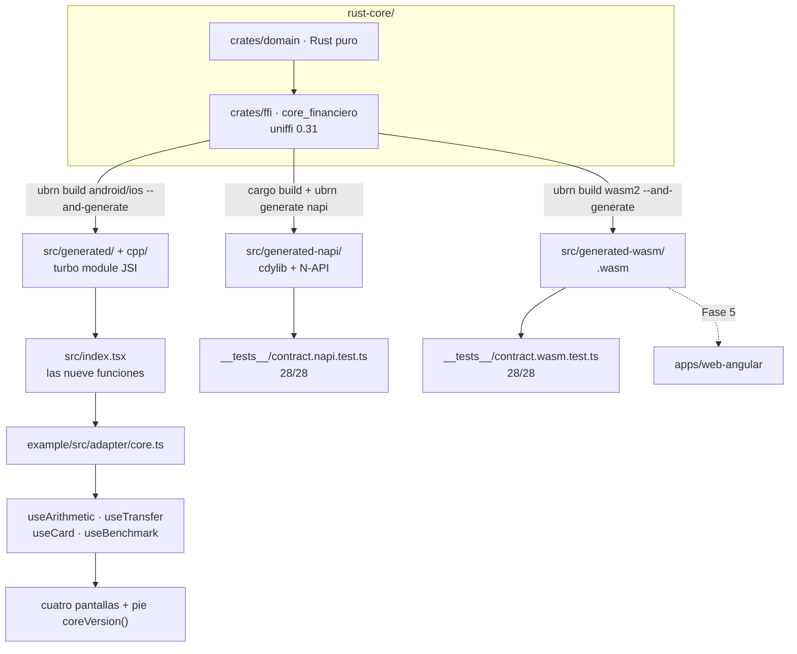

# Fase 4 — `apps/react-native`: plan de implementación

> **For agentic workers:** REQUIRED SUB-SKILL: Use superpowers:subagent-driven-development (recommended) or superpowers:executing-plans to implement this plan task-by-task. Steps use checkbox (`- [ ]`) syntax for tracking.

**Goal:** Construir el tercer consumidor de `rust-core` —una librería React Native con turbo module vía `ubrn` más una app de demo en `example/`— que pasa el test de contrato 28/28 por dos rutas y produce el paquete WASM que consumirá la Fase 5.

**Architecture:** `rust-core` baja a uniffi 0.31 porque `ubrn` fija `=0.31` (paso cero, con re-verificación de Android e iOS). Después, `apps/react-native` es una librería `create-react-native-library` tipo turbo module: posee la frontera nativa (`cpp/`, `src/generated*/`, podspec, `CMakeLists.txt`) y expone una sola superficie de nueve funciones TypeScript; `example/` tiene las cuatro pantallas y nunca importa uniffi. Tres flavours generados en tres directorios separados: JSI para la app, N-API y `wasm2` para los dos tests de contrato.

**Tech Stack:** Rust 1.98.1 · uniffi 0.31.2 · uniffi-bindgen-react-native 0.31.0-5 (`ubrn`) · React Native 0.87.0 · React (el peer de RN 0.87) · TypeScript · Jest · pnpm 11.21.x · Node 22.16

**Spec:** [docs/superpowers/specs/2026-09-11-phase-4-app-react-native-design.md](../specs/2026-09-11-phase-4-app-react-native-design.md)

## Global Constraints

Valen en **todas** las tareas. Los requisitos de cada tarea incluyen implícitamente esta sección.

- **Identificadores en inglés** — archivos, carpetas, funciones, tipos, campos, variables, constantes y nombres de test. Contenido de documentación, comentarios, textos de UI y **mensajes de commit: español**.
- **Commits en Conventional Commits, en español**, con scope = subproyecto: `feat(react-native):`, `chore(rust-core):`, `docs(android):`, `test(react-native):`.
- **Ningún tipo de punto flotante toca un monto. Nunca.** Prohibidos `number`, `parseFloat`, `Number()`, `+` aritmético y cualquier operador aritmético sobre montos — **tampoco en tests**. Única excepción: `__benchmarks__/baseline.ts` y `example/src/benchmark/NativeBaseline.ts`, aislados en su archivo y **con el comentario que dice por qué existen**.
- **Cero reglas de negocio fuera de `rust-core`.** Ninguna validación de CCI con regex, ningún Luhn, ninguna tasa, ninguna fórmula. Los filtros de texto de los campos **no** son reglas de negocio: operan sobre el string y no parsean.
- **Ninguna librería de decimales** (`decimal.js`, `big.js`, etc.). Necesitarla es señal de que el cálculo está en el lugar equivocado.
- **Sin red, sin persistencia, sin I/O.** `async` sólo para el `simulatedLatencyMs` de la transferencia y para el benchmark.
- **Las comparaciones del contrato son igualdad exacta de strings** (`toBe`), nunca comparación numérica con tolerancia.
- **`src/generated/`, `src/generated-napi/` y `src/generated-wasm/` son artefactos**: nunca se editan a mano, nunca se commitean modificados, van al `.gitignore`.
- **Los labels exactos y el orden de campos son normativos** y viven en [`docs/ui-spec.md`](../../ui-spec.md). Cambiar un label obliga a cambiarlo en las cuatro apps y en ese archivo, en el mismo cambio. No se duplica la lista en ningún otro lado.
- **Los montos de los mensajes de error van CRUDOS**, tal como los devuelve el core. Nada de `Intl.NumberFormat` ahí.
- **El `message` del binding es diagnóstico, nunca texto de usuario.** Los nueve textos de usuario viven en `contracts/messages.es.json`.
- **Versiones fijas:** `react-native` **0.87.0** · `react` el peer que declare RN 0.87 · `@react-native-community/cli` 20.1.0 · `uniffi-bindgen-react-native` 0.31.0-5 · `@ubjs/core` y `@ubjs/node` 0.31.0-5 · Node ≥22 · pnpm 11.21.x.
- **`contracts/cases.json` está en v2.3.0** con 28 casos: `aritmetica` 6, `cci` 4, `itf` 5, `tarjeta` 6, `transferencia` 7, más `cuentas_iniciales` 2. Moneda `PEN`.
- **Corregir un valor esperado de `cases.json` va SIEMPRE en su propio commit**, con la justificación aritmética en el mensaje, nunca mezclado con cambios al core. En esta fase **no se espera corregir ninguno**: si uno falla, el sospechoso es el código, no el contrato.
- **No se inventan reglas de dominio.** Si un caso de negocio no está en `cases.json`, no se implementa: se pregunta.

## Gates por tarea

Cada tarea pasa por los cuatro, en este orden, antes de darse por terminada: **TDD** (el test
se escribe primero y se lo ve fallar) → **`/simplify`** → **`superpowers:requesting-code-review`**
→ **`superpowers:verification-before-completion`**. `/security-review` **no** es gate en esta
fase: `docs/superpowers/skills-by-phase.md` lo reserva para `rust-core`, porque las apps son
cascarones sin red ni persistencia.

## Estructura de archivos

Qué se crea y de qué responde cada cosa. Fija las fronteras antes de la primera tarea.

| Archivo | Responsabilidad |
|---|---|
| `rust-core/Cargo.toml` | baja `uniffi` de `"0.32"` a `"0.31"` (T1) |
| `rust-core/PENDING.md` | registra el techo: el core queda anclado a 0.31 por ubrn (T1) |
| `apps/android/PENDING.md` · `apps/ios/PENDING.md` | reciben las recomendaciones de la evaluación técnica (T4) |
| `apps/react-native/ubrn.config.yaml` | dónde está el Rust y dónde van los bindings de cada flavour |
| `apps/react-native/package.json` | el paquete: nombre, `codegenConfig`, scripts de `ubrn`, dependencias |
| `apps/react-native/src/index.tsx` | **la única superficie pública**: reexporta las nueve funciones |
| `apps/react-native/src/generated/` | bindings JSI · artefacto |
| `apps/react-native/src/generated-napi/` | bindings N-API · artefacto |
| `apps/react-native/src/generated-wasm/` | bindings `wasm2` + `.wasm` · artefacto |
| `apps/react-native/__tests__/contractFixtures.ts` | carga `cases.json` y `messages.es.json` y los tipa. Una sola copia para las dos rutas |
| `apps/react-native/__tests__/contract.napi.test.ts` | 28 casos + 5 guardias, ruta N-API |
| `apps/react-native/__tests__/contract.wasm.test.ts` | 28 casos + 5 guardias, ruta WASM |
| `apps/react-native/__benchmarks__/baseline.ts` | la baseline TS del test en rojo intencional. **Excepción comentada** |
| `example/src/adapter/core.ts` | reexporta el paquete. Único punto de contacto con el core |
| `example/src/adapter/ContractMessages.ts` | `e.tag` → nombre del contrato → texto de `messages.es.json`. `switch` exhaustivo con `never`. **Producción**, y el test lo reusa |
| `example/src/contract/sources.ts` | carga de `cases.json` (para `cuentas_iniciales`) y `messages.es.json` |
| `example/src/format/money.ts` | `S/` y separadores, **sobre el string**, sólo al pintar |
| `example/src/ui/components/` | `ScreenHeader` · `LabeledField` · `ResultRow` · `SectionDivider` · `CoreVersionFooter` |
| `example/src/screens/<feature>/` | `XxxScreen.tsx` + `XxxUiState.ts` + `useXxx.ts` por pantalla |
| `example/src/benchmark/NativeBaseline.ts` | la baseline nativa de la pantalla. **Excepción comentada** |
| `apps/react-native/README.md` · `BUILD.md` · `TESTING.md` · `PENDING.md` | la documentación, partida por pregunta desde el principio |

---

## Bloque 0 — `rust-core` y el gate de regresión

Nada de TypeScript existe hasta que este bloque esté entero en verde. Bajar el core y descubrir tres días después que rompió Android sería el peor momento posible para enterarse.

### Task 1: Bajar `rust-core` a uniffi 0.31 y escribir el techo

**Files:**
- Modify: `rust-core/Cargo.toml` (línea del `uniffi` en `[workspace.dependencies]`)
- Modify: `rust-core/Cargo.lock` (lo reescribe cargo)
- Modify: `rust-core/PENDING.md`
- Modify: `rust-core/CONTEXT.md` (la línea de la versión de uniffi)

**Interfaces:**
- Consumes: nada.
- Produces: un workspace en uniffi 0.31.2 con los 67 tests en verde. Todas las tareas siguientes dependen de esto.

**Contexto que el implementador necesita:** `ubrn` fija `uniffi = "=0.31"` en su propio `Cargo.toml`, y también en su rama `main`. El encoding de metadata cambió entre 0.31 y 0.32 —0.32 escribe un `orig_name: Option<String>` extra por función y record— pero `UNIFFI_CONTRACT_VERSION` sigue en `30` en las dos, así que el choque **no avisa con un error de versión**: se manifiesta como parseo corrupto. Por eso hay que bajar, no confiar en que "quizás funcione".

- [ ] **Step 1: Ver el estado de partida**

```bash
cd rust-core
grep -n '^uniffi' Cargo.toml
# uniffi = "0.32"
```

- [ ] **Step 2: Bajar la versión**

En `rust-core/Cargo.toml`, dentro de `[workspace.dependencies]`, cambiar exactamente esta línea:

```toml
uniffi = "0.32"
```

por:

```toml
# Anclado a 0.31 por uniffi-bindgen-react-native, que fija `=0.31`. Ver PENDING.md.
uniffi = "0.31"
```

- [ ] **Step 3: Resolver dependencias y comprobar a qué patch cayó**

```bash
cd rust-core
cargo update -p uniffi
grep -n -A2 '^name = "uniffi"$' Cargo.lock
```

Qué se debe ver: `version = "0.31.2"`. No hay que clavar el patch — desde `0.31.0-5` ubrn acepta cualquier `0.31.x`.

- [ ] **Step 4: Correr la suite completa**

```bash
cd rust-core
cargo test --workspace
```

Qué se debe ver: **67 passed, 0 failed**, repartidos así — 3 del lib de `core_financiero`, 11 de `tests/contract.rs` (que expanden los 28 vectores), 47 del lib de `domain`, 6 de `tests/properties.rs`.

Si `the_version_has_semver_and_sha` falla diciendo `1.0.0+sin-git`, **no es este cambio**: es que el build corrió fuera de un checkout de git. Verificar que se está dentro del repo.

- [ ] **Step 5: Clippy y formato, que son gate del core**

```bash
cd rust-core
cargo clippy --workspace --all-targets -- -D warnings
cargo fmt --all --check
```

Qué se debe ver: ambos sin salida y con código 0.

- [ ] **Step 6: Escribir el techo en `PENDING.md`**

Añadir a `rust-core/PENDING.md`, dentro de la sección `## Deuda técnica conocida`, esta entrada completa:

```markdown
### El core está anclado a uniffi 0.31, y lo ancla React Native

`uniffi` no puede subir a 0.32 mientras la Fase 4 dependa de
`uniffi-bindgen-react-native`, que fija `uniffi = "=0.31"` en su `Cargo.toml` — en su último
release publicado (`0.31.0-5`, 2026-08-21) **y en su rama `main`**.

**Por qué no se puede ignorar el pin.** `UNIFFI_CONTRACT_VERSION` vale `30` tanto en 0.31 como
en 0.32, así que la incompatibilidad **no llega como un error de versión**. El encoding de
metadata sí cambió: 0.32 escribe un `orig_name: Option<String>` extra por función y por record,
y reasignó códigos de tipo (`TYPE_BOX` 26 y `TYPE_HASH_SET` 27 donde 0.31 tenía
`TYPE_CALLBACK_TRAIT_INTERFACE` 25). Un lector 0.31 sobre bytes 0.32 se desincroniza y falla
tarde y mal.

**Qué cuesta estar en 0.31: nada medible.** Este crate usa sólo `setup_scaffolding!`,
`uniffi::Error`, `uniffi::Record` y `#[uniffi::export]` sobre funciones libres — nada de
objetos, traits, callbacks ni async—, y todo eso existe igual en 0.31. Verificado al bajar: los
67 tests siguen en verde, el contrato sigue 28/28, y las API públicas generadas para Kotlin y
Swift son **idénticas** a las de 0.32 (mismas nueve funciones, mismas subclases de
`DomainException`, mismos campos de los Records, y `DomainError` conservando `LocalizedError`
en Swift). Ni Android ni iOS tocaron una línea de código de app.

**Condición para desanclar:** que ubrn cierre
[su issue #449](https://github.com/jhugman/uniffi-bindgen-react-native/issues/449) y publique
`0.32.0-6`. Al 2026-09-11 ese issue está abierto, sin asignar y con cero comentarios desde el
2026-08-21, y su autor presupuesta la migración como *"real migration rather than a dependency
bump"*: el cambio de `[ByRef] bytes` a `ForeignBytes` toca 22 sitios en cuatro flavours.
Cuando salga, subir las dos versiones a la vez —el core y ubrn— y volver a correr los tres
gates: los 67 de aquí, los 43 de Android y los 47 de iOS.
```

- [ ] **Step 7: Alinear `rust-core/CONTEXT.md`**

```bash
grep -n "0\.32" rust-core/CONTEXT.md
```

Cada acierto que nombre la versión de uniffi pasa a **0.31**, con un puntero a `PENDING.md` para
el porqué. El CONTEXT es la spec de entrada del core: si dice 0.32 mientras el `Cargo.toml` dice
0.31, la próxima persona va a creerle al equivocado.

- [ ] **Step 8: Commit**

```bash
git add rust-core/Cargo.toml rust-core/Cargo.lock rust-core/PENDING.md rust-core/CONTEXT.md
git commit -m "chore(rust-core): el core baja a uniffi 0.31, que es lo que ubrn puede leer

uniffi-bindgen-react-native fija uniffi = \"=0.31\" en su release publicado y
en su rama main, y el issue #449 que lo subiría a 0.32 está abierto y sin
empezar. El choque no avisa limpio: UNIFFI_CONTRACT_VERSION vale 30 en las
dos versiones, pero el encoding de metadata cambió, así que un lector 0.31
sobre bytes 0.32 se desincroniza en vez de dar un error de versión.

Bajar no cuesta nada medible: este crate usa sólo la superficie más vieja de
uniffi. Los 67 tests siguen en verde y el contrato sigue 28/28.

El techo queda escrito en PENDING.md con la condición para desanclarlo."
```

### Task 2: Regenerar Android sobre el core 0.31 y volver a 43/43

**Files:**
- Modify (regenerado, gitignorado): `apps/android/app/src/main/jniLibs/{arm64-v8a,armeabi-v7a,x86_64}/libcore_financiero.so`
- Modify (regenerado, gitignorado): `apps/android/app/src/main/java/uniffi/core_financiero/core_financiero.kt`

**Interfaces:**
- Consumes: el workspace en uniffi 0.31.2 de la Task 1.
- Produces: la evidencia de que la bajada no rompió Android. Ninguna tarea posterior consume código de aquí; consumen la **confianza**.

**Contexto:** los comandos son los de [`apps/android/BUILD.md`](../../../apps/android/BUILD.md), copiados tal cual. Dos trampas ya documentadas ahí: `uniffi-bindgen` **no puede leer metadata de un `.so` de Android** (falla con *"No UniFFI metadata found"*), hay que darle el `.dylib` del host; y el NDK debe ser r27+ o la librería crashea al cargar en dispositivos con páginas de 16 KB.

- [ ] **Step 1: Recompilar las tres `.so`**

```bash
cd rust-core
export ANDROID_NDK_HOME="$HOME/Library/Android/sdk/ndk/30.0.16248370"
cargo ndk -t arm64-v8a -t armeabi-v7a -t x86_64 \
  -o ../apps/android/app/src/main/jniLibs build --release -p core_financiero
```

- [ ] **Step 2: Recompilar el artefacto del host y regenerar los bindings Kotlin**

```bash
cd rust-core
cargo build --release
cargo run --quiet --bin uniffi-bindgen -- generate \
  --library target/release/libcore_financiero.dylib \
  --language kotlin --out-dir ../apps/android/app/src/main/java
```

- [ ] **Step 3: Verificar que las nueve funciones cruzaron**

```bash
KT=apps/android/app/src/main/java/uniffi/core_financiero/core_financiero.kt
for f in add subtract calculateItf validateCci validateCard \
         encrypt decrypt executeTransfer coreVersion; do
  printf "%-18s %s\n" "$f" "$(grep -c "fun \`$f\`(" $KT)"
done
```

Qué se debe ver: **`1` en las nueve**. Un `0` en cualquiera significa que el bindgen leyó metadata que no entendió, y entonces el problema es la Task 1, no esta.

- [ ] **Step 4: Correr la suite de JVM**

```bash
cd apps/android
./gradlew :app:testDebugUnitTest
```

Qué se debe ver: **28 passed**.

- [ ] **Step 5: Correr la suite instrumentada, que es la que cruza el FFI**

```bash
cd apps/android
adb devices     # debe listar un dispositivo o emulador en estado `device`
./gradlew :app:connectedDebugAndroidTest
```

Qué se debe ver: **15 passed**, de los cuales 9 son el test de contrato. Total de la app: **43**.

Ésta es la prueba que importa: es la única que ejecuta `System.loadLibrary`, la resolución de símbolos de JNA y el `strip` del perfil release sobre el core nuevo.

- [ ] **Step 6: Commit**

Los artefactos están gitignorados, así que **este paso normalmente no tiene nada que commitear**. Comprobarlo y dejar constancia:

```bash
git status --short apps/android
```

Si sale vacío: no se commitea nada y se anota el resultado en el ledger de ejecución. Si aparece algún archivo, es que algo generado **no** está gitignorado — arreglar el `.gitignore` y commitear sólo eso:

```bash
git add apps/android/.gitignore
git commit -m "chore(android): un artefacto generado se estaba versionando"
```

### Task 3: Regenerar iOS sobre el core 0.31 y volver a 47/47

**Files:**
- Modify (regenerado, gitignorado): `apps/ios/CoreFinanciero.xcframework/`
- Modify (regenerado, gitignorado): `apps/ios/Generated/include/`, `apps/ios/ios-rust-test/Generated/core_financiero.swift`

**Interfaces:**
- Consumes: el workspace en uniffi 0.31.2 de la Task 1.
- Produces: la evidencia de que la bajada no rompió iOS.

**Contexto:** comandos de [`apps/ios/BUILD.md`](../../../apps/ios/BUILD.md). La trampa documentada: uniffi emite el modulemap con **otro nombre** (`core_financieroFFI.modulemap`) y hay que copiarlo como `module.modulemap` dentro de `Generated/include`, o el XCFramework no expone nada.

- [ ] **Step 1: Recompilar los dos slices y el artefacto del host**

```bash
cd rust-core
export PATH="$HOME/.cargo/bin:$PATH"
cargo build --release --target aarch64-apple-ios
cargo build --release --target aarch64-apple-ios-sim
cargo build --release          # el artefacto del HOST, sólo para bindgen
```

- [ ] **Step 2: Regenerar los bindings Swift**

```bash
cd rust-core
cargo run --bin uniffi-bindgen -- generate \
  --library target/release/libcore_financiero.a \
  --language swift --out-dir ../apps/ios/Generated
```

- [ ] **Step 3: Rearmar el directorio de headers con el renombre**

```bash
cd apps/ios
mkdir -p Generated/include ios-rust-test/Generated
mv Generated/core_financiero.swift     ios-rust-test/Generated/
mv Generated/core_financieroFFI.h      Generated/include/
cp Generated/core_financieroFFI.modulemap Generated/include/module.modulemap
ls Generated Generated/include ios-rust-test/Generated
```

- [ ] **Step 4: Rearmar el XCFramework con los dos slices**

```bash
cd rust-core
rm -rf ../apps/ios/CoreFinanciero.xcframework
xcodebuild -create-xcframework \
  -library target/aarch64-apple-ios/release/libcore_financiero.a \
  -headers ../apps/ios/Generated/include \
  -library target/aarch64-apple-ios-sim/release/libcore_financiero.a \
  -headers ../apps/ios/Generated/include \
  -output ../apps/ios/CoreFinanciero.xcframework
```

- [ ] **Step 5: Correr la suite en simulador**

```bash
cd apps/ios
xcodebuild test -project ios-rust-test.xcodeproj -scheme ios-rust-test \
  -destination 'platform=iOS Simulator,name=iPhone 17 Pro'
```

Qué se debe ver: `** TEST SUCCEEDED **` y `Test run with 47 tests in 12 suites passed`.

- [ ] **Step 6: Correr la suite sobre hardware real**

```bash
cd apps/ios
xcodebuild test -project ios-rust-test.xcodeproj -scheme ios-rust-test \
  -destination 'id=<identificador del aparato>' -allowProvisioningUpdates
```

Mismo conteo, mismo verde. Es lo único que ejercita el slice `aarch64-apple-ios`, que es **el que se embarca** y es un binario distinto del de simulador.

Si el perfil venció —la cuenta de desarrollador es gratuita y los perfiles duran 7 días—, `-allowProvisioningUpdates` lo regenera; la primera vez por certificado hay que confiarlo en el aparato desde *Ajustes → General → VPN y Gestión de Dispositivos*. Los mensajes de error exactos están en `apps/ios/TESTING.md`.

**Si no hay aparato disponible**, anotarlo explícitamente en el ledger de ejecución y seguir: el verde de simulador más el verde de Android de la Task 2 son evidencia suficiente para continuar, pero el gate queda **parcialmente cumplido** y hay que cerrarlo antes de la demo.

- [ ] **Step 7: Commit**

Igual que en la Task 2: los artefactos están gitignorados y normalmente no hay nada que commitear.

```bash
git status --short apps/ios
```

### Task 4: Transferir la evaluación técnica de Android a los `PENDING.md`

**Files:**
- Modify: `apps/android/PENDING.md` (nueva sección antes de `## Fuera de alcance por diseño`)
- Modify: `apps/ios/PENDING.md` (nueva entrada dentro de `## Deuda técnica medible`)
- Delete: `docs/android-rust-core-evaluation.md` (**sólo en el Step 4**, y sólo si el Step 3 pasa)

**Interfaces:**
- Consumes: nada.
- Produces: nada que el código use. Produce que siete recomendaciones dejen de vivir en un archivo sin versionar.

**Contexto:** `docs/android-rust-core-evaluation.md` es un **documento de trabajo local, deliberadamente no versionado**: se escribió para ser leído y destilado, no para vivir en el repo. Hoy `git status` lo marca `??` y ningún archivo del repo lo menciona. **No se commitea.** Lo que se transfiere es su contenido.

**No se aplica ninguna recomendación.** Modularizar Android o iOS es trabajo de sus fases, en su propia rama.

- [ ] **Step 1: Leer el documento y su matriz de recomendaciones**

```bash
sed -n '213,226p' docs/android-rust-core-evaluation.md
```

Las siete filas, con su prioridad: Tecnología FFI (mantener UniFFI, sin prioridad), Estructura de Módulos (**Alta**), Pipeline de Build (Media), Archivos Generados (Media), Filtros de ABI (**Alta**), Estabilidad Compose (Media), Ciclo de Vida (Baja en POC / Alta en producción).

- [ ] **Step 2: Escribir la sección en `apps/android/PENDING.md`**

Insertar en `apps/android/PENDING.md`, **antes** de `## Fuera de alcance por diseño`:

```markdown
## Camino a producción: lo que una evaluación técnica marcó

Estas siete no son defectos de la POC: son la distancia entre una POC correcta y una app de
producción. Ninguna bloquea la demo. Salieron de una evaluación técnica de la integración
`rust-core` ↔ Android, y se anotan aquí porque **una recomendación que vive sólo en una
conversación no existe**.

| # | Hoy | Recomendación | Prioridad |
|---|---|---|---|
| 1 | UniFFI 0.31 + JNA Direct | **Mantener UniFFI.** JNI puro bajaría la latencia de ~150-450 µs a <5 µs, pero obliga a mantener a mano las firmas `Java_dev_...` y los bindings de las cuatro plataformas. El riesgo de desincronización pasa de mínimo a alto | — |
| 2 | Monolito en `:app` | **Extraer `:core-financiero` como Android Library.** `:app` deja de conocer JNA y de ver las `.so`; los cambios de UI no reevalúan la capa FFI; y si algún día se adopta KMP, `:core-financiero` se vuelve el `androidMain` sin tocar la UI | **Alta** |
| 3 | Comandos manuales de terminal | **Automatizar `cargo ndk` y `uniffi-bindgen` como tareas Gradle `Exec`** | Media |
| 4 | Generados en `src/main/` | **Generar en `build/generated/`**, que es donde el sistema de build sabe que son artefactos | Media |
| 5 | Todos los ABI de JNA | **Configurar `ndk.abiFilters`** con los tres que se usan | **Alta** |
| 6 | `@Immutable` a mano sobre los `var` de uniffi | **Regla de lint, o mappers inmutables con `val`** | Media |
| 7 | `remember` volátil | **`viewModel()` / `rememberSaveable`** para sobrevivir a la rotación | Baja en POC / Alta en producción |

La #2 es la que más lejos llega, y **`apps/react-native` ya nace con ella**: su librería es la
frontera nativa y su `example/` es la app, que nunca importa uniffi. Es el mismo desacople,
conseguido por frontera de paquete en vez de módulo Gradle. Ver
[apps/react-native/README.md](../react-native/README.md).

La #7 ya está anotada arriba, en "El estado no sobrevive a la rotación".
```

- [ ] **Step 3: Escribir la entrada en `apps/ios/PENDING.md`**

Insertar en `apps/ios/PENDING.md`, dentro de `## Deuda técnica medible`:

```markdown
### La app es un solo target, y el argumento para partirla vale igual que en Android

Una evaluación técnica de Android marcó como prioridad **Alta** extraer la capa FFI a su propio
módulo, para que la capa de presentación no conozca ni el binario nativo ni los bindings
generados. Aquí la situación es la misma —`ios-rust-test` es un único target que contiene el
`Generated/`, el XCFramework, el adapter y las cuatro pantallas— y los tres beneficios se
trasladan sin cambios: aislamiento, caché de compilación, y que un futuro `androidMain`/`iosMain`
de KMP tenga dónde encajar sin tocar la UI.

Aquí además cerraría el hueco ya anotado en "El seam de `CoreFinanciero` es más débil que en
Android": si `Generated/` y el XCFramework vivieran en otro target, un test de presentación que
intentara llamar al core real **no compilaría**, y la disciplina dejaría de depender de la
revisión.

No se hace en la Fase 4: es trabajo de iOS, en su propia rama. `apps/react-native` sí nace ya
con esa separación, y sirve de referencia de a qué se parece.
```

- [ ] **Step 4: Comprobar que la transferencia está completa y recién entonces borrar**

El criterio de "transferido" es que **el documento original se pueda borrar sin perder nada**. Comprobarlo leyendo las dos secciones nuevas y preguntándose, recomendación por recomendación, si alguien que nunca vio el documento entendería qué hay que hacer y por qué.

```bash
grep -c "Camino a producción" apps/android/PENDING.md     # 1
grep -c "vale igual que en Android" apps/ios/PENDING.md   # 1
rm docs/android-rust-core-evaluation.md
git status --short docs/                                   # el `??` desaparece
```

- [ ] **Step 5: Commit**

```bash
git add apps/android/PENDING.md apps/ios/PENDING.md
git commit -m "docs(android): las siete recomendaciones de la evaluación pasan a los PENDING

Vivían sólo en docs/android-rust-core-evaluation.md, un documento de trabajo
sin versionar que ningún archivo del repo mencionaba: dos recomendaciones de
prioridad Alta estaban a un git clean de desaparecer.

Se transfieren a apps/android/PENDING.md las siete con su prioridad, y a
apps/ios/PENDING.md la de modularización, cuyo argumento vale igual ahí y
además cerraría el hueco del seam ya anotado. No se aplica ninguna: eso es
trabajo de sus fases. El documento original se borra, que es la prueba de que
la transferencia está completa."
```

---

## Bloque 1 — El puente

El primer commit no es una pantalla. Es la cadena entera hasta llamar a `coreVersion()`.

### Task 5: Corregir la documentación que esta fase contradice

**Files:**
- Modify: `CLAUDE.md` (la fila de la Fase 4 en la tabla de toolchain)
- Modify: `apps/react-native/CONTEXT.md` (secciones `Configuración`, `Estructura`, y las dependencias)

**Interfaces:**
- Consumes: nada.
- Produces: un CONTEXT que describe lo que la fase va a construir. Todas las tareas siguientes lo leen como spec de entrada.

**Contexto:** el CONTEXT se escribió antes de que `ubrn` estuviera instalado, así que describe un proyecto único y el flavour de WASM viejo. Corregirlo **antes** de construir evita que el implementador siga instrucciones que contradicen el diseño. Cada corrección tiene su evidencia.

- [ ] **Step 1: Verificar el error de `CLAUDE.md` antes de corregirlo**

```bash
npx ubrn --version
```

Qué se debe ver: **`npm error 404 Not Found - GET https://registry.npmjs.org/ubrn`**. No existe un paquete npm llamado `ubrn`: el binario lo trae `uniffi-bindgen-react-native`.

- [ ] **Step 2: Corregir la tabla de toolchain de `CLAUDE.md`**

En la tabla "Toolchain incremental", la fila de la Fase 4 dice hoy:

```markdown
| 4 | `uniffi-bindgen-react-native` en `apps/react-native` | `npx ubrn --version` |
```

Cambiarla por:

```markdown
| 4 | `uniffi-bindgen-react-native` 0.31.0-5 en `apps/react-native` (trae el CLI `ubrn`, que se compila con cargo al primer uso) | desde `apps/react-native/`: `pnpm exec ubrn --version` |
```

- [ ] **Step 3: Corregir el `Estructura` de `apps/react-native/CONTEXT.md`**

Reemplazar el bloque de `## Estructura` entero por:

```markdown
## Estructura

Este proyecto es **una librería con una app de demo adentro**, no una app suelta. `ubrn` genera
archivos de librería —`codegenConfig` en `package.json`, un podspec, un `android/build.gradle`,
un `CMakeLists.txt` y un `index.tsx` que es *el entrypoint de la librería*—, y ésa es además la
frontera que la Fase 5 necesita: Angular consume un paquete instalable, no una app.

    apps/react-native/            el paquete
    ├── src/
    │   ├── generated/            bindings JSI · NO EDITAR
    │   ├── generated-napi/       bindings N-API · NO EDITAR
    │   ├── generated-wasm/       bindings wasm2 + .wasm · NO EDITAR
    │   └── index.tsx             entrypoint: las nueve funciones
    ├── __tests__/                contrato N-API · contrato WASM · guardias
    ├── __benchmarks__/baseline.ts
    └── example/                  LA APP DE LA DEMO
        └── src/
            ├── adapter/ contract/ format/
            ├── ui/components/
            ├── screens/          arithmetic · transfer · card · benchmark
            └── benchmark/        NativeBaseline.ts

**Son tres directorios generados y no uno**, porque son tres flavours del mismo core. Mezclarlos
sería el modo de fallar más caro de esta fase: un test en verde contra bindings que no son los
que la app embarca.

`example/` **nunca importa uniffi**: importa el paquete. Ése es el mismo desacople que la
evaluación técnica de Android pide para `:app` frente a `:core-financiero`, conseguido por
frontera de paquete en vez de módulo Gradle.
```

- [ ] **Step 4: Corregir la `Configuración` del CONTEXT**

El bloque de `ubrn.config.yaml` del CONTEXT usa `web: wasmCrateName:`, que pertenece al flavour **viejo** de WASM. Reemplazar ese bloque y el de scripts por:

```markdown
`ubrn.config.yaml` en la raíz del proyecto:

    rust:
      directory: ../../rust-core
      manifestPath: crates/ffi/Cargo.toml
    bindings:
      cpp: cpp/bindings
      ts: src/generated
    android:
      targets: [arm64-v8a, armeabi-v7a, x86_64]

El WASM se produce con el flavour **`wasm2`**, que compila el crate una sola vez para
`wasm32-unknown-unknown` y lee la metadata de uniffi del propio `.wasm`. No genera crate shim y
su salida es neutral respecto del entorno: el mismo bundle sirve para Node, navegador y React
Native. Requisitos que `ubrn build wasm2` valida por adelantado: que el crate produzca `cdylib`,
que enlace `uniffi-runtime-wasm`, y que declare `uniffi_core` con el feature `single-threaded`.

Scripts en `package.json`:

    "ubrn:android": "ubrn build android --and-generate",
    "ubrn:ios": "ubrn build ios --and-generate && (cd example/ios && pod install)",
    "ubrn:wasm": "ubrn build wasm2 --and-generate",
    "ubrn:clean": "rm -rf cpp/ src/generated src/generated-napi src/generated-wasm"

Dependencias que el código generado necesita, y que no son opcionales:

| Paquete | Para qué |
|---|---|
| `uniffi-bindgen-react-native` | el CLI `ubrn` **y** el runtime C++/JSI contra el que compila el turbo module. Dependencia regular, no de desarrollo |
| `@ubjs/core` | el runtime TypeScript —converters de FFI, `RustBuffer`, polyfills— que importa todo lo generado, en los tres flavours |
| `@ubjs/node` | el addon N-API que carga el `cdylib` para el test de contrato del host |
```

- [ ] **Step 5: Commit**

```bash
git add CLAUDE.md apps/react-native/CONTEXT.md
git commit -m "docs(react-native): el CONTEXT describía un proyecto que ubrn no genera

Tres correcciones, todas verificadas antes de escribirlas:

- CLAUDE.md daba 'npx ubrn --version' como verificación de la Fase 4, y eso
  falla con E404: no existe un paquete npm llamado ubrn, el binario lo trae
  uniffi-bindgen-react-native.
- La Estructura dibujaba un proyecto único con src/screens junto a
  src/generated. ubrn genera archivos de librería, y además la Fase 5
  necesita un paquete instalable, no una app: pasa a librería + example/.
- La Configuración usaba web.wasmCrateName, que es del flavour viejo de
  WASM, y no mencionaba @ubjs/core ni @ubjs/node, que hoy son dependencias
  obligatorias del código generado."
```

### Task 6: Levantar el proyecto, instalar `ubrn` y verificar que el CLI responde

**Files:**
- Create: `apps/react-native/` (scaffolding de `create-react-native-library`)
- Create: `pnpm-workspace.yaml` (raíz del repo)
- Modify: `.gitignore` (raíz del repo)

**Interfaces:**
- Consumes: nada del código anterior.
- Produces: un paquete `apps/react-native` con `pnpm exec ubrn --version` respondiendo. Las Tasks 7 en adelante lo usan.

**Por qué 0.87.0 y no la del `stack.png`.** RN 0.87.0 salió el **2026-08-11** y ubrn 0.31.0-5 el **2026-08-21**, diez días después. El CHANGELOG de ubrn dice que su matriz de CI es *date-derived* y que los checks per-PR corren «the latest versions only»: o sea que **0.87.0 es, con alta probabilidad, la versión contra la que ubrn probó al publicarse**. El `stack.png` del usuario fija 0.85.3, que sólo entra en el barrido histórico nocturno — red más floja. **No 0.87.1**: salió el 2026-08-26, cinco días *después* de ubrn, y nadie las probó juntas. Queda anotado en `PENDING.md` que el stack corporativo está dos minors atrás, con un preset privado (`@mbbk/react-native-preset`, perfil `"0.85"`) que este entorno no puede resolver.

**Riesgo declarado:** `create-react-native-library` está en **0.63.1** y el tutorial de ubrn se probó con 0.35.1 y 0.42.3 sobre RN 0.75/0.76. **Si hay drift, se baja a la versión que ubrn cubra y se documenta el porqué en `BUILD.md`** — no se pelea con el scaffolding.

`ubrn` **no es un binario prebuilt**: su `bin/cli.cjs` hace `cargo run --manifest-path node_modules/.../ubrn_cli/Cargo.toml`. La primera invocación compila un proyecto Rust entero y tarda varios minutos, mostrando *"🤖 Building the uniffi-bindgen-react-native command… this is only needed first time"*. Eso es esperado, no un cuelgue.

- [ ] **Step 1: Subir pnpm a la versión del stack**

```bash
corepack prepare pnpm@11.21.0 --activate
pnpm --version
```

Qué se debe ver: `11.21.0`. Hoy hay 11.1.3 instalado.

- [ ] **Step 2: Generar el scaffolding**

```bash
cd apps
npx create-react-native-library@0.63.1 react-native
```

Respuestas exactas en el asistente:

| Pregunta | Respuesta |
|---|---|
| npm package name | `@banco/core-financiero` |
| description | `Núcleo financiero en Rust para React Native y la web` |
| package author | el del repo |
| type of library | **Turbo module** |
| languages | **C++ for Android & iOS** |
| example app | **Vanilla** |

El nombre del paquete **no es decorativo**: `@banco/core-financiero` es el que el diagrama de `CLAUDE.md` ya tiene dibujado como lo que consume Angular en la Fase 5.

- [ ] **Step 3: Fijar las versiones del stack**

Editar `apps/react-native/example/package.json` para que las dependencias sean exactamente:

```json
"react": "<el peer que declare RN 0.87, leído de sus peerDependencies>",
"react-native": "0.87.0"
```

y `apps/react-native/package.json` para que `devDependencies` incluya `"@react-native-community/cli": "20.1.0"`. En `apps/react-native/package.json`, añadir el motor:

```json
"engines": { "node": ">=22" }
```

- [ ] **Step 4: Declarar el workspace en la raíz del repo**

Crear `pnpm-workspace.yaml` en la raíz:

```yaml
packages:
  - "apps/react-native"
  - "apps/react-native/example"
  - "apps/web-angular"       # todavía no existe; lo consumirá en la Fase 5
```

- [ ] **Step 5: Instalar las dependencias de ubrn**

```bash
cd apps/react-native
pnpm add uniffi-bindgen-react-native@0.31.0-5 @ubjs/core@0.31.0-5
pnpm add -D @ubjs/node@0.31.0-5
pnpm install
```

`uniffi-bindgen-react-native` y `@ubjs/core` van como dependencias **regulares**: la primera trae el runtime C++/JSI que el turbo module compila, y la segunda la importa el código generado en runtime.

- [ ] **Step 6: Verificar que el CLI responde — es el gate de esta tarea**

```bash
cd apps/react-native
export PATH="$HOME/.cargo/bin:$PATH"
pnpm exec ubrn --help
pnpm ls uniffi-bindgen-react-native
```

Qué se debe ver: la primera vez, `🤖 Building the uniffi-bindgen-react-native command…` y varios minutos de compilación; después, los subcomandos (`checkout`, `build`, `generate`) y `uniffi-bindgen-react-native@0.31.0-5`.

**No uses `--version`: este CLI no define ese flag** y responde `error: unexpected argument '--version' found`. Verificado sobre la versión instalada. La versión se comprueba con `pnpm ls`, no con el binario.

**Si falla porque no encuentra `cargo`**, es el `PATH`: `ubrn` necesita el toolchain de Rust, y el `PATH` de un shell no interactivo no siempre lo trae.

- [ ] **Step 6b: Confirmar que existen los tres subcomandos que la fase necesita**

```bash
cd apps/react-native
pnpm exec ubrn build --help      # android · ios · web · wasm2
pnpm exec ubrn generate --help   # jsi · napi · wasm · wasm2
```

No es ceremonia: **`build wasm2` y `generate napi` son dos apuestas del diseño** —el flavour de WASM que consume la Fase 5 y la ruta del test de contrato del host— y hasta acá eran supuestos leídos de notas de release. Si alguno falta, para y repórtalo: cambia el plan, no el código.

- [ ] **Step 7: Limpiar el scaffolding que no se usa**

`create-react-native-library` deja un módulo de ejemplo que `ubrn` va a reemplazar:

```bash
cd apps/react-native
rm -rf cpp/ android/src/main/java ios/ src/index.tsx src/Native*
```

- [ ] **Step 8: Gitignorar los artefactos**

Añadir a `.gitignore` de la raíz:

```gitignore
# apps/react-native — artefactos generados por ubrn, nunca a mano
apps/react-native/cpp/
apps/react-native/src/generated/
apps/react-native/src/generated-napi/
apps/react-native/src/generated-wasm/
apps/react-native/android/src/main/java/
node_modules/
```

- [ ] **Step 9: Commit**

```bash
git add -A
git commit -m "feat(react-native): el esqueleto del paquete, con ubrn respondiendo

create-react-native-library tipo turbo module, con la app de demo en
example/. El paquete se llama @banco/core-financiero porque es el que el
diagrama de CLAUDE.md ya tiene dibujado como lo que consume Angular.

ubrn no es un binario prebuilt: se compila con cargo en la primera
invocación. 'pnpm exec ubrn --version' responde, que es el gate de esta
tarea."
```

### Task 7: Generar los bindings JSI y contrastarlos contra las nueve funciones

**Files:**
- Create: `apps/react-native/ubrn.config.yaml`
- Create (generado): `apps/react-native/cpp/`, `apps/react-native/src/generated/`, `apps/react-native/android/src/main/java/`
- Create: `apps/react-native/BUILD.md`

**Interfaces:**
- Consumes: `ubrn` funcionando (Task 6), el core en uniffi 0.31 (Task 1).
- Produces: `src/generated/core_financiero.ts` (nombre a **confirmar** en el Step 3) exportando `add`, `subtract`, `calculateItf`, `validateCci`, `validateCard`, `encrypt`, `decrypt`, `executeTransfer`, `coreVersion`, más los tipos `Account`, `TransferRequest`, `TransferResult`, `ValidCci`, `ValidCard` y el error `DomainError`. Las Tasks 10 en adelante importan de ahí.

**Contexto:** el CONTEXT advierte que los nombres TypeScript están **derivados, no generados** — se dedujeron de la regla de uniffi ya verificada en Kotlin y Swift, no se leyeron de un binding real. Este es el momento de contrastarlos. Si algo difiere, **gana el archivo generado** y se corrige el CONTEXT.

- [ ] **Step 1: Escribir `ubrn.config.yaml`**

```yaml
rust:
  directory: ../../rust-core
  manifestPath: crates/ffi/Cargo.toml
bindings:
  cpp: cpp/bindings
  ts: src/generated
android:
  targets: [arm64-v8a, armeabi-v7a, x86_64]
```

- [ ] **Step 2: Construir y generar para Android**

```bash
cd apps/react-native
export PATH="$HOME/.cargo/bin:$PATH"
export ANDROID_NDK_HOME="$HOME/Library/Android/sdk/ndk/30.0.16248370"
pnpm exec ubrn build android --and-generate
```

Requisito ya cumplido en este entorno: NDK **r27 o superior** (hay 30.0.16248370). Con NDK anterior la librería compila pero crashea al cargar en dispositivos con páginas de 16 KB.

- [ ] **Step 3: Confirmar el nombre del archivo generado**

```bash
cd apps/react-native
ls src/generated/
```

El CONTEXT predice `core_financiero.ts`, derivado del nombre del crate. **Anotar el nombre real**: todos los imports de las tareas siguientes lo usan.

- [ ] **Step 4: Contrastar las nueve funciones — es el gate de esta tarea**

```bash
cd apps/react-native
TS=$(ls src/generated/*.ts | head -1)
for f in add subtract calculateItf validateCci validateCard \
         encrypt decrypt executeTransfer coreVersion; do
  printf "%-18s %s\n" "$f" "$(grep -c "export function $f" $TS)"
done
```

Qué se debe ver: **`1` en las nueve**. Un `0` significa que el nombre generado difiere del derivado — anotar cuál es el real y corregir el CONTEXT en el Step 6.

- [ ] **Step 5: Contrastar los cinco Records y sus campos**

```bash
cd apps/react-native
TS=$(ls src/generated/*.ts | head -1)
grep -nE "Account|TransferRequest|TransferResult|ValidCci|ValidCard" $TS | head -30
```

Qué hay que confirmar, campo por campo, contra la lista del CONTEXT: `Account {id, holder, balance}`, `TransferRequest {origin, destination, amount}`, `TransferResult {accounts, itfFee, totalDebited, receipt, simulatedLatencyMs}`, `ValidCci {bankCode, bankName, branch, account}`, `ValidCard {brand, masked}`.

**`simulatedLatencyMs` es el único número de toda la superficie.** Si aparece cualquier otro campo tipado `number`, es un monto mal tipado y hay que parar.

- [ ] **Step 6: Confirmar la forma del error**

```bash
cd apps/react-native
TS=$(ls src/generated/*.ts | head -1)
grep -nE "DomainError|_Tags|instanceOf" $TS | head -20
```

El CONTEXT predice una clase `DomainError` y un companion `DomainError_Tags`. **Anotar la forma real, y en particular dos cosas que la Task 11 necesita**: los nueve valores de `DomainError_Tags`, y **si el binding exporta un tipo para ese companion** (el que se usará en el cast del `switch`). Si no lo exporta, hay que declararlo como la unión de los nueve valores. El mapeo se discrimina por `tag`, no con `instanceOf`: el porqué está en la Task 11.

**Si algo de los Steps 4-6 difirió**, corregir `apps/react-native/CONTEXT.md` con el archivo generado a la vista, en un commit aparte con el mensaje `docs(react-native): los nombres derivados del CONTEXT, contrastados contra el binding real`.

- [ ] **Step 7: Escribir `BUILD.md` copiando lo que acaba de correr**

Crear `apps/react-native/BUILD.md` con: los requisitos de entorno verificados (Node, pnpm, NDK, Rust y sus targets), el `ubrn.config.yaml` explicado línea a línea, el comando del Step 2 con su salida esperada, y la nota de que `ubrn` se compila con cargo la primera vez. **Se escribe copiando comandos que ya corrieron, nunca deducidos.**

- [ ] **Step 8: Commit**

```bash
git add apps/react-native/ubrn.config.yaml apps/react-native/BUILD.md
git commit -m "feat(react-native): los bindings JSI cruzan, y las nueve funciones están

Primera generación real con ubrn. Los nombres TypeScript que el CONTEXT
traía estaban derivados de la regla de uniffi, no leídos de un binding:
contrastados uno por uno contra src/generated/, incluidos los cinco Records
y sus campos. simulatedLatencyMs sigue siendo el único number de toda la
superficie."
```

### Task 8: El smoke JSI en Android — el gate que ordena la fase

**Files:**
- Create: `apps/react-native/src/index.tsx`
- Modify: `apps/react-native/example/src/App.tsx`
- Modify: `apps/react-native/BUILD.md`

**Interfaces:**
- Consumes: `src/generated/<archivo>.ts` de la Task 7.
- Produces: `src/index.tsx` exportando las nueve funciones y los cinco tipos. **Ésta es la única superficie que `example/` importa**, y todas las tareas de la app la consumen.

**Contexto, y una limitación que hay que decir en voz alta:** React Native **no tiene corredor de tests en dispositivo**. Jest mockea los módulos nativos, así que nada automatizado puede cruzar JSI; lo único que lo haría sería un e2e con Detox, una pila entera que esta POC no necesita. Por eso este gate es **manual y documentado**, no una suite. Sigue siendo lo primero que se construye, porque si JSI no resuelve los símbolos, cuatro pantallas encima no sirven de nada.

- [ ] **Step 1: Mover el entrypoint generado y escribir el propio encima**

**NO escribas `src/index.tsx` desde cero.** La Task 7 descubrió que **`ubrn` lo genera**, y ese archivo hace algo que no se puede perder:

```tsx
import installer from './NativeCoreFinanciero';
installer.installRustCrate();          // registra el crate de Rust con Hermes
export * from './generated/core_financiero';
```

Sin esa llamada el turbo module **nunca se instala** y JSI no resuelve nada. Y el síntoma no aparece al compilar: aparece al abrir la app.

Pero el paquete también tiene que exportar `contractName` (Task 11), y editar a mano un archivo que `ubrn` regenera es frágil. Se resuelve moviendo el archivo generado y quedándonos con el nombre:

En `apps/react-native/ubrn.config.yaml`, añadir:

```yaml
turboModule:
  entrypoint: src/bindings.tsx
```

Regenerar para que `ubrn` escriba ahí:

```bash
cd apps/react-native
export PATH="$HOME/.cargo/bin:$PATH"
pnpm exec ubrn generate jsi turbo-module --config ubrn.config.yaml
ls src/            # bindings.tsx generado; index.tsx libre
```

Y ahora sí, escribir a mano `apps/react-native/src/index.tsx`:

```tsx
// La superficie pública del paquete. `bindings.tsx` lo genera ubrn —incluida la llamada que
// registra el crate con Hermes— y por eso no se toca: este archivo sólo lo reexporta y le
// suma lo que la librería aporta por su cuenta.
export * from './bindings';
export { default } from './bindings';

// OJO: la línea `export { contractName } from './contractName';` NO va acá — la agrega la
// Task 11 junto con el archivo. Ver Ruling T8-1.
```

**Por qué no al revés** —generar en `index.tsx` y añadirle la línea de `contractName`—: `ubrn` reescribe ese archivo en cada `--and-generate`, así que la línea se perdería en la primera regeneración. `noOverwrite` existe en la config para congelarlo, pero congelar el archivo que contiene el registro de Hermes significa quedarse con una versión vieja del *glue* la próxima vez que ubrn lo cambie. Mover el generado y envolverlo cuesta un archivo y no congela nada.

**Ruling T8-1 — corrección de este plan.** La versión original de este paso mandaba poner acá
`export { contractName } from './contractName';`, afirmando que hasta la Task 11 "`tsc` va a
marcar esa línea, y es esperado". **Está mal y rompe el gate**: no es un error de tipos, es un
módulo que Metro no puede resolver, así que el bundle no se arma y la app ni carga JS — o sea
que el Step 4 de esta misma tarea se vuelve imposible. La línea la agrega la Task 11 junto con
el archivo. Efecto colateral bueno: preserva el rojo del TDD de la Task 11, que espera fallar
porque `../src/contractName` **no existe**.

- [ ] **Step 2: Poner `coreVersion()` en pantalla, y nada más**

Reemplazar `apps/react-native/example/src/App.tsx` por lo mínimo que prueba el cruce:

```tsx
import { useEffect, useState } from 'react';
import { SafeAreaView, Text } from 'react-native';
import { coreVersion } from '@banco/core-financiero';

export default function App() {
  const [version, setVersion] = useState<string>('');
  const [error, setError] = useState<string>('');

  useEffect(() => {
    try {
      setVersion(coreVersion());
    } catch (e) {
      setError(String(e));
    }
  }, []);

  return (
    <SafeAreaView>
      <Text testID="core-version">{version}</Text>
      <Text testID="core-error">{error}</Text>
    </SafeAreaView>
  );
}
```

- [ ] **Step 3: Correr la app en el emulador**

```bash
cd apps/react-native/example
adb devices          # un dispositivo o emulador en estado `device`
pnpm android
```

- [ ] **Step 4: Verificar el cruce — es el gate**

Qué se debe ver **en la pantalla del emulador**: un string con forma `1.0.0+<sha corto>`, donde el SHA es el del HEAD con el que se compiló el core.

Qué **no** se debe ver: el campo vacío, o el de error con texto. Un error aquí significa que el turbo module no se registró o que los símbolos no resolvieron, y es lo que esta tarea existe para descubrir temprano.

Comprobación cruzada que cierra el sentido de todo esto:

```bash
git rev-parse --short HEAD
```

Ese SHA tiene que ser el que aparece en pantalla, y **el mismo que muestran Android e iOS** si se regeneraron desde este HEAD.

- [ ] **Step 4b: Medir el APK y confirmar que el `.a` NO se empaquetó**

`ubrn` deja en `android/src/main/jniLibs/` el **staticlib** de Rust —`libcore_financiero.a`, de
**76 a 86 MB por ABI**—, no un `.so`. CMake lo enlaza dentro del `.so` del turbo module, así que
es un insumo de build, no un artefacto de runtime. Pero `jniLibs/` es exactamente el directorio
que Gradle empaqueta, así que hay que **verlo**, no suponerlo:

```bash
cd apps/react-native/example/android
APK=$(find . -name "*.apk" | head -1)
ls -lh "$APK"
unzip -l "$APK" | grep -E "\.a$|\.so$"
```

Qué se debe ver: **ningún `.a`** en el listado, y sí los `.so` —el del turbo module y los de
React Native—. Si aparece un `.a`, el APK pesa cientos de megas y hay que excluirlo por
`packagingOptions` antes de seguir.

Para comparar: el APK de debug de Android pesa 32 MB, y eso ya está anotado como deuda en
`apps/android/PENDING.md`.

- [ ] **Step 5: Documentar el gate en `BUILD.md`**

Añadir a `apps/react-native/BUILD.md` una sección `## El smoke JSI` con: el comando del Step 3, el string que hay que ver, y **la razón de que sea manual** — que React Native no tiene corredor de tests en dispositivo y que un e2e con Detox está fuera de alcance.

- [ ] **Step 6: Commit**

```bash
git add apps/react-native/src/index.tsx apps/react-native/example/src/App.tsx apps/react-native/BUILD.md
git commit -m "feat(react-native): coreVersion() cruza JSI en un aparato

El gate que ordena la fase, igual que el de JNA en la Fase 2 y el del
XCFramework en la Fase 3: antes de construir una sola pantalla hay que saber
que el turbo module se registra y que los símbolos resuelven.

Es manual y no una suite, y eso va escrito en BUILD.md: React Native no
tiene corredor de tests en dispositivo, así que nada automatizado cruza JSI.
Lo que sí queda automatizado son las dos rutas de contrato del bloque 2."
```

### Task 9: El mismo smoke en iOS

**Files:**
- Create (generado): `apps/react-native/ios/`
- Modify: `apps/react-native/BUILD.md`

**Interfaces:**
- Consumes: `src/index.tsx` de la Task 8.
- Produces: la evidencia de que el turbo module también cruza en iOS. Nada de código.

- [ ] **Step 1: Construir y generar para iOS**

```bash
cd apps/react-native
export PATH="$HOME/.cargo/bin:$PATH"
pnpm exec ubrn build ios --and-generate
(cd example/ios && pod install)
```

- [ ] **Step 2: Correr en el simulador**

```bash
cd apps/react-native/example
pnpm ios
```

- [ ] **Step 3: Verificar el mismo string**

Qué se debe ver: **exactamente el mismo `1.0.0+<sha>`** que mostró Android en la Task 8. Si difieren, uno de los dos artefactos se construyó desde otro HEAD y hay que regenerarlo — que es justo el modo de fallar que el pie de `coreVersion()` existe para exhibir.

- [ ] **Step 4: Documentar en `BUILD.md` y commitear**

```bash
git add apps/react-native/BUILD.md
git commit -m "feat(react-native): el turbo module también cruza en iOS

Mismo string de coreVersion() que en Android, que es la comprobación de que
los dos artefactos salieron del mismo HEAD."
```

---

## Bloque 2 — El contrato por N-API

La suite rápida. Corre en el host en segundos y **cruza a Rust de verdad**: es más de lo que automatiza la suite rápida de Android, donde los 28 casos van contra un `FakeCoreFinanciero`.

### Task 10: Bindings N-API y el primer test que llama al core desde Jest

**Files:**
- Create (generado): `apps/react-native/src/generated-napi/`
- Create: `apps/react-native/jest.config.js`
- Create: `apps/react-native/__tests__/core.napi.test.ts`
- Modify: `apps/react-native/package.json` (script `napi:generate`)
- Modify: `apps/react-native/BUILD.md`

**Interfaces:**
- Consumes: el core en uniffi 0.31 (Task 1).
- Produces: `src/generated-napi/<archivo>.ts` con las mismas nueve funciones, importable desde Jest. Las Tasks 11 y 12 importan de ahí.

**Contexto:** la ruta N-API existe desde `ubrn 0.31.0-3`. **No hay comando `build` de punta a punta para napi**: se compila el `cdylib` del host con cargo normal y después se genera. `--lib-colocated` significa que el binario vive al lado del `.js` generado en runtime, que es el modo simple para desarrollo local.

Un detalle que importa y está en el CHANGELOG de ubrn: Jest corre los tests en `worker_threads` por defecto, y eso **colgaba en la primera llamada** hasta `0.31.0-5`, la versión que este plan fija. Si aparece un cuelgue en la primera llamada, comprobar la versión instalada antes que ninguna otra cosa.

- [ ] **Step 1: Compilar el `cdylib` del host y generar los bindings**

```bash
cd rust-core
export PATH="$HOME/.cargo/bin:$PATH"
cargo build --release

cd ../apps/react-native
mkdir -p src/generated-napi
cp ../../rust-core/target/release/libcore_financiero.dylib src/generated-napi/
pnpm exec ubrn generate napi bindings \
  --library src/generated-napi/libcore_financiero.dylib \
  --ts-dir src/generated-napi \
  --lib-colocated
ls src/generated-napi/
```

Anotar el nombre del `.ts` generado: las dos tareas siguientes lo importan.

- [ ] **Step 2: Guardar el comando como script**

En `apps/react-native/package.json`, añadir a `scripts`:

```json
"napi:generate": "cargo build --release --manifest-path ../../rust-core/Cargo.toml && mkdir -p src/generated-napi && cp ../../rust-core/target/release/libcore_financiero.dylib src/generated-napi/ && ubrn generate napi bindings --library src/generated-napi/libcore_financiero.dylib --ts-dir src/generated-napi --lib-colocated"
```

- [ ] **Step 3: Configurar Jest**

Crear `apps/react-native/jest.config.js`:

```js
module.exports = {
  preset: 'ts-jest',
  testEnvironment: 'node',
  testMatch: ['<rootDir>/__tests__/**/*.test.ts'],
};
```

```bash
cd apps/react-native
pnpm add -D jest ts-jest @types/jest typescript
```

- [ ] **Step 4: Escribir el test que falla**

Crear `apps/react-native/__tests__/core.napi.test.ts`. Sustituir la ruta del import por el archivo real del Step 1:

```ts
import { coreVersion } from '../src/generated-napi/core_financiero';

describe('el core responde por N-API', () => {
  it('coreVersion() devuelve semver + SHA corto', () => {
    const v = coreVersion();
    // No alcanza con que haya un '+': '1.0.0+sin-git' también lo tiene, y ése es
    // justamente el string degradado que build.rs existe para evitar.
    expect(v).toMatch(/^\d+\.\d+\.\d+\+[0-9a-f]{7,}$/);
  });
});
```

- [ ] **Step 5: Correr el test y verificar que falla**

```bash
cd apps/react-native
pnpm jest __tests__/core.napi.test.ts
```

Esperado antes de generar: **FAIL**, con un error de módulo no encontrado. Si el Step 1 ya corrió, este paso pasa directamente — anotarlo y seguir.

- [ ] **Step 6: Correr el test y verificar que pasa**

```bash
cd apps/react-native
pnpm jest __tests__/core.napi.test.ts
```

Esperado: **PASS, 1 test**.

Si falla con `1.0.0+sin-git`, el `cargo build` corrió fuera de un checkout de git. Si **cuelga** en la llamada, comprobar que `uniffi-bindgen-react-native` está en `0.31.0-5`.

- [ ] **Step 7: Commit**

```bash
git add apps/react-native/jest.config.js apps/react-native/__tests__/core.napi.test.ts \
        apps/react-native/package.json apps/react-native/BUILD.md
git commit -m "test(react-native): Jest llama al core real por N-API

Jest corre en Node y no puede cargar el turbo module, que es C++. La ruta
N-API entra al mismo cdylib por la puerta de addons nativos de Node, así que
los tests del host cruzan a Rust de verdad en vez de ir contra un fake."
```

### Task 11: Las cinco guardias del contrato, y verificar por mutación cuál es el modo de fallar de Jest

**Files:**
- Create: `apps/react-native/__tests__/contractFixtures.ts`
- Create: `apps/react-native/src/contractName.ts`
- Create: `apps/react-native/__tests__/contract.napi.test.ts`

**Interfaces:**
- Consumes: `src/generated-napi/` (Task 10).
- Produces:
  - `contractFixtures.ts` → `loadCases(): ContractFile`, `loadMessages(): MessagesFile`, `group(name: string): unknown[]`
  - `src/contractName.ts` → `contractName(e: unknown): string`, **exportada desde el paquete**, que traduce una variante de `DomainError` al nombre en español del contrato. La Task 12 y la app la consumen. **No se duplica en ningún lado.**

**Contexto y por qué las guardias no son opcional:** en Rust y en Swift **se verificó por mutación** que un grupo vaciado a `[]` genera cero casos y **reporta éxito**: el test quedaría en verde sin comparar un solo string. En Jest el comportamiento de `it.each([])` es distinto y **hay que verificarlo, no asumirlo**. La guardia de conteo va igual; lo que tiene que ser verdadero es el motivo escrito al lado.

**Decisión de ubicación, que refina la tabla de la spec:** `contractName` vive en la **librería** (`src/contractName.ts`), no en `example/`. Motivo: la consumen el test de contrato y la app, y la spec prohíbe expresamente escribir dos copias del mapeo. Lo que sí se queda en `example/src/adapter/` es la interpolación al texto de usuario, que es asunto de UI (Task 16).

- [ ] **Step 1: Escribir el cargador de fixtures**

Crear `apps/react-native/__tests__/contractFixtures.ts`:

```ts
import { readFileSync } from 'node:fs';
import { join } from 'node:path';

const CONTRACTS = join(__dirname, '..', '..', '..', 'contracts');

export type ContractFile = Record<string, unknown>;
export type MessagesFile = { version: string; mensajes: Record<string, string> };

export function loadCases(): ContractFile {
  return JSON.parse(readFileSync(join(CONTRACTS, 'cases.json'), 'utf8'));
}

export function loadMessages(): MessagesFile {
  return JSON.parse(readFileSync(join(CONTRACTS, 'messages.es.json'), 'utf8'));
}

export function group(name: string): any[] {
  const g = loadCases()[name];
  if (!Array.isArray(g)) {
    throw new Error(`el grupo "${name}" no existe o no es un array en cases.json`);
  }
  return g;
}
```

- [ ] **Step 2: Escribir las cinco guardias, que deben fallar**

Crear `apps/react-native/__tests__/contract.napi.test.ts`:

```ts
import { loadCases, loadMessages, group } from './contractFixtures';
import { contractName } from '../src/contractName';

describe('guardias del contrato', () => {
  it('1 — la versión y la moneda son las esperadas', () => {
    const c = loadCases();
    expect(c.version).toBe('2.3.0');
    expect(c.moneda).toBe('PEN');
  });

  it('2 — cada grupo tiene el número de casos esperado', () => {
    expect(group('aritmetica')).toHaveLength(6);
    expect(group('cci')).toHaveLength(4);
    expect(group('itf')).toHaveLength(5);
    expect(group('tarjeta')).toHaveLength(6);
    expect(group('transferencia')).toHaveLength(7);
    expect(group('cuentas_iniciales')).toHaveLength(2);
  });

  it('3 — las claves de primer nivel son exactamente las esperadas', () => {
    const esperadas = [
      '_alicuota_itf', '_clave_demo_hex', '_nonce_demo_hex', '_nota',
      'aritmetica', 'cci', 'cuentas_iniciales', 'itf', 'moneda',
      'tarjeta', 'transferencia', 'version',
    ];
    // En los dos sentidos: una clave nueva y una clave faltante fallan igual.
    expect(Object.keys(loadCases()).sort()).toEqual(esperadas);
  });

  it('5 — messages.es.json cubre las nueve variantes del core', () => {
    const nombres = [
      'Longitud', 'DigitoControl', 'BancoDesconocido', 'MontoInvalido',
      'CuentaNoEncontrada', 'MismaCuenta', 'SaldoInsuficiente', 'Cifrado',
      'FueraDeRango',
    ];
    expect(Object.keys(loadMessages().mensajes).sort()).toEqual([...nombres].sort());
  });
});
```

La guardia 4 —el `switch` exhaustivo— no es un `it`: **es el compilador**, y se escribe en el Step 4.

- [ ] **Step 3: Correr y verificar que fallan**

```bash
cd apps/react-native
pnpm jest __tests__/contract.napi.test.ts
```

Esperado: **FAIL**, porque `../src/contractName` no existe todavía.

- [ ] **Step 4: Escribir `contractName` con el `switch` exhaustivo**

Crear `apps/react-native/src/contractName.ts`. Ajustar la forma de discriminación a la que se confirmó en la Task 7 Step 6:

```ts
import { DomainError_Tags, type DomainError } from './bindings';

/**
 * Traduce una variante de `DomainError` al nombre en español que usa el contrato.
 *
 * Este mapeo NO cruza el FFI: uniffi no usa los `#[error("...")]` en español del core.
 * `contracts/cases.json` y `contracts/messages.es.json` están indexados por estos nombres,
 * así que sin esta función ni el test de contrato ni la UI pueden encontrar nada.
 *
 * Va exhaustivo y con el `default` que asigna a `never`: una décima variante del core
 * rompe `tsc` en vez de caer en un "Desconocido" que pasaría en verde. Ésa es la guardia 4.
 */
export function contractName(e: unknown): string {
  // Se discrimina por la PRESENCIA de `tag`, no con `DomainError.instanceOf(e)`. Ver el
  // comentario de abajo: `instanceOf` compara contra la clase de su propio módulo y rompe
  // en dos sitios que esta fase necesita.
  const { tag } = e as DomainError;
  switch (tag) {
    case DomainError_Tags.Length: return 'Longitud';
    case DomainError_Tags.CheckDigit: return 'DigitoControl';
    case DomainError_Tags.UnknownBank: return 'BancoDesconocido';
    case DomainError_Tags.InvalidAmount: return 'MontoInvalido';
    case DomainError_Tags.AccountNotFound: return 'CuentaNoEncontrada';
    case DomainError_Tags.SameAccount: return 'MismaCuenta';
    case DomainError_Tags.InsufficientFunds: return 'SaldoInsuficiente';
    case DomainError_Tags.Encryption: return 'Cifrado';
    case DomainError_Tags.OutOfRange: return 'FueraDeRango';
    default: {
      const _exhaustive: never = tag;
      throw new Error(`variante de DomainError sin nombre de contrato: ${String(_exhaustive)}`);
    }
  }
}
```

**Dos cosas del código de arriba que no son estilo y no se cambian:**

1. **El cast va al tipo `DomainError`, que es la unión de las nueve variantes**, no a `unknown`.
   Verificado en el binding real (Task 7): cada variante declara su `tag` como el **miembro
   concreto** del enum —`tag: DomainError_Tags.Length`—, así que `DomainError` es una unión
   discriminada de verdad y el `switch` angosta solo hasta `never`. Con el discriminante tipado
   `unknown`, TypeScript **no puede angostar por exclusión de casos hasta `never`** —esa
   operación sólo existe sobre una unión finita—, así que el `default` fallaría a compilar
   **siempre**, con las nueve cubiertas o sin ellas. Una guardia que falla siempre no distingue
   "está completo" de "falta una variante", que es lo único que tiene que hacer. Verificado con
   `tsc --strict`: con `unknown` da `TS2322: Type 'unknown' is not assignable to type 'never'`
   aun con los nueve `case` puestos; con la unión compila limpio, y al comentar un `case` da el
   error **específico** nombrando la variante que falta.

   **Ojo con el nombre, porque ubrn exporta dos cosas que se llaman igual:** un `const
   DomainError` —objeto congelado con las nueve clases internas— y un `type DomainError` que es
   la unión. El cast necesita **el tipo**, así que va importado como `type DomainError`.
2. **Por qué NO `DomainError.instanceOf(e)`, aunque el binding lo ofrezca.** Compara contra la
   clase **de su propio módulo**, y eso falla en dos sitios que esta fase necesita: los tests de
   los hooks lanzan dobles de prueba —objetos planos con `tag`, que no son instancias de nada
   (Task 16 en adelante)—, y el test de contrato por **WASM** recibe errores del módulo wasm,
   que no son instancias de la clase del módulo JSI (Task 15). En los dos casos devuelve `false`
   y el mapeo se rompe entero. Discriminar por `tag` funciona en los tres flavours y con dobles.

`src/index.tsx` **NO la exporta todavía** — hay que agregarle la línea acá (Ruling T8-1: la
Task 8 la omitió a propósito, porque un import a un archivo inexistente impide que Metro arme el
bundle y habría bloqueado su gate de JSI). Comprobar que no esté, y agregarla:

```bash
grep -n "contractName" apps/react-native/src/index.tsx   # no debe haber nada todavía
```

```tsx
// al final de src/index.tsx
export { contractName } from './contractName';
```

- [ ] **Step 5: Correr y verificar que pasan**

```bash
cd apps/react-native
pnpm jest __tests__/contract.napi.test.ts
pnpm exec tsc --noEmit
```

Esperado: **PASS, 4 tests**, y `tsc` sin errores. El `tsc` limpio **es** la guardia 4.

- [ ] **Step 6: Verificar la guardia 4 por mutación**

Comentar temporalmente una línea del `switch` —por ejemplo la de `SameAccount`— y correr:

```bash
cd apps/react-native
pnpm exec tsc --noEmit
```

Esperado: **error de compilación** en la asignación a `never`. Descomentar y volver a comprobar que `tsc` queda limpio. **Anotar el mensaje de error exacto en `TESTING.md`**: es la prueba de que la guardia funciona.

- [ ] **Step 7: Verificar por mutación cuál es el modo de fallar de Jest con un grupo vacío**

Esto es lo que en Rust y en Swift ya se sabe y aquí no. Escribir un test temporal:

```ts
// TEMPORAL — sólo para observar el comportamiento, se borra en el Step 8
it.each([])('no debería existir ningún caso (%s)', (_c) => {
  expect(true).toBe(false);
});
```

```bash
cd apps/react-native
pnpm jest __tests__/contract.napi.test.ts
```

**Anotar qué hace Jest**: si reporta éxito —como Rust y Swift—, la guardia 2 es la única red y hay que decirlo así en `TESTING.md`. Si falla ruidosamente, la guardia 2 sigue yendo igual pero el motivo escrito al lado tiene que ser el verdadero: que protege contra un grupo *incompleto*, no contra uno vacío.

- [ ] **Step 8: Borrar el test temporal y commitear**

```bash
cd apps/react-native
pnpm jest __tests__/contract.napi.test.ts   # PASS, 4 tests
git add apps/react-native/__tests__/ apps/react-native/src/contractName.ts apps/react-native/src/index.tsx
git commit -m "test(react-native): las cinco guardias del contrato, y el modo de fallar de Jest verificado

Las guardias existen porque en Rust y en Swift se comprobó por mutación que
un grupo vaciado a [] reporta éxito. En Jest el comportamiento es otro y se
verificó en vez de asumirse; queda anotado en TESTING.md.

contractName vive en la librería y no en example/, porque la consumen el
test y la app, y escribir dos copias del mapeo es justo lo que la spec
prohíbe. Su switch exhaustivo con el default que asigna a never es la cuarta
guardia: la sostiene tsc, no un assert."
```

### Task 12: Los 28 casos del contrato por N-API

**Files:**
- Modify: `apps/react-native/__tests__/contract.napi.test.ts`
- Create: `apps/react-native/TESTING.md`

**Interfaces:**
- Consumes: `contractFixtures.ts` y `contractName` (Task 11), `src/generated-napi/` (Task 10).
- Produces: el contrato **28/28 en verde** por la ruta N-API. Es el primer criterio de cierre de la fase.

**Contexto:** las comparaciones son **igualdad exacta de strings** con `toBe`, nunca numéricas con tolerancia. Si un caso falla, **el sospechoso es el código, no el contrato**: corregir un valor esperado va siempre en su propio commit con la justificación aritmética, y en esta fase no se espera corregir ninguno.

Cada grupo se escribe con `it.each` para que un fallo diga **cuál** caso falló sin leer el log.

- [ ] **Step 1: Escribir los seis casos de aritmética, que deben fallar**

Añadir a `contract.napi.test.ts`. Sustituir la ruta del import por el archivo real:

```ts
import { add, subtract, calculateItf, validateCci, validateCard,
         encrypt, decrypt, executeTransfer } from '../src/generated-napi/core_financiero';

const CASES = loadCases();
const KEY = CASES._clave_demo_hex as string;
const NONCE = CASES._nonce_demo_hex as string;

describe('aritmetica', () => {
  it.each(group('aritmetica'))('$id: $a $op $b = $esperado', (c) => {
    const r = c.op === 'sumar' ? add(c.a, c.b) : subtract(c.a, c.b);
    expect(r).toBe(c.esperado);   // String contra String, exacto
  });
});
```

- [ ] **Step 2: Correr y ver los seis en verde**

```bash
cd apps/react-native
pnpm jest __tests__/contract.napi.test.ts -t aritmetica
```

Esperado: **6 passed**. Los seis casos divergen bajo IEEE-754 —`0.1 + 0.2` es `0.30000000000000004` en JavaScript y `"0.30"` en el core—, y ésa es toda la demostración.

- [ ] **Step 3: Escribir los cuatro casos de CCI**

```ts
describe('cci', () => {
  it.each(group('cci'))('$id: $entrada', (c) => {
    if (c.valido) {
      const r = validateCci(c.entrada);
      expect(r.bankCode).toBe(c.esperado.codigo_banco);
      expect(r.bankName).toBe(c.esperado.nombre_banco);
      expect(r.branch).toBe(c.esperado.oficina);
      expect(r.account).toBe(c.esperado.cuenta);
    } else {
      expect(() => validateCci(c.entrada)).toThrow();
      try {
        validateCci(c.entrada);
      } catch (e) {
        expect(contractName(e)).toBe(c.error);
      }
    }
  });
});
```

- [ ] **Step 4: Escribir los cinco casos de ITF**

```ts
describe('itf', () => {
  it.each(group('itf'))('$id: $entrada -> $esperado', (c) => {
    expect(calculateItf(c.entrada)).toBe(c.esperado);
  });
});
```

`itf-005` (`"2500.00"` → `"0.13"`) es el único caso que distingue `MidpointAwayFromZero` de banker's rounding. Si falla sólo ése, el redondeo está mal; los otros cuatro no lo distinguen.

- [ ] **Step 5: Escribir los seis casos de tarjeta**

```ts
describe('tarjeta', () => {
  it.each(group('tarjeta'))('$id: $entrada', (c) => {
    if (c.valido) {
      const r = validateCard(c.entrada);
      expect(r.brand).toBe(c.esperado.marca);
      expect(r.masked).toBe(c.esperado.enmascarado);
      expect(encrypt(c.entrada, KEY, NONCE)).toBe(c.esperado.cifrado_hex);
      // La vuelta completa: es cifrado reversible, no un hash.
      expect(decrypt(c.esperado.cifrado_hex, KEY, NONCE)).toBe(c.entrada);
    } else {
      try {
        validateCard(c.entrada);
        throw new Error(`${c.id} debió fallar y no falló`);
      } catch (e) {
        expect(contractName(e)).toBe(c.error);
      }
    }
  });
});
```

El nonce es fijo a propósito, para que las cuatro plataformas produzcan el mismo hex. En producción eso sería catastrófico; está documentado en `contracts/README.md`.

- [ ] **Step 6: Escribir los siete casos de transferencia**

```ts
describe('transferencia', () => {
  const cuentas = () =>
    group('cuentas_iniciales').map((a) => ({
      id: a.id, holder: a.titular, balance: a.saldo,
    }));

  it.each(group('transferencia'))('$id: $entrada.monto', (c) => {
    const req = {
      origin: c.entrada.origen,
      destination: c.entrada.destino,
      amount: c.entrada.monto,
    };
    if (c.valido) {
      const r = executeTransfer(cuentas(), req);
      expect(r.itfFee).toBe(c.esperado.comision_itf);
      expect(r.totalDebited).toBe(c.esperado.total_debitado);
      expect(r.receipt).toBe(c.esperado.comprobante);
      expect(r.simulatedLatencyMs).toBe(c.esperado.latencia_simulada_ms);
      expect(r.accounts.map((a) => a.balance))
        .toEqual(c.esperado.cuentas.map((a: any) => a.saldo));
    } else {
      try {
        executeTransfer(cuentas(), req);
        throw new Error(`${c.id} debió fallar y no falló`);
      } catch (e) {
        expect(contractName(e)).toBe(c.error);
      }
    }
  });
});
```

`simulatedLatencyMs` es el **único** campo de toda la superficie que se compara como número, porque es milisegundos y no dinero.

`tr-007` (`"0.001"` → `MontoInvalido`) es la guardia de escala: un monto con más de 2 decimales se rechaza, porque sin esa puerta el redondeo al formatear movía la suma de saldos y el invariante de conservación del dinero dejaba de valer.

- [ ] **Step 7: Correr la suite entera**

```bash
cd apps/react-native
pnpm jest __tests__/contract.napi.test.ts
```

Esperado: **32 passed** — los 28 casos del contrato más las 4 guardias que son `it`. La quinta guardia la sostiene `tsc`.

- [ ] **Step 8: Escribir `TESTING.md`**

Crear `apps/react-native/TESTING.md` con: qué suite hay y qué prueba cada una, las cinco guardias con **el resultado de la verificación por mutación de la Task 11 Steps 6 y 7**, el mensaje de error exacto de la guardia 4, y una sección explícita —**qué NO prueba este test**— diciendo que ninguna de estas dos rutas cruza JSI.

- [ ] **Step 9: Commit**

```bash
git add apps/react-native/__tests__/contract.napi.test.ts apps/react-native/TESTING.md
git commit -m "test(react-native): el contrato pasa 28/28 por N-API

Los 28 vectores de cases.json v2.3.0 comparados con toBe contra strings, sin
tolerancia numérica y sin haber tocado un solo valor esperado. El único
campo que se compara como número es simulatedLatencyMs, que es
milisegundos y no dinero.

Los seis casos de aritmética divergen bajo IEEE-754, que es lo que la POC
demuestra: 0.1 + 0.2 da 0.30000000000000004 en JavaScript y '0.30' en el
core."
```

---

## Bloque 3 — El WASM, que es lo que desbloquea la Fase 5

### Task 13: Spike de `wasm2` — antes de commitear nada a `crates/ffi`

**Files:**
- Modify (temporal, **sin commitear hasta el Step 5**): `rust-core/crates/ffi/Cargo.toml`
- Create: `apps/react-native/PENDING.md`

**Interfaces:**
- Consumes: el core en uniffi 0.31 (Task 1), `ubrn` (Task 6).
- Produces: la respuesta a **si `wasm2` funciona con este crate y con qué alcance**. La Task 14 depende de esa respuesta.

**Contexto, y por qué esto es un spike y no una tarea normal:** `wasm2` se publicó el 2026-08-20/21 y **no tiene página en el libro de documentación de ubrn** — aparece en un único archivo del libro, y es `contributing/cutting-a-release.md`. Lo que existe son las notas de release y la suite de fixtures de CI. En la práctica: **si algo falla, no hay página que consultar**; hay que leer `crates/ubrn_cli/src/wasm2/` dentro de `node_modules`.

De ahí que se construya **antes** de commitear cambios al crate compartido: descubrir que no funciona después de haber tocado `crates/ffi` costaría otra reverificación de Android e iOS.

**La pregunta concreta que este spike contesta:** `ubrn build wasm2` valida los requisitos leyendo `cargo metadata`. ¿Ve un feature declarado bajo una dependencia **condicionada por target**? Si lo ve, el cambio queda confinado a wasm y Android e iOS no se enteran. Si no lo ve, el feature va incondicional —inerte para nosotros, porque el core no exporta objetos y `Send + Sync` no aplica a nada— pero es un cambio al crate compartido y **Android e iOS vuelven a entrar en reverificación**.

- [ ] **Step 1: Instalar el target de wasm**

```bash
export PATH="$HOME/.cargo/bin:$PATH"
rustup target add wasm32-unknown-unknown
rustup target list --installed
```

- [ ] **Step 2: Confirmar lo que ya se sabe del target, sin compilar nada**

```bash
rustc --print cfg --target wasm32-unknown-unknown | grep panic   # panic="abort"
rustc --print cfg --target aarch64-linux-android  | grep panic   # panic="unwind"
```

Esto no es ceremonia: confirma que **en wasm no hay red de `catch_unwind`**. El `panic = "unwind"` del perfil se ignora en ese target, así que un pánico del core en la ruta WASM no vuelve como error del FFI — es un trap que deja la instancia del módulo inutilizable. Lo único que protege esa ruta es la regla 5 y los proptests `*_never_panics`.

- [ ] **Step 3: Intentar primero la variante confinada a wasm**

Editar `rust-core/crates/ffi/Cargo.toml` añadiendo, **sin commitear**:

```toml
[target.'cfg(target_arch = "wasm32")'.dependencies]
uniffi = { workspace = true, features = ["single-threaded"] }
uniffi-runtime-wasm = "0.31"
```

```bash
cd apps/react-native
export PATH="$HOME/.cargo/bin:$PATH"
pnpm exec ubrn build wasm2 --and-generate
```

Dos desenlaces posibles, los dos informativos:

- **Compila** → el chequeo sí ve la dependencia condicionada. **Éste es el mundo bueno**: Android e iOS no se enteran. Anotarlo y saltar al Step 5.
- **Falla** diciendo que falta el feature `single-threaded` o el crate `uniffi-runtime-wasm` → el chequeo no mira las dependencias por target. Seguir al Step 4.

- [ ] **Step 4: Si el Step 3 falló, pasar a la variante incondicional**

Revertir el bloque anterior y poner en `[dependencies]` de `rust-core/crates/ffi/Cargo.toml`:

```toml
uniffi = { workspace = true, features = ["cli", "single-threaded"] }

[target.'cfg(target_arch = "wasm32")'.dependencies]
uniffi-runtime-wasm = "0.31"
```

```bash
cd apps/react-native
pnpm exec ubrn build wasm2 --and-generate
```

El feature es **inerte para este crate**: `single-threaded` sólo levanta el requisito de `Send + Sync` sobre objetos exportados, y este crate no exporta ninguno — sólo funciones libres, Records y un enum de error. Pero es un cambio al crate compartido, así que la Task 14 incluye la reverificación.

- [ ] **Step 5: Verificar que el `.wasm` existe y que la metadata se leyó**

```bash
cd apps/react-native
ls -la src/generated-wasm/
```

Qué se debe ver: un `.wasm` y los `.ts` generados. Anotar los nombres: la Task 15 los importa.

- [ ] **Step 6: Si `wasm2` no sale por ninguna de las dos vías, caer al plan B**

Revertir **todos** los cambios a `rust-core/crates/ffi/Cargo.toml` y usar el flavour viejo, que es barato justamente porque no toca el core:

```bash
cd rust-core && git checkout crates/ffi/Cargo.toml
cd ../apps/react-native
pnpm exec ubrn build web --and-generate
```

Ese flavour genera un **crate shim** anotado con `wasm-bindgen` y lo compila con `wasm-pack`. Si se llega aquí, anotarlo en `PENDING.md` con el error exacto de `wasm2`, porque es información que la Fase 5 necesita.

- [ ] **Step 7: Escribir el resultado del spike en `PENDING.md`**

Crear `apps/react-native/PENDING.md` con una sección `## El WASM` que diga: **qué vía funcionó** (Step 3, Step 4 o Step 6), el comando exacto, y —si fue el Step 4— que el feature quedó incondicional en el crate compartido y por qué es inerte.

No se commitea nada del crate todavía: eso es la Task 14.

### Task 14: Commitear los cambios de `crates/ffi` y reverificar lo que corresponda

**Files:**
- Modify: `rust-core/crates/ffi/Cargo.toml`, `rust-core/Cargo.lock`
- Modify: `rust-core/BUILD.md` (sección nueva sobre el target de wasm)
- Modify: `apps/react-native/BUILD.md`

**Interfaces:**
- Consumes: el resultado del spike (Task 13).
- Produces: el crate con soporte wasm commiteado y el gate de regresión cerrado.

**Contexto:** esta tarea es **condicional** — lo que hay que reverificar depende de qué vía funcionó en la Task 13.

- [ ] **Step 1: Confirmar que el core sigue en verde**

```bash
cd rust-core
export PATH="$HOME/.cargo/bin:$PATH"
cargo test --workspace
cargo clippy --workspace --all-targets -- -D warnings
```

Esperado: **67 passed** y clippy limpio. El `single-threaded` no cambia nada para este crate, pero eso hay que **verlo**, no suponerlo.

- [ ] **Step 2: Si el feature quedó INCONDICIONAL (vía del Step 4 de la Task 13), reverificar Android**

```bash
cd rust-core
export ANDROID_NDK_HOME="$HOME/Library/Android/sdk/ndk/30.0.16248370"
cargo ndk -t arm64-v8a -t armeabi-v7a -t x86_64 \
  -o ../apps/android/app/src/main/jniLibs build --release -p core_financiero
cargo build --release
cargo run --quiet --bin uniffi-bindgen -- generate \
  --library target/release/libcore_financiero.dylib \
  --language kotlin --out-dir ../apps/android/app/src/main/java

cd ../apps/android
./gradlew :app:testDebugUnitTest          # 28 passed
./gradlew :app:connectedDebugAndroidTest  # 15 passed
```

Si el feature quedó **confinado a wasm** (vía del Step 3), saltar este paso y anotar por qué.

- [ ] **Step 3: Si el feature quedó INCONDICIONAL, reverificar iOS**

```bash
cd rust-core
cargo build --release --target aarch64-apple-ios
cargo build --release --target aarch64-apple-ios-sim
cargo build --release
cargo run --bin uniffi-bindgen -- generate \
  --library target/release/libcore_financiero.a \
  --language swift --out-dir ../apps/ios/Generated

cd ../apps/ios
mkdir -p Generated/include ios-rust-test/Generated
mv Generated/core_financiero.swift     ios-rust-test/Generated/
mv Generated/core_financieroFFI.h      Generated/include/
cp Generated/core_financieroFFI.modulemap Generated/include/module.modulemap
rm -rf CoreFinanciero.xcframework
cd ../../rust-core
xcodebuild -create-xcframework \
  -library target/aarch64-apple-ios/release/libcore_financiero.a \
  -headers ../apps/ios/Generated/include \
  -library target/aarch64-apple-ios-sim/release/libcore_financiero.a \
  -headers ../apps/ios/Generated/include \
  -output ../apps/ios/CoreFinanciero.xcframework

cd ../apps/ios
xcodebuild test -project ios-rust-test.xcodeproj -scheme ios-rust-test \
  -destination 'platform=iOS Simulator,name=iPhone 17 Pro'
```

Esperado: `** TEST SUCCEEDED **` y **47 tests**.

- [ ] **Step 4: Documentar el target de wasm en `rust-core/BUILD.md`**

Añadir una sección con: el `rustup target add wasm32-unknown-unknown`, la salida del `rustc --print cfg` que muestra `panic="abort"`, y **la consecuencia**: en wasm no hay red de `catch_unwind`, así que la app de la Fase 5 no tiene segunda red y la regla 5 es lo único que la protege.

- [ ] **Step 5: Commit**

```bash
git add rust-core/crates/ffi/Cargo.toml rust-core/Cargo.lock rust-core/BUILD.md apps/react-native/BUILD.md
git commit -m "chore(ffi): el crate declara lo que wasm2 necesita

ubrn build wasm2 valida tres cosas antes de compilar: que el crate produzca
cdylib —ya lo hacía—, que enlace uniffi-runtime-wasm, y que declare
uniffi_core con el feature single-threaded, porque wasm es monohilo y sin eso
uniffi exige Send + Sync.

El feature es inerte para este crate: sólo levanta ese requisito sobre
objetos exportados, y aquí no hay ninguno — sólo funciones libres, Records y
un enum de error. Verificado igual: 67 tests en verde y clippy limpio."
```

### Task 15: Los 28 casos del contrato por WASM

**Files:**
- Create: `apps/react-native/__tests__/contract.wasm.test.ts`
- Modify: `apps/react-native/TESTING.md`
- Modify: `apps/react-native/package.json` (script `wasm:generate`)

**Interfaces:**
- Consumes: `src/generated-wasm/` (Task 13), `contractFixtures.ts` y `contractName` (Task 11).
- Produces: el contrato **28/28 por WASM**. Con esto **la Fase 5 arranca sin deuda**: el artefacto que Angular va a consumir ya está probado.

**Contexto:** este archivo es **el mismo test que el de N-API con otro import**. Esa duplicación es deliberada y hay que resistir la tentación de factorizarla en una función parametrizada por runtime: los dos archivos tienen que poder fallar por separado y decir cuál runtime falló sin leer el log. Si sólo uno rompe, el problema está en el flavour, no en el core — y eso es precisamente lo que se quiere poder leer de un vistazo.

- [ ] **Step 1: Copiar el test de N-API cambiando el import**

```bash
cd apps/react-native
sed 's#../src/generated-napi/#../src/generated-wasm/#' \
  __tests__/contract.napi.test.ts > __tests__/contract.wasm.test.ts
```

Ajustar a mano el nombre del archivo generado si difiere del de la ruta N-API (anotado en la Task 13 Step 5), y las guardias duplicadas —que no dependen del runtime— pueden quedarse: verifican lo mismo dos veces y cuestan milisegundos.

Añadir al principio del archivo el comentario que explica por qué está duplicado:

```ts
// Mismo test que contract.napi.test.ts, con otro import, y la duplicación es deliberada:
// los dos runtimes tienen que poder fallar por separado. Si sólo rompe uno, el problema está
// en ese flavour y no en el core — y eso se quiere leer de un vistazo, no deducirlo de un log.
```

- [ ] **Step 2: Correr y verificar**

```bash
cd apps/react-native
pnpm jest __tests__/contract.wasm.test.ts
```

Esperado: **32 passed** — los 28 casos más las 4 guardias.

**El modo de fallar que esto habría tenido, y por qué ya no lo tiene.** `contractName` importa
de `src/generated/` —los bindings **JSI**—, y un error lanzado por el módulo **wasm** no es
instancia de la clase de ese módulo. Si `contractName` se hubiera escrito con
`DomainError.instanceOf(e)`, habría devuelto `false` y tirado *"no es un DomainError"* en los
ocho casos que esperan error.

Por eso la Task 11 lo escribe discriminando **por la presencia de `tag`**: los valores del
companion son los mismos en los tres flavours, así que el mismo `switch` sirve para JSI, N-API y
WASM sin parametrizar nada y sin duplicar el mapeo. **Si aun así este test falla con un error de
mapeo**, comparar los valores de `DomainError_Tags` entre `src/generated/` y `src/generated-wasm/`
antes que ninguna otra cosa: si difieren, el problema es de generación, no del mapeo.

Si falla **sólo** el grupo de `tarjeta`, el sospechoso es el manejo de bytes en la frontera wasm, no la criptografía: el core es el mismo binario lógico.

- [ ] **Step 3: Correr las dos suites juntas, que es el gate**

```bash
cd apps/react-native
pnpm jest
```

Esperado: **65 passed** — 32 de N-API, 32 de WASM y el smoke de `coreVersion()` de la Task 10.

- [ ] **Step 4: Guardar el comando de generación como script**

En `apps/react-native/package.json`, añadir a `scripts`:

```json
"wasm:generate": "ubrn build wasm2 --and-generate"
```

- [ ] **Step 5: Actualizar `TESTING.md` y commitear**

Añadir a `TESTING.md` la ruta WASM, con la razón de que el archivo esté duplicado en vez de factorizado.

```bash
git add apps/react-native/__tests__/contract.wasm.test.ts apps/react-native/TESTING.md apps/react-native/package.json
git commit -m "test(react-native): el contrato pasa 28/28 también por WASM

El artefacto que consumirá Angular en la Fase 5 queda probado en la Fase 4,
contra los mismos 28 vectores y con la misma igualdad exacta de strings.

El archivo está duplicado respecto del de N-API a propósito: los dos
runtimes tienen que poder fallar por separado, para que un fallo diga cuál
flavour rompió sin leer el log."
```

---

## Bloque 4 — La app

Cuatro pantallas, los labels exactos de [`docs/ui-spec.md`](../../ui-spec.md), y el pie de `coreVersion()` visible en las cuatro. **Ningún label se inventa ni se retoca**: cambiar uno obliga a cambiarlo en las cuatro apps y en ese archivo, en el mismo cambio.

### Task 16: El adapter, las fuentes del contrato y el mensaje de usuario

**Files:**
- Create: `example/src/adapter/core.ts`
- Create: `example/src/contract/sources.ts`
- Create: `example/src/adapter/ContractMessages.ts`
- Create: `example/__tests__/ContractMessages.test.ts`
- Create: `example/src/adapter/FakeCore.ts`

Rutas relativas a `apps/react-native/`.

**Interfaces:**
- Consumes: el paquete `@banco/core-financiero` (`src/index.tsx`, Task 8) y `contractName` (Task 11).
- Produces:
  - `core` → objeto con las nueve funciones, tipado `Core`
  - `type Core` → la interfaz que `FakeCore` implementa
  - `userMessage(e: unknown): string` → texto de usuario ya interpolado
  - `initialAccounts(): Account[]` → las dos cuentas de `cuentas_iniciales`
  - Las Tasks 19-22 consumen las tres.

**Contexto:** el adapter **no traduce nombres ni tipos**: reexporta. La cadena de errores es `core → catch en el hook → userMessage → campo del estado`, y la conversión ocurre en el hook, no en el adapter: **el adapter propaga el error tal cual**.

- [ ] **Step 1: Escribir el adapter**

Crear `example/src/adapter/core.ts`:

```ts
import {
  add, subtract, calculateItf, validateCci, validateCard,
  encrypt, decrypt, executeTransfer, coreVersion,
} from '@banco/core-financiero';

// No traduce: reexporta. Una segunda nomenclatura en TypeScript hay que mantenerla a mano
// y se desincroniza en la primera regeneración de bindings.
export const core = {
  add, subtract, calculateItf, validateCci, validateCard,
  encrypt, decrypt, executeTransfer, coreVersion,
};

export type Core = typeof core;
```

- [ ] **Step 2: Escribir las fuentes del contrato**

Crear `example/src/contract/sources.ts`:

```ts
import type { Account } from '@banco/core-financiero';
// Cinco niveles: contract -> src -> example -> react-native -> apps -> raíz del repo.
import cases from '../../../../../contracts/cases.json';
import messages from '../../../../../contracts/messages.es.json';

/**
 * Las dos cuentas salen del contrato y no de constantes en TypeScript: hardcodearlas las
 * haría divergir de las otras tres apps, que es justo lo que cases.json existe para impedir.
 */
export function initialAccounts(): Account[] {
  return cases.cuentas_iniciales.map((a) => ({
    id: a.id,
    holder: a.titular,
    balance: a.saldo,
  }));
}

/** La clave y el nonce de la demo salen del contrato, igual que las cuentas. */
export function demoKey(): string { return cases._clave_demo_hex; }
export function demoNonce(): string { return cases._nonce_demo_hex; }

export function messageFor(contractName: string): string {
  const m = messages.mensajes[contractName as keyof typeof messages.mensajes];
  if (!m) throw new Error(`no hay mensaje de usuario para "${contractName}"`);
  return m;
}
```

Para que el import de JSON compile, añadir a `apps/react-native/tsconfig.json`:

```json
"resolveJsonModule": true
```

- [ ] **Step 3: Escribir el test que falla**

Crear `example/__tests__/ContractMessages.test.ts`:

```ts
import { userMessage } from '../src/adapter/ContractMessages';
import { DomainError_Tags } from '@banco/core-financiero';

describe('userMessage', () => {
  it('interpola los placeholders CRUDOS, sin formatear el monto', () => {
    const e = {
      tag: DomainError_Tags.InsufficientFunds,
      inner: { available: '1200.50', required: '10000.01' },
    };
    expect(userMessage(e)).toBe(
      'Saldo insuficiente: tienes 1200.50 y se necesitan 10000.01.',
    );
  });

  it('devuelve el texto tal cual cuando la variante no tiene campos', () => {
    const e = { tag: DomainError_Tags.SameAccount, inner: {} };
    expect(userMessage(e)).toBe('La cuenta de origen y la de destino son la misma.');
  });
});
```

**Los montos van crudos.** Nada de `Intl.NumberFormat` aquí: los formateadores de Android, iOS y el navegador no coinciden entre sí, y una diferencia rompe la comparación carácter por carácter que es toda la tesis.

- [ ] **Step 4: Correr y verificar que falla**

```bash
cd apps/react-native
pnpm jest example/__tests__/ContractMessages.test.ts
```

Esperado: **FAIL** — el módulo no existe.

- [ ] **Step 5: Implementar**

Crear `example/src/adapter/ContractMessages.ts`:

```ts
import { contractName } from '@banco/core-financiero';
import { messageFor } from '../contract/sources';

/**
 * Convierte un error del core en el texto que ve el usuario.
 *
 * Reusa `contractName` del paquete en vez de escribir su propio mapeo: una segunda copia se
 * desincroniza, y además el test de contrato verifica esa misma función.
 *
 * El `message` del binding NO se usa: uniffi no propaga los `#[error("...")]` en español del
 * core, arma el mensaje con los campos de la variante y lo deja vacío para las que no tienen.
 * Es diagnóstico, nunca texto de usuario.
 */
export function userMessage(e: unknown): string {
  const plantilla = messageFor(contractName(e));
  const campos = (e as { inner?: Record<string, string> }).inner ?? {};
  return plantilla.replace(/\{(\w+)\}/g, (coincidencia, clave) =>
    clave in campos ? campos[clave] : coincidencia,
  );
}
```

- [ ] **Step 6: Correr y verificar que pasa**

```bash
cd apps/react-native
pnpm jest example/__tests__/ContractMessages.test.ts
```

Esperado: **PASS, 2 tests**.

- [ ] **Step 7: Escribir el fake para los tests de los hooks**

Crear `example/src/adapter/FakeCore.ts`:

```ts
import type { Core } from './core';

/**
 * Determinista y sin tocar el FFI. Los tests de los hooks verifican transiciones de estado,
 * no aritmética: la aritmética ya la prueban los dos tests de contrato contra Rust real.
 */
export function fakeCore(overrides: Partial<Core> = {}): Core {
  const noop = () => { throw new Error('el fake no implementa esta función'); };
  return {
    add: noop, subtract: noop, calculateItf: noop,
    validateCci: noop, validateCard: noop,
    encrypt: noop, decrypt: noop, executeTransfer: noop,
    coreVersion: () => '1.0.0+fake123',
    ...overrides,
  } as Core;
}
```

- [ ] **Step 8: Commit**

```bash
git add apps/react-native/example/src apps/react-native/example/__tests__ apps/react-native/tsconfig.json
git commit -m "feat(react-native): el adapter, el contrato y el mensaje de usuario

El adapter reexporta y no traduce. userMessage reusa contractName del
paquete en vez de escribir un segundo mapeo, que es el que el test de
contrato ya verifica.

Los placeholders se interpolan crudos: los formateadores de moneda de
Android, iOS y el navegador no coinciden entre sí, y una diferencia ahí
rompe la comparación carácter por carácter."
```

### Task 17: El formateador de moneda, que opera sobre el string

**Files:**
- Create: `example/src/format/money.ts`
- Create: `example/__tests__/money.test.ts`

**Interfaces:**
- Consumes: nada.
- Produces: `formatPEN(amount: string): string` → `"4899.99"` se convierte en `"S/ 4,899.99"`. Las Tasks 20 y 22 la consumen.

**Contexto y la decisión que este task toma:** el CONTEXT prefiere `Intl.NumberFormat("es-PE", …)` alimentado con el string del core. Eso depende de que el runtime soporte **pasar un string a `format()`** —la extensión de Intl NumberFormat que evita la pérdida de precisión—, y **Hermes no lo garantiza**. Convertir a número para formatear está **prohibido**: es exactamente el fallo que la POC ataca. Así que este task **comprueba antes de elegir**.

- [ ] **Step 1: Comprobar qué soporta el runtime**

Escribir un test temporal y correrlo **en la app, sobre Hermes**, no en Node:

```ts
// TEMPORAL — añadir a example/src/App.tsx, mirar en pantalla, y borrar
const probe = (() => {
  try {
    return new Intl.NumberFormat('es-PE', { style: 'currency', currency: 'PEN' })
      .format('4899.99' as unknown as number);
  } catch (e) {
    return `sin soporte: ${String(e)}`;
  }
})();
```

Qué hay que mirar en pantalla: si sale `S/ 4,899.99` hay soporte; si sale `sin soporte:` o un valor redondeado raro, no lo hay. **Anotar el resultado en `PENDING.md`** cualquiera sea.

- [ ] **Step 2: Escribir los tests, que fallan**

Crear `example/__tests__/money.test.ts`. Los casos salen de valores que el core produce de verdad, tomados de `cases.json`:

```ts
import { formatPEN } from '../src/format/money';

describe('formatPEN', () => {
  it.each([
    ['0.01', 'S/ 0.01'],
    ['0.30', 'S/ 0.30'],
    ['100.01', 'S/ 100.01'],
    ['1300.50', 'S/ 1,300.50'],
    ['4899.99', 'S/ 4,899.99'],
    ['1000000.30', 'S/ 1,000,000.30'],
  ])('%s -> %s', (entrada, esperado) => {
    expect(formatPEN(entrada)).toBe(esperado);
  });

  it('no redondea ni altera la escala que entregó el core', () => {
    expect(formatPEN('1499.82')).toBe('S/ 1,499.82');
  });

  it('devuelve el string tal cual si no tiene forma de monto', () => {
    // El formateador nunca inventa: si no reconoce la entrada, no la toca.
    expect(formatPEN('no-es-un-monto')).toBe('no-es-un-monto');
  });
});
```

- [ ] **Step 3: Correr y verificar que fallan**

```bash
cd apps/react-native
pnpm jest example/__tests__/money.test.ts
```

Esperado: **FAIL** — el módulo no existe.

- [ ] **Step 4: Implementar sobre el string**

Crear `example/src/format/money.ts`:

```ts
/**
 * Inserta `S/` y los separadores de miles POR POSICIÓN, sobre el string.
 *
 * Nunca convierte a `number`: eso es exactamente el fallo que la POC exhibe. Y nunca redondea
 * — el core ya entregó el valor con la escala correcta; el formateo ocurre sólo en el borde de
 * presentación.
 *
 * Se implementó a mano en vez de con Intl.NumberFormat porque pasar un string a `format()`
 * depende de una extensión de Intl que Hermes no garantiza, y pasar un número está prohibido.
 * El resultado de la comprobación sobre Hermes está en PENDING.md.
 */
export function formatPEN(amount: string): string {
  const m = /^(-?)(\d+)(?:\.(\d+))?$/.exec(amount);
  if (!m) return amount;

  const [, signo, entera, decimales] = m;
  const conSeparadores = entera.replace(/\B(?=(\d{3})+(?!\d))/g, ',');
  const parteDecimal = decimales === undefined ? '' : `.${decimales}`;
  return `S/ ${signo}${conSeparadores}${parteDecimal}`;
}
```

- [ ] **Step 5: Correr y verificar que pasan**

```bash
cd apps/react-native
pnpm jest example/__tests__/money.test.ts
```

Esperado: **PASS, 8 tests**.

- [ ] **Step 6: Borrar la sonda temporal del Step 1 y commitear**

```bash
git add apps/react-native/example/src/format apps/react-native/example/__tests__/money.test.ts
git commit -m "feat(react-native): el formateador de moneda opera sobre el string

Inserta S/ y los separadores por posición, sin pasar nunca por number. Pasar
un string a Intl.NumberFormat depende de una extensión que Hermes no
garantiza, y pasar un número está prohibido: es el fallo que la POC exhibe.

Nunca redondea: el core ya entregó el valor con la escala correcta y el
formateo ocurre sólo en el borde de presentación."
```

### Task 18: Los cinco componentes compartidos, la navegación y el pie

**Files:**
- Create: `example/src/ui/components/index.tsx`
- Create: `example/src/ui/theme.ts`
- Create: `example/src/ui/navigation/BancoApp.tsx`
- Modify: `example/src/App.tsx`

**Interfaces:**
- Consumes: `core` (Task 16).
- Produces:
  - `ScreenHeader({ title, subtitle })`
  - `LabeledField({ label, value, onChangeText, placeholder?, keyboardType? })`
  - `ResultRow({ label, value, monospace? })`
  - `SectionDivider({ title })`
  - `CoreVersionFooter()`
  - Las Tasks 19-22 los consumen **sin variantes propias**.

**Contexto:** `docs/ui-spec.md` fija la misma descomposición en las cuatro apps para que las pantallas sean comparables. El componente aporta tipografía y espaciado internos; **el padding posicional lo pone quien lo usa**, que es lo que permite usar el mismo componente dentro de una lista y dentro de una tarjeta sin variantes.

La paleta es **naranja / azul / blanco**, compartida con Android e iOS. Es dirección visual, no identidad: la app se queda con el banco ficticio del contrato y **no se usa el nombre ni el logo de un banco real**.

- [ ] **Step 1: Escribir la paleta**

Crear `example/src/ui/theme.ts`:

```ts
// Paleta compartida con Android e iOS. Es dirección visual, no identidad: el banco es el
// ficticio del contrato ("Banco Demo Uno"), nunca uno real.
export const theme = {
  orange: '#E8600A',
  blue: '#0A4DE8',
  white: '#FFFFFF',
  surface: '#F6F6F8',
  text: '#141418',
  muted: '#6B6B76',
  danger: '#C62828',   // el resultado del punto flotante nativo
  ok: '#2E7D32',       // el resultado del core
  mono: 'Courier',
} as const;
```

- [ ] **Step 2: Escribir los cinco componentes**

Crear `example/src/ui/components/index.tsx`:

```tsx
import { Text, TextInput, View, type KeyboardTypeOptions, type StyleProp, type ViewStyle } from 'react-native';
import { coreVersion } from '@banco/core-financiero';
import { theme } from '../theme';

export function ScreenHeader({ title, subtitle, style }: {
  title: string; subtitle: string; style?: StyleProp<ViewStyle>;
}) {
  return (
    <View style={style}>
      <Text style={{ fontSize: 24, fontWeight: '700', color: theme.text }}>{title}</Text>
      <Text style={{ fontSize: 14, color: theme.muted }}>{subtitle}</Text>
    </View>
  );
}

export function LabeledField({ label, value, onChangeText, placeholder, keyboardType, style }: {
  label: string; value: string; onChangeText: (t: string) => void;
  placeholder?: string; keyboardType?: KeyboardTypeOptions; style?: StyleProp<ViewStyle>;
}) {
  return (
    <View style={[{ flexDirection: 'row', alignItems: 'center' }, style]}>
      <Text style={{ width: 110, color: theme.text }}>{label}</Text>
      <TextInput
        style={{ flex: 1, borderWidth: 1, borderColor: theme.muted, borderRadius: 6, padding: 8, color: theme.text }}
        value={value}
        onChangeText={onChangeText}
        placeholder={placeholder}
        keyboardType={keyboardType}
        autoCapitalize="none"
        autoCorrect={false}
      />
    </View>
  );
}

export function ResultRow({ label, value, monospace, style }: {
  label: string; value: string; monospace?: boolean; style?: StyleProp<ViewStyle>;
}) {
  return (
    <View style={[{ flexDirection: 'row', justifyContent: 'space-between' }, style]}>
      <Text style={{ color: theme.muted }}>{label}</Text>
      <Text
        style={{ color: theme.text, flexShrink: 1, textAlign: 'right',
                 fontFamily: monospace ? theme.mono : undefined }}
        selectable
      >
        {value}
      </Text>
    </View>
  );
}

export function SectionDivider({ title, style }: { title: string; style?: StyleProp<ViewStyle> }) {
  return (
    <View style={[{ flexDirection: 'row', alignItems: 'center', gap: 8 }, style]}>
      <View style={{ flex: 1, height: 1, backgroundColor: theme.muted }} />
      <Text style={{ color: theme.muted, fontSize: 12 }}>{title}</Text>
      <View style={{ flex: 1, height: 1, backgroundColor: theme.muted }} />
    </View>
  );
}

// El pie va en las CUATRO pantallas, no en un "Acerca de": cuatro strings idénticos en
// pantalla son la prueba de que las cuatro apps corren el mismo build. Se muestra tal cual
// lo devuelve el core, SIN reformatear.
export function CoreVersionFooter({ style }: { style?: StyleProp<ViewStyle> }) {
  return (
    <View style={style}>
      <Text style={{ textAlign: 'center', color: theme.muted, fontSize: 12 }}>
        {coreVersion()}
      </Text>
    </View>
  );
}
```

- [ ] **Step 3: Escribir la navegación de cuatro pestañas**

Crear `example/src/ui/navigation/BancoApp.tsx`. Se usa estado local en vez de una librería de navegación: son cuatro pestañas sin rutas ni parámetros, y una dependencia más sería ceremonia.

```tsx
import { useState } from 'react';
import { Pressable, SafeAreaView, ScrollView, Text, View } from 'react-native';
import { CoreVersionFooter } from '../components';
import { theme } from '../theme';
import { ArithmeticScreen } from '../../screens/arithmetic/ArithmeticScreen';
import { TransferScreen } from '../../screens/transfer/TransferScreen';
import { CardScreen } from '../../screens/card/CardScreen';
import { BenchmarkScreen } from '../../screens/benchmark/BenchmarkScreen';

const TABS = [
  { key: 'arithmetic', label: 'Aritmética', Screen: ArithmeticScreen },
  { key: 'transfer', label: 'Transf.', Screen: TransferScreen },
  { key: 'card', label: 'Tarjeta', Screen: CardScreen },
  { key: 'benchmark', label: 'Bm', Screen: BenchmarkScreen },
] as const;

export function BancoApp() {
  const [active, setActive] = useState<(typeof TABS)[number]['key']>('arithmetic');
  const Screen = TABS.find((t) => t.key === active)!.Screen;

  return (
    <SafeAreaView style={{ flex: 1, backgroundColor: theme.white }}>
      <ScrollView contentContainerStyle={{ padding: 16, gap: 12 }}>
        <Screen />
      </ScrollView>
      <CoreVersionFooter style={{ paddingVertical: 8 }} />
      <View style={{ flexDirection: 'row', borderTopWidth: 1, borderTopColor: theme.surface }}>
        {TABS.map((t) => (
          <Pressable key={t.key} onPress={() => setActive(t.key)} style={{ flex: 1, padding: 12 }}>
            <Text style={{ textAlign: 'center',
                           color: active === t.key ? theme.orange : theme.muted }}>
              {t.label}
            </Text>
          </Pressable>
        ))}
      </View>
    </SafeAreaView>
  );
}
```

- [ ] **Step 4: Reemplazar `App.tsx` por la navegación**

```tsx
import { BancoApp } from './ui/navigation/BancoApp';

export default function App() {
  return <BancoApp />;
}
```

- [ ] **Step 5: Verificar que compila**

```bash
cd apps/react-native
pnpm exec tsc --noEmit
```

Esperado: errores **sólo** por las cuatro pantallas que todavía no existen. Eso confirma que los componentes y la navegación están bien tipados.

- [ ] **Step 6: Commit**

```bash
git add apps/react-native/example/src/ui apps/react-native/example/src/App.tsx
git commit -m "feat(react-native): los cinco componentes compartidos y el pie en las cuatro

Misma descomposición que Android e iOS, que es lo que hace comparables las
pantallas el día de la demo. El componente aporta tipografía y espaciado; el
padding posicional lo pone quien lo usa.

El pie va en las cuatro pantallas y muestra coreVersion() sin reformatear:
cuatro strings idénticos son la prueba de que las cuatro apps corren el
mismo build.

Navegación con estado local y sin librería: son cuatro pestañas sin rutas ni
parámetros."
```

### Task 19: Pantalla de Aritmética

**Files:**
- Create: `example/src/screens/arithmetic/ArithmeticUiState.ts`
- Create: `example/src/screens/arithmetic/useArithmetic.ts`
- Create: `example/src/screens/arithmetic/ArithmeticScreen.tsx`
- Create: `example/__tests__/useArithmetic.test.ts`

**Interfaces:**
- Consumes: `core`, `userMessage` (Task 16), los componentes (Task 18).
- Produces: `ArithmeticScreen` — la consume `BancoApp`.

**Contexto:** es la pantalla que exhibe el fallo del punto flotante, y **la única donde se permite usar el tipo flotante nativo**. Existe justamente para eso, y esa línea lleva el comentario obligatorio.

Labels exactos, de `docs/ui-spec.md`: `Operando A`, `Operando B`, `Sumar`, `Restar`, `Calcular`, `Punto flotante nativo`, `Core (Rust · Decimal)`. Cabecera: título `Aritmética`, subtítulo `El float rompe el dinero`.

**Sin límite de 2 decimales acá.** El contrato acepta escala libre en la entrada: `ar-001` es `"0.1"`.

- [ ] **Step 1: Escribir el estado**

Crear `example/src/screens/arithmetic/ArithmeticUiState.ts`:

```ts
export type Operation = 'add' | 'subtract';

/** Todos los montos son string. El estado no calcula: guarda lo que devolvió el core. */
export type ArithmeticUiState = {
  a: string;
  b: string;
  operation: Operation;
  nativeResult: string;
  coreResult: string;
  error: string;
};

export const initialArithmeticState: ArithmeticUiState = {
  a: '0.1', b: '0.2', operation: 'add',
  nativeResult: '', coreResult: '', error: '',
};
```

- [ ] **Step 2: Escribir el test que falla**

Crear `example/__tests__/useArithmetic.test.ts`:

```ts
import { renderHook, act } from '@testing-library/react-native';
import { useArithmetic } from '../src/screens/arithmetic/useArithmetic';
import { fakeCore } from '../src/adapter/FakeCore';

describe('useArithmetic', () => {
  it('guarda el resultado del core tal cual, sin tocarlo', () => {
    const core = fakeCore({ add: () => '0.30' });
    const { result } = renderHook(() => useArithmetic(core));
    act(() => result.current.calculate());
    expect(result.current.state.coreResult).toBe('0.30');
  });

  it('un error del core se guarda como texto de usuario en el estado, no sube como excepción', () => {
    const core = fakeCore({
      add: () => { throw { tag: 'InvalidAmount', inner: { detail: 'x' } }; },
    });
    const { result } = renderHook(() => useArithmetic(core));
    act(() => result.current.calculate());
    expect(result.current.state.error).not.toBe('');
    expect(result.current.state.coreResult).toBe('');
  });
});
```

```bash
cd apps/react-native
pnpm add -D @testing-library/react-native react-test-renderer
pnpm jest example/__tests__/useArithmetic.test.ts
```

Esperado: **FAIL** — el hook no existe.

- [ ] **Step 3: Implementar el hook**

Crear `example/src/screens/arithmetic/useArithmetic.ts`:

```ts
import { useState } from 'react';
import type { Core } from '../../adapter/core';
import { userMessage } from '../../adapter/ContractMessages';
import { initialArithmeticState, type ArithmeticUiState, type Operation } from './ArithmeticUiState';
import { nativeFloat } from '../../benchmark/NativeBaseline';

export function useArithmetic(core: Core) {
  const [state, setState] = useState<ArithmeticUiState>(initialArithmeticState);

  const set = (patch: Partial<ArithmeticUiState>) =>
    setState((s) => ({ ...s, ...patch }));

  function calculate() {
    try {
      const coreResult =
        state.operation === 'add' ? core.add(state.a, state.b)
                                  : core.subtract(state.a, state.b);
      set({ coreResult, nativeResult: nativeFloat(state.a, state.b, state.operation), error: '' });
    } catch (e) {
      set({ coreResult: '', nativeResult: '', error: userMessage(e) });
    }
  }

  return {
    state,
    setA: (a: string) => set({ a }),
    setB: (b: string) => set({ b }),
    setOperation: (operation: Operation) => set({ operation }),
    calculate,
  };
}
```

- [ ] **Step 4: Escribir la baseline nativa — la excepción, comentada**

Crear `example/src/benchmark/NativeBaseline.ts`:

```ts
/**
 * LA ÚNICA EXCEPCIÓN PERMITIDA a "cero reglas de negocio fuera de rust-core", y existe para
 * exhibir el fallo, no para calcular nada de verdad.
 *
 * Esto es aritmética IEEE-754 sobre montos: es exactamente lo que el resto del proyecto
 * prohíbe. Está aislada en este archivo y con este comentario para que quede claro que no es
 * un descuido. `0.1 + 0.2` da aquí `0.30000000000000004`, y el core da `"0.30"`.
 *
 * NO copiar este patrón a ningún otro archivo.
 */
export function nativeFloat(a: string, b: string, op: 'add' | 'subtract'): string {
  const x = parseFloat(a);
  const y = parseFloat(b);
  return String(op === 'add' ? x + y : x - y);
}
```

- [ ] **Step 5: Correr y verificar que pasan**

```bash
cd apps/react-native
pnpm jest example/__tests__/useArithmetic.test.ts
```

Esperado: **PASS, 2 tests**.

- [ ] **Step 6: Escribir la pantalla con los labels exactos**

Crear `example/src/screens/arithmetic/ArithmeticScreen.tsx`:

```tsx
import { Button, Pressable, Text, View } from 'react-native';
import { core } from '../../adapter/core';
import { LabeledField, ResultRow, ScreenHeader, SectionDivider } from '../../ui/components';
import { theme } from '../../ui/theme';
import { useArithmetic } from './useArithmetic';

export function ArithmeticScreen() {
  const { state, setA, setB, setOperation, calculate } = useArithmetic(core);

  return (
    <View style={{ gap: 12 }}>
      <ScreenHeader title="Aritmética" subtitle="El float rompe el dinero" />

      {/* Escala libre a propósito: el contrato acepta "0.1" (ar-001). Sin límite de 2 decimales. */}
      <LabeledField label="Operando A" value={state.a} onChangeText={setA} />
      <LabeledField label="Operando B" value={state.b} onChangeText={setB} />

      <View style={{ flexDirection: 'row', gap: 16 }}>
        {(['add', 'subtract'] as const).map((op) => (
          <Pressable key={op} onPress={() => setOperation(op)}>
            <Text style={{ color: state.operation === op ? theme.orange : theme.muted }}>
              {op === 'add' ? 'Sumar' : 'Restar'}
            </Text>
          </Pressable>
        ))}
      </View>

      <Button title="Calcular" onPress={calculate} color={theme.orange} />

      {state.error !== '' && <Text style={{ color: theme.danger }}>{state.error}</Text>}

      <View style={{ borderWidth: 1, borderColor: theme.danger, borderRadius: 8, padding: 12 }}>
        <Text style={{ color: theme.danger }}>Punto flotante nativo</Text>
        <Text style={{ color: theme.text }}>{state.nativeResult}</Text>
      </View>
      <View style={{ borderWidth: 1, borderColor: theme.ok, borderRadius: 8, padding: 12 }}>
        <Text style={{ color: theme.ok }}>Core (Rust · Decimal)</Text>
        <Text style={{ color: theme.text }}>{state.coreResult}</Text>
      </View>
    </View>
  );
}
```

- [ ] **Step 7: Verificar en el emulador y commitear**

```bash
cd apps/react-native/example
pnpm android
```

Qué se debe ver con los valores por defecto y `Calcular`: **`0.30000000000000004`** en el bloque rojo y **`0.30`** en el verde. Ésa es la demo entera en una pantalla.

```bash
git add apps/react-native/example/src/screens/arithmetic apps/react-native/example/src/benchmark apps/react-native/example/__tests__/useArithmetic.test.ts
git commit -m "feat(react-native): pantalla de Aritmética, y el float roto a la vista

Con los valores por defecto, el bloque rojo muestra 0.30000000000000004 y el
verde 0.30. Es la única pantalla donde se permite el tipo flotante nativo, y
la función que lo usa está aislada en NativeBaseline.ts con el comentario
que dice por qué existe.

Sin límite de 2 decimales aquí: el contrato acepta escala libre en la
entrada, ar-001 es '0.1'."
```

### Task 20: Pantalla de Transferencia

**Files:**
- Create: `example/src/screens/transfer/TransferUiState.ts`
- Create: `example/src/screens/transfer/useTransfer.ts`
- Create: `example/src/screens/transfer/TransferScreen.tsx`
- Create: `example/__tests__/useTransfer.test.ts`

**Interfaces:**
- Consumes: `core`, `userMessage`, `initialAccounts` (Task 16), `formatPEN` (Task 17), los componentes (Task 18).
- Produces: `TransferScreen`.

**Contexto.** Labels exactos: `Origen`, `Destino`, `Monto`, `Transferir`, `Resultado`, `Comisión ITF`, `Total debitado`, `Comprobante`, `Saldos`. Cabecera: `Transferencia` / `Dos cuentas en memoria`. **Orden de los campos: origen, destino, monto. No se altera.**

Tres cosas que no son opcionales:

1. **La app espera `simulatedLatencyMs` antes de pintar el resultado**, para que parezca una llamada de red. **No hay red.** El botón queda en estado de carga durante esa espera.
2. **El campo de monto acepta 2 decimales como máximo**, con un **filtro de texto** —no una validación de negocio—. El core ya rechaza el resto (`tr-007`), pero el usuario no tiene que llegar hasta ahí: es una demo y la pantalla tiene que verse bien.
3. **El string viaja al core tal como se tecleó**: punto decimal, sin `S/` y sin separadores de miles. Un `decimal-pad` con locale es-PE puede ofrecer coma; el filtro la descarta, que es justo lo que hay que hacer.

- [ ] **Step 1: Escribir el estado**

Crear `example/src/screens/transfer/TransferUiState.ts`:

```ts
import type { Account } from '@banco/core-financiero';

export type TransferUiState = {
  origin: string;
  destination: string;
  amount: string;
  loading: boolean;
  accounts: Account[];
  itfFee: string;
  totalDebited: string;
  receipt: string;
  error: string;
};
```

- [ ] **Step 2: Escribir los tests que fallan**

Crear `example/__tests__/useTransfer.test.ts`:

```ts
import { renderHook, act, waitFor } from '@testing-library/react-native';
import { useTransfer } from '../src/screens/transfer/useTransfer';
import { fakeCore } from '../src/adapter/FakeCore';

const resultado = {
  accounts: [
    { id: '00219100123456789047', holder: 'Ana Quispe', balance: '4899.99' },
    { id: '01122000987654321065', holder: 'Luis Ramos', balance: '1300.50' },
  ],
  itfFee: '0.01',
  totalDebited: '100.01',
  receipt: 'TRF-9047-1065-10000',
  simulatedLatencyMs: 10,
};

describe('useTransfer', () => {
  it('guarda los strings del core tal cual', async () => {
    const core = fakeCore({ executeTransfer: () => resultado });
    const { result } = renderHook(() => useTransfer(core));
    act(() => { result.current.transfer(); });
    await waitFor(() => expect(result.current.state.loading).toBe(false));
    expect(result.current.state.itfFee).toBe('0.01');
    expect(result.current.state.totalDebited).toBe('100.01');
    expect(result.current.state.receipt).toBe('TRF-9047-1065-10000');
  });

  it('espera simulatedLatencyMs antes de soltar el estado de carga', async () => {
    const core = fakeCore({ executeTransfer: () => ({ ...resultado, simulatedLatencyMs: 50 }) });
    const { result } = renderHook(() => useTransfer(core));
    act(() => { result.current.transfer(); });
    expect(result.current.state.loading).toBe(true);
    await waitFor(() => expect(result.current.state.loading).toBe(false));
  });

  it('el filtro de monto acepta hasta 2 decimales y rechaza el resto', () => {
    const { result } = renderHook(() => useTransfer(fakeCore()));
    act(() => result.current.setAmount('100.00'));
    expect(result.current.state.amount).toBe('100.00');
    act(() => result.current.setAmount('100.001'));   // rechazado: el estado no cambia
    expect(result.current.state.amount).toBe('100.00');
    act(() => result.current.setAmount('1,50'));      // coma del decimal-pad es-PE
    expect(result.current.state.amount).toBe('100.00');
  });
});
```

```bash
cd apps/react-native && pnpm jest example/__tests__/useTransfer.test.ts
```

Esperado: **FAIL**.

- [ ] **Step 3: Implementar el hook**

Crear `example/src/screens/transfer/useTransfer.ts`:

```ts
import { useState } from 'react';
import type { Core } from '../../adapter/core';
import { userMessage } from '../../adapter/ContractMessages';
import { initialAccounts } from '../../contract/sources';
import type { TransferUiState } from './TransferUiState';

/**
 * Filtro de TEXTO, no regla de negocio: decide si el string que el usuario acaba de teclear
 * se acepta en el campo. No parsea, no redondea, no calcula. Quien valida sigue siendo el
 * core, y tr-007 lo prueba en el test de contrato.
 */
const AMOUNT = /^\d{0,9}(\.\d{0,2})?$/;

export function useTransfer(core: Core) {
  const [state, setState] = useState<TransferUiState>({
    origin: '00219100123456789047',
    destination: '01122000987654321065',
    amount: '100.00',
    loading: false,
    accounts: initialAccounts(),
    itfFee: '', totalDebited: '', receipt: '', error: '',
  });

  const set = (patch: Partial<TransferUiState>) => setState((s) => ({ ...s, ...patch }));

  function transfer() {
    set({ loading: true, error: '' });
    try {
      const r = core.executeTransfer(state.accounts, {
        origin: state.origin,
        destination: state.destination,
        amount: state.amount,   // el string viaja tal como se tecleó
      });
      // Se espera la latencia simulada para que parezca una llamada de red. NO hay red.
      setTimeout(() => {
        set({
          loading: false,
          accounts: r.accounts,
          itfFee: r.itfFee,
          totalDebited: r.totalDebited,
          receipt: r.receipt,
        });
      }, r.simulatedLatencyMs);
    } catch (e) {
      set({ loading: false, itfFee: '', totalDebited: '', receipt: '', error: userMessage(e) });
    }
  }

  return {
    state,
    setOrigin: (origin: string) => set({ origin }),
    setDestination: (destination: string) => set({ destination }),
    setAmount: (amount: string) => { if (AMOUNT.test(amount)) set({ amount }); },
    transfer,
  };
}
```

- [ ] **Step 4: Correr y verificar que pasan**

```bash
cd apps/react-native && pnpm jest example/__tests__/useTransfer.test.ts
```

Esperado: **PASS, 3 tests**.

- [ ] **Step 5: Escribir la pantalla con los labels exactos**

Crear `example/src/screens/transfer/TransferScreen.tsx`:

```tsx
import { ActivityIndicator, Button, Text, View } from 'react-native';
import { core } from '../../adapter/core';
import { formatPEN } from '../../format/money';
import { LabeledField, ResultRow, ScreenHeader, SectionDivider } from '../../ui/components';
import { theme } from '../../ui/theme';
import { useTransfer } from './useTransfer';

export function TransferScreen() {
  const { state, setOrigin, setDestination, setAmount, transfer } = useTransfer(core);

  return (
    <View style={{ gap: 12 }}>
      <ScreenHeader title="Transferencia" subtitle="Dos cuentas en memoria" />

      {/* Orden normativo: origen, destino, monto. No se altera. */}
      <LabeledField label="Origen" value={state.origin} onChangeText={setOrigin} />
      <LabeledField label="Destino" value={state.destination} onChangeText={setDestination} />
      <LabeledField label="Monto" value={state.amount} onChangeText={setAmount}
                    keyboardType="decimal-pad" placeholder="Monto" />

      {state.loading
        ? <ActivityIndicator color={theme.orange} />
        : <Button title="Transferir" onPress={transfer} color={theme.orange} />}

      {state.error !== '' && <Text style={{ color: theme.danger }}>{state.error}</Text>}

      {state.receipt !== '' && (
        <>
          <SectionDivider title="Resultado" />
          <ResultRow label="Comisión ITF" value={formatPEN(state.itfFee)} />
          <ResultRow label="Total debitado" value={formatPEN(state.totalDebited)} />
          <ResultRow label="Comprobante" value={state.receipt} />
        </>
      )}

      <SectionDivider title="Saldos" />
      {state.accounts.map((a) => (
        <ResultRow key={a.id} label={`${a.id}  ${a.holder}`} value={formatPEN(a.balance)} />
      ))}
    </View>
  );
}
```

- [ ] **Step 6: Verificar en el emulador y commitear**

Qué se debe ver transfiriendo `100.00`: el botón pasa a spinner ~350 ms, y después `Comisión ITF S/ 0.01`, `Total debitado S/ 100.01`, `Comprobante TRF-9047-1065-10000` y los saldos en `S/ 4,899.99` y `S/ 1,300.50`. **Los mismos strings que muestran Android e iOS.**

```bash
git add apps/react-native/example/src/screens/transfer apps/react-native/example/__tests__/useTransfer.test.ts
git commit -m "feat(react-native): pantalla de Transferencia

El campo de monto acepta 2 decimales como máximo con un filtro de texto, no
una validación: opera sobre el string, no parsea, y descarta la coma que un
decimal-pad con locale es-PE puede ofrecer. Quien valida sigue siendo el
core, y tr-007 lo prueba.

Se espera simulatedLatencyMs antes de pintar el resultado para que parezca
una llamada de red. No hay red."
```

### Task 21: Pantalla de Tarjeta

**Files:**
- Create: `example/src/screens/card/CardUiState.ts`
- Create: `example/src/screens/card/useCard.ts`
- Create: `example/src/screens/card/CardScreen.tsx`
- Create: `example/__tests__/useCard.test.ts`

**Interfaces:**
- Consumes: `core`, `userMessage` (Task 16), los componentes (Task 18), `cases.json` para la clave y el nonce.
- Produces: `CardScreen`.

**Contexto.** Es la pantalla que demuestra la capacidad criptográfica del core y hace **tres** cosas: valida por Luhn, cifra y **descifra**. Labels exactos: `Número`, `Validar y cifrar`, `Resultado`, `Marca`, `Enmascarado`, `Cifrado (hex)`, `Descifrado`, `Descifrar un hex de otra plataforma`, `Hex cifrado`, `Descifrar`, `Número recuperado`. Cabecera: `Tarjeta` / `Luhn y cifrado ChaCha20-Poly1305`.

Cuatro cosas que no son opcionales:

1. **El texto de ayuda bajo `Número` es obligatorio**, con estas dos líneas exactas: `Puedes probar 4111111111111111 (Visa) o 5555555555554444 (Mastercard).` y `Un número inválido lo rechaza el core, no esta pantalla.` Sin él, quien hace la demo tiene que adivinar qué tipear frente a la audiencia, y el rechazo parece un fallo del producto en vez de parte de lo que se demuestra.
2. **La fila `Descifrado` no es decorativa.** Sin ella la pantalla muestra un hex que un espectador no puede distinguir de un hash. Cifrar y volver a descifrar en el mismo gesto es lo único que prueba, mirando, que el core hace criptografía reversible.
3. **Los dos bloques son independientes y tienen su propio error.** Un fallo al descifrar un hex pegado no puede borrar el resultado de cifrar: en la demo los dos están en pantalla a la vez.
4. **Filtros de texto, no validaciones**: `Número` acepta sólo dígitos y `Hex cifrado` sólo `[0-9a-f]`. Quien decide si el número pasa Luhn o si el hex es descifrable es el core.

- [ ] **Step 1: Escribir el estado**

```ts
// example/src/screens/card/CardUiState.ts
export type CardUiState = {
  number: string;
  brand: string;
  masked: string;
  cipherHex: string;
  decrypted: string;
  error: string;
  // Segundo bloque, independiente del primero — incluido su error.
  pastedHex: string;
  recovered: string;
  pasteError: string;
};
```

- [ ] **Step 2: Escribir los tests que fallan**

Crear `example/__tests__/useCard.test.ts`:

```ts
import { renderHook, act } from '@testing-library/react-native';
import { useCard } from '../src/screens/card/useCard';
import { fakeCore } from '../src/adapter/FakeCore';

describe('useCard', () => {
  it('cifra y descifra en el mismo gesto: la vuelta completa', () => {
    const core = fakeCore({
      validateCard: () => ({ brand: 'Visa', masked: '4111 **** **** 1111' }),
      encrypt: () => 'bdca3931',
      decrypt: () => '4111111111111111',
    });
    const { result } = renderHook(() => useCard(core));
    act(() => result.current.setNumber('4111111111111111'));
    act(() => result.current.validateAndEncrypt());
    expect(result.current.state.brand).toBe('Visa');
    expect(result.current.state.cipherHex).toBe('bdca3931');
    expect(result.current.state.decrypted).toBe('4111111111111111');
  });

  it('un fallo al descifrar un hex pegado NO borra el resultado de cifrar', () => {
    const core = fakeCore({
      validateCard: () => ({ brand: 'Visa', masked: '4111 **** **** 1111' }),
      encrypt: () => 'bdca3931',
      decrypt: (hex: string) => {
        if (hex === 'bdca3931') return '4111111111111111';
        throw { tag: 'Encryption', inner: { detail: 'x' } };
      },
    });
    const { result } = renderHook(() => useCard(core));
    act(() => result.current.setNumber('4111111111111111'));
    act(() => result.current.validateAndEncrypt());
    act(() => result.current.setPastedHex('deadbeef'));
    act(() => result.current.decryptPasted());
    expect(result.current.state.pasteError).not.toBe('');
    expect(result.current.state.cipherHex).toBe('bdca3931');   // intacto
  });

  it('los filtros de texto descartan lo que no corresponde', () => {
    const { result } = renderHook(() => useCard(fakeCore()));
    act(() => result.current.setNumber('4111-1111'));
    expect(result.current.state.number).toBe('');          // sólo dígitos
    act(() => result.current.setPastedHex('DEADBEEF'));
    expect(result.current.state.pastedHex).toBe('');       // sólo [0-9a-f] minúscula
  });
});
```

- [ ] **Step 3: Implementar el hook**

Crear `example/src/screens/card/useCard.ts`:

```ts
import { useState } from 'react';
import type { Core } from '../../adapter/core';
import { userMessage } from '../../adapter/ContractMessages';
import { demoKey, demoNonce } from '../../contract/sources';
import type { CardUiState } from './CardUiState';

// Se leen de `contract/sources`, que es el único módulo que conoce la ruta a contracts/.
const KEY = demoKey();
const NONCE = demoNonce();

// Filtros de TEXTO. Quien decide si el número pasa Luhn o si el hex es descifrable es el core.
const DIGITS = /^\d*$/;
const HEX = /^[0-9a-f]*$/;

export function useCard(core: Core) {
  const [state, setState] = useState<CardUiState>({
    number: '', brand: '', masked: '', cipherHex: '', decrypted: '', error: '',
    pastedHex: '', recovered: '', pasteError: '',
  });

  const set = (patch: Partial<CardUiState>) => setState((s) => ({ ...s, ...patch }));

  function validateAndEncrypt() {
    try {
      const card = core.validateCard(state.number);
      const cipherHex = core.encrypt(state.number, KEY, NONCE);
      // La vuelta completa: sin esto el hex no se distingue de un hash.
      const decrypted = core.decrypt(cipherHex, KEY, NONCE);
      set({ brand: card.brand, masked: card.masked, cipherHex, decrypted, error: '' });
    } catch (e) {
      set({ brand: '', masked: '', cipherHex: '', decrypted: '', error: userMessage(e) });
    }
  }

  function decryptPasted() {
    try {
      // Sólo toca los campos de SU bloque: el resultado de cifrar queda intacto.
      set({ recovered: core.decrypt(state.pastedHex, KEY, NONCE), pasteError: '' });
    } catch (e) {
      set({ recovered: '', pasteError: userMessage(e) });
    }
  }

  return {
    state,
    setNumber: (n: string) => { if (DIGITS.test(n)) set({ number: n }); },
    setPastedHex: (h: string) => { if (HEX.test(h)) set({ pastedHex: h }); },
    validateAndEncrypt,
    decryptPasted,
  };
}
```

- [ ] **Step 4: Correr y verificar**

```bash
cd apps/react-native && pnpm jest example/__tests__/useCard.test.ts
```

Esperado: **PASS, 3 tests**.

- [ ] **Step 5: Escribir la pantalla, con el texto de ayuda obligatorio**

Crear `example/src/screens/card/CardScreen.tsx`:

```tsx
import { Button, Text, View } from 'react-native';
import { core } from '../../adapter/core';
import { LabeledField, ResultRow, ScreenHeader, SectionDivider } from '../../ui/components';
import { theme } from '../../ui/theme';
import { useCard } from './useCard';

export function CardScreen() {
  const { state, setNumber, setPastedHex, validateAndEncrypt, decryptPasted } = useCard(core);

  return (
    <View style={{ gap: 12 }}>
      <ScreenHeader title="Tarjeta" subtitle="Luhn y cifrado ChaCha20-Poly1305" />

      <LabeledField label="Número" value={state.number} onChangeText={setNumber}
                    keyboardType="number-pad" />
      {/* Texto de ayuda OBLIGATORIO, con estas dos líneas exactas. Sin él, quien hace la
          demo tiene que adivinar qué tipear frente a la audiencia. */}
      <Text style={{ color: theme.muted, fontSize: 12 }}>
        Puedes probar 4111111111111111 (Visa) o 5555555555554444 (Mastercard).
      </Text>
      <Text style={{ color: theme.muted, fontSize: 12 }}>
        Un número inválido lo rechaza el core, no esta pantalla.
      </Text>

      <Button title="Validar y cifrar" onPress={validateAndEncrypt} color={theme.orange} />
      {state.error !== '' && <Text style={{ color: theme.danger }}>{state.error}</Text>}

      {state.cipherHex !== '' && (
        <>
          <SectionDivider title="Resultado" />
          <ResultRow label="Marca" value={state.brand} />
          <ResultRow label="Enmascarado" value={state.masked} />
          <Text style={{ color: theme.muted }}>Cifrado (hex)</Text>
          <Text selectable style={{ fontFamily: theme.mono, color: theme.text }}>
            {state.cipherHex}
          </Text>
          <ResultRow label="Descifrado" value={state.decrypted} />
          <Text style={{ color: theme.muted, fontSize: 12 }}>
            El mismo número salió de vuelta: es cifrado reversible, no un hash.
          </Text>
        </>
      )}

      <SectionDivider title="Descifrar un hex de otra plataforma" />
      <Text style={{ color: theme.muted, fontSize: 12 }}>
        Pega aquí el hex que produjo la app de iOS, Android o Angular.
      </Text>
      <LabeledField label="Hex cifrado" value={state.pastedHex} onChangeText={setPastedHex} />
      <Button title="Descifrar" onPress={decryptPasted} color={theme.blue} />
      {state.pasteError !== '' && <Text style={{ color: theme.danger }}>{state.pasteError}</Text>}
      {state.recovered !== '' && <ResultRow label="Número recuperado" value={state.recovered} />}
    </View>
  );
}
```

- [ ] **Step 6: Verificar la demostración en vivo y commitear**

Con `4111111111111111`, el hex tiene que ser exactamente
`bdca39311826947186b20ec2a92c3f521aacff902e37d519bcd2754fc7c7c0dd` — el mismo `tj-001` de `cases.json`, y **el mismo que muestran Android e iOS**.

Después, pegar en el segundo bloque el hex de `tj-002`
(`bcce3d351c22907582b60ac6ac293a57e26c8e6007abc9a2b0c323bf74184036`) y comprobar que devuelve `5555555555554444`. **Ésa es la demostración en vivo de la tesis**: las cuatro apps comparten clave, nonce y algoritmo desde el mismo core.

```bash
git add apps/react-native/example/src/screens/card apps/react-native/example/__tests__/useCard.test.ts
git commit -m "feat(react-native): pantalla de Tarjeta, con la vuelta completa del cifrado

Hace las tres cosas: valida por Luhn, cifra y descifra. La fila Descifrado
no es decorativa — sin ella el hex no se distingue de un hash.

Los dos bloques son independientes y tienen su propio error: en la demo los
dos están en pantalla a la vez, y un fallo al descifrar un hex pegado no
puede borrar el resultado de cifrar."
```

### Task 22: Pantalla de Benchmark, y el test rojo intencional

**Files:**
- Create: `example/src/screens/benchmark/BenchmarkUiState.ts`
- Create: `example/src/screens/benchmark/useBenchmark.ts`
- Create: `example/src/screens/benchmark/BenchmarkScreen.tsx`
- Create: `example/__tests__/useBenchmark.test.ts`
- Create: `apps/react-native/__benchmarks__/baseline.ts`
- Create: `apps/react-native/__benchmarks__/divergence.test.ts`

**Interfaces:**
- Consumes: `core` (Task 16), `nativeFloat` (Task 19), los componentes (Task 18).
- Produces: `BenchmarkScreen`, y el test rojo intencional que es material de presentación.

**Contexto.** Labels exactos: `Iteraciones`, `Ejecutar`, `Core (Rust · Decimal)`, `Punto flotante nativo`, `Tiempo típico (p50)`, `Peor caso (p95)`, y **los dos párrafos finales completos**. Cabecera: `Benchmark` / `Core vs. implementación nativa`.

Cinco cosas que no son opcionales:

1. **La frase "El core es más lento porque cada llamada cruza la frontera al código Rust" es obligatoria.** Sin ella, un número más grande parece un defecto en vez del argumento que es.
2. **Los nombres de las dos implementaciones son los mismos que usa Aritmética**, y eso no es casual: antes esta pantalla decía `Core` y `Nativa` mientras Aritmética decía otra cosa, y quien miraba la demo veía cuatro conceptos donde hay dos.
3. **`Tiempo típico` y `Peor caso` dicen qué significan; el `(p50)` / `(p95)` conserva el término técnico.** Van los dos.
4. **Filas etiqueta–valor agrupadas por `SectionDivider`, no una tabla de dos ejes.** Usa sólo los componentes compartidos; una tabla 2D obligaría a un componente nuevo sólo para esta pantalla.
5. **Es la única pantalla donde las llamadas al core van fuera del hilo principal.** En el resto son síncronas y de microsegundos.

**Trampa ya pagada en Android, no volver a pisarla:** cero iteraciones colgaba el spinner (commit `ad45cac`). El hook tiene que tratar `0` y la entrada vacía antes de arrancar.

- [ ] **Step 1: Escribir el estado**

```ts
// example/src/screens/benchmark/BenchmarkUiState.ts
export type BenchmarkUiState = {
  iterations: string;      // string, porque es lo que teclea el usuario
  running: boolean;
  coreP50: string; coreP95: string;
  nativeP50: string; nativeP95: string;
  error: string;
};
```

- [ ] **Step 2: Escribir los tests que fallan**

Crear `example/__tests__/useBenchmark.test.ts`:

```ts
import { renderHook, act, waitFor } from '@testing-library/react-native';
import { useBenchmark } from '../src/screens/benchmark/useBenchmark';
import { fakeCore } from '../src/adapter/FakeCore';

describe('useBenchmark', () => {
  it('cero iteraciones no arranca ni deja el spinner colgado', async () => {
    const { result } = renderHook(() => useBenchmark(fakeCore({ add: () => '0.30' })));
    act(() => result.current.setIterations('0'));
    act(() => { result.current.run(); });
    await waitFor(() => expect(result.current.state.running).toBe(false));
    expect(result.current.state.error).not.toBe('');
  });

  it('la entrada vacía tampoco arranca', async () => {
    const { result } = renderHook(() => useBenchmark(fakeCore({ add: () => '0.30' })));
    act(() => result.current.setIterations(''));
    act(() => { result.current.run(); });
    await waitFor(() => expect(result.current.state.running).toBe(false));
    expect(result.current.state.error).not.toBe('');
  });

  it('con iteraciones válidas produce las cuatro medidas y suelta el spinner', async () => {
    const { result } = renderHook(() => useBenchmark(fakeCore({ add: () => '0.30' })));
    act(() => result.current.setIterations('10'));
    act(() => { result.current.run(); });
    await waitFor(() => expect(result.current.state.running).toBe(false));
    expect(result.current.state.coreP50).not.toBe('');
    expect(result.current.state.nativeP95).not.toBe('');
    expect(result.current.state.error).toBe('');
  });
});
```

- [ ] **Step 3: Implementar el hook**

Crear `example/src/screens/benchmark/useBenchmark.ts`:

```ts
import { useState } from 'react';
import type { Core } from '../../adapter/core';
import { nativeFloat } from '../../benchmark/NativeBaseline';
import type { BenchmarkUiState } from './BenchmarkUiState';

const ITERATIONS = /^\d{0,6}$/;

function percentile(sorted: number[], p: number): number {
  const i = Math.min(sorted.length - 1, Math.floor((p / 100) * sorted.length));
  return sorted[i];
}

/** Microsegundos con dos decimales. Esto es tiempo, no dinero: aquí `number` es correcto. */
const us = (ms: number) => `${(ms * 1000).toFixed(2)} µs`;

export function useBenchmark(core: Core) {
  const [state, setState] = useState<BenchmarkUiState>({
    iterations: '1000', running: false,
    coreP50: '', coreP95: '', nativeP50: '', nativeP95: '', error: '',
  });

  const set = (patch: Partial<BenchmarkUiState>) => setState((s) => ({ ...s, ...patch }));

  function run() {
    const n = Number.parseInt(state.iterations, 10);
    // Android dejó el spinner colgado con cero iteraciones (ad45cac). Se corta antes de arrancar.
    if (!Number.isFinite(n) || n <= 0) {
      set({ running: false, error: 'Ingresa un número de iteraciones mayor que cero.' });
      return;
    }
    set({ running: true, error: '' });

    // Fuera del hilo de render: es la única pantalla que lo necesita.
    setTimeout(() => {
      const medir = (f: () => void) => {
        const muestras: number[] = [];
        for (let i = 0; i < n; i++) {
          const t0 = performance.now();
          f();
          muestras.push(performance.now() - t0);
        }
        muestras.sort((a, b) => a - b);
        return { p50: percentile(muestras, 50), p95: percentile(muestras, 95) };
      };

      try {
        const c = medir(() => { core.add('0.1', '0.2'); });
        const nat = medir(() => { nativeFloat('0.1', '0.2', 'add'); });
        set({
          running: false,
          coreP50: us(c.p50), coreP95: us(c.p95),
          nativeP50: us(nat.p50), nativeP95: us(nat.p95),
        });
      } catch (e) {
        // El benchmark de Android se tragaba los errores del core; aquí se muestran.
        set({ running: false, error: String(e) });
      }
    }, 0);
  }

  return {
    state,
    setIterations: (v: string) => { if (ITERATIONS.test(v)) set({ iterations: v }); },
    run,
  };
}
```

- [ ] **Step 4: Correr y verificar**

```bash
cd apps/react-native && pnpm jest example/__tests__/useBenchmark.test.ts
```

Esperado: **PASS, 3 tests**.

- [ ] **Step 5: Escribir la pantalla con los dos párrafos obligatorios**

Crear `example/src/screens/benchmark/BenchmarkScreen.tsx`:

```tsx
import { ActivityIndicator, Button, Text, View } from 'react-native';
import { core } from '../../adapter/core';
import { LabeledField, ResultRow, ScreenHeader, SectionDivider } from '../../ui/components';
import { theme } from '../../ui/theme';
import { useBenchmark } from './useBenchmark';

export function BenchmarkScreen() {
  const { state, setIterations, run } = useBenchmark(core);

  return (
    <View style={{ gap: 12 }}>
      <ScreenHeader title="Benchmark" subtitle="Core vs. implementación nativa" />

      <LabeledField label="Iteraciones" value={state.iterations}
                    onChangeText={setIterations} keyboardType="number-pad" />

      {state.running
        ? <ActivityIndicator color={theme.orange} />
        : <Button title="Ejecutar" onPress={run} color={theme.orange} />}

      {state.error !== '' && <Text style={{ color: theme.danger }}>{state.error}</Text>}

      {state.coreP50 !== '' && (
        <>
          <SectionDivider title="Core (Rust · Decimal)" />
          <ResultRow label="Tiempo típico (p50)" value={state.coreP50} />
          <ResultRow label="Peor caso (p95)" value={state.coreP95} />

          <SectionDivider title="Punto flotante nativo" />
          <ResultRow label="Tiempo típico (p50)" value={state.nativeP50} />
          <ResultRow label="Peor caso (p95)" value={state.nativeP95} />

          {/* Los dos párrafos son OBLIGATORIOS. Sin el primero, un número más grande
              parece un defecto en vez del argumento que es. */}
          <Text style={{ color: theme.muted }}>
            El core es más lento porque cada llamada cruza la frontera al código Rust.
          </Text>
          <Text style={{ color: theme.muted }}>
            ⚠ El punto flotante nativo es más rápido y da mal el resultado: existe para
            exhibirlo.
          </Text>
        </>
      )}
    </View>
  );
}
```

- [ ] **Step 6: Escribir la baseline de TypeScript y el test rojo intencional**

Crear `apps/react-native/__benchmarks__/baseline.ts`:

```ts
/**
 * LA EXCEPCIÓN, y existe para exhibir la divergencia. Aritmética IEEE-754 sobre montos: lo
 * que el resto del proyecto prohíbe. Aislada aquí y con este comentario para que quede claro
 * que no es un descuido. NO copiar este patrón.
 */
export function baselineAdd(a: string, b: string): string {
  return String(parseFloat(a) + parseFloat(b));
}

export function baselineSubtract(a: string, b: string): string {
  return String(parseFloat(a) - parseFloat(b));
}
```

Crear `apps/react-native/__benchmarks__/divergence.test.ts`:

```ts
import { group } from '../__tests__/contractFixtures';
import { baselineAdd, baselineSubtract } from './baseline';

/**
 * Este test documenta el problema en vez de esconderlo: la baseline de TypeScript FALLA
 * contra cases.json. Es material de presentación.
 *
 * Se escribe en positivo —"al menos un caso diverge"— para que quede en VERDE mientras la
 * divergencia exista. Si algún día pasara a rojo significaría que TypeScript dejó de
 * divergir, y entonces esos casos ya no sirven para la demo y hay que reemplazarlos.
 */
describe('la baseline de TypeScript diverge del contrato', () => {
  it('al menos un caso de aritmetica da un string distinto al esperado', () => {
    const divergentes = group('aritmetica').filter((c) => {
      const r = c.op === 'sumar' ? baselineAdd(c.a, c.b) : baselineSubtract(c.a, c.b);
      return r !== c.esperado;
    });
    expect(divergentes.length).toBeGreaterThan(0);
  });

  it('ar-001 es el caso canónico: 0.1 + 0.2 no da "0.30"', () => {
    expect(baselineAdd('0.1', '0.2')).toBe('0.30000000000000004');
  });
});
```

- [ ] **Step 7: Correr todo y verificar el conteo**

```bash
cd apps/react-native
pnpm jest
```

Esperado: todas en verde, incluidos los dos tests de divergencia.

- [ ] **Step 8: Verificar en el emulador y commitear**

Qué se debe ver con 1000 iteraciones: cuatro medidas en µs, y el core **más lento** que la baseline. Eso está bien y es el punto: la baseline es más rápida y **da mal el resultado**.

```bash
git add apps/react-native/example/src/screens/benchmark apps/react-native/example/__tests__/useBenchmark.test.ts apps/react-native/__benchmarks__
git commit -m "feat(react-native): pantalla de Benchmark, y la divergencia de TS documentada

Cero iteraciones no arranca ni deja el spinner colgado: es la trampa que
Android ya pagó en ad45cac. Y los errores del core se muestran en vez de
tragarse, que es el otro pendiente anotado allá.

__benchmarks__/baseline.ts es la baseline de TypeScript, aislada y
comentada, y su test comprueba que diverge de cases.json. Está escrito en
positivo para quedar en verde mientras la divergencia exista: si pasara a
rojo, significaría que esos casos ya no sirven para la demo."
```

### Task 23: Cierre — README, diagrama, PENDING y la verificación completa

**Files:**
- Create: `apps/react-native/README.md`
- Modify: `apps/react-native/PENDING.md`, `apps/react-native/TESTING.md`, `apps/react-native/BUILD.md`
- Modify: `CLAUDE.md` (estado de fases), `docs/demo-runbook.md`

**Interfaces:**
- Consumes: todo lo anterior.
- Produces: la fase cerrada.

**Contexto:** `CLAUDE.md` exige tres cosas para cerrar una fase, no una. El README **se escribe al final copiando comandos que ya corrieron**, nunca deducidos del CONTEXT: un README con comandos sin ejecutar se descubre roto el día de la demo, que es el único día que importa.

- [ ] **Step 1: Correr la verificación completa y anotar los números reales**

```bash
cd rust-core && cargo test --workspace                        # 67
cd ../apps/android && ./gradlew :app:testDebugUnitTest        # 28
./gradlew :app:connectedDebugAndroidTest                      # 15
cd ../ios && xcodebuild test -project ios-rust-test.xcodeproj -scheme ios-rust-test \
  -destination 'platform=iOS Simulator,name=iPhone 17 Pro'    # 47
cd ../react-native && pnpm jest                               # anotar el total real
pnpm exec tsc --noEmit                                        # sin errores
```

**No inventar el conteo de Jest**: escribir en el README el número que salga.

- [ ] **Step 2: Verificar el pie en las cuatro apps**

Es el primer paso del runbook y no es opcional. Abrir las cuatro y comparar el string de `coreVersion()`:

```bash
git rev-parse --short HEAD
```

Las cuatro pantallas tienen que mostrar `1.0.0+<ese sha>`. Si no coinciden, alguien regeneró un artefacto y no los otros, y la comparación deja de valer aunque las pantallas se vean bien.

- [ ] **Step 3: Escribir el `README.md` con su diagrama Mermaid**

Crear `apps/react-native/README.md` con: qué es el proyecto, la estructura librería + `example/`, los comandos **efectivamente ejecutados** para construir, correr la demo y correr los tests, y este diagrama, que muestra el camino desde el crate hasta la pantalla con las tres salidas:

````markdown

````

Añadir además la sección **por qué el turbo module es agnóstico del bundler**, que es la pregunta que la demo va a recibir: un turbo module no lo bundlea nadie —es código nativo que enlazan Gradle y CocoaPods y que se registra contra el runtime de JS—, y Metro, Re.Pack, rspack y webpack bundlean JavaScript. El core además **no se puede federar**: viaja dentro del `.apk` y del `.ipa`; se pueden federar las pantallas que lo llaman, nunca el core.

- [ ] **Step 4: Completar `PENDING.md`**

Tiene que incluir, como mínimo:

- **Nada automatizado prueba el camino JSI.** React Native no tiene corredor de tests en dispositivo; Jest mockea los módulos nativos y un e2e con Detox está fuera de alcance. El smoke es manual y está en `BUILD.md`. Android sí tiene 15 tests instrumentados; aquí no los hay.
- **En wasm no hay red de `catch_unwind`**, porque el target impone `panic = "abort"`. Lo único que protege esa ruta es la regla 5 y los proptests del core.
- **El resultado de la comprobación de `Intl` sobre Hermes** (Task 17 Step 1) y por qué el formateador es manual.
- **Qué vía de `wasm2` funcionó** (Task 13) y, si el feature quedó incondicional, que el crate compartido lo lleva.
- El benchmark medido en este aparato, con el modelo anotado, y la salvedad de que no es comparable con los de Android e iOS si el hardware difiere.

- [ ] **Step 5: Actualizar `CLAUDE.md` y el runbook**

En `CLAUDE.md`: marcar la **Fase 4 como completada** con sus números reales, actualizar el "Estado actual" y la fila de toolchain de la Fase 4 con lo que efectivamente se instaló.

En `docs/demo-runbook.md`: **extender, no reescribir.** Añadir React Native a los actos existentes, incluido el paso de copiar un hex entre apps, que ahora tiene una tercera pantalla.

- [ ] **Step 6: Commit final**

```bash
git add -A
git commit -m "docs(react-native): cierre de la Fase 4

Las tres cosas que CLAUDE.md pide para cerrar una fase: el contrato en verde
—28/28 por N-API y 28/28 por WASM—, el README con los comandos
efectivamente ejecutados y su diagrama Mermaid, y las cinco pantallas con
los labels exactos de ui-spec.md.

PENDING.md dice lo que esta app no prueba: nada automatizado cruza JSI,
porque React Native no tiene corredor de tests en dispositivo y Detox está
fuera de alcance."
```

- [ ] **Step 7: Cerrar la rama**

Usar `superpowers:requesting-code-review` y después `superpowers:finishing-a-development-branch`.
