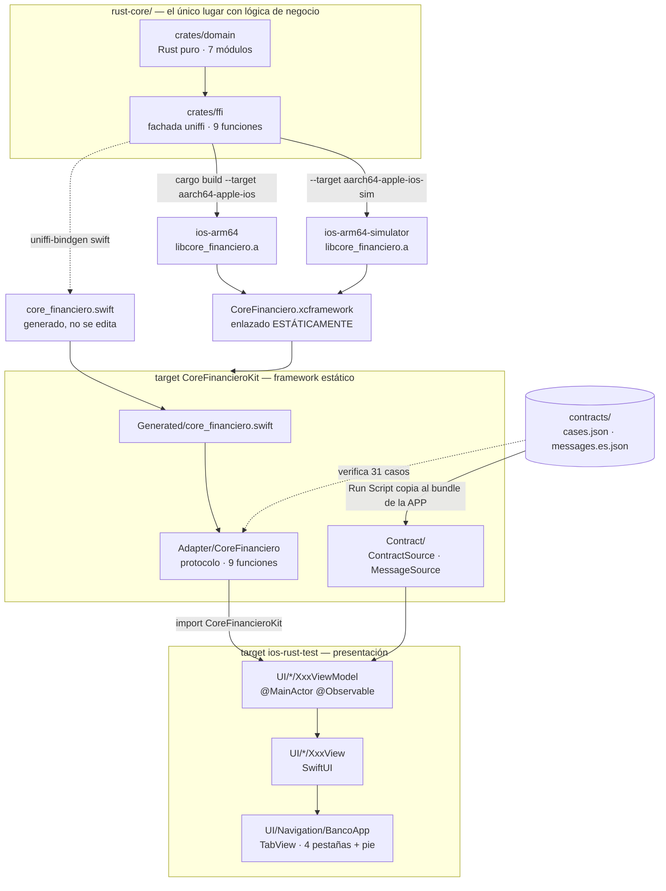

# Split de `apps/ios` en dos targets — plan de implementación

> **For agentic workers:** REQUIRED SUB-SKILL: Use superpowers:subagent-driven-development (recommended) or superpowers:executing-plans to implement this plan task-by-task. Steps use checkbox (`- [ ]`) syntax for tracking.

**Goal:** Extraer el borde FFI de `apps/ios` a un target propio, `CoreFinancieroKit`, framework estático, sin cambiar una línea de comportamiento.

**Architecture:** Un `PBXNativeTarget` nuevo con `MACH_O_TYPE = staticlib` se lleva `Adapter/`, `Contract/` y `Generated/core_financiero.swift`. El target `ios-rust-test` queda con `UI/`, `Format/`, `AppContainer` y el App, y los consume vía `import CoreFinancieroKit`. La cirugía sobre el `project.pbxproj` se hace con el gem `xcodeproj` 1.27.0, no editando XML a mano.

**Tech Stack:** Xcode 26.6 (`objectVersion = 77`, grupos sincronizados), Swift 5.0, `xcodeproj` 1.27.0 (Ruby), `xcodebuild`, `xcrun devicectl`, `adb`.

**Spec:** [docs/superpowers/specs/2026-09-17-ios-target-split-design.md](../specs/2026-09-17-ios-target-split-design.md)

## Global Constraints

- **Cero cambios de comportamiento.** Ni lógica, ni textos de UI, ni contrato. Si un test cambia de valor esperado, el refactor salió mal — parar, no ajustar el test.
- **Identificadores en inglés; comentarios y docs en español.**
- **Commits en Conventional Commits, en español, scope `ios`.** Terminan con `Co-Authored-By: Claude Opus 5 <noreply@anthropic.com>`.
- **Nombre del módulo: `CoreFinancieroKit`.** Nunca `CoreFinanciero` (colisiona con el protocolo y con el `.xcframework`) ni `CoreFinancieroFFI` (colisiona con el módulo C `core_financieroFFI`).
- **Framework estático:** `MACH_O_TYPE = staticlib`. Uno dinámico metería indirección de `dyld` en cada llamada al core y cambiaría los 0,062 µs que publica `docs/cross-app-pending.md`.
- **Prohibido `@testable import CoreFinancieroKit`.** `ENABLE_TESTABILITY` solo está en Debug y el benchmark de la Fase 7 se mide en Release; con `@testable` esa corrida dejaría de compilar. Los símbolos que los tests necesitan van `public`.
- **Nunca editar `Generated/core_financiero.swift` ni el `.xcframework`.** Son artefactos generados y gitignored.
- **Conteo a mantener: 54 tests en 13 suites.** Cualquier otro número es un fallo, incluso hacia arriba.
- **Aparatos de esta sesión:** iPhone 12 físico, UDID `00008101-001368940EC2001E`. Android: **emulador** `emulator-5554` — no hay Pixel 6 conectado, lo cual alcanza para comparar el pie pero **no** para medir nada.
- **Rutas:** el repo está en `/Users/tohure/Documents/Projects/rust-core-cross-app`. Los scripts auxiliares van al scratchpad de la sesión, nunca al repo ni a `/tmp`.

---

### Task 1: Baseline verde sobre el iPhone 12

Sin este paso, cualquier fallo posterior es ambiguo: no se sabría si lo introdujo el split o ya estaba roto. **No se commitea nada.**

**Files:**
- Ninguno. Es una tarea de verificación.

**Interfaces:**
- Consumes: nada.
- Produces: el conteo de tests y el string de `coreVersion()` que las tareas 3 y 4 tienen que igualar.

- [ ] **Step 1: Confirmar que los artefactos generados están en disco**

Son gitignored, así que un clon limpio no los tiene.

```bash
cd /Users/tohure/Documents/Projects/rust-core-cross-app/apps/ios
ls -d CoreFinanciero.xcframework Generated/include ios-rust-test/Generated
ls CoreFinanciero.xcframework
```

Esperado: los tres directorios existen, y el `.xcframework` lista **dos** slices, `ios-arm64` y `ios-arm64-simulator`. Si falta alguno, parar y regenerar siguiendo [apps/ios/BUILD.md](../../../apps/ios/BUILD.md) antes de seguir.

- [ ] **Step 2: Confirmar que el iPhone está disponible**

```bash
xcrun devicectl list devices
```

Esperado: una fila con `00008101-001368940EC2001E (UDID)`, estado `available (paired)`, modelo `iPhone 12`.

- [ ] **Step 3: Correr la suite sobre el aparato**

```bash
cd /Users/tohure/Documents/Projects/rust-core-cross-app/apps/ios
xcodebuild test -project ios-rust-test.xcodeproj -scheme ios-rust-test \
  -destination 'id=00008101-001368940EC2001E' -allowProvisioningUpdates 2>&1 | tail -30
```

Esperado: `** TEST SUCCEEDED **` y `Test run with 54 tests in 13 suites passed`.

Si falla al instalar o firmar, el perfil de la cuenta gratuita venció (dura 7 días): hay que confiar el certificado en el aparato, *Ajustes → General → VPN y Gestión de Dispositivos → APP DE DESARROLLADOR → Confiar*. Los mensajes exactos están en [apps/ios/TESTING.md](../../../apps/ios/TESTING.md).

- [ ] **Step 4: Anotar el `coreVersion()` de partida**

Se saca del artefacto, no del README: el README nombra un ejemplo que envejece cada vez que alguien regenera el `.xcframework`.

```bash
cd /Users/tohure/Documents/Projects/rust-core-cross-app/apps/ios
strings CoreFinanciero.xcframework/ios-arm64/libcore_financiero.a \
  | grep -oE '[0-9]+\.[0-9]+\.[0-9]+\+[0-9a-f]{7}' | sort -u
```

Esperado: **exactamente un** string, con forma `1.0.0+<sha de 7>` — al 2026-09-17, `1.0.0+959025f`.

**El cuantificador va `{7}` exacto, nunca `{7,}`.** `strings` no separa literales contiguos de un binario de Rust: el SHA queda pegado al literal siguiente, que acá es ``called `Result::unwrap()`…``, y un `{7,}` codicioso se come la `ca` de `called` y devuelve `959025fca`, un SHA que no existe. El error es silencioso y plausible, que es lo peor que puede ser.

**El artefacto es una pista, no la autoridad.** Lo que vale es el string que se pinta en pantalla. Confirmarlo contra la app en la Task 3.

Si salen dos strings distintos, los slices del `.xcframework` se construyeron en momentos distintos y hay que regenerar antes de seguir.

**No commitear nada en esta tarea.**

---

### Task 2: Nace `CoreFinancieroKit`

Es la tarea grande, y es atómica a propósito: un target no se puede partir por la mitad sin dejar el proyecto sin compilar. Los pasos de adentro sí son chicos.

**Files:**
- Create: `apps/ios/CoreFinancieroKit/` con `Adapter/`, `Contract/` y `Generated/`
- Move: los 3 de `apps/ios/ios-rust-test/Adapter/`, los 4 de `apps/ios/ios-rust-test/Contract/`, y `apps/ios/ios-rust-test/Generated/core_financiero.swift`
- Modify: `apps/ios/ios-rust-test.xcodeproj/project.pbxproj`
- Modify: `.gitignore` línea 18
- Modify: 12 archivos de `apps/ios/ios-rust-test/` (imports)
- Modify: 9 archivos de `apps/ios/ios-rust-testTests/` (imports)

**Interfaces:**
- Consumes: el baseline verde de la Task 1.
- Produces: el módulo `CoreFinancieroKit`, cuya superficie pública es exactamente:
  - `public protocol CoreFinanciero` con `add(a:b:)`, `subtract(a:b:)`, `calculateItf(amount:)`, `validateCci(cci:)`, `validateCard(number:)`, `encrypt(text:keyHex:nonceHex:)`, `decrypt(ciphertextHex:keyHex:nonceHex:)`, `transfer(accounts:request:)`, `coreVersion()`
  - `public struct UniffiCoreFinanciero: CoreFinanciero` con `public init()`
  - `public struct ContractMessages` con `public init(source: MessageSource)`, `public static let fallback: String`, y las dos sobrecargas `public func userMessage(_:) -> String` (una toma `Error`, otra `DomainError`)
  - `public var DomainError.contractName: String` (extension)
  - `public protocol ContractSource` con `initialAccounts() -> [Account]`, `demoKeyHex() -> String`, `demoNonceHex() -> String`
  - `public protocol MessageSource` con `messages() -> [String: String]`
  - `public struct BundleContractSource: ContractSource` con `public init(bundle: Bundle) throws`
  - `public struct BundleMessageSource: MessageSource` con `public init(bundle: Bundle) throws`
  - y lo que uniffi ya emite `public` en `core_financiero.swift`: `Account`, `ValidCci`, `ValidCard`, `TransferRequest`, `TransferResult`, `DomainError` y las 9 funciones globales.
  - **Queda `internal` a propósito:** los dos `enum LoadError` anidados. Nadie los nombra desde fuera —verificado— y un `struct` público puede lanzar un error interno sin problema, porque los errores viajan como `any Error`.

- [ ] **Step 1: Arreglar el `.gitignore` ANTES de mover nada**

Si esto se hace después, el `core_financiero.swift` generado entra al commit.

```bash
cd /Users/tohure/Documents/Projects/rust-core-cross-app
sed -i '' 's|^/apps/ios/ios-rust-test/Generated/$|/apps/ios/CoreFinancieroKit/Generated/|' .gitignore
sed -n '14,20p' .gitignore
```

Esperado: la línea que decía `/apps/ios/ios-rust-test/Generated/` ahora dice `/apps/ios/CoreFinancieroKit/Generated/`. Las de Android, React Native y el wasm quedan intactas.

- [ ] **Step 2: Mover los archivos**

Los siete escritos a mano están versionados (`git mv`); el generado está ignorado (`mv` pelado).

```bash
cd /Users/tohure/Documents/Projects/rust-core-cross-app/apps/ios
mkdir -p CoreFinancieroKit/Adapter CoreFinancieroKit/Contract CoreFinancieroKit/Generated
git mv ios-rust-test/Adapter/CoreFinanciero.swift        CoreFinancieroKit/Adapter/
git mv ios-rust-test/Adapter/UniffiCoreFinanciero.swift  CoreFinancieroKit/Adapter/
git mv ios-rust-test/Adapter/ContractMessages.swift      CoreFinancieroKit/Adapter/
git mv ios-rust-test/Contract/ContractSource.swift       CoreFinancieroKit/Contract/
git mv ios-rust-test/Contract/MessageSource.swift        CoreFinancieroKit/Contract/
git mv ios-rust-test/Contract/BundleContractSource.swift CoreFinancieroKit/Contract/
git mv ios-rust-test/Contract/BundleMessageSource.swift  CoreFinancieroKit/Contract/
mv ios-rust-test/Generated/core_financiero.swift         CoreFinancieroKit/Generated/
rmdir ios-rust-test/Adapter ios-rust-test/Contract ios-rust-test/Generated
find CoreFinancieroKit -type f | sort
```

Esperado: exactamente ocho archivos bajo `CoreFinancieroKit/`, y los tres directorios viejos ya no existen. `rmdir` falla si quedó algo adentro — eso es señal, no ruido.

- [ ] **Step 3: Verificar que ahora NO compila**

El equivalente de "correr el test y verlo fallar": confirma que la mudanza de verdad sacó los archivos del target de la app y no quedó una copia colgada.

```bash
cd /Users/tohure/Documents/Projects/rust-core-cross-app/apps/ios
xcodebuild build -project ios-rust-test.xcodeproj -scheme ios-rust-test \
  -destination 'platform=iOS Simulator,name=iPhone 17 Pro' 2>&1 | tail -20
```

Esperado: `** BUILD FAILED **` con errores del tipo `cannot find 'UniffiCoreFinanciero' in scope` en `AppContainer.swift`. **Si compila, parar**: el grupo sincronizado no apuntaba donde se creía y el diagnóstico del resto del plan no vale.

- [ ] **Step 4: Crear el target con `xcodeproj`**

El script va al scratchpad y **no se commitea**: no es re-ejecutable (una vez aplicado, el target ya existe) y versionarlo sería ceremonia. Lo que queda versionado es el `project.pbxproj` resultante.

```bash
SCRATCH=/private/tmp/claude-501/-Users-tohure-Documents-Projects-rust-core-cross-app/afae3ba1-8d03-4216-9fb3-8528ff780b3f/scratchpad
mkdir -p "$SCRATCH" && cat > "$SCRATCH/add_target.rb" <<'RUBY'
require "xcodeproj"

PROJECT = "/Users/tohure/Documents/Projects/rust-core-cross-app/apps/ios/ios-rust-test.xcodeproj"
project = Xcodeproj::Project.open(PROJECT)

app  = project.targets.find { |t| t.name == "ios-rust-test" }
xcfw = project.main_group.files.find { |f| f.path == "CoreFinanciero.xcframework" }
raise "no encontré la app o el xcframework" unless app && xcfw
raise "el target ya existe" if project.targets.any? { |t| t.name == "CoreFinancieroKit" }

kit = project.new_target(:framework, "CoreFinancieroKit", :ios, "17.0")

# Los tres ajustes de concurrencia son load-bearing: si el módulo nuevo tiene otro
# aislamiento de actor por defecto, la app deja de compilar por concurrencia y el error
# aparece lejos de su causa.
kit.build_configurations.each do |c|
  c.build_settings.merge!(
    "MACH_O_TYPE" => "staticlib",
    "DEFINES_MODULE" => "YES",
    "SKIP_INSTALL" => "YES",
    "PRODUCT_NAME" => "$(TARGET_NAME)",
    "PRODUCT_BUNDLE_IDENTIFIER" => "dev.tohure.CoreFinancieroKit",
    "IPHONEOS_DEPLOYMENT_TARGET" => "17.0",
    "SWIFT_VERSION" => "5.0",
    "TARGETED_DEVICE_FAMILY" => "1,2",
    "CODE_SIGN_STYLE" => "Automatic",
    "DEVELOPMENT_TEAM" => "PSBE6PYY33",
    "GENERATE_INFOPLIST_FILE" => "YES",
    "SWIFT_APPROACHABLE_CONCURRENCY" => "YES",
    "SWIFT_DEFAULT_ACTOR_ISOLATION" => "MainActor",
    "SWIFT_UPCOMING_FEATURE_MEMBER_IMPORT_VISIBILITY" => "YES"
  )
end

# Grupo sincronizado propio: Xcode 26 exige que cada target tenga su raíz en disco.
sync = project.new(Xcodeproj::Project::Object::PBXFileSystemSynchronizedRootGroup)
sync.path = "CoreFinancieroKit"
sync.source_tree = "<group>"
project.main_group.children.insert(0, sync)
kit.file_system_synchronized_groups = [sync]

# El kit enlaza el xcframework para ver el modulemap de `core_financieroFFI`. La app lo
# conserva en SU fase también: un framework estático no resuelve símbolos, el enlace final
# lo hace el binario de la app, así que el `.a` tiene que estar en los dos lados.
kit.frameworks_build_phase.add_file_reference(xcfw)

app.add_dependency(kit)
app.frameworks_build_phase.add_file_reference(kit.product_reference)

project.save
puts "OK: CoreFinancieroKit creado"
RUBY
ruby "$SCRATCH/add_target.rb"
```

Esperado: `OK: CoreFinancieroKit creado`.

- [ ] **Step 5: Revisar el diff del `pbxproj` antes de seguir**

```bash
cd /Users/tohure/Documents/Projects/rust-core-cross-app
git diff --stat apps/ios/ios-rust-test.xcodeproj/project.pbxproj
git diff apps/ios/ios-rust-test.xcodeproj/project.pbxproj | grep -E '^[+-]' | grep -iE 'MACH_O|staticlib|CoreFinancieroKit|xcframework' | head -20
```

Esperado: aparece el target nuevo, `MACH_O_TYPE = staticlib`, y el `CoreFinanciero.xcframework` sigue referenciado por la app. Hay además ~12 líneas de ruido cosmético del round-trip del gem (`exceptions = ()` que aparece, `packageProductDependencies = ()` que desaparece): es esperado, está documentado en la spec.

- [ ] **Step 6: Marcar `public` las 40 declaraciones que cruzan la frontera**

Son mecánicas: agregar `public ` al principio de la declaración, sin tocar nada más. Los `private let` de propiedades almacenadas **no** se tocan.

| Archivo | Declaraciones |
|---|---|
| `Adapter/CoreFinanciero.swift` | `protocol CoreFinanciero` + sus 9 `func` |
| `Adapter/UniffiCoreFinanciero.swift` | `struct UniffiCoreFinanciero` + sus 9 `func` |
| `Adapter/ContractMessages.swift` | `var contractName`, `struct ContractMessages`, `init(source:)`, `static let fallback`, las 2 `func userMessage` |
| `Contract/ContractSource.swift` | `protocol ContractSource` + sus 3 `func` |
| `Contract/MessageSource.swift` | `protocol MessageSource` + su 1 `func` |
| `Contract/BundleContractSource.swift` | `struct`, `init(bundle:) throws`, sus 3 `func` |
| `Contract/BundleMessageSource.swift` | `struct`, `init(bundle:) throws`, su 1 `func` |

Dos detalles que el compilador no perdona:

1. **`extension DomainError` no lleva `public`, `contractName` sí.** Marcar la extension entera como `public` es legal pero redundante; lo que importa es la propiedad.
2. **`UniffiCoreFinanciero` necesita un `public init() {}` escrito a mano.** Hoy usa el memberwise implícito, que es `internal`: sin esto, `AppContainer` no puede construirlo y el error dice `'UniffiCoreFinanciero' initializer is inaccessible due to 'internal' protection level`. Va justo después de la llave de apertura del `struct`:

```swift
public struct UniffiCoreFinanciero: CoreFinanciero {
    public init() {}

    public func add(a: String, b: String) throws -> String {
```

- [ ] **Step 7: Cambiar el prefijo de desambiguación**

Los 9 cuerpos de `UniffiCoreFinanciero` llaman `ios_rust_test.add(...)` para distinguir la función global de uniffi del método homónimo del `struct`. Al mudarse de módulo, el prefijo cambia.

```bash
cd /Users/tohure/Documents/Projects/rust-core-cross-app/apps/ios
sed -i '' 's/\bios_rust_test\./CoreFinancieroKit./g' CoreFinancieroKit/Adapter/UniffiCoreFinanciero.swift
grep -c 'CoreFinancieroKit\.' CoreFinancieroKit/Adapter/UniffiCoreFinanciero.swift
```

Esperado: `9`.

Actualizar también el comentario de encabezado del archivo, que hoy dice «El prefijo `ios_rust_test.` en cada llamada desambigua…»: tiene que nombrar el prefijo nuevo.

- [ ] **Step 8: Compilar el kit solo**

Antes de tocar la app, verificar que el módulo se sostiene por sí mismo. Este es el paso que caza el riesgo #1 de la spec (el enlace del `.a`) y el #2 (`core_financieroFFI` no resuelve).

```bash
cd /Users/tohure/Documents/Projects/rust-core-cross-app/apps/ios
xcodebuild build -project ios-rust-test.xcodeproj -target CoreFinancieroKit \
  -sdk iphonesimulator -destination 'platform=iOS Simulator,name=iPhone 17 Pro' 2>&1 | tail -20
```

Esperado: `** BUILD SUCCEEDED **`.

Si falla con `no such module 'core_financieroFFI'`, el kit no está viendo el modulemap del xcframework: revisar que el Step 4 lo haya agregado a la fase Frameworks del kit.

- [ ] **Step 9: Agregar `import CoreFinancieroKit` a los 12 archivos de la app**

```bash
cd /Users/tohure/Documents/Projects/rust-core-cross-app/apps/ios
for f in \
  ios-rust-test/AppContainer.swift \
  ios-rust-test/UI/Arithmetic/ArithmeticView.swift \
  ios-rust-test/UI/Arithmetic/ArithmeticViewModel.swift \
  ios-rust-test/UI/Benchmark/BenchmarkView.swift \
  ios-rust-test/UI/Benchmark/BenchmarkViewModel.swift \
  ios-rust-test/UI/Card/CardView.swift \
  ios-rust-test/UI/Card/CardViewModel.swift \
  ios-rust-test/UI/Components/Components.swift \
  ios-rust-test/UI/Navigation/BancoApp.swift \
  ios-rust-test/UI/Transfer/TransferUiState.swift \
  ios-rust-test/UI/Transfer/TransferView.swift \
  ios-rust-test/UI/Transfer/TransferViewModel.swift ; do
  grep -q '^import CoreFinancieroKit$' "$f" || \
    awk 'NR==1 && !/^import / { print "import CoreFinancieroKit"; print "" } { print }' "$f" > "$f.tmp" && mv "$f.tmp" "$f"
done
grep -L '^import CoreFinancieroKit$' \
  ios-rust-test/AppContainer.swift \
  ios-rust-test/UI/Arithmetic/Arithmetic{View,ViewModel}.swift \
  ios-rust-test/UI/Benchmark/Benchmark{View,ViewModel}.swift \
  ios-rust-test/UI/Card/Card{View,ViewModel}.swift \
  ios-rust-test/UI/Components/Components.swift \
  ios-rust-test/UI/Navigation/BancoApp.swift \
  ios-rust-test/UI/Transfer/Transfer{UiState,View,ViewModel}.swift
```

El `awk` inserta el import arriba de todo cuando el archivo **no** empieza con un `import`. Para los que sí empiezan con `import Foundation` o `import SwiftUI`, hay que insertarlo en orden alfabético dentro del bloque de imports existente — revisar archivo por archivo y corregir a mano.

Esperado del último `grep -L`: **sin salida**.

**El `grep` va sobre la lista explícita, no sobre `UI/*/*.swift`.** Estos cinco archivos de `UI/` **no** deben llevar el import porque no nombran nada del core, y un glob los reportaría como falsos fallos: `Arithmetic/ArithmeticUiState.swift`, `Benchmark/BenchmarkUiState.swift`, `Benchmark/NativeBaseline.swift`, `Card/CardUiState.swift`, `Theme/Palette.swift`. `Format/MoneyFormatter.swift` tampoco entra, por lo mismo.

- [ ] **Step 10: Agregar `import CoreFinancieroKit` a los 9 archivos de test**

Los nueve conservan su `@testable import ios_rust_test` y suman el import normal del kit. **Sin `@testable` sobre el kit** — ver Global Constraints.

Archivos: `ArithmeticViewModelTest.swift`, `BenchmarkViewModelTest.swift`, `CardViewModelTest.swift`, `ContractMessagesTest.swift`, `ContractTest.swift`, `CoreSmokeTest.swift`, `FakeCoreFinanciero.swift`, `FfiCostProbe.swift`, `TransferViewModelTest.swift`.

Quedan **sin** import, porque no nombran nada del kit: `ContractFixtures.swift`, `MoneyFormatterTest.swift`, `ios_rust_testTests.swift`.

```bash
cd /Users/tohure/Documents/Projects/rust-core-cross-app/apps/ios
grep -L '^import CoreFinancieroKit$' \
  ios-rust-testTests/{Arithmetic,Benchmark,Card,Transfer}ViewModelTest.swift \
  ios-rust-testTests/{ContractMessagesTest,ContractTest,CoreSmokeTest,FakeCoreFinanciero,FfiCostProbe}.swift
```

Esperado: sin salida.

- [ ] **Step 11: Suite completa en simulador**

```bash
cd /Users/tohure/Documents/Projects/rust-core-cross-app/apps/ios
xcodebuild test -project ios-rust-test.xcodeproj -scheme ios-rust-test \
  -destination 'platform=iOS Simulator,name=iPhone 17 Pro' 2>&1 | tail -30
```

Esperado: `** TEST SUCCEEDED **` y `Test run with 54 tests in 13 suites passed`. **El mismo conteo que la Task 1.** Un número distinto significa que un archivo de test se cayó del target al moverse algo — parar y encontrarlo antes de commitear.

- [ ] **Step 12: Commit**

```bash
cd /Users/tohure/Documents/Projects/rust-core-cross-app
git add -A apps/ios .gitignore
git status --short
git commit -F - <<'EOF'
refactor(ios): nace el target CoreFinancieroKit con el borde FFI

Extrae `Adapter/`, `Contract/` y el `core_financiero.swift` generado a un
framework estático propio. `ios-rust-test` queda con UI, Format y el
contenedor, y los consume con `import CoreFinancieroKit`.

Estático y no dinámico a propósito: el piso de cruce de 0,062 µs que
publica docs/cross-app-pending.md depende de que el `.a` quede enlazado
dentro del binario de la app. Uno dinámico metería indirección de dyld en
cada llamada.

Los tres ajustes de concurrencia del target nuevo se copian de la app
—SWIFT_DEFAULT_ACTOR_ISOLATION, SWIFT_APPROACHABLE_CONCURRENCY y
SWIFT_UPCOMING_FEATURE_MEMBER_IMPORT_VISIBILITY—: si no coinciden, el
adapter cambia de aislamiento al cruzar de módulo y la app deja de
compilar por concurrencia, lejos de la causa.

No se usa `@testable import` sobre el kit: ENABLE_TESTABILITY solo está en
Debug y el benchmark de la Fase 7 se mide en Release. Se pagan 40
`public` más un init para no romper esa corrida.

Sin cambios de comportamiento: 54 tests en 13 suites, el mismo conteo.

Co-Authored-By: Claude Opus 5 <noreply@anthropic.com>
EOF
```

Antes de confirmar, revisar que `git status --short` **no** liste `CoreFinancieroKit/Generated/core_financiero.swift`: si aparece, el Step 1 no surtió efecto.

---

### Task 3: Verificación sobre el iPhone 12 y paridad del pie

Lo que el simulador no puede probar: el slice `aarch64-apple-ios` es un binario distinto, y es el único que se embarca. Es justo lo que este cambio pone en riesgo.

**Files:**
- Ninguno, salvo que aparezca un fallo. En ese caso se corrige y se commitea aparte.

**Interfaces:**
- Consumes: el commit de la Task 2.
- Produces: la evidencia que la Task 4 cita en el README.

- [ ] **Step 1: Suite completa sobre el aparato**

```bash
cd /Users/tohure/Documents/Projects/rust-core-cross-app/apps/ios
xcodebuild test -project ios-rust-test.xcodeproj -scheme ios-rust-test \
  -destination 'id=00008101-001368940EC2001E' -allowProvisioningUpdates 2>&1 | tail -30
```

Esperado: `** TEST SUCCEEDED **` y `Test run with 54 tests in 13 suites passed`.

Los que importan acá son `CoreSmokeTest` (4) y `ContractTest` (11): son los que cruzan el FFI de verdad. Si el enlace estático se rompió, fallan estos y no los de ViewModel.

- [ ] **Step 2: Si falla el enlace, aplicar los planes B en orden**

Síntoma: `Undefined symbol: _uniffi_core_financiero_fn_func_*` al enlazar la app o el bundle de test.

1. Sacar el xcframework de la fase Frameworks del **kit** y dejarlo solo en la de la app.
2. Si persiste, agregar a `OTHER_LDFLAGS` del target de la app:
   `-force_load $(SRCROOT)/CoreFinanciero.xcframework/ios-arm64/libcore_financiero.a` para device, con el slice de simulador en la variante correspondiente.

Cualquiera de los dos que se use **se documenta en `BUILD.md` en la Task 4**, con el porqué. Una solución que vive solo en el pbxproj se vuelve inexplicable en seis meses.

- [ ] **Step 3: Levantar la app iOS en el iPhone y leer el pie**

```bash
cd /Users/tohure/Documents/Projects/rust-core-cross-app/apps/ios
xcodebuild build -project ios-rust-test.xcodeproj -scheme ios-rust-test \
  -destination 'id=00008101-001368940EC2001E' -allowProvisioningUpdates 2>&1 | tail -5
```

Después abrir la app en el aparato y anotar el string del pie, que aparece en las cuatro pestañas. Tiene forma `1.0.0+<sha corto>` y **tiene que ser el mismo** que anotó la Task 1: este cambio no regenera el artefacto, así que el SHA no puede haberse movido. Si cambió, alguien regeneró algo por el camino.

- [ ] **Step 4: Comparar contra Android**

```bash
cd /Users/tohure/Documents/Projects/rust-core-cross-app/apps/android
adb devices -l
./gradlew :app:installDebug
adb shell am start -n dev.tohure.android_rust_test/.MainActivity
sleep 3
adb shell uiautomator dump /sdcard/ui.xml && adb shell cat /sdcard/ui.xml | tr '>' '>\n' | grep -o '1\.0\.0+[0-9a-f]*'
```

Esperado: el mismo string que el pie de iOS, carácter por carácter.

**Salvedad honesta para el ledger:** el Android conectado es un **emulador**, no el Pixel 6. Para comparar el pie alcanza —el string sale del artefacto, no del aparato—, pero cualquier número de benchmark medido ahí no vale.

- [ ] **Step 5: Anotar la evidencia**

Registrar en el ledger de ejecución: el conteo del aparato, el string del pie en las dos apps, y cuál de los planes B del Step 2 hizo falta (o ninguno). **Sin commit** si no hubo que corregir nada.

---

### Task 4: Documentación

La regla del proyecto: cualquier decisión que requiera ejecutar algo se documenta en el README del subproyecto, con el comando exacto y qué se debe ver. Y una fase no termina sin su diagrama.

**Files:**
- Modify: `apps/ios/BUILD.md`
- Modify: `apps/ios/CONTEXT.md`
- Modify: `apps/ios/README.md`
- Modify: `apps/ios/PENDING.md`

**Interfaces:**
- Consumes: la evidencia de la Task 3.
- Produces: nada que otro código consuma.

- [ ] **Step 1: `BUILD.md`**

Tres cosas:

1. El paso de generación mueve el Swift a otra carpeta. La línea
   `mv Generated/core_financiero.swift ios-rust-test/Generated/`
   pasa a `mv Generated/core_financiero.swift CoreFinancieroKit/Generated/`, y el `mkdir -p` de arriba y el `ls` de verificación acompañan.
2. El árbol de directorios del encabezado suma `CoreFinancieroKit/`.
3. **Sección nueva: la estructura de targets.** Qué target existe, qué se lleva cada uno, que el kit es estático y por qué, y —si hizo falta— cuál plan B del enlace se aplicó. Es lo que reemplaza al script Ruby, que no se commitea.

- [ ] **Step 2: `CONTEXT.md`**

El árbol de la sección de estructura (hoy alrededor de la línea 76) y la prohibición de editar generados (alrededor de la 377), que nombra `Generated/` y tiene que nombrar la ruta nueva.

- [ ] **Step 3: `README.md` — el diagrama**

El Mermaid actual no muestra frontera de módulo: `gen` y `xcf` apuntan directo a `adapter`, y `adapter` a los ViewModels, todo plano. Tiene que quedar con dos subgrafos, para que se vea de un vistazo qué queda de cada lado:



Nota que el diagrama tiene que dejar explícita: la Run Script que copia los contratos sigue en el target de la **app**, no en el kit, porque un framework estático no embarca recursos. Es una divergencia deliberada con Android, donde los assets viven en `:core-financiero`.

- [ ] **Step 4: `README.md` — el resto**

- La tabla de archivos que hoy nombra `Generated/core_financiero.swift` bajo `ios-rust-test/`.
- **El string de ejemplo del pie está viejo.** El README dice `hoy 1.0.0+b719da3`; el valor real, verificado en pantalla en iOS y en el Pixel 6, es `1.0.0+959025f`. Actualizarlo al valor real — es justo el string que el runbook de demo manda comparar entre las cuatro apps.
- Agregar el comando que compila el kit solo, que es el diagnóstico más rápido cuando algo del borde FFI se rompe:

```bash
xcodebuild build -project ios-rust-test.xcodeproj -target CoreFinancieroKit \
  -sdk iphonesimulator -destination 'platform=iOS Simulator,name=iPhone 17 Pro'
```

Qué se debe ver: `** BUILD SUCCEEDED **`.

- [ ] **Step 5: `PENDING.md` — las dos cosas**

1. **Cerrar** el ítem «La app es un solo target, y el argumento para partirla vale igual que en Android», con el formato tachado que ya usan los otros cerrados del archivo.
2. **Corregir la premisa falsa**, que es la parte que no se puede omitir. El texto cerrado tiene que decir que el split **no** impone el seam por compilador, y por qué: el bundle de tests hostea en la app, la app enlaza el framework, y los tests de ViewModel tienen que importarlo igual porque `ContractMessages`, `ValidCci` y `DomainError` viven ahí. En Android el seam lo cierra el runtime —la JVM no carga la `.so`—, no el compilador.
3. El ítem «El seam de `CoreFinanciero` es más débil que en Android» **se queda abierto**, porque sigue siendo cierto. Actualizarlo para que diga que el split ya ocurrió y aun así el seam lo sostiene la revisión.

- [ ] **Step 6: Verificar los enlaces que se tocaron**

```bash
cd /Users/tohure/Documents/Projects/rust-core-cross-app/apps/ios
grep -oE '\]\([^)]+\.md[^)]*\)' README.md CONTEXT.md BUILD.md PENDING.md \
  | sed 's/.*](//;s/)$//;s/#.*//' | sort -u \
  | while read -r l; do [ -f "$l" ] || echo "ROTO: $l"; done
```

Esperado: sin salida.

- [ ] **Step 7: Commit**

```bash
cd /Users/tohure/Documents/Projects/rust-core-cross-app
git add apps/ios/*.md
git commit -F - <<'EOF'
docs(ios): corregir la premisa del split y cerrar el ítem del target único

El PENDING justificaba esta deuda diciendo que con el borde FFI en otro
target, un test de presentación que llamara al core real no compilaría.
Es falso: el bundle de tests hostea en la app, la app enlaza el framework,
y los tests de ViewModel tienen que importarlo igual porque
ContractMessages, ValidCci y DomainError viven ahí.

En Android el seam lo cierra el runtime —la JVM no puede cargar la `.so`—,
no el compilador. iOS no tiene ese mecanismo porque el core se enlaza
estáticamente. Por eso el ítem del seam débil queda ABIERTO aunque el
split ya esté hecho.

El diagrama del README pasa a mostrar los dos targets, y BUILD.md suma la
estructura de targets, que es lo que reemplaza al script de migración
—que no se commitea porque no es re-ejecutable—.

Co-Authored-By: Claude Opus 5 <noreply@anthropic.com>
EOF
```

---

## Cierre

Con las cuatro tareas hechas: `superpowers:verification-before-completion`, después `superpowers:requesting-code-review`, y el PR con `superpowers:finishing-a-development-branch`.
