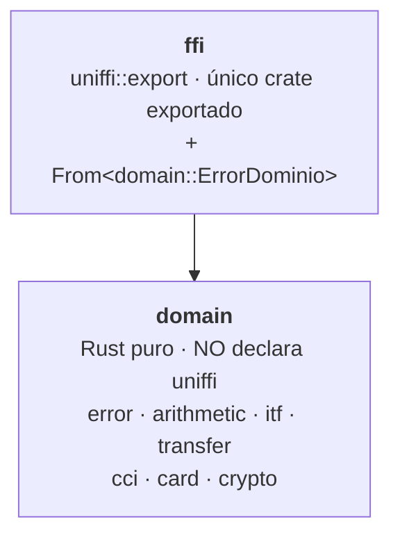

# Fase 1 — `rust-core`

**Fecha:** 2026-09-08 · **Estado:** ✅ aprobado · **Rama:** `feat/phase-1-rust-core`
**Specs de entrada:** [`rust-core/CONTEXT.md`](../../../rust-core/CONTEXT.md) y
[`contracts/README.md`](../../../contracts/README.md), que es la fuente normativa de los
algoritmos.

## Qué prueba esta fase, y qué no

La POC demuestra **una** cosa: que la lógica de negocio se escribe una vez en Rust y las
cuatro plataformas la consumen sin reescribirla. En concreto, sobre la pantalla:

1. El mismo cálculo no pierde decimales en Android, iOS, React Native ni web.
2. El mismo secreto cifrado en Rust sale idéntico en las cuatro.
3. Una transferencia —que por dentro es una resta y una suma— produce el mismo estado
   nuevo en las cuatro.

La forma de app bancaria es **feeling**, no el objeto de la prueba. No se modelan procesos
del banco, ni capas de error por dominio, ni casos de uso, ni networking. Si la idea
gusta, esa complejidad viene después; agregarla ahora solo aleja la demo.

## Decisiones

### D1 — Dos crates, no cinco

`rust-core` tiene `domain` (Rust puro) y `ffi` (uniffi). Los cuatro crates internos que
proponía el CONTEXT (`domain`, `calculation`, `validation`, `crypto`) pasan a ser módulos
dentro de ese único crate puro.

La POC argumenta **una sola frontera**: la lógica de negocio no conoce el FFI. Separar
`domain` de `calculation` de `validation` no prueba nada adicional sobre ~400 líneas — es
una separación que se gana cuando el código crece, no en una demo.

La frontera que sí importa la sigue **haciendo cumplir el compilador**: `domain` no declara
`uniffi` en su `Cargo.toml`, así que un `#[uniffi::export]` ahí adentro no compila. No es
convención, es error de compilación.

> **Corrección de ejecución (2026-09-08).** El crate puro se llama `domain` y no `core`,
> como decía la versión aprobada de esta spec. Un paquete llamado `core` sí choca: `ffi` lo
> declara como dependencia y el `--extern core` resultante tapa al `core` de la stdlib, así
> que `#[derive(thiserror::Error)]` —que expande a `::core::fmt`— falla con
> `cannot find 'fmt' in 'core'`. Verificado con un workspace de prueba antes de escribir la
> primera línea. El cdylib sigue llamándose `core_financiero`, que es el nombre que esperan
> las Fases 2 a 5.



### D2 — `ErrorDominio` se define una sola vez

Vive en `domain/src/error.rs` como `thiserror` puro. `ffi` declara su propio enum con
`#[derive(uniffi::Error)]` y un `impl From<domain::ErrorDominio>` de ~15 líneas.

Se descartó derivar uniffi directamente sobre el tipo de `domain` con tipos remotos
(`#[uniffi::remote(...)]`, `use_remote_type!`): la documentación de uniffi cubre records y
enums y **no confirma enums de error**, con casos borde advertidos. Quince líneas legibles
valen más que un rincón poco documentado de una dependencia.

También se descartó activar el derive con un feature de cargo. Funciona, pero mete un
concepto más (features condicionales) a cambio de ahorrar quince líneas.

### D3 — `comprobante` y `latencia_simulada_ms`

Son salidas públicas que **no existían en el contrato**. Como `ejecutar_transferencia` es
pura, tienen que estar determinadas por la entrada: si no, las cuatro apps mostrarían
comprobantes distintos lado a lado, que es exactamente lo contrario de lo que la POC
prueba.

| Campo | Derivación | `tr-001` | `tr-002` |
|---|---|---|---|
| `comprobante` | `TRF-` + últimos 4 del origen + `-` + últimos 4 del destino + `-` + monto en centavos | `TRF-9047-1065-10000` | `TRF-9047-1065-350000` |
| `latencia_simulada_ms` | `250 + min(parte entera del monto, 500)` | `350` | `750` |

Derivación legible en vez de hash: `TRF-9047-1065-10000` se ve derivado del dato en
pantalla y no agrega dependencia de hashing. La latencia crece con el monto porque es
explicable en vivo — "las transferencias grandes tardan más, y lo decide el core, no la
app" — en lugar de ser un número mágico.

Los dos campos se agregan como esperados a los dos casos válidos de `transferencia`, y
`cases.json` sube a **v2.1.0** (minor: se agrega cobertura, no se corrige un esperado).

### D4 — `ejecutar_transferencia` no valida el CCI del destino

El [recorte de alcance](2026-09-08-scope-simplification-design.md) decía que `validar_cci`
"valida la cuenta destino de la transferencia". El pseudocódigo normativo de
`contracts/README.md` no la llama, y el contrato lo confirma: el destino de `tr-004` es
`00000000000000000000`, que **pasa** el dígito de control (la suma ponderada da 0) pero
tiene código de banco `000`, fuera de la tabla. Si la transferencia validara CCI, `tr-004`
devolvería `BancoDesconocido`; el contrato exige `CuentaNoEncontrada`.

Gana el contrato: `validar_cci` es una función independiente, con su propia pantalla.

### D5 — Desbordamiento

`Decimal` desborda cerca de 7.9×10²⁸ y el contrato no tiene ningún caso. Toda la
aritmética usa `checked_add` / `checked_sub` / `checked_mul` y devuelve
`FueraDeRango { campo }` — la variante que hoy está huérfana en el enum. Un proptest lo
cubre junto con el resto.

### D6 — `version_core()`

Devuelve `<versión del crate>+<SHA corto de git>`, por ejemplo `1.0.0+abc1234`, inyectado
por `build.rs` vía `env!`. Con fallback `sin-git` cuando no hay repositorio.

`build.rs` lee git en **tiempo de compilación**, lo que no viola la regla de funciones
puras: esa regla es sobre el runtime de la API pública. El script emite
`cargo:rerun-if-changed=.git/HEAD` para que el SHA no se quede pegado.

### D7 — La fase cierra con un smoke del FFI

`cargo test` no detecta los fallos típicos de uniffi: un tipo que no cruza la frontera, un
`Vec<Cuenta>` que no se mapea, un enum de error con campos que no genera bien. Aparecerían
en la Fase 2, mezclados con un build de Android también nuevo.

La fase termina generando bindings **Kotlin y Swift** contra la librería del host y
verificando que salen sin error. No agrega toolchain (ni NDK ni targets de iOS) y no
compila Kotlin ni Swift: solo prueba que la API cruza.

## Estructura

```
rust-core/
├── Cargo.toml                 workspace + [profile.release]
├── README.md                  gate de fase: comandos ejecutados + diagrama Mermaid
├── crates/
│   ├── domain/                Rust puro — NO declara uniffi
│   │   ├── Cargo.toml
│   │   └── src/
│   │       ├── lib.rs
│   │       ├── error.rs       ErrorDominio (thiserror), definido una sola vez
│   │       ├── arithmetic.rs  sumar, restar
│   │       ├── itf.rs         ALICUOTA_ITF + calcular_itf
│   │       ├── transfer.rs    Cuenta, ejecutar_transferencia
│   │       ├── cci.rs         validar_cci + tabla de bancos
│   │       ├── card.rs        Luhn, marca, enmascarado
│   │       └── crypto.rs      cifrar / descifrar
│   └── ffi/                   único crate exportado
│       ├── Cargo.toml
│       ├── build.rs           inyecta versión + SHA
│       ├── src/lib.rs         uniffi::export + From<domain::ErrorDominio>
│       └── tests/
│           └── golden.rs      lee ../../../contracts/cases.json
```

**El golden va dentro del paquete `ffi`, no en `rust-core/tests/`.** Verificado con un
workspace de prueba: un directorio `tests/` en la raíz de un workspace sin paquete raíz
**nunca se compila ni se ejecuta** — `cargo test --workspace` lo ignora en silencio y
`cargo test --test golden` responde `no test target named golden`. El test golden es la
evidencia central de la POC; puesto ahí habría "pasado" sin correr jamás. La estructura de
`rust-core/CONTEXT.md` lo ubica en la raíz y hay que corregirla.

Dentro del paquete funcionan las tres formas, incluido el atajo que documenta `CLAUDE.md`:

```bash
cargo test --workspace                        # lo incluye
cargo test -p core_financiero --test golden   # explícito
cargo test --test golden                      # atajo, también resuelve
```

La API pública no cambia respecto de `rust-core/CONTEXT.md`: mismas funciones, mismos
Records, mismo enum de error.

## Pruebas

Cuatro niveles, en este orden. La Ley de Hierro aplica desde aquí: ningún cálculo sin un
test que falle primero.

1. **Unitarias** por módulo, en `domain`, Rust puro. `cargo test -p domain` no compila uniffi.
2. **Proptest**, las invariantes del CONTEXT:
   - una transferencia válida conserva la suma total de saldos menos el ITF;
   - ningún saldo queda negativo tras una transferencia aceptada;
   - `descifrar(cifrar(x)) == x` para todo `x`;
   - `validar_cci`, `validar_tarjeta` y `descifrar` **nunca entran en pánico** con ninguna
     entrada de texto — es un test de seguridad, reciben input arbitrario del usuario.
3. **Golden** contra `contracts/cases.json`: igualdad exacta de strings sobre los 26 casos
   más los dos campos nuevos. Es la evidencia de la POC, no un test más.
4. **Smoke del FFI** (D7).

Gates de salida: `cargo clippy --workspace --all-targets -- -D warnings`, `cargo fmt --all
--check`, `#![forbid(unsafe_code)]` en ambos crates, y `/security-review`.

## Cambios que esta fase debe propagar

Van en su propio commit, separados del código:

- `rust-core/CONTEXT.md` — de cinco crates a dos, con el porqué, **y la ubicación del
  golden**: hoy lo pone en `rust-core/tests/`, donde nunca se ejecutaría.
- `CLAUDE.md` — el conteo de crates de la Fase 1.
- `contracts/cases.json` — v2.1.0 con `comprobante` y `latencia_simulada_ms`.
- `contracts/README.md` — las dos derivaciones de D3, como especificación normativa.
- `rust-core/README.md` — **nuevo**, con el diagrama Mermaid y los comandos ejecutados.

## Fuera de alcance

Ningún target de Android, iOS ni wasm. Ninguna app. Ningún benchmark. Ninguna capa de
casos de uso, repositorios ni errores por dominio. El perfil de release queda con
`opt-level = "z"`, `panic = "unwind"` y la nota del trade-off del benchmark ya
documentada en el CONTEXT.
