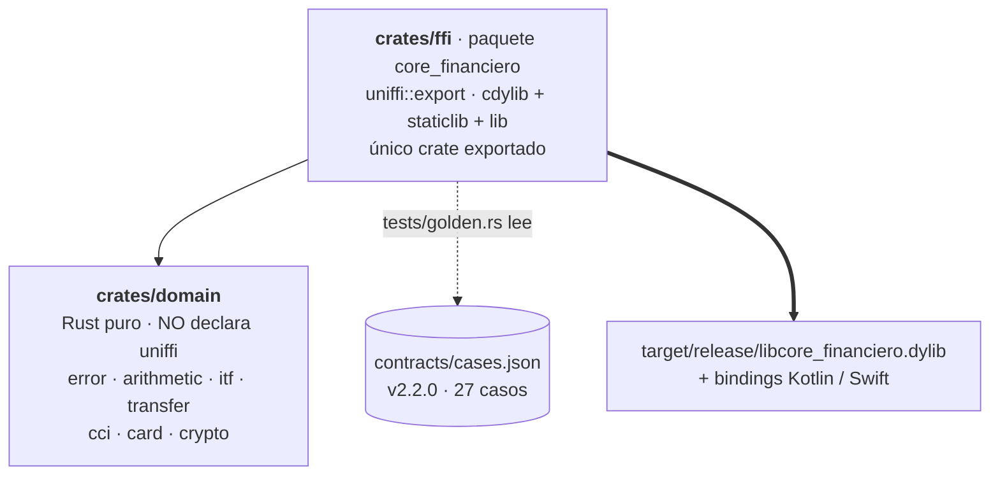

# rust-core

Núcleo de dominio de la POC. Es el único lugar donde vive lógica de negocio: las cuatro
apps lo consumen sin reescribirlo.

**Estado: Fase 1 completada.** 54 tests en verde —37 unitarios de `domain`, 6 de `proptest`,
3 del lib de `ffi` y 8 del golden— contra `contracts/cases.json` v2.2.0, 27 casos.

Todos los comandos de este README **se ejecutaron tal como están escritos**, desde
`rust-core/`, y la salida que sigue a cada uno es la que devolvieron. Ninguno está deducido
del [CONTEXT.md](CONTEXT.md): un README con comandos sin correr se descubre roto el día de
la demo, que es el único día que importa.

## Cómo está organizado



Son dos crates y no más porque la POC argumenta **una** frontera: la lógica de negocio no
conoce el FFI. Y no es una convención de estilo — `crates/domain` no declara `uniffi` en su
`Cargo.toml`, así que un `#[uniffi::export]` ahí adentro **no compila**. Quien sostiene la
regla es el compilador, no la disciplina de quien edita.

Los siete módulos de `domain` (`arithmetic`, `card`, `cci`, `crypto`, `error`, `itf`,
`transfer`) son módulos, no crates. Partirlos en cinco paquetes para ~1000 líneas de Rust
puro sería ceremonia: agregaría cinco `Cargo.toml` y ninguna frontera que el compilador
esté defendiendo.

**El crate puro se llama `domain`, no `core`.** No es preferencia estética: un paquete
llamado `core` hace que el `--extern core` que cargo pasa al compilar `ffi` tape al `core`
de la stdlib, y `#[derive(thiserror::Error)]` deja de compilar con `cannot find 'fmt' in
'core'`. Se verificó con un workspace de prueba antes de elegir el nombre.

## Correr los tests

```bash
cargo test --workspace                                        # todo: 54 tests
cargo test -p domain                                          # solo el núcleo, sin compilar uniffi
cargo test -p core_financiero --test golden                   # solo los 27 casos del contrato
cargo test -p domain rounds_half_away_from_zero_not_to_even   # un solo test por nombre
cargo clippy --workspace --all-targets -- -D warnings
cargo fmt --all
```

`cargo test --workspace` compila **siete targets de test** y todos cierran en `0 failed`.
Solo cuatro llevan tests; los otros tres —el `[[bin]]` `uniffi-bindgen` y los dos de
doc-tests— reportan `0 passed`, que es lo esperado:

| Binario | Tests |
|---|---|
| `crates/ffi/src/lib.rs` (unitarias del lib) | 3 |
| `crates/ffi/tests/golden.rs` | 8 |
| `crates/domain/src/**` (unitarias del lib) | 37 |
| `crates/domain/tests/properties.rs` (`proptest`) | 6 |
| **Total** | **54** |

`cargo test -p core_financiero --test golden` imprime:

```
running 8 tests
test the_contract_has_the_expected_number_of_cases ... ok
test the_contract_has_no_unknown_top_level_keys ... ok
test the_contract_is_the_expected_version ... ok
test golden_cci ... ok
test golden_itf ... ok
test golden_arithmetic ... ok
test golden_transfer ... ok
test golden_card ... ok

test result: ok. 8 passed; 0 failed; 0 ignored; 0 measured; 0 filtered out; finished in 0.00s
```

El orden de las ocho líneas **varía entre corridas** —los tests corren en paralelo—; lo que
no varía es el `8 passed; 0 failed` del cierre.

## El golden: qué prueba, qué no prueba y dónde vive

### Por qué vive en `crates/ffi/tests/`

El golden está en `crates/ffi/tests/golden.rs` y **no** en `rust-core/tests/`. La razón es
mecánica: `rust-core/` es un workspace virtual, sin paquete raíz, y un directorio `tests/`
en la raíz de un workspace así **nunca se compila ni se ejecuta**. El test más importante
de la fase habría figurado como "pasado" sin haber corrido una sola vez. Dentro del paquete
`ffi`, `cargo test --workspace` lo alcanza — es la tabla de arriba, ocho tests.

### Qué prueba

Los 27 casos de `contracts/cases.json`, con **igualdad exacta de strings** (`assert_eq!`),
nunca comparación numérica con tolerancia. Cubre los cinco grupos del contrato:
`aritmetica` 6, `cci` 4, `itf` 5, `tarjeta` 6, `transferencia` 6. El contrato se embebe con
`include_str!`, así que editarlo fuerza recompilar el test y no hay I/O en runtime.

### Qué NO prueba

Llama a las funciones del crate `ffi` **como funciones Rust ordinarias**. Prueba la API
pública y el mapeo de tipos entre `domain` y la fachada; **no prueba el borde FFI real**:
nada cruza JNI, ni el ABI de C, ni el `catch_unwind` de uniffi. Un fallo de carga en runtime
—`System.loadLibrary`, JNA, símbolos comidos por el `strip`— no lo caza este test. Eso se
prueba recién con el golden de `androidTest` en la Fase 2, corriendo el mismo `cases.json`
contra el `.so` de verdad.

### Sus tres guardias, y el hueco que queda abierto

Cinco `golden_*` ejercitan los casos; los otros tres tests existen para que esos cinco no
puedan mentir:

| Guardia | Qué caza |
|---|---|
| `the_contract_is_the_expected_version` | que el contrato deje de ser v2.2.0 |
| `the_contract_has_the_expected_number_of_cases` | un grupo vaciado a `[]` o renombrado |
| `the_contract_has_no_unknown_top_level_keys` | un grupo nuevo que ningún `golden_*` lee |

Las tres se verificaron por mutación, no por lectura: sin ellas, vaciar `cci` a `[]` dejaba
`golden_cci ... ok` en verde sin comparar un solo string. Cada `golden_*` además cuenta los
casos que ejercitó y lo aserta contra una constante propia.

**Hueco conocido y aceptado, uno:** borrar una función `golden_*` **entera** no lo caza
ninguna guardia — el contador se borra junto con la función, y ni el conteo por grupo ni el
set de claves saben qué funciones existen. Verificado: borrando `golden_cci` la corrida da
siete tests, todo verde, sin un warning. Cerrarlo requeriría extraer los cinco cuerpos a
funciones normales referenciadas desde una tabla `[(&str, fn(&Value)); 5]`, para que borrar
una rompa la compilación o dispare `dead_code` en clippy; no se hizo porque colapsaría los
cinco nombres de test, que es justo lo que se lee cuando algo falla. Queda escrito acá para
que la decisión se tome **una vez** y no cuatro veces, cuando Kotlin, Swift y TypeScript
espejen este archivo.

## Generar los bindings

No hace falta NDK ni targets de iOS para esto: `uniffi-bindgen` es el `[[bin]]` del propio
paquete `core_financiero` y lee la librería del host.

```bash
cargo build --release -p core_financiero
ls -la target/release/ | grep -E 'libcore_financiero\.(a|dylib)$'
```

Qué se debe ver — **dos** artefactos, porque `crates/ffi` declara
`crate-type = ["cdylib", "staticlib", "lib"]`:

```
-rw-r--r--@   1 tohure  staff  69281640 Sep 10 09:43 libcore_financiero.a
-rwxr-xr-x@   1 tohure  staff    442784 Sep 10 09:43 libcore_financiero.dylib
```

El **`.dylib`** (cdylib) es el que consume Android como `.so` y el que alimenta el
`uniffi-bindgen` de acá abajo: ~432 KB con el perfil de release del workspace
(`opt-level = "z"`, `lto = true`, `codegen-units = 1`, `strip = true`, `panic = "unwind"`).
La primera compilación en limpio tarda alrededor de 1 m 05 s.

El **`.a`** (staticlib) es el que pide `xcodebuild -create-xcframework -library` en la Fase
3. Sus ~66 MB no contradicen los 432 KB del `.dylib`: un staticlib es un archivo de objetos
con toda la `std` adentro y sin `strip`, y el linker se queda solo con lo que se usa al
armar la app. Genera los mismos bindings que el `.dylib`, byte por byte — verificado con
`diff` sobre los tres archivos Swift.

> **`crate-type` no se elige por target: el `.a` se construye para TODOS.** Solo iOS lo
> necesita, pero cargo emite los tres tipos de crate en cada build, para cada target. En la
> Fase 2 eso son **tres `.a` de ~66 MB con LTO** —uno por ABI de Android
> (`arm64-v8a`, `armeabi-v7a`, `x86_64`)— que nadie va a usar; en la Fase 5, uno más para
> wasm. Se paga en tiempo de build y en espacio de `target/`, no en el tamaño del `.so` que
> se embarca. Está escrito acá para que, cuando `cargo ndk` se ponga lento, nadie salga a
> buscarle la culpa al NDK ni a la máquina. Si molesta lo suficiente, la salida es un
> `--crate-type` en la línea de comandos o una feature de Cargo — **no** sacar `staticlib`
> del `Cargo.toml`, que es lo que rompería la Fase 3.

```bash
mkdir -p target/bindings-smoke/kotlin
cargo run --quiet --bin uniffi-bindgen -- generate \
  --library target/release/libcore_financiero.dylib \
  --language kotlin --no-format \
  --out-dir target/bindings-smoke/kotlin
find target/bindings-smoke/kotlin -name '*.kt'
```

Qué se debe ver — exit 0 y **un** `.kt`, en el paquete `uniffi.core_financiero`:

```
target/bindings-smoke/kotlin/uniffi/core_financiero/core_financiero.kt
```

```bash
mkdir -p target/bindings-smoke/swift
cargo run --quiet --bin uniffi-bindgen -- generate \
  --library target/release/libcore_financiero.dylib \
  --language swift --no-format \
  --out-dir target/bindings-smoke/swift
ls -la target/bindings-smoke/swift
```

Qué se debe ver — exit 0 y **los tres** archivos. Los tres importan: sin el `.h` y sin el
modulemap, el XCFramework de la Fase 3 compila pero no expone un solo símbolo.

```
total 144
drwxr-xr-x@ 5 tohure  staff    160 Sep 10 09:27 .
drwxr-xr-x@ 4 tohure  staff    128 Sep 10 09:27 ..
-rw-r--r--@ 1 tohure  staff  37913 Sep 10 09:27 core_financiero.swift
-rw-r--r--@ 1 tohure  staff  24652 Sep 10 09:27 core_financieroFFI.h
-rw-r--r--@ 1 tohure  staff    146 Sep 10 09:27 core_financieroFFI.modulemap
```

`--no-format` evita depender de `ktlint` / `swift-format`, que no están instalados. En las
Fases 2 y 3, si se quiere el código formateado, se saca el flag y se instala el formateador.

Los bindings salen a `target/`, que está en `.gitignore` (`/rust-core/target/`): son
artefactos generados y no se commitean. Corriendo desde `rust-core/`, el path es relativo a
ese directorio —`git status --porcelain target`, no `rust-core/target`, que desde acá sería
`rust-core/rust-core/` y solo devuelve un warning—; después de generar los bindings devuelve
vacío.

### Verificar que las nueve funciones cruzaron

Un chequeo por substring cuenta archivos, no declaraciones (`add` matchea también
`InvalidAmount`). Este verifica la **declaración real** en los tres artefactos, incluido el
símbolo de scaffolding del header C:

```bash
for f in add:add subtract:subtract execute_transfer:executeTransfer validate_cci:validateCci \
         calculate_itf:calculateItf validate_card:validateCard encrypt:encrypt decrypt:decrypt \
         core_version:coreVersion; do
  snake=${f%%:*}; camel=${f##*:}
  k=$(grep -c "fun \`$camel\`(" target/bindings-smoke/kotlin/uniffi/core_financiero/core_financiero.kt)
  s=$(grep -c "public func $camel(" target/bindings-smoke/swift/core_financiero.swift)
  h=$(grep -c "uniffi_core_financiero_fn_func_$snake(" target/bindings-smoke/swift/core_financieroFFI.h)
  printf "%-20s kotlin:%s swift:%s header:%s\n" "$snake" "$k" "$s" "$h"
done
```

Qué se debe ver — 9/9 en las tres columnas, ningún `0`:

```
add                  kotlin:1 swift:1 header:1
subtract             kotlin:1 swift:1 header:1
execute_transfer     kotlin:1 swift:1 header:1
validate_cci         kotlin:1 swift:1 header:1
calculate_itf        kotlin:1 swift:1 header:1
validate_card        kotlin:1 swift:1 header:1
encrypt              kotlin:1 swift:1 header:1
decrypt              kotlin:1 swift:1 header:1
core_version         kotlin:1 swift:1 header:1
```

Todos los montos cruzan como `String` / `kotlin.String`: **ninguna de las nueve firmas ni
ninguno de los cinco Records usa `Double`, `Float` ni `number`**. Ojo con verificar esto con
un `grep Double` sobre el archivo entero: da positivo (3 veces en el `.kt`, más
`readFloat`/`writeFloat` en el `.swift`) porque el **scaffolding** de uniffi trae los
lectores de todos los tipos que sabe serializar, los use este core o no. Lo que importa es
la superficie pública, y ahí no hay ninguno. `Vec<Account>` se mapea a `List<Account>` en Kotlin y
`[Account]` en Swift. Ojo con el nombre del enum de error, que **difiere por lenguaje**:
`DomainException` en Kotlin, `DomainError` en Swift.

### El modulemap de Swift no se llama `module.modulemap`

uniffi 0.32 nombra el modulemap según el crate: genera **`core_financieroFFI.modulemap`**.
Pero `xcodebuild -create-xcframework -headers <dir>` exige que el directorio de headers
contenga un archivo llamado **`module.modulemap`**. Con el nombre generado tal cual, el
XCFramework se construye sin error y después `import core_financieroFFI` no resuelve — el
síntoma es "el XCFramework no exporta nada", y cuesta una tarde de debugging.

La Fase 3 tiene que renombrar o copiar el archivo dentro del directorio de headers:

```bash
cp target/bindings-smoke/swift/core_financieroFFI.modulemap \
   target/bindings-smoke/swift/module.modulemap
ls target/bindings-smoke/swift
cat target/bindings-smoke/swift/module.modulemap
```

Qué se debe ver — cuatro archivos, con `module.modulemap` presente, y adentro el módulo:

```
core_financiero.swift
core_financieroFFI.h
core_financieroFFI.modulemap
module.modulemap

module core_financieroFFI {
    header "core_financieroFFI.h"
    export *
    use "Darwin"
    use "_Builtin_stdbool"
    use "_Builtin_stdint"
}
```

### Cada app necesita su propio mapeo variante → nombre del contrato

`DomainError::contract_name()` es un método de Rust y **no cruza el FFI**. En Kotlin y en
Swift el enum generado trae solo los nombres en inglés (`SameAccount`, `CheckDigit`,
`InsufficientFunds`), mientras `contracts/cases.json` compara contra los nombres en español
(`"MismaCuenta"`, `"DigitoControl"`, `"SaldoInsuficiente"`). Verificado sobre los bindings
generados: los nueve nombres del contrato aparecen **0 veces** en el `.kt` y 0 veces en el
`.swift`, y `contract_name` tampoco cruza.

```bash
for n in Longitud DigitoControl BancoDesconocido MontoInvalido CuentaNoEncontrada \
         MismaCuenta SaldoInsuficiente Cifrado FueraDeRango; do
  k=$(grep -c "$n" target/bindings-smoke/kotlin/uniffi/core_financiero/core_financiero.kt)
  s=$(grep -c "$n" target/bindings-smoke/swift/core_financiero.swift)
  printf "%-20s kotlin:%s swift:%s\n" "$n" "$k" "$s"
done
```

Qué se debe ver — `kotlin:0 swift:0` en las nueve líneas.

Consecuencia práctica, y es lo primero que va a chocar en la Fase 2: **cada app va a
escribir esas nueve líneas de mapeo variante → nombre del contrato en su test golden, no en
código de producción.** No es duplicación silenciosa: si divergen, el golden de esa app
falla contra el contrato. Esa es exactamente la garantía que el contrato compartido existe
para dar.

**Ese mapeo va exhaustivo y sin rama por defecto.** El `when` de Kotlin sobre la
`sealed class DomainException` y el `switch` de Swift sobre el `enum DomainError` cubren las
nueve variantes **una por una, sin `else` y sin `default`** — y en Kotlin el `when` tiene que
ser una *expresión* (asignada o devuelta), porque solo así el compilador exige exhaustividad.
La razón es lo que pasa cuando el core crece: agregar una décima variante tiene que **romper
la compilación de los cuatro goldens**, que es un fallo ruidoso y ubicado, en vez de caer en
un `"Desconocido"` que compila, pasa en verde y solo se descubre el día de la demo, cuando
una app muestra un error que las otras tres no. En TypeScript no hay exhaustividad del
compilador de por sí: se consigue con un `default` que asigne a `never`
(`const _exhaustive: never = variante`), que es la forma de que `tsc` falle igual.

## Los mensajes de error en español NO cruzan el FFI

Es el segundo agujero de la misma familia que el anterior, y es peor porque no se ve. Los
nueve `#[error("...")]` de `crates/ffi/src/lib.rs` están en español y **no llegan a ninguna
app**: uniffi no usa el `Display` de `thiserror`, arma el mensaje él mismo a partir de los
campos de la variante. Verificado sobre los bindings generados:

```bash
for m in "longitud inválida" "dígito de control inválido" "banco no reconocido" \
         "monto inválido" "cuenta no encontrada" "origen y destino" \
         "saldo insuficiente" "error de cifrado" "parámetro fuera de rango"; do
  printf "%-32s %s\n" "$m" \
    "$(grep -c "$m" target/bindings-smoke/kotlin/uniffi/core_financiero/core_financiero.kt)"
done
```

Qué se debe ver — **`0` en las nueve líneas**. Lo que el binding Kotlin genera en su lugar
se lee con
`sed -n '/sealed class DomainException/,/^}/p' target/bindings-smoke/kotlin/uniffi/core_financiero/core_financiero.kt`,
y es esto (mismo texto, con los saltos de línea de uniffi colapsados):

```kotlin
class Length(val `field`: kotlin.String, val `expected`: kotlin.UInt, val `received`: kotlin.UInt) : DomainException() {
    override val message get() = "field=${ `field` }, expected=${ `expected` }, received=${ `received` }"
}
class CheckDigit() : DomainException() {
    override val message get() = ""
}
```

O sea: `e.message` es un volcado de campos en inglés, y para las dos variantes **sin campos**
—`CheckDigit` y `SameAccount`— es **el string vacío**. `CheckDigit` es el error más frecuente
de las pantallas de validación de CCI y de tarjeta: una app que muestre `e.message` va a
mostrar un cuadro de error en blanco.

Y no es que Swift arregle nada: ahí el binding define
`errorDescription = String(reflecting: self)`, o sea la representación de **debug** del enum,
que además es distinta de la de Kotlin. Se comprueba recortando el enum generado y
ejecutándolo tal cual, sin Xcode ni FFI de por medio:

```bash
{ echo 'import Foundation'
  sed -n '/^enum DomainError/,/^}$/p' target/bindings-smoke/swift/core_financiero.swift
  echo 'print("CheckDigit ->", (DomainError.CheckDigit as Error).localizedDescription)'
  echo 'print("Length     ->", (DomainError.Length(field: "cci", expected: 20, received: 18) as Error).localizedDescription)'
} > /tmp/DomainErrorProbe.swift
swift /tmp/DomainErrorProbe.swift
```

Qué se debe ver — el nombre del tipo, no una frase; el prefijo es el nombre del módulo
Swift, que en la app va a ser el suyo:

```
CheckDigit -> DomainErrorProbe.DomainError.CheckDigit
Length     -> DomainErrorProbe.DomainError.Length(field: "cci", expected: 20, received: 18)
```

Nótese que Kotlin y Swift no coinciden **ni siquiera en el diagnóstico**: para `Length`,
Kotlin da `field=cci, expected=20, received=18` y Swift da el volcado del enum. Dos apps que
muestren `message` van a mostrar dos cosas distintas.

**Regla, entonces: `e.message` / `errorDescription` es diagnóstico —para el log y el
stacktrace—, nunca texto de usuario.** Si cada app redacta su propio texto, las cuatro
pantallas de error no van a coincidir puestas lado a lado, y las pantallas de error son la
única parte del sistema donde la paridad no la garantiza `cases.json`: el contrato comparte
los **nombres** de las variantes, no sus **mensajes**.

### La tabla que las cuatro apps copian

Estos nueve strings son normativos igual que los labels de las pantallas: si se cambia uno,
se cambia en las cuatro apps. Están derivados de los `#[error(...)]` del core, pero
reescritos como texto de usuario — el `#[error]` es un diagnóstico para quien lee un log.

| Variante | Mensaje de usuario |
|---|---|
| `Length` | `El número ingresado no tiene la cantidad de dígitos correcta.` |
| `CheckDigit` | `El número ingresado no es válido: no pasa el dígito de control.` |
| `UnknownBank` | `No reconocemos el banco del código {code}.` |
| `InvalidAmount` | `El monto ingresado no es válido.` |
| `AccountNotFound` | `No encontramos la cuenta {id}.` |
| `SameAccount` | `La cuenta de origen y la de destino son la misma.` |
| `InsufficientFunds` | `Saldo insuficiente: tenés {available} y se necesitan {required}.` |
| `Encryption` | `No se pudo cifrar los datos de la tarjeta.` |
| `OutOfRange` | `El valor de {field} está fuera del rango permitido.` |

Cuatro detalles que hacen la diferencia entre que esto funcione y que no:

1. **Los cuatro placeholders se interpolan crudos, tal como los devuelve el core.** Los
   montos de `InsufficientFunds` **no** pasan por `NumberFormat` / `Intl.NumberFormat` acá:
   los formateadores de moneda de Android, iOS y el navegador no coinciden entre sí (`S/`,
   `S/.`, `PEN`, separador de miles), y una diferencia ahí rompe la comparación carácter por
   carácter que es toda la tesis. El formateo de moneda se queda en las pantallas de montos,
   no en los mensajes de error.
2. **`Length` no nombra un número a propósito.** El campo `expected` vale
   `TYPICAL_LENGTH = 16` para `tarjeta`, pero el rango real que el core acepta es 13-19 (una
   Amex válida tiene 15). Decir "se esperaban 16 dígitos" sería mentir en el caso de Amex, así
   que el mensaje de usuario no promete ninguna cantidad. `expected` y `received` siguen
   estando en el objeto de error, para el log.
3. **`Encryption` y `OutOfRange` no tienen caso en `cases.json`**, así que ningún golden los
   compara: para estos dos, esta tabla es la única fuente de verdad que existe.
4. **`{field}` de `OutOfRange` llega en español desde el core** (`"marca"`, `"monto"`), igual
   que `{code}` e `{id}`. No hay que traducirlo.

## `core_version()` congela el SHA del build

`core_version()` devuelve `<semver>+<sha corto de git>`, con el SHA inyectado por `build.rs`
en **tiempo de compilación**. El string queda literalmente embebido en el artefacto:

```bash
strings -a target/release/libcore_financiero.dylib | grep -o "1\.0\.0+$(git rev-parse --short HEAD)" | head -1
```

Qué se debe ver — el semver y el SHA corto del `HEAD` **con el que se compiló el
artefacto**. En la corrida de verificación de cierre de la fase, `HEAD` era `03007a6`:

```
1.0.0+03007a6
```

El SHA cambia con cada commit, así que el valor concreto va a ser otro. Lo que importa es
que el comando **imprima algo**: si no imprime nada, el `.dylib` quedó de un commit anterior
y hay que volver a correr `cargo build --release -p core_financiero`. Ese silencio es
exactamente el fallo que la sección de abajo describe, detectado a tiempo.

De ahí sale la consecuencia que hay que tener presente **antes de la demo**: el `.so` de
Android, el `.xcframework` de iOS y el WASM se construyen en momentos distintos, y cada uno
se lleva congelado el SHA del momento en que se construyó. "Las cuatro apps muestran el
mismo string" es una propiedad **verificable, no automática**: si los artefactos salieron de
commits distintos, las cuatro pantallas van a mostrar cuatro strings distintos y la prueba
en pantalla se cae. Hay que **regenerar los cuatro artefactos desde el mismo HEAD** antes de
poner las apps lado a lado.

Si en pantalla aparece `1.0.0+sin-git`, el build corrió sin `git` disponible o fuera de un
checkout: ese binario no lleva identificación y no sirve para la comparación.

## Reglas que no se negocian

Las completas están en [CONTEXT.md](CONTEXT.md) y en el [CLAUDE.md](../CLAUDE.md) de la
raíz. Las dos que más fácil se rompen:

- **Ningún `f32`/`f64` toca un monto.** Los montos son `String` en la frontera y
  `rust_decimal::Decimal` adentro. El único numérico que cruza es
  `simulated_latency_ms: u32`.
- **`panic = "unwind"`, nunca `abort`.** Con `abort` se desactiva el `catch_unwind` de
  uniffi y cualquier pánico de Rust mata la app en vez de volver como error del FFI.

Los comandos de exportación por plataforma (cargo-ndk, `xcodebuild -create-xcframework`,
`ubrn build android|ios|web`) están en [CONTEXT.md](CONTEXT.md); no se duplican acá porque
se desincronizan.

## Verificación de cierre de la Fase 1

El bloque que se corrió para declarar la fase terminada:

```bash
cargo test --workspace
cargo clippy --workspace --all-targets -- -D warnings
cargo fmt --all --check
grep -rn "f32\|f64" crates/ --include='*.rs' || echo "sin punto flotante ✅"
# awk corta cada archivo en su `#[cfg(test)]`: lo de abajo son tests, donde unwrap() sí se permite
find crates/domain/src crates/ffi/src -name '*.rs' -exec awk '/#\[cfg\(test\)\]/{exit} /unwrap\(\)|expect\(/{print FILENAME":"FNR": "$0}' {} + | grep . || echo "sin unwrap/expect en produccion ✅"
```

Qué se debe ver — 54 tests en `0 failed`, clippy y fmt sin salida, y los dos últimos
comandos imprimiendo su mensaje de "sin ...", que es lo que pasa cuando **no** encuentran
nada.
