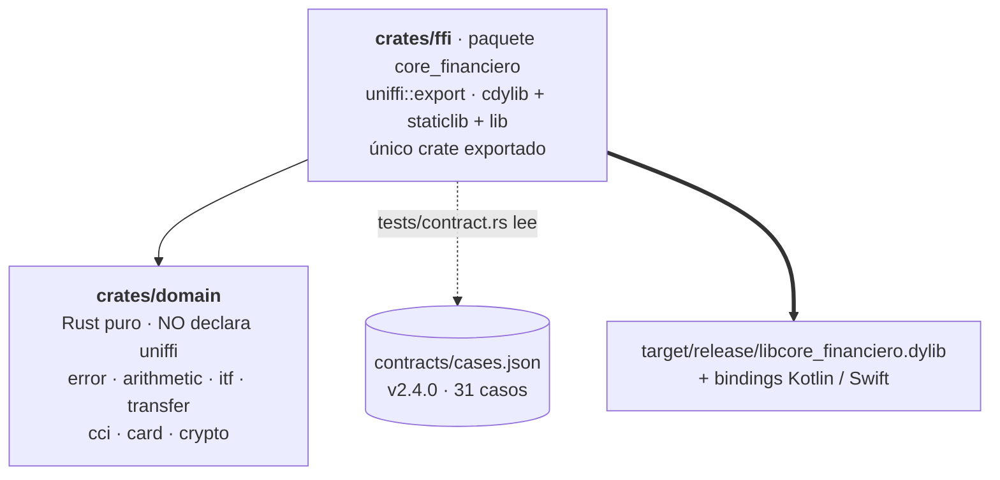

# rust-core

Núcleo de dominio de la POC. Es el único lugar donde vive lógica de negocio: las cuatro
apps lo consumen sin reescribirlo.

**Estado: Fase 1 completada.** 71 tests en verde —50 unitarios de `domain`, 6 de `proptest`,
3 del lib de `ffi` y 12 del test de contrato— contra `contracts/cases.json` v2.4.0, 31 casos.

Todos los comandos de esta documentación —los de [BUILD.md](BUILD.md) y los de
[TESTING.md](TESTING.md)— **se ejecutaron tal como están escritos**, desde `rust-core/`, y la
salida que sigue a cada uno es la que devolvieron. Ninguno está deducido del
[CONTEXT.md](CONTEXT.md): un comando sin correr se descubre roto el día de la demo, que es el
único día que importa.

## Cómo está organizado



Son dos crates y no más porque la POC argumenta **una** frontera: la lógica de negocio no
conoce el FFI. Y no es una convención de estilo — `crates/domain` no declara `uniffi` en su
`Cargo.toml`, así que un `#[uniffi::export]` ahí adentro **no compila**. Quien sostiene la
regla es el compilador, no la disciplina de quien edita.

Los siete módulos de `domain` (`arithmetic`, `card`, `cci`, `crypto`, `error`, `itf`,
`transfer`) son módulos, no crates. Partirlos en cinco paquetes para ~1000 líneas de Rust
puro sería ceremonia: agregaría cinco `Cargo.toml` y ninguna frontera que el compilador
esté defendiendo.

**El crate puro se llama `domain`, no `core`.** No es preferencia estética: un paquete
llamado `core` hace que el `--extern core` que cargo pasa al compilar `ffi` tape al `core`
de la stdlib, y `#[derive(thiserror::Error)]` deja de compilar con `cannot find 'fmt' in
'core'`. Se verificó con un workspace de prueba antes de elegir el nombre.

## Qué es el FFI, y por qué esta POC gira alrededor de él

**FFI** es *Foreign Function Interface*: el mecanismo por el que código escrito en un lenguaje
llama a código escrito en otro. Es **el** concepto de este proyecto — sin él no hay POC.

El problema que resuelve es concreto. Rust, Kotlin, Swift y JavaScript no se entienden entre sí:
representan los tipos distinto, manejan la memoria distinto y pasan los argumentos distinto. Un
`String` de Rust y un `String` de Kotlin no tienen nada que ver en memoria.

La salida universal es la **ABI de C**: el formato binario de llamada que casi todos los
lenguajes saben hablar. Así que este crate no expone funciones "de Rust" — expone funciones
**con forma de C**, y cada lenguaje anfitrión las llama con su propio mecanismo. Por eso la
palabra "frontera" aparece tanto en esta documentación y es literal: de un lado hay
`rust_decimal::Decimal`, `Result` y enums con datos; del otro, punteros, enteros y bytes.

**Qué hace uniffi.** Escribir ese borde a mano es tedioso y peligroso —hay que decidir quién
libera cada string, cómo se codifica el texto, qué pasa con un error—. uniffi lo genera de los
dos lados: de los `#[uniffi::export]` de `crates/ffi` produce la capa C en Rust *y* los bindings
en Kotlin, Swift y TypeScript. Por eso esos bindings son artefactos generados que **nunca se
editan a mano**: si algo está mal ahí, se arregla en Rust y se regenera.

**El mismo núcleo cruza de cuatro maneras distintas**, y eso no es cosmético: los cuatro puentes
están medidos, en release y sobre aparatos físicos, y **el más caro cuesta 350× más que el más
barato** — `add("0.1","0.2")`, p50:

| App | Cómo cruza | Qué le cuesta |
|---|---|---|
| Android | `.so` + **JNA** con *direct mapping* | **145,9 µs** en un Pixel 6, casi todo marshalling — el más caro de los cuatro, por lejos |
| React Native | C++ / **JSI**, vía `ubrn` | **9,44 µs** en el mismo Pixel 6 y **4,71 µs** en un iPhone 12: 15× más barato que JNA |
| iOS | `.a` enlazado **estáticamente** en un XCFramework | **0,42 µs** en el iPhone 12 — tan barato que el reloj del sistema no lo resuelve llamada por llamada |
| Web | **WebAssembly** | ~1,5 µs, pero en una Mac y con el reloj del navegador cuantizado: ubica el orden de magnitud y nada más. Y ahí **no hay red de `catch_unwind`** |

El cuadro completo, con el piso del cruce y la descomposición de qué parte es el aparato, está en
[docs/cross-app-pending.md](../docs/cross-app-pending.md).

Ese último punto explica una regla que parece caprichosa: **`panic = "abort"` está prohibido**.
uniffi envuelve cada llamada en un `catch_unwind`, así que un pánico de Rust vuelve como error
del FFI en vez de matar la app. Con `abort` esa red se desactiva — y en wasm el target la
**impone**, así que la app Angular no va a tenerla.

**Y por qué todo es `String` en la frontera.** Cuanto más simple el tipo que cruza, menos puede
romperse en la traducción. `Decimal` no existe en Kotlin, ni en Swift, ni en JavaScript;
convertirlo a `Double` para cruzar destruiría exactamente la precisión que este crate existe
para garantizar. Así que el cálculo se hace con `Decimal` **adentro** y cruza un `String` con la
escala ya correcta. De los cinco `Record` que cruzan, el único campo que no es `String` es
`simulated_latency_ms: u32`.

Dos cosas **no** cruzan, y cada app tiene que reimplementarlas: los mensajes de error en español
y el mapeo de variante a nombre del contrato. Eso tiene archivo propio — **[FFI.md](FFI.md)**, de
lectura obligatoria antes de escribir una app consumidora.

Un último detalle que explica el orden de las fases: **el test de contrato de este crate no
cruza el FFI.** Llama a las nueve funciones como funciones Rust normales. El primer test de toda
la POC que atravesó el borde de verdad fue el instrumentado de Android.

## Dónde está cada cosa

Este README contesta **qué es y cómo está organizado**. Lo demás vive en un archivo por
pregunta — igual que en [`apps/android/`](../apps/android/README.md), y por el mismo motivo:
un README que contesta cinco preguntas a la vez no contesta bien ninguna.

| Archivo | La pregunta que contesta |
|---|---|
| **[BUILD.md](BUILD.md)** | ¿Qué herramientas necesito, cómo lo compilo y cómo genero los bindings? Incluye [el paso único para generar los artefactos de las cuatro apps](BUILD.md#generar-el-core-que-consumen-las-cuatro-apps). |
| **[TESTING.md](TESTING.md)** | ¿Qué suites hay, qué prueba el test de contrato y qué **no** prueba? |
| **[FFI.md](FFI.md)** | ¿Qué cruza el FFI y qué no? **Léelo antes de escribir una app consumidora.** |
| **[PENDING.md](PENDING.md)** | ¿Qué no hace y qué queda abierto? |
| [CONTEXT.md](CONTEXT.md) | La spec: reglas duras, contrato de API pública, comandos de exportación por plataforma |
| [../contracts/README.md](../contracts/README.md) | El contrato compartido: los 31 casos y de dónde salen |

## `core_version()` congela el SHA del build

`core_version()` devuelve `<semver>+<sha corto de git>`, con el SHA inyectado por `build.rs`
en **tiempo de compilación**. El string queda literalmente embebido en el artefacto:

```bash
strings -a target/release/libcore_financiero.dylib | grep -o "1\.0\.0+$(git rev-parse --short HEAD)" | head -1
```

Qué se debe ver — el semver y el SHA corto del `HEAD` **con el que se compiló el
artefacto**. En la corrida de verificación de cierre de la fase, `HEAD` era `03007a6`:

```
1.0.0+03007a6
```

El SHA cambia con cada commit, así que el valor concreto va a ser otro. Lo que importa es
que el comando **imprima algo**: si no imprime nada, el `.dylib` quedó de un commit anterior
y hay que volver a correr `cargo build --release -p core_financiero`. Ese silencio es
exactamente el fallo que la sección de abajo describe, detectado a tiempo.

De ahí sale la consecuencia que hay que tener presente **antes de la demo**: el `.so` de
Android, el `.xcframework` de iOS y el WASM se construyen en momentos distintos, y cada uno
se lleva congelado el SHA del momento en que se construyó. "Las cuatro apps muestran el
mismo string" es una propiedad **verificable, no automática**: si los artefactos salieron de
commits distintos, las cuatro pantallas van a mostrar cuatro strings distintos y la prueba
en pantalla se cae. Hay que **regenerar los cuatro artefactos desde el mismo HEAD** antes de
poner las apps lado a lado.

### Comprobar los cuatro artefactos de una vez

Después de regenerarlos —[el paso único de BUILD.md](BUILD.md#generar-el-core-que-consumen-las-cuatro-apps)—
y **antes** de levantar las apps:

```bash
SHA=$(git rev-parse --short HEAD)
for p in \
  apps/android/core-financiero/src/generated/jniLibs/arm64-v8a/libcore_financiero.so \
  apps/ios/CoreFinanciero.xcframework/ios-arm64/libcore_financiero.a \
  apps/ios/CoreFinanciero.xcframework/ios-arm64-simulator/libcore_financiero.a \
  apps/react-native/android/src/main/jniLibs/arm64-v8a/libcore_financiero.a \
  apps/react-native/src/generated-napi/libcore_financiero.dylib \
  packages/core-financiero-wasm/generated/core_financiero.wasm
do
  printf '%-70s %s\n' "$p" "$(strings -a "$p" | grep -oE "1\.0\.0\+$SHA" | sort -u)"
done
```

Qué se debe ver — el **mismo** `1.0.0+<sha>` en las seis líneas, y ninguna vacía. Una línea
vacía es un artefacto que quedó de otro commit: se regenera ése y se vuelve a correr.

> **El patrón va anclado al SHA de `HEAD`, nunca abierto como `[0-9a-f]{7,}`.** Rust empaqueta
> los literales de string contiguos y **sin terminador**, así que `strings` los devuelve
> pegados: un patrón abierto se come los caracteres hex del literal siguiente y devuelve, por
> ejemplo, `1.0.0+56acc05ca` en un binario y `1.0.0+56acc05` en otro — el `ca` es el principio
> de `called \`Result::unwrap()\`...`. Los dos artefactos son del mismo commit y el comando
> dice que no. Verificado en la Fase 6.

Si en pantalla aparece `1.0.0+sin-git`, el build corrió sin `git` disponible o fuera de un
checkout: ese binario no lleva identificación y no sirve para la comparación.

### Ya generé todo, ¿y ahora?

Con los artefactos en su lugar, cada app se levanta por su cuenta y **no hay nada más que
configurar**: el cableado está fijo en el código de cada proyecto y los artefactos caen en rutas
fijas. Cada README abre con «Antes de correrla», que dice qué herramientas hacen falta, dónde
tiene que haber caído cada artefacto y cuál es el archivo que lo cablea.

| App | Su README | Qué hace falta además de los artefactos |
|---|---|---|
| Android | [apps/android/README.md](../apps/android/README.md) | Java 21, SDK de Android, y un emulador o teléfono |
| iOS | [apps/ios/README.md](../apps/ios/README.md) | Xcode 26 y un simulador iOS 17+ |
| React Native | [apps/react-native/README.md](../apps/react-native/README.md) | Node 22, pnpm, y Metro en su propia terminal |
| Angular | [apps/web-angular/README.md](../apps/web-angular/README.md) | Node 22 y pnpm; **consume el `.wasm` que produce React Native**, no este crate |

Y si lo que quiere es poner las cuatro pantallas lado a lado, el guion está en
[docs/demo-runbook.md](../docs/demo-runbook.md). Su primer paso es comparar los cuatro pies de
`coreVersion()`, que es justo lo que verifica el comando de arriba.

## Reglas que no se negocian

Las completas están en [CONTEXT.md](CONTEXT.md) y en el [CLAUDE.md](../CLAUDE.md) de la
raíz. Las dos que más fácil se rompen:

- **Ningún `f32`/`f64` toca un monto.** Los montos son `String` en la frontera y
  `rust_decimal::Decimal` adentro. El único numérico que cruza es
  `simulated_latency_ms: u32`.
- **`panic = "unwind"`, nunca `abort`.** Con `abort` se desactiva el `catch_unwind` de
  uniffi y cualquier pánico de Rust mata la app en vez de volver como error del FFI.
  **Con una salvedad que no es opcional:** `wasm32-unknown-unknown` impone `abort` desde el
  target —el wasm base no tiene unwinding— así que en la Fase 5 la app Angular **no va a
  tener esa red**. Se verifica sin instalar nada:

  ```bash
  rustc --print cfg --target wasm32-unknown-unknown | grep panic   # panic="abort"
  rustc --print cfg --target aarch64-linux-android  | grep panic   # panic="unwind"
  rustc --print cfg --target aarch64-apple-ios      | grep panic   # panic="unwind"
  ```

  Ahí un pánico del core no vuelve como error del FFI: es un trap de WebAssembly que deja
  la instancia del módulo inutilizable. Lo único que protege a esa app es la regla de arriba
  —cero `panic!`/`unwrap()`/`expect()` en producción— y los tres proptests
  `*_never_panics`. En la plataforma sin red, esos tres tests dejan de ser robustez y pasan
  a ser el mecanismo de seguridad.

Los comandos de exportación por plataforma (cargo-ndk, `xcodebuild -create-xcframework`,
`ubrn build android|ios|web`) están en [CONTEXT.md](CONTEXT.md); no se duplican aquí porque
se desincronizan.
